# PssIEEE4B

_IEEE 421.5-2005 type PSS4B power system stabilizer. The PSS4B model represents a structure based on multiple working frequency bands. Three separate bands, respectively dedicated to the low-, intermediate- and high-frequency modes of oscillations, are used in this delta omega (speed input) PSS._

_There is an error in the in IEEE 421.5-2005 PSS4B model: the <i>Pe</i> input should read –<i>Pe</i>. This implies that the input <i>Pe</i> needs to be multiplied by -1._

_Reference: IEEE 4B 421.5-2005, 8.4. _

_Parameter details:_

_This model has 2 input signals. They have the following fixed types (expressed in terms of InputSignalKind values): the first one is of rotorAngleFrequencyDeviation type and the second one is of generatorElectricalPower type._

**URI**: [cim:PssIEEE4B](http://iec.ch/TC57/CIM100#PssIEEE4B) 
**Type**: Class

```mermaid
 classDiagram
    class PssIEEE4B
      PowerSystemStabilizerDynamics <|-- PssIEEE4B
      
      PssIEEE4B : PssIEEE4B.bwh1
        
      PssIEEE4B : PssIEEE4B.bwh2
        
      PssIEEE4B : PssIEEE4B.bwl1
        
      PssIEEE4B : PssIEEE4B.bwl2
        
      PssIEEE4B : IdentifiedObject.description
        
      PssIEEE4B : DynamicsFunctionBlock.enabled
        
      PssIEEE4B : PowerSystemStabilizerDynamics.ExcitationSystemDynamics
        
          PssIEEE4B --> ExcitationSystemDynamics : PowerSystemStabilizerDynamics.ExcitationSystemDynamics
        
      PssIEEE4B : PssIEEE4B.kh
        
          PssIEEE4B --> PU : PssIEEE4B.kh
        
      PssIEEE4B : PssIEEE4B.kh1
        
          PssIEEE4B --> PU : PssIEEE4B.kh1
        
      PssIEEE4B : PssIEEE4B.kh11
        
          PssIEEE4B --> PU : PssIEEE4B.kh11
        
      PssIEEE4B : PssIEEE4B.kh17
        
          PssIEEE4B --> PU : PssIEEE4B.kh17
        
      PssIEEE4B : PssIEEE4B.kh2
        
          PssIEEE4B --> PU : PssIEEE4B.kh2
        
      PssIEEE4B : PssIEEE4B.ki
        
          PssIEEE4B --> PU : PssIEEE4B.ki
        
      PssIEEE4B : PssIEEE4B.ki1
        
          PssIEEE4B --> PU : PssIEEE4B.ki1
        
      PssIEEE4B : PssIEEE4B.ki11
        
          PssIEEE4B --> PU : PssIEEE4B.ki11
        
      PssIEEE4B : PssIEEE4B.ki17
        
          PssIEEE4B --> PU : PssIEEE4B.ki17
        
      PssIEEE4B : PssIEEE4B.ki2
        
          PssIEEE4B --> PU : PssIEEE4B.ki2
        
      PssIEEE4B : PssIEEE4B.kl
        
          PssIEEE4B --> PU : PssIEEE4B.kl
        
      PssIEEE4B : PssIEEE4B.kl1
        
          PssIEEE4B --> PU : PssIEEE4B.kl1
        
      PssIEEE4B : PssIEEE4B.kl11
        
          PssIEEE4B --> PU : PssIEEE4B.kl11
        
      PssIEEE4B : PssIEEE4B.kl17
        
          PssIEEE4B --> PU : PssIEEE4B.kl17
        
      PssIEEE4B : PssIEEE4B.kl2
        
          PssIEEE4B --> PU : PssIEEE4B.kl2
        
      PssIEEE4B : IdentifiedObject.mRID
        
      PssIEEE4B : IdentifiedObject.name
        
      PssIEEE4B : PssIEEE4B.omeganh1
        
      PssIEEE4B : PssIEEE4B.omeganh2
        
      PssIEEE4B : PssIEEE4B.omeganl1
        
      PssIEEE4B : PssIEEE4B.omeganl2
        
      PssIEEE4B : PowerSystemStabilizerDynamics.RemoteInputSignal
        
          PssIEEE4B --> RemoteInputSignal : PowerSystemStabilizerDynamics.RemoteInputSignal
        
      PssIEEE4B : PssIEEE4B.th1
        
          PssIEEE4B --> Seconds : PssIEEE4B.th1
        
      PssIEEE4B : PssIEEE4B.th10
        
          PssIEEE4B --> Seconds : PssIEEE4B.th10
        
      PssIEEE4B : PssIEEE4B.th11
        
          PssIEEE4B --> Seconds : PssIEEE4B.th11
        
      PssIEEE4B : PssIEEE4B.th12
        
          PssIEEE4B --> Seconds : PssIEEE4B.th12
        
      PssIEEE4B : PssIEEE4B.th2
        
          PssIEEE4B --> Seconds : PssIEEE4B.th2
        
      PssIEEE4B : PssIEEE4B.th3
        
          PssIEEE4B --> Seconds : PssIEEE4B.th3
        
      PssIEEE4B : PssIEEE4B.th4
        
          PssIEEE4B --> Seconds : PssIEEE4B.th4
        
      PssIEEE4B : PssIEEE4B.th5
        
          PssIEEE4B --> Seconds : PssIEEE4B.th5
        
      PssIEEE4B : PssIEEE4B.th6
        
          PssIEEE4B --> Seconds : PssIEEE4B.th6
        
      PssIEEE4B : PssIEEE4B.th7
        
          PssIEEE4B --> Seconds : PssIEEE4B.th7
        
      PssIEEE4B : PssIEEE4B.th8
        
          PssIEEE4B --> Seconds : PssIEEE4B.th8
        
      PssIEEE4B : PssIEEE4B.th9
        
          PssIEEE4B --> Seconds : PssIEEE4B.th9
        
      PssIEEE4B : PssIEEE4B.ti1
        
          PssIEEE4B --> Seconds : PssIEEE4B.ti1
        
      PssIEEE4B : PssIEEE4B.ti10
        
          PssIEEE4B --> Seconds : PssIEEE4B.ti10
        
      PssIEEE4B : PssIEEE4B.ti11
        
          PssIEEE4B --> Seconds : PssIEEE4B.ti11
        
      PssIEEE4B : PssIEEE4B.ti12
        
          PssIEEE4B --> Seconds : PssIEEE4B.ti12
        
      PssIEEE4B : PssIEEE4B.ti2
        
          PssIEEE4B --> Seconds : PssIEEE4B.ti2
        
      PssIEEE4B : PssIEEE4B.ti3
        
          PssIEEE4B --> Seconds : PssIEEE4B.ti3
        
      PssIEEE4B : PssIEEE4B.ti4
        
          PssIEEE4B --> Seconds : PssIEEE4B.ti4
        
      PssIEEE4B : PssIEEE4B.ti5
        
          PssIEEE4B --> Seconds : PssIEEE4B.ti5
        
      PssIEEE4B : PssIEEE4B.ti6
        
          PssIEEE4B --> Seconds : PssIEEE4B.ti6
        
      PssIEEE4B : PssIEEE4B.ti7
        
          PssIEEE4B --> Seconds : PssIEEE4B.ti7
        
      PssIEEE4B : PssIEEE4B.ti8
        
          PssIEEE4B --> Seconds : PssIEEE4B.ti8
        
      PssIEEE4B : PssIEEE4B.ti9
        
          PssIEEE4B --> Seconds : PssIEEE4B.ti9
        
      PssIEEE4B : PssIEEE4B.tl1
        
          PssIEEE4B --> Seconds : PssIEEE4B.tl1
        
      PssIEEE4B : PssIEEE4B.tl10
        
          PssIEEE4B --> Seconds : PssIEEE4B.tl10
        
      PssIEEE4B : PssIEEE4B.tl11
        
          PssIEEE4B --> Seconds : PssIEEE4B.tl11
        
      PssIEEE4B : PssIEEE4B.tl12
        
          PssIEEE4B --> Seconds : PssIEEE4B.tl12
        
      PssIEEE4B : PssIEEE4B.tl2
        
          PssIEEE4B --> Seconds : PssIEEE4B.tl2
        
      PssIEEE4B : PssIEEE4B.tl3
        
          PssIEEE4B --> Seconds : PssIEEE4B.tl3
        
      PssIEEE4B : PssIEEE4B.tl4
        
          PssIEEE4B --> Seconds : PssIEEE4B.tl4
        
      PssIEEE4B : PssIEEE4B.tl5
        
          PssIEEE4B --> Seconds : PssIEEE4B.tl5
        
      PssIEEE4B : PssIEEE4B.tl6
        
          PssIEEE4B --> Seconds : PssIEEE4B.tl6
        
      PssIEEE4B : PssIEEE4B.tl7
        
          PssIEEE4B --> Seconds : PssIEEE4B.tl7
        
      PssIEEE4B : PssIEEE4B.tl8
        
          PssIEEE4B --> Seconds : PssIEEE4B.tl8
        
      PssIEEE4B : PssIEEE4B.tl9
        
          PssIEEE4B --> Seconds : PssIEEE4B.tl9
        
      PssIEEE4B : PssIEEE4B.vhmax
        
          PssIEEE4B --> PU : PssIEEE4B.vhmax
        
      PssIEEE4B : PssIEEE4B.vhmin
        
          PssIEEE4B --> PU : PssIEEE4B.vhmin
        
      PssIEEE4B : PssIEEE4B.vimax
        
          PssIEEE4B --> PU : PssIEEE4B.vimax
        
      PssIEEE4B : PssIEEE4B.vimin
        
          PssIEEE4B --> PU : PssIEEE4B.vimin
        
      PssIEEE4B : PssIEEE4B.vlmax
        
          PssIEEE4B --> PU : PssIEEE4B.vlmax
        
      PssIEEE4B : PssIEEE4B.vlmin
        
          PssIEEE4B --> PU : PssIEEE4B.vlmin
        
      PssIEEE4B : PssIEEE4B.vstmax
        
          PssIEEE4B --> PU : PssIEEE4B.vstmax
        
      PssIEEE4B : PssIEEE4B.vstmin
        
          PssIEEE4B --> PU : PssIEEE4B.vstmin
        
      
```

## Inheritance
* [IdentifiedObject](IdentifiedObject.md)
    * [DynamicsFunctionBlock](DynamicsFunctionBlock.md)
        * [PowerSystemStabilizerDynamics](PowerSystemStabilizerDynamics.md)
            * **PssIEEE4B**

## Attributes

| Name | URI | Cardinality and Range | Description | Inheritance |
| ---  | --- | --- | --- | --- |
| bwh1 | [cim:PssIEEE4B.bwh1](http://iec.ch/TC57/CIM100#PssIEEE4B.bwh1) | 1..1    float  | Notch filter 1 (high-frequency band): three dB bandwidth (<i>B</i><i>wi<... | direct |
| bwh2 | [cim:PssIEEE4B.bwh2](http://iec.ch/TC57/CIM100#PssIEEE4B.bwh2) | 1..1    float  | Notch filter 2 (high-frequency band): three dB bandwidth (<i>B</i><i>wi<... | direct |
| bwl1 | [cim:PssIEEE4B.bwl1](http://iec.ch/TC57/CIM100#PssIEEE4B.bwl1) | 1..1    float  | Notch filter 1 (low-frequency band): three dB bandwidth (<i>B</i><i>wi</... | direct |
| bwl2 | [cim:PssIEEE4B.bwl2](http://iec.ch/TC57/CIM100#PssIEEE4B.bwl2) | 1..1    float  | Notch filter 2 (low-frequency band): three dB bandwidth (<i>B</i><i>wi</... | direct |
| kh | [cim:PssIEEE4B.kh](http://iec.ch/TC57/CIM100#PssIEEE4B.kh) | 1..1    [PU](PU.md)  | High band gain (<i>K</i><i>H</i>) | direct |
| kh1 | [cim:PssIEEE4B.kh1](http://iec.ch/TC57/CIM100#PssIEEE4B.kh1) | 1..1    [PU](PU.md)  | High band differential filter gain (<i>K</i><i>H1</i>) | direct |
| kh11 | [cim:PssIEEE4B.kh11](http://iec.ch/TC57/CIM100#PssIEEE4B.kh11) | 1..1    [PU](PU.md)  | High band first lead-lag blocks coefficient (<i>K</i><i>H11</i>) | direct |
| kh17 | [cim:PssIEEE4B.kh17](http://iec.ch/TC57/CIM100#PssIEEE4B.kh17) | 1..1    [PU](PU.md)  | High band first lead-lag blocks coefficient (<i>K</i><i>H17</i>) | direct |
| kh2 | [cim:PssIEEE4B.kh2](http://iec.ch/TC57/CIM100#PssIEEE4B.kh2) | 1..1    [PU](PU.md)  | High band differential filter gain (<i>K</i><i>H2</i>) | direct |
| ki | [cim:PssIEEE4B.ki](http://iec.ch/TC57/CIM100#PssIEEE4B.ki) | 1..1    [PU](PU.md)  | Intermediate band gain (<i>K</i><i>I</i>) | direct |
| ki1 | [cim:PssIEEE4B.ki1](http://iec.ch/TC57/CIM100#PssIEEE4B.ki1) | 1..1    [PU](PU.md)  | Intermediate band differential filter gain (<i>K</i><i>I1</i>) | direct |
| ki11 | [cim:PssIEEE4B.ki11](http://iec.ch/TC57/CIM100#PssIEEE4B.ki11) | 1..1    [PU](PU.md)  | Intermediate band first lead-lag blocks coefficient (<i>K</i><i>I11</sub... | direct |
| ki17 | [cim:PssIEEE4B.ki17](http://iec.ch/TC57/CIM100#PssIEEE4B.ki17) | 1..1    [PU](PU.md)  | Intermediate band first lead-lag blocks coefficient (<i>K</i><i>I17</sub... | direct |
| ki2 | [cim:PssIEEE4B.ki2](http://iec.ch/TC57/CIM100#PssIEEE4B.ki2) | 1..1    [PU](PU.md)  | Intermediate band differential filter gain (<i>K</i><i>I2</i>) | direct |
| kl | [cim:PssIEEE4B.kl](http://iec.ch/TC57/CIM100#PssIEEE4B.kl) | 1..1    [PU](PU.md)  | Low band gain (<i>K</i><i>L</i>) | direct |
| kl1 | [cim:PssIEEE4B.kl1](http://iec.ch/TC57/CIM100#PssIEEE4B.kl1) | 1..1    [PU](PU.md)  | Low band differential filter gain (<i>K</i><i>L1</i>) | direct |
| kl11 | [cim:PssIEEE4B.kl11](http://iec.ch/TC57/CIM100#PssIEEE4B.kl11) | 1..1    [PU](PU.md)  | Low band first lead-lag blocks coefficient (<i>K</i><i>L11</i>) | direct |
| kl17 | [cim:PssIEEE4B.kl17](http://iec.ch/TC57/CIM100#PssIEEE4B.kl17) | 1..1    [PU](PU.md)  | Low band first lead-lag blocks coefficient (<i>K</i><i>L17</i>) | direct |
| kl2 | [cim:PssIEEE4B.kl2](http://iec.ch/TC57/CIM100#PssIEEE4B.kl2) | 1..1    [PU](PU.md)  | Low band differential filter gain (<i>K</i><i>L2</i>) | direct |
| omeganh1 | [cim:PssIEEE4B.omeganh1](http://iec.ch/TC57/CIM100#PssIEEE4B.omeganh1) | 1..1    float  | Notch filter 1 (high-frequency band): filter frequency (<i>omega</i><i>n... | direct |
| omeganh2 | [cim:PssIEEE4B.omeganh2](http://iec.ch/TC57/CIM100#PssIEEE4B.omeganh2) | 1..1    float  | Notch filter 2 (high-frequency band): filter frequency (<i>omega</i><i>n... | direct |
| omeganl1 | [cim:PssIEEE4B.omeganl1](http://iec.ch/TC57/CIM100#PssIEEE4B.omeganl1) | 1..1    float  | Notch filter 1 (low-frequency band): filter frequency (<i>omega</i><i>ni... | direct |
| omeganl2 | [cim:PssIEEE4B.omeganl2](http://iec.ch/TC57/CIM100#PssIEEE4B.omeganl2) | 1..1    float  | Notch filter 2 (low-frequency band): filter frequency (<i>omega</i><i>ni... | direct |
| th1 | [cim:PssIEEE4B.th1](http://iec.ch/TC57/CIM100#PssIEEE4B.th1) | 1..1    [Seconds](Seconds.md)  | High band time constant (<i>T</i><i>H1</i>) (&gt;= 0) | direct |
| th10 | [cim:PssIEEE4B.th10](http://iec.ch/TC57/CIM100#PssIEEE4B.th10) | 1..1    [Seconds](Seconds.md)  | High band time constant (<i>T</i><i>H10</i>) (&gt;= 0) | direct |
| th11 | [cim:PssIEEE4B.th11](http://iec.ch/TC57/CIM100#PssIEEE4B.th11) | 1..1    [Seconds](Seconds.md)  | High band time constant (<i>T</i><i>H11</i>) (&gt;= 0) | direct |
| th12 | [cim:PssIEEE4B.th12](http://iec.ch/TC57/CIM100#PssIEEE4B.th12) | 1..1    [Seconds](Seconds.md)  | High band time constant (<i>T</i><i>H12</i>) (&gt;= 0) | direct |
| th2 | [cim:PssIEEE4B.th2](http://iec.ch/TC57/CIM100#PssIEEE4B.th2) | 1..1    [Seconds](Seconds.md)  | High band time constant (<i>T</i><i>H2</i>) (&gt;= 0) | direct |
| th3 | [cim:PssIEEE4B.th3](http://iec.ch/TC57/CIM100#PssIEEE4B.th3) | 1..1    [Seconds](Seconds.md)  | High band time constant (<i>T</i><i>H3</i>) (&gt;= 0) | direct |
| th4 | [cim:PssIEEE4B.th4](http://iec.ch/TC57/CIM100#PssIEEE4B.th4) | 1..1    [Seconds](Seconds.md)  | High band time constant (<i>T</i><i>H4</i>) (&gt;= 0) | direct |
| th5 | [cim:PssIEEE4B.th5](http://iec.ch/TC57/CIM100#PssIEEE4B.th5) | 1..1    [Seconds](Seconds.md)  | High band time constant (<i>T</i><i>H5</i>) (&gt;= 0) | direct |
| th6 | [cim:PssIEEE4B.th6](http://iec.ch/TC57/CIM100#PssIEEE4B.th6) | 1..1    [Seconds](Seconds.md)  | High band time constant (<i>T</i><i>H6</i>) (&gt;= 0) | direct |
| th7 | [cim:PssIEEE4B.th7](http://iec.ch/TC57/CIM100#PssIEEE4B.th7) | 1..1    [Seconds](Seconds.md)  | High band time constant (<i>T</i><i>H7</i>) (&gt;= 0) | direct |
| th8 | [cim:PssIEEE4B.th8](http://iec.ch/TC57/CIM100#PssIEEE4B.th8) | 1..1    [Seconds](Seconds.md)  | High band time constant (<i>T</i><i>H8</i>) (&gt;= 0) | direct |
| th9 | [cim:PssIEEE4B.th9](http://iec.ch/TC57/CIM100#PssIEEE4B.th9) | 1..1    [Seconds](Seconds.md)  | High band time constant (<i>T</i><i>H9</i>) (&gt;= 0) | direct |
| ti1 | [cim:PssIEEE4B.ti1](http://iec.ch/TC57/CIM100#PssIEEE4B.ti1) | 1..1    [Seconds](Seconds.md)  | Intermediate band time constant (<i>T</i><i>I1</i>) (&gt;= 0) | direct |
| ti10 | [cim:PssIEEE4B.ti10](http://iec.ch/TC57/CIM100#PssIEEE4B.ti10) | 1..1    [Seconds](Seconds.md)  | Intermediate band time constant (<i>T</i><i>I10</i>) (&gt;= 0) | direct |
| ti11 | [cim:PssIEEE4B.ti11](http://iec.ch/TC57/CIM100#PssIEEE4B.ti11) | 1..1    [Seconds](Seconds.md)  | Intermediate band time constant (<i>T</i><i>I11</i>) (&gt;= 0) | direct |
| ti12 | [cim:PssIEEE4B.ti12](http://iec.ch/TC57/CIM100#PssIEEE4B.ti12) | 1..1    [Seconds](Seconds.md)  | Intermediate band time constant (<i>T</i><i>I12</i>) (&gt;= 0) | direct |
| ti2 | [cim:PssIEEE4B.ti2](http://iec.ch/TC57/CIM100#PssIEEE4B.ti2) | 1..1    [Seconds](Seconds.md)  | Intermediate band time constant (<i>T</i><i>I2</i>) (&gt;= 0) | direct |
| ti3 | [cim:PssIEEE4B.ti3](http://iec.ch/TC57/CIM100#PssIEEE4B.ti3) | 1..1    [Seconds](Seconds.md)  | Intermediate band time constant (<i>T</i><i>I3</i>) (&gt;= 0) | direct |
| ti4 | [cim:PssIEEE4B.ti4](http://iec.ch/TC57/CIM100#PssIEEE4B.ti4) | 1..1    [Seconds](Seconds.md)  | Intermediate band time constant (<i>T</i><i>I4</i>) (&gt;= 0) | direct |
| ti5 | [cim:PssIEEE4B.ti5](http://iec.ch/TC57/CIM100#PssIEEE4B.ti5) | 1..1    [Seconds](Seconds.md)  | Intermediate band time constant (<i>T</i><i>I5</i>) (&gt;= 0) | direct |
| ti6 | [cim:PssIEEE4B.ti6](http://iec.ch/TC57/CIM100#PssIEEE4B.ti6) | 1..1    [Seconds](Seconds.md)  | Intermediate band time constant (<i>T</i><i>I6</i>) (&gt;= 0) | direct |
| ti7 | [cim:PssIEEE4B.ti7](http://iec.ch/TC57/CIM100#PssIEEE4B.ti7) | 1..1    [Seconds](Seconds.md)  | Intermediate band time constant (<i>T</i><i>I7</i>) (&gt;= 0) | direct |
| ti8 | [cim:PssIEEE4B.ti8](http://iec.ch/TC57/CIM100#PssIEEE4B.ti8) | 1..1    [Seconds](Seconds.md)  | Intermediate band time constant (<i>T</i><i>I8</i>) (&gt;= 0) | direct |
| ti9 | [cim:PssIEEE4B.ti9](http://iec.ch/TC57/CIM100#PssIEEE4B.ti9) | 1..1    [Seconds](Seconds.md)  | Intermediate band time constant (<i>T</i><i>I9</i>) (&gt;= 0) | direct |
| tl1 | [cim:PssIEEE4B.tl1](http://iec.ch/TC57/CIM100#PssIEEE4B.tl1) | 1..1    [Seconds](Seconds.md)  | Low band time constant (<i>T</i><i>L1</i>) (&gt;= 0) | direct |
| tl10 | [cim:PssIEEE4B.tl10](http://iec.ch/TC57/CIM100#PssIEEE4B.tl10) | 1..1    [Seconds](Seconds.md)  | Low band time constant (<i>T</i><i>L10</i>) (&gt;= 0) | direct |
| tl11 | [cim:PssIEEE4B.tl11](http://iec.ch/TC57/CIM100#PssIEEE4B.tl11) | 1..1    [Seconds](Seconds.md)  | Low band time constant (<i>T</i><i>L11</i>) (&gt;= 0) | direct |
| tl12 | [cim:PssIEEE4B.tl12](http://iec.ch/TC57/CIM100#PssIEEE4B.tl12) | 1..1    [Seconds](Seconds.md)  | Low band time constant (<i>T</i><i>L12</i>) (&gt;= 0) | direct |
| tl2 | [cim:PssIEEE4B.tl2](http://iec.ch/TC57/CIM100#PssIEEE4B.tl2) | 1..1    [Seconds](Seconds.md)  | Low band time constant (<i>T</i><i>L2</i>) (&gt;= 0) | direct |
| tl3 | [cim:PssIEEE4B.tl3](http://iec.ch/TC57/CIM100#PssIEEE4B.tl3) | 1..1    [Seconds](Seconds.md)  | Low band time constant (<i>T</i><i>L3</i>) (&gt;= 0) | direct |
| tl4 | [cim:PssIEEE4B.tl4](http://iec.ch/TC57/CIM100#PssIEEE4B.tl4) | 1..1    [Seconds](Seconds.md)  | Low band time constant (<i>T</i><i>L4</i>) (&gt;= 0) | direct |
| tl5 | [cim:PssIEEE4B.tl5](http://iec.ch/TC57/CIM100#PssIEEE4B.tl5) | 1..1    [Seconds](Seconds.md)  | Low band time constant (<i>T</i><i>L5</i>) (&gt;= 0) | direct |
| tl6 | [cim:PssIEEE4B.tl6](http://iec.ch/TC57/CIM100#PssIEEE4B.tl6) | 1..1    [Seconds](Seconds.md)  | Low band time constant (<i>T</i><i>L6</i>) (&gt;= 0) | direct |
| tl7 | [cim:PssIEEE4B.tl7](http://iec.ch/TC57/CIM100#PssIEEE4B.tl7) | 1..1    [Seconds](Seconds.md)  | Low band time constant (<i>T</i><i>L7</i>) (&gt;= 0) | direct |
| tl8 | [cim:PssIEEE4B.tl8](http://iec.ch/TC57/CIM100#PssIEEE4B.tl8) | 1..1    [Seconds](Seconds.md)  | Low band time constant (<i>T</i><i>L8</i>) (&gt;= 0) | direct |
| tl9 | [cim:PssIEEE4B.tl9](http://iec.ch/TC57/CIM100#PssIEEE4B.tl9) | 1..1    [Seconds](Seconds.md)  | Low band time constant (<i>T</i><i>L9</i>) (&gt;= 0) | direct |
| vhmax | [cim:PssIEEE4B.vhmax](http://iec.ch/TC57/CIM100#PssIEEE4B.vhmax) | 1..1    [PU](PU.md)  | High band output maximum limit (<i>V</i><i>Hmax</i>) (&gt; PssIEEE... | direct |
| vhmin | [cim:PssIEEE4B.vhmin](http://iec.ch/TC57/CIM100#PssIEEE4B.vhmin) | 1..1    [PU](PU.md)  | High band output minimum limit (<i>V</i><i>Hmin</i>) (&lt; PssIEEE... | direct |
| vimax | [cim:PssIEEE4B.vimax](http://iec.ch/TC57/CIM100#PssIEEE4B.vimax) | 1..1    [PU](PU.md)  | Intermediate band output maximum limit (<i>V</i><i>Imax</i>) (&gt;... | direct |
| vimin | [cim:PssIEEE4B.vimin](http://iec.ch/TC57/CIM100#PssIEEE4B.vimin) | 1..1    [PU](PU.md)  | Intermediate band output minimum limit (<i>V</i><i>Imin</i>) (&lt;... | direct |
| vlmax | [cim:PssIEEE4B.vlmax](http://iec.ch/TC57/CIM100#PssIEEE4B.vlmax) | 1..1    [PU](PU.md)  | Low band output maximum limit (<i>V</i><i>Lmax</i>) (&gt; PssIEEE4... | direct |
| vlmin | [cim:PssIEEE4B.vlmin](http://iec.ch/TC57/CIM100#PssIEEE4B.vlmin) | 1..1    [PU](PU.md)  | Low band output minimum limit (<i>V</i><i>Lmin</i>) (&lt; PssIEEE4... | direct |
| vstmax | [cim:PssIEEE4B.vstmax](http://iec.ch/TC57/CIM100#PssIEEE4B.vstmax) | 1..1    [PU](PU.md)  | PSS output maximum limit (<i>V</i><i>STmax</i>) (&gt; PssIEEE4B | direct |
| vstmin | [cim:PssIEEE4B.vstmin](http://iec.ch/TC57/CIM100#PssIEEE4B.vstmin) | 1..1    [PU](PU.md)  | PSS output minimum limit (<i>V</i><i>STmin</i>) (&lt; PssIEEE4B | direct |
| RemoteInputSignal | [cim:PowerSystemStabilizerDynamics.RemoteInputSignal](http://iec.ch/TC57/CIM100#PowerSystemStabilizerDynamics.RemoteInputSignal) | 0..*    [RemoteInputSignal](RemoteInputSignal.md)  | Remote input signal used by this power system stabilizer model | [PowerSystemStabilizerDynamics](PowerSystemStabilizerDynamics.md) |
| ExcitationSystemDynamics | [cim:PowerSystemStabilizerDynamics.ExcitationSystemDynamics](http://iec.ch/TC57/CIM100#PowerSystemStabilizerDynamics.ExcitationSystemDynamics) | 1..1    [ExcitationSystemDynamics](ExcitationSystemDynamics.md)  | Excitation system model with which this power system stabilizer model is asso... | [PowerSystemStabilizerDynamics](PowerSystemStabilizerDynamics.md) |
| enabled | [cim:DynamicsFunctionBlock.enabled](http://iec.ch/TC57/CIM100#DynamicsFunctionBlock.enabled) | 1..1    boolean  | Function block used indicator | [DynamicsFunctionBlock](DynamicsFunctionBlock.md) |
| description | [cim:IdentifiedObject.description](http://iec.ch/TC57/CIM100#IdentifiedObject.description) | 0..1    string  | The description is a free human readable text describing or naming the object | [IdentifiedObject](IdentifiedObject.md) |
| mRID | [cim:IdentifiedObject.mRID](http://iec.ch/TC57/CIM100#IdentifiedObject.mRID) | 1..1    string  | Master resource identifier issued by a model authority | [IdentifiedObject](IdentifiedObject.md) |
| name | [cim:IdentifiedObject.name](http://iec.ch/TC57/CIM100#IdentifiedObject.name) | 0..1    string  | The name is any free human readable and possibly non unique text naming the o... | [IdentifiedObject](IdentifiedObject.md) |

## Identifier and Mapping Information

### Schema Source

* from schema: http://iec.ch/TC57/ns/CIM/Dynamics-EU#Package_DynamicsProfile

## Mappings

| Mapping Type | Mapped Value |
| ---  | ---  |
| self | cim:PssIEEE4B |
| native | this:PssIEEE4B |

