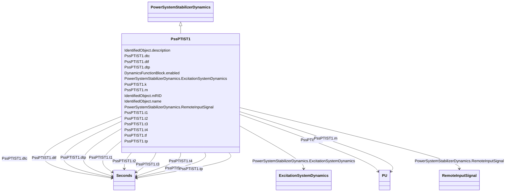

# PssPTIST1

_PTI microprocessor-based stabilizer type 1._

**URI**: [cim:PssPTIST1](http://iec.ch/TC57/CIM100#PssPTIST1) 
**Type**: Class

## Inheritance
* [IdentifiedObject](IdentifiedObject.md)
    * [DynamicsFunctionBlock](DynamicsFunctionBlock.md)
        * [PowerSystemStabilizerDynamics](PowerSystemStabilizerDynamics.md)
            * **PssPTIST1**

## Attributes

| Name | URI | Cardinality and Range | Description | Inheritance |
| ---  | --- | --- | --- | --- |
| m | [cim:PssPTIST1.m](http://iec.ch/TC57/CIM100#PssPTIST1.m) | 1..1    [PU](PU.md)  | (<i>M</i>) | direct |
| tf | [cim:PssPTIST1.tf](http://iec.ch/TC57/CIM100#PssPTIST1.tf) | 1..1    [Seconds](Seconds.md)  | Time constant (<i>Tf</i>) (&gt;= 0) | direct |
| tp | [cim:PssPTIST1.tp](http://iec.ch/TC57/CIM100#PssPTIST1.tp) | 1..1    [Seconds](Seconds.md)  | Time constant (<i>Tp</i>) (&gt;= 0) | direct |
| t1 | [cim:PssPTIST1.t1](http://iec.ch/TC57/CIM100#PssPTIST1.t1) | 1..1    [Seconds](Seconds.md)  | Time constant (<i>T1</i>) (&gt;= 0) | direct |
| t2 | [cim:PssPTIST1.t2](http://iec.ch/TC57/CIM100#PssPTIST1.t2) | 1..1    [Seconds](Seconds.md)  | Time constant (<i>T2</i>) (&gt;= 0) | direct |
| t3 | [cim:PssPTIST1.t3](http://iec.ch/TC57/CIM100#PssPTIST1.t3) | 1..1    [Seconds](Seconds.md)  | Time constant (<i>T3</i>) (&gt;= 0) | direct |
| t4 | [cim:PssPTIST1.t4](http://iec.ch/TC57/CIM100#PssPTIST1.t4) | 1..1    [Seconds](Seconds.md)  | Time constant (<i>T4</i>) (&gt;= 0) | direct |
| k | [cim:PssPTIST1.k](http://iec.ch/TC57/CIM100#PssPTIST1.k) | 1..1    [PU](PU.md)  | Gain (<i>K</i>) | direct |
| dtf | [cim:PssPTIST1.dtf](http://iec.ch/TC57/CIM100#PssPTIST1.dtf) | 1..1    [Seconds](Seconds.md)  | Time step frequency calculation (<i>deltatf</i>) (&gt;= 0) | direct |
| dtc | [cim:PssPTIST1.dtc](http://iec.ch/TC57/CIM100#PssPTIST1.dtc) | 1..1    [Seconds](Seconds.md)  | Time step related to activation of controls (<i>deltatc</i>) (&gt;= 0) | direct |
| dtp | [cim:PssPTIST1.dtp](http://iec.ch/TC57/CIM100#PssPTIST1.dtp) | 1..1    [Seconds](Seconds.md)  | Time step active power calculation (<i>deltatp</i>) (&gt;= 0) | direct |
| RemoteInputSignal | [cim:PowerSystemStabilizerDynamics.RemoteInputSignal](http://iec.ch/TC57/CIM100#PowerSystemStabilizerDynamics.RemoteInputSignal) | 0..*    [RemoteInputSignal](RemoteInputSignal.md)  | Remote input signal used by this power system stabilizer model | [PowerSystemStabilizerDynamics](PowerSystemStabilizerDynamics.md) |
| ExcitationSystemDynamics | [cim:PowerSystemStabilizerDynamics.ExcitationSystemDynamics](http://iec.ch/TC57/CIM100#PowerSystemStabilizerDynamics.ExcitationSystemDynamics) | 1..1    [ExcitationSystemDynamics](ExcitationSystemDynamics.md)  | Excitation system model with which this power system stabilizer model is asso... | [PowerSystemStabilizerDynamics](PowerSystemStabilizerDynamics.md) |
| enabled | [cim:DynamicsFunctionBlock.enabled](http://iec.ch/TC57/CIM100#DynamicsFunctionBlock.enabled) | 1..1    boolean  | Function block used indicator | [DynamicsFunctionBlock](DynamicsFunctionBlock.md) |
| description | [cim:IdentifiedObject.description](http://iec.ch/TC57/CIM100#IdentifiedObject.description) | 0..1    string  | The description is a free human readable text describing or naming the object | [IdentifiedObject](IdentifiedObject.md) |
| mRID | [cim:IdentifiedObject.mRID](http://iec.ch/TC57/CIM100#IdentifiedObject.mRID) | 1..1    string  | Master resource identifier issued by a model authority | [IdentifiedObject](IdentifiedObject.md) |
| name | [cim:IdentifiedObject.name](http://iec.ch/TC57/CIM100#IdentifiedObject.name) | 0..1    string  | The name is any free human readable and possibly non unique text naming the o... | [IdentifiedObject](IdentifiedObject.md) |

## Identifier and Mapping Information

### Schema Source

* from schema: http://iec.ch/TC57/ns/CIM/Dynamics-EU#Package_DynamicsProfile

## Mappings

| Mapping Type | Mapped Value |
| ---  | ---  |
| self | cim:PssPTIST1 |
| native | this:PssPTIST1 |

