# PssPTIST3

_PTI microprocessor-based stabilizer type 3._

**URI**: [cim:PssPTIST3](http://iec.ch/TC57/CIM100#PssPTIST3) 
**Type**: Class

```mermaid
 classDiagram
    class PssPTIST3
    click PssPTIST3 href "../PssPTIST3"
      PowerSystemStabilizerDynamics <|-- PssPTIST3
        click PowerSystemStabilizerDynamics href "../PowerSystemStabilizerDynamics"
      
      PssPTIST3 : PssPTIST3.a0
        
          PssPTIST3 --> PU : PssPTIST3.a0
          click PU href "../PU"
        
      PssPTIST3 : PssPTIST3.a1
        
          PssPTIST3 --> PU : PssPTIST3.a1
          click PU href "../PU"
        
      PssPTIST3 : PssPTIST3.a2
        
          PssPTIST3 --> PU : PssPTIST3.a2
          click PU href "../PU"
        
      PssPTIST3 : PssPTIST3.a3
        
          PssPTIST3 --> PU : PssPTIST3.a3
          click PU href "../PU"
        
      PssPTIST3 : PssPTIST3.a4
        
          PssPTIST3 --> PU : PssPTIST3.a4
          click PU href "../PU"
        
      PssPTIST3 : PssPTIST3.a5
        
          PssPTIST3 --> PU : PssPTIST3.a5
          click PU href "../PU"
        
      PssPTIST3 : PssPTIST3.al
        
          PssPTIST3 --> PU : PssPTIST3.al
          click PU href "../PU"
        
      PssPTIST3 : PssPTIST3.athres
        
          PssPTIST3 --> PU : PssPTIST3.athres
          click PU href "../PU"
        
      PssPTIST3 : PssPTIST3.b0
        
          PssPTIST3 --> PU : PssPTIST3.b0
          click PU href "../PU"
        
      PssPTIST3 : PssPTIST3.b1
        
          PssPTIST3 --> PU : PssPTIST3.b1
          click PU href "../PU"
        
      PssPTIST3 : PssPTIST3.b2
        
          PssPTIST3 --> PU : PssPTIST3.b2
          click PU href "../PU"
        
      PssPTIST3 : PssPTIST3.b3
        
          PssPTIST3 --> PU : PssPTIST3.b3
          click PU href "../PU"
        
      PssPTIST3 : PssPTIST3.b4
        
          PssPTIST3 --> PU : PssPTIST3.b4
          click PU href "../PU"
        
      PssPTIST3 : PssPTIST3.b5
        
          PssPTIST3 --> PU : PssPTIST3.b5
          click PU href "../PU"
        
      PssPTIST3 : IdentifiedObject.description
        
      PssPTIST3 : PssPTIST3.dl
        
          PssPTIST3 --> PU : PssPTIST3.dl
          click PU href "../PU"
        
      PssPTIST3 : PssPTIST3.dtc
        
          PssPTIST3 --> Seconds : PssPTIST3.dtc
          click Seconds href "../Seconds"
        
      PssPTIST3 : PssPTIST3.dtf
        
          PssPTIST3 --> Seconds : PssPTIST3.dtf
          click Seconds href "../Seconds"
        
      PssPTIST3 : PssPTIST3.dtp
        
          PssPTIST3 --> Seconds : PssPTIST3.dtp
          click Seconds href "../Seconds"
        
      PssPTIST3 : DynamicsFunctionBlock.enabled
        
      PssPTIST3 : PowerSystemStabilizerDynamics.ExcitationSystemDynamics
        
          PssPTIST3 --> ExcitationSystemDynamics : PowerSystemStabilizerDynamics.ExcitationSystemDynamics
          click ExcitationSystemDynamics href "../ExcitationSystemDynamics"
        
      PssPTIST3 : PssPTIST3.isw
        
      PssPTIST3 : PssPTIST3.k
        
          PssPTIST3 --> PU : PssPTIST3.k
          click PU href "../PU"
        
      PssPTIST3 : PssPTIST3.lthres
        
          PssPTIST3 --> PU : PssPTIST3.lthres
          click PU href "../PU"
        
      PssPTIST3 : PssPTIST3.m
        
          PssPTIST3 --> PU : PssPTIST3.m
          click PU href "../PU"
        
      PssPTIST3 : IdentifiedObject.mRID
        
      PssPTIST3 : IdentifiedObject.name
        
      PssPTIST3 : PssPTIST3.nav
        
      PssPTIST3 : PssPTIST3.ncl
        
      PssPTIST3 : PssPTIST3.ncr
        
      PssPTIST3 : PssPTIST3.pmin
        
          PssPTIST3 --> PU : PssPTIST3.pmin
          click PU href "../PU"
        
      PssPTIST3 : PowerSystemStabilizerDynamics.RemoteInputSignal
        
          PssPTIST3 --> RemoteInputSignal : PowerSystemStabilizerDynamics.RemoteInputSignal
          click RemoteInputSignal href "../RemoteInputSignal"
        
      PssPTIST3 : PssPTIST3.t1
        
          PssPTIST3 --> Seconds : PssPTIST3.t1
          click Seconds href "../Seconds"
        
      PssPTIST3 : PssPTIST3.t2
        
          PssPTIST3 --> Seconds : PssPTIST3.t2
          click Seconds href "../Seconds"
        
      PssPTIST3 : PssPTIST3.t3
        
          PssPTIST3 --> Seconds : PssPTIST3.t3
          click Seconds href "../Seconds"
        
      PssPTIST3 : PssPTIST3.t4
        
          PssPTIST3 --> Seconds : PssPTIST3.t4
          click Seconds href "../Seconds"
        
      PssPTIST3 : PssPTIST3.t5
        
          PssPTIST3 --> Seconds : PssPTIST3.t5
          click Seconds href "../Seconds"
        
      PssPTIST3 : PssPTIST3.t6
        
          PssPTIST3 --> Seconds : PssPTIST3.t6
          click Seconds href "../Seconds"
        
      PssPTIST3 : PssPTIST3.tf
        
          PssPTIST3 --> Seconds : PssPTIST3.tf
          click Seconds href "../Seconds"
        
      PssPTIST3 : PssPTIST3.tp
        
          PssPTIST3 --> Seconds : PssPTIST3.tp
          click Seconds href "../Seconds"
        
      
```

## Inheritance
* [IdentifiedObject](IdentifiedObject.md)
    * [DynamicsFunctionBlock](DynamicsFunctionBlock.md)
        * [PowerSystemStabilizerDynamics](PowerSystemStabilizerDynamics.md)
            * **PssPTIST3**

## Attributes

| Name | URI | Cardinality and Range | Description | Inheritance |
| ---  | --- | --- | --- | --- |
| m | [cim:PssPTIST3.m](http://iec.ch/TC57/CIM100#PssPTIST3.m) | 1    [PU](PU.md)  | (<i>M</i>) | direct |
| tf | [cim:PssPTIST3.tf](http://iec.ch/TC57/CIM100#PssPTIST3.tf) | 1    [Seconds](Seconds.md)  | Time constant (<i>Tf</i>) (&gt;= 0) | direct |
| tp | [cim:PssPTIST3.tp](http://iec.ch/TC57/CIM100#PssPTIST3.tp) | 1    [Seconds](Seconds.md)  | Time constant (<i>Tp</i>) (&gt;= 0) | direct |
| t1 | [cim:PssPTIST3.t1](http://iec.ch/TC57/CIM100#PssPTIST3.t1) | 1    [Seconds](Seconds.md)  | Time constant (<i>T1</i>) (&gt;= 0) | direct |
| t2 | [cim:PssPTIST3.t2](http://iec.ch/TC57/CIM100#PssPTIST3.t2) | 1    [Seconds](Seconds.md)  | Time constant (<i>T2</i>) (&gt;= 0) | direct |
| t3 | [cim:PssPTIST3.t3](http://iec.ch/TC57/CIM100#PssPTIST3.t3) | 1    [Seconds](Seconds.md)  | Time constant (<i>T3</i>) (&gt;= 0) | direct |
| t4 | [cim:PssPTIST3.t4](http://iec.ch/TC57/CIM100#PssPTIST3.t4) | 1    [Seconds](Seconds.md)  | Time constant (<i>T4</i>) (&gt;= 0) | direct |
| k | [cim:PssPTIST3.k](http://iec.ch/TC57/CIM100#PssPTIST3.k) | 1    [PU](PU.md)  | Gain (<i>K</i>) | direct |
| dtf | [cim:PssPTIST3.dtf](http://iec.ch/TC57/CIM100#PssPTIST3.dtf) | 1    [Seconds](Seconds.md)  | Time step frequency calculation (<i>deltatf</i>) (&gt;= 0) | direct |
| dtc | [cim:PssPTIST3.dtc](http://iec.ch/TC57/CIM100#PssPTIST3.dtc) | 1    [Seconds](Seconds.md)  | Time step related to activation of controls (<i>deltatc</i>) (&gt;= 0) | direct |
| dtp | [cim:PssPTIST3.dtp](http://iec.ch/TC57/CIM100#PssPTIST3.dtp) | 1    [Seconds](Seconds.md)  | Time step active power calculation (<i>deltatp</i>) (&gt;= 0) | direct |
| t5 | [cim:PssPTIST3.t5](http://iec.ch/TC57/CIM100#PssPTIST3.t5) | 1    [Seconds](Seconds.md)  | Time constant (<i>T5</i>) (&gt;= 0) | direct |
| t6 | [cim:PssPTIST3.t6](http://iec.ch/TC57/CIM100#PssPTIST3.t6) | 1    [Seconds](Seconds.md)  | Time constant (<i>T6</i>) (&gt;= 0) | direct |
| a0 | [cim:PssPTIST3.a0](http://iec.ch/TC57/CIM100#PssPTIST3.a0) | 1    [PU](PU.md)  | Filter coefficient (<i>A0</i>) | direct |
| a1 | [cim:PssPTIST3.a1](http://iec.ch/TC57/CIM100#PssPTIST3.a1) | 1    [PU](PU.md)  | Limiter (<i>Al</i>) | direct |
| a2 | [cim:PssPTIST3.a2](http://iec.ch/TC57/CIM100#PssPTIST3.a2) | 1    [PU](PU.md)  | Filter coefficient (<i>A2</i>) | direct |
| b0 | [cim:PssPTIST3.b0](http://iec.ch/TC57/CIM100#PssPTIST3.b0) | 1    [PU](PU.md)  | Filter coefficient (<i>B0</i>) | direct |
| b1 | [cim:PssPTIST3.b1](http://iec.ch/TC57/CIM100#PssPTIST3.b1) | 1    [PU](PU.md)  | Filter coefficient (<i>B1</i>) | direct |
| b2 | [cim:PssPTIST3.b2](http://iec.ch/TC57/CIM100#PssPTIST3.b2) | 1    [PU](PU.md)  | Filter coefficient (<i>B2</i>) | direct |
| a3 | [cim:PssPTIST3.a3](http://iec.ch/TC57/CIM100#PssPTIST3.a3) | 1    [PU](PU.md)  | Filter coefficient (<i>A3</i>) | direct |
| a4 | [cim:PssPTIST3.a4](http://iec.ch/TC57/CIM100#PssPTIST3.a4) | 1    [PU](PU.md)  | Filter coefficient (<i>A4</i>) | direct |
| a5 | [cim:PssPTIST3.a5](http://iec.ch/TC57/CIM100#PssPTIST3.a5) | 1    [PU](PU.md)  | Filter coefficient (<i>A5</i>) | direct |
| b3 | [cim:PssPTIST3.b3](http://iec.ch/TC57/CIM100#PssPTIST3.b3) | 1    [PU](PU.md)  | Filter coefficient (<i>B3</i>) | direct |
| b4 | [cim:PssPTIST3.b4](http://iec.ch/TC57/CIM100#PssPTIST3.b4) | 1    [PU](PU.md)  | Filter coefficient (<i>B4</i>) | direct |
| b5 | [cim:PssPTIST3.b5](http://iec.ch/TC57/CIM100#PssPTIST3.b5) | 1    [PU](PU.md)  | Filter coefficient (<i>B5</i>) | direct |
| athres | [cim:PssPTIST3.athres](http://iec.ch/TC57/CIM100#PssPTIST3.athres) | 1    [PU](PU.md)  | Threshold value above which output averaging will be bypassed (<i>Athres</i>) | direct |
| dl | [cim:PssPTIST3.dl](http://iec.ch/TC57/CIM100#PssPTIST3.dl) | 1    [PU](PU.md)  | Limiter (<i>Dl</i>) | direct |
| al | [cim:PssPTIST3.al](http://iec.ch/TC57/CIM100#PssPTIST3.al) | 1    [PU](PU.md)  | Limiter (<i>Al</i>) | direct |
| lthres | [cim:PssPTIST3.lthres](http://iec.ch/TC57/CIM100#PssPTIST3.lthres) | 1    [PU](PU.md)  | Threshold value (<i>Lthres</i>) | direct |
| pmin | [cim:PssPTIST3.pmin](http://iec.ch/TC57/CIM100#PssPTIST3.pmin) | 1    [PU](PU.md)  | (<i>Pmin</i>) | direct |
| isw | [cim:PssPTIST3.isw](http://iec.ch/TC57/CIM100#PssPTIST3.isw) | 1    boolean  | Digital/analogue output switch (<i>Isw</i>) | direct |
| nav | [cim:PssPTIST3.nav](http://iec.ch/TC57/CIM100#PssPTIST3.nav) | 1    float  | Number of control outputs to average (<i>NAV</i>) (1 &lt;=  <i>NAV</i> &lt;= ... | direct |
| ncl | [cim:PssPTIST3.ncl](http://iec.ch/TC57/CIM100#PssPTIST3.ncl) | 1    float  | Number of counts at limit to active limit function (<i>NCL</i>) (&gt; 0) | direct |
| ncr | [cim:PssPTIST3.ncr](http://iec.ch/TC57/CIM100#PssPTIST3.ncr) | 1    float  | Number of counts until reset after limit function is triggered (<i>NCR</i>) | direct |
| RemoteInputSignal | [cim:PowerSystemStabilizerDynamics.RemoteInputSignal](http://iec.ch/TC57/CIM100#PowerSystemStabilizerDynamics.RemoteInputSignal) | *    [RemoteInputSignal](RemoteInputSignal.md)  | Remote input signal used by this power system stabilizer model | [PowerSystemStabilizerDynamics](PowerSystemStabilizerDynamics.md) |
| ExcitationSystemDynamics | [cim:PowerSystemStabilizerDynamics.ExcitationSystemDynamics](http://iec.ch/TC57/CIM100#PowerSystemStabilizerDynamics.ExcitationSystemDynamics) | 1    [ExcitationSystemDynamics](ExcitationSystemDynamics.md)  | Excitation system model with which this power system stabilizer model is asso... | [PowerSystemStabilizerDynamics](PowerSystemStabilizerDynamics.md) |
| enabled | [cim:DynamicsFunctionBlock.enabled](http://iec.ch/TC57/CIM100#DynamicsFunctionBlock.enabled) | 1    boolean  | Function block used indicator | [DynamicsFunctionBlock](DynamicsFunctionBlock.md) |
| description | [cim:IdentifiedObject.description](http://iec.ch/TC57/CIM100#IdentifiedObject.description) | 0..1    string  | The description is a free human readable text describing or naming the object | [IdentifiedObject](IdentifiedObject.md) |
| mRID | [cim:IdentifiedObject.mRID](http://iec.ch/TC57/CIM100#IdentifiedObject.mRID) | 1    string  | Master resource identifier issued by a model authority | [IdentifiedObject](IdentifiedObject.md) |
| name | [cim:IdentifiedObject.name](http://iec.ch/TC57/CIM100#IdentifiedObject.name) | 0..1    string  | The name is any free human readable and possibly non unique text naming the o... | [IdentifiedObject](IdentifiedObject.md) |

## Identifier and Mapping Information

### Schema Source

* from schema: http://iec.ch/TC57/ns/CIM/Dynamics-EU#Package_DynamicsProfile

## Mappings

| Mapping Type | Mapped Value |
| ---  | ---  |
| self | cim:PssPTIST3 |
| native | this:PssPTIST3 |

