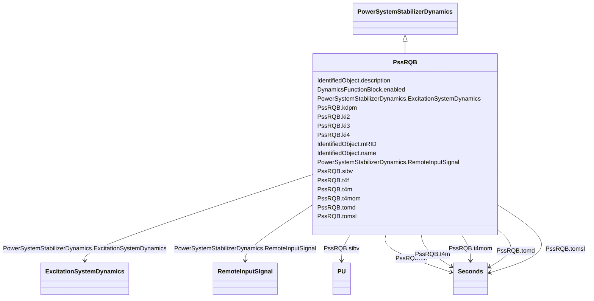

# PssRQB

_Power system stabilizer type RQB. This power system stabilizer is intended to be used together with excitation system type ExcRQB, which is primarily used in nuclear or thermal generating units._

**URI**: [cim:PssRQB](http://iec.ch/TC57/CIM100#PssRQB) 
**Type**: Class

## Inheritance
* [IdentifiedObject](IdentifiedObject.md)
    * [DynamicsFunctionBlock](DynamicsFunctionBlock.md)
        * [PowerSystemStabilizerDynamics](PowerSystemStabilizerDynamics.md)
            * **PssRQB**

## Attributes

| Name | URI | Cardinality and Range | Description | Inheritance |
| ---  | --- | --- | --- | --- |
| ki2 | [cim:PssRQB.ki2](http://iec.ch/TC57/CIM100#PssRQB.ki2) | 1..1    float  | Speed input gain (<i>Ki2</i>) | direct |
| ki3 | [cim:PssRQB.ki3](http://iec.ch/TC57/CIM100#PssRQB.ki3) | 1..1    float  | Electrical power input gain (<i>Ki3</i>) | direct |
| ki4 | [cim:PssRQB.ki4](http://iec.ch/TC57/CIM100#PssRQB.ki4) | 1..1    float  | Mechanical power input gain (<i>Ki4</i>) | direct |
| t4m | [cim:PssRQB.t4m](http://iec.ch/TC57/CIM100#PssRQB.t4m) | 1..1    [Seconds](Seconds.md)  | Input time constant (<i>T4M</i>) (&gt;= 0) | direct |
| tomd | [cim:PssRQB.tomd](http://iec.ch/TC57/CIM100#PssRQB.tomd) | 1..1    [Seconds](Seconds.md)  | Speed delay (<i>TOMD</i>) (&gt;= 0) | direct |
| tomsl | [cim:PssRQB.tomsl](http://iec.ch/TC57/CIM100#PssRQB.tomsl) | 1..1    [Seconds](Seconds.md)  | Speed time constant (<i>TOMSL</i>) (&gt;= 0) | direct |
| t4mom | [cim:PssRQB.t4mom](http://iec.ch/TC57/CIM100#PssRQB.t4mom) | 1..1    [Seconds](Seconds.md)  | Speed time constant (<i>T4MOM</i>) (&gt;= 0) | direct |
| sibv | [cim:PssRQB.sibv](http://iec.ch/TC57/CIM100#PssRQB.sibv) | 1..1    [PU](PU.md)  | Speed deadband (<i>SIBV</i>) | direct |
| kdpm | [cim:PssRQB.kdpm](http://iec.ch/TC57/CIM100#PssRQB.kdpm) | 1..1    float  | Lead lag gain (<i>KDPM</i>) | direct |
| t4f | [cim:PssRQB.t4f](http://iec.ch/TC57/CIM100#PssRQB.t4f) | 1..1    [Seconds](Seconds.md)  | Lead lag time constant (<i>T4F</i>) (&gt;= 0) | direct |
| RemoteInputSignal | [cim:PowerSystemStabilizerDynamics.RemoteInputSignal](http://iec.ch/TC57/CIM100#PowerSystemStabilizerDynamics.RemoteInputSignal) | 0..*    [RemoteInputSignal](RemoteInputSignal.md)  | Remote input signal used by this power system stabilizer model | [PowerSystemStabilizerDynamics](PowerSystemStabilizerDynamics.md) |
| ExcitationSystemDynamics | [cim:PowerSystemStabilizerDynamics.ExcitationSystemDynamics](http://iec.ch/TC57/CIM100#PowerSystemStabilizerDynamics.ExcitationSystemDynamics) | 1..1    [ExcitationSystemDynamics](ExcitationSystemDynamics.md)  | Excitation system model with which this power system stabilizer model is asso... | [PowerSystemStabilizerDynamics](PowerSystemStabilizerDynamics.md) |
| enabled | [cim:DynamicsFunctionBlock.enabled](http://iec.ch/TC57/CIM100#DynamicsFunctionBlock.enabled) | 1..1    boolean  | Function block used indicator | [DynamicsFunctionBlock](DynamicsFunctionBlock.md) |
| description | [cim:IdentifiedObject.description](http://iec.ch/TC57/CIM100#IdentifiedObject.description) | 0..1    string  | The description is a free human readable text describing or naming the object | [IdentifiedObject](IdentifiedObject.md) |
| mRID | [cim:IdentifiedObject.mRID](http://iec.ch/TC57/CIM100#IdentifiedObject.mRID) | 1..1    string  | Master resource identifier issued by a model authority | [IdentifiedObject](IdentifiedObject.md) |
| name | [cim:IdentifiedObject.name](http://iec.ch/TC57/CIM100#IdentifiedObject.name) | 0..1    string  | The name is any free human readable and possibly non unique text naming the o... | [IdentifiedObject](IdentifiedObject.md) |

## Identifier and Mapping Information

### Schema Source

* from schema: http://iec.ch/TC57/ns/CIM/Dynamics-EU#Package_DynamicsProfile

## Mappings

| Mapping Type | Mapped Value |
| ---  | ---  |
| self | cim:PssRQB |
| native | this:PssRQB |

