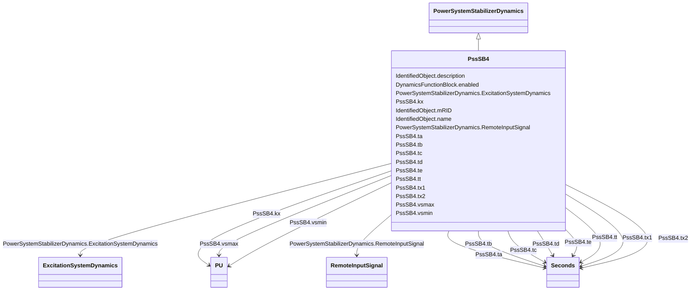

# PssSB4

_Power sensitive stabilizer model._

**URI**: [cim:PssSB4](http://iec.ch/TC57/CIM100#PssSB4) 
**Type**: Class

## Inheritance
* [IdentifiedObject](IdentifiedObject.md)
    * [DynamicsFunctionBlock](DynamicsFunctionBlock.md)
        * [PowerSystemStabilizerDynamics](PowerSystemStabilizerDynamics.md)
            * **PssSB4**

## Attributes

| Name | URI | Cardinality and Range | Description | Inheritance |
| ---  | --- | --- | --- | --- |
| tt | [cim:PssSB4.tt](http://iec.ch/TC57/CIM100#PssSB4.tt) | 1..1    [Seconds](Seconds.md)  | Time constant (<i>Tt</i>) (&gt;= 0) | direct |
| kx | [cim:PssSB4.kx](http://iec.ch/TC57/CIM100#PssSB4.kx) | 1..1    [PU](PU.md)  | Gain (<i>Kx</i>) | direct |
| tx2 | [cim:PssSB4.tx2](http://iec.ch/TC57/CIM100#PssSB4.tx2) | 1..1    [Seconds](Seconds.md)  | Time constant (<i>Tx2</i>) (&gt;= 0) | direct |
| ta | [cim:PssSB4.ta](http://iec.ch/TC57/CIM100#PssSB4.ta) | 1..1    [Seconds](Seconds.md)  | Time constant (<i>Ta</i>) (&gt;= 0) | direct |
| tx1 | [cim:PssSB4.tx1](http://iec.ch/TC57/CIM100#PssSB4.tx1) | 1..1    [Seconds](Seconds.md)  | Reset time constant (<i>Tx1</i>) (&gt;= 0) | direct |
| tb | [cim:PssSB4.tb](http://iec.ch/TC57/CIM100#PssSB4.tb) | 1..1    [Seconds](Seconds.md)  | Time constant (<i>Tb</i>) (&gt;= 0) | direct |
| tc | [cim:PssSB4.tc](http://iec.ch/TC57/CIM100#PssSB4.tc) | 1..1    [Seconds](Seconds.md)  | Time constant (<i>Tc</i>) (&gt;= 0) | direct |
| td | [cim:PssSB4.td](http://iec.ch/TC57/CIM100#PssSB4.td) | 1..1    [Seconds](Seconds.md)  | Time constant (<i>Td</i>) (&gt;= 0) | direct |
| te | [cim:PssSB4.te](http://iec.ch/TC57/CIM100#PssSB4.te) | 1..1    [Seconds](Seconds.md)  | Time constant (<i>Te</i>) (&gt;= 0) | direct |
| vsmax | [cim:PssSB4.vsmax](http://iec.ch/TC57/CIM100#PssSB4.vsmax) | 1..1    [PU](PU.md)  | Limiter (<i>Vsmax</i>) (&gt; PssSB4 | direct |
| vsmin | [cim:PssSB4.vsmin](http://iec.ch/TC57/CIM100#PssSB4.vsmin) | 1..1    [PU](PU.md)  | Limiter (<i>Vsmin</i>) (&lt; PssSB4 | direct |
| RemoteInputSignal | [cim:PowerSystemStabilizerDynamics.RemoteInputSignal](http://iec.ch/TC57/CIM100#PowerSystemStabilizerDynamics.RemoteInputSignal) | 0..*    [RemoteInputSignal](RemoteInputSignal.md)  | Remote input signal used by this power system stabilizer model | [PowerSystemStabilizerDynamics](PowerSystemStabilizerDynamics.md) |
| ExcitationSystemDynamics | [cim:PowerSystemStabilizerDynamics.ExcitationSystemDynamics](http://iec.ch/TC57/CIM100#PowerSystemStabilizerDynamics.ExcitationSystemDynamics) | 1..1    [ExcitationSystemDynamics](ExcitationSystemDynamics.md)  | Excitation system model with which this power system stabilizer model is asso... | [PowerSystemStabilizerDynamics](PowerSystemStabilizerDynamics.md) |
| enabled | [cim:DynamicsFunctionBlock.enabled](http://iec.ch/TC57/CIM100#DynamicsFunctionBlock.enabled) | 1..1    boolean  | Function block used indicator | [DynamicsFunctionBlock](DynamicsFunctionBlock.md) |
| description | [cim:IdentifiedObject.description](http://iec.ch/TC57/CIM100#IdentifiedObject.description) | 0..1    string  | The description is a free human readable text describing or naming the object | [IdentifiedObject](IdentifiedObject.md) |
| mRID | [cim:IdentifiedObject.mRID](http://iec.ch/TC57/CIM100#IdentifiedObject.mRID) | 1..1    string  | Master resource identifier issued by a model authority | [IdentifiedObject](IdentifiedObject.md) |
| name | [cim:IdentifiedObject.name](http://iec.ch/TC57/CIM100#IdentifiedObject.name) | 0..1    string  | The name is any free human readable and possibly non unique text naming the o... | [IdentifiedObject](IdentifiedObject.md) |

## Identifier and Mapping Information

### Schema Source

* from schema: http://iec.ch/TC57/ns/CIM/Dynamics-EU#Package_DynamicsProfile

## Mappings

| Mapping Type | Mapped Value |
| ---  | ---  |
| self | cim:PssSB4 |
| native | this:PssSB4 |

