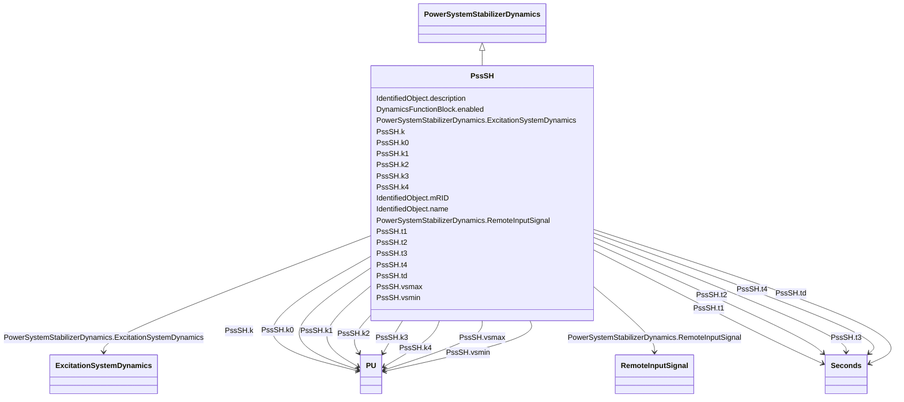

# PssSH

_SiemensTM “H infinity” power system stabilizer with generator electrical power input._

_[Footnote: Siemens "H infinity" power system stabilizers are an example of suitable products available commercially. This information is given for the convenience of users of this document and does not constitute an endorsement by IEC of these products.]_

**URI**: [cim:PssSH](http://iec.ch/TC57/CIM100#PssSH) 
**Type**: Class

## Inheritance
* [IdentifiedObject](IdentifiedObject.md)
    * [DynamicsFunctionBlock](DynamicsFunctionBlock.md)
        * [PowerSystemStabilizerDynamics](PowerSystemStabilizerDynamics.md)
            * **PssSH**

## Attributes

| Name | URI | Cardinality and Range | Description | Inheritance |
| ---  | --- | --- | --- | --- |
| k | [cim:PssSH.k](http://iec.ch/TC57/CIM100#PssSH.k) | 1..1    [PU](PU.md)  | Main gain (<i>K</i>) | direct |
| k0 | [cim:PssSH.k0](http://iec.ch/TC57/CIM100#PssSH.k0) | 1..1    [PU](PU.md)  | Gain 0 (<i>K0</i>) | direct |
| k1 | [cim:PssSH.k1](http://iec.ch/TC57/CIM100#PssSH.k1) | 1..1    [PU](PU.md)  | Gain 1 (<i>K1</i>) | direct |
| k2 | [cim:PssSH.k2](http://iec.ch/TC57/CIM100#PssSH.k2) | 1..1    [PU](PU.md)  | Gain 2 (<i>K2</i>) | direct |
| k3 | [cim:PssSH.k3](http://iec.ch/TC57/CIM100#PssSH.k3) | 1..1    [PU](PU.md)  | Gain 3 (<i>K3</i>) | direct |
| k4 | [cim:PssSH.k4](http://iec.ch/TC57/CIM100#PssSH.k4) | 1..1    [PU](PU.md)  | Gain 4 (<i>K4</i>) | direct |
| td | [cim:PssSH.td](http://iec.ch/TC57/CIM100#PssSH.td) | 1..1    [Seconds](Seconds.md)  | Input time constant (<i>T</i><i>d</i>) (&gt;= 0) | direct |
| t1 | [cim:PssSH.t1](http://iec.ch/TC57/CIM100#PssSH.t1) | 1..1    [Seconds](Seconds.md)  | Time constant 1 (<i>T1</i>) (&gt; 0) | direct |
| t2 | [cim:PssSH.t2](http://iec.ch/TC57/CIM100#PssSH.t2) | 1..1    [Seconds](Seconds.md)  | Time constant 2 (<i>T2</i>) (&gt; 0) | direct |
| t3 | [cim:PssSH.t3](http://iec.ch/TC57/CIM100#PssSH.t3) | 1..1    [Seconds](Seconds.md)  | Time constant 3 (<i>T3</i>) (&gt; 0) | direct |
| t4 | [cim:PssSH.t4](http://iec.ch/TC57/CIM100#PssSH.t4) | 1..1    [Seconds](Seconds.md)  | Time constant 4 (<i>T4</i>) (&gt; 0) | direct |
| vsmax | [cim:PssSH.vsmax](http://iec.ch/TC57/CIM100#PssSH.vsmax) | 1..1    [PU](PU.md)  | Output maximum limit (<i>Vsmax</i>) (&gt; PssSH | direct |
| vsmin | [cim:PssSH.vsmin](http://iec.ch/TC57/CIM100#PssSH.vsmin) | 1..1    [PU](PU.md)  | Output minimum limit (<i>Vsmin</i>) (&lt; PssSH | direct |
| RemoteInputSignal | [cim:PowerSystemStabilizerDynamics.RemoteInputSignal](http://iec.ch/TC57/CIM100#PowerSystemStabilizerDynamics.RemoteInputSignal) | 0..*    [RemoteInputSignal](RemoteInputSignal.md)  | Remote input signal used by this power system stabilizer model | [PowerSystemStabilizerDynamics](PowerSystemStabilizerDynamics.md) |
| ExcitationSystemDynamics | [cim:PowerSystemStabilizerDynamics.ExcitationSystemDynamics](http://iec.ch/TC57/CIM100#PowerSystemStabilizerDynamics.ExcitationSystemDynamics) | 1..1    [ExcitationSystemDynamics](ExcitationSystemDynamics.md)  | Excitation system model with which this power system stabilizer model is asso... | [PowerSystemStabilizerDynamics](PowerSystemStabilizerDynamics.md) |
| enabled | [cim:DynamicsFunctionBlock.enabled](http://iec.ch/TC57/CIM100#DynamicsFunctionBlock.enabled) | 1..1    boolean  | Function block used indicator | [DynamicsFunctionBlock](DynamicsFunctionBlock.md) |
| description | [cim:IdentifiedObject.description](http://iec.ch/TC57/CIM100#IdentifiedObject.description) | 0..1    string  | The description is a free human readable text describing or naming the object | [IdentifiedObject](IdentifiedObject.md) |
| mRID | [cim:IdentifiedObject.mRID](http://iec.ch/TC57/CIM100#IdentifiedObject.mRID) | 1..1    string  | Master resource identifier issued by a model authority | [IdentifiedObject](IdentifiedObject.md) |
| name | [cim:IdentifiedObject.name](http://iec.ch/TC57/CIM100#IdentifiedObject.name) | 0..1    string  | The name is any free human readable and possibly non unique text naming the o... | [IdentifiedObject](IdentifiedObject.md) |

## Identifier and Mapping Information

### Schema Source

* from schema: http://iec.ch/TC57/ns/CIM/Dynamics-EU#Package_DynamicsProfile

## Mappings

| Mapping Type | Mapped Value |
| ---  | ---  |
| self | cim:PssSH |
| native | this:PssSH |

