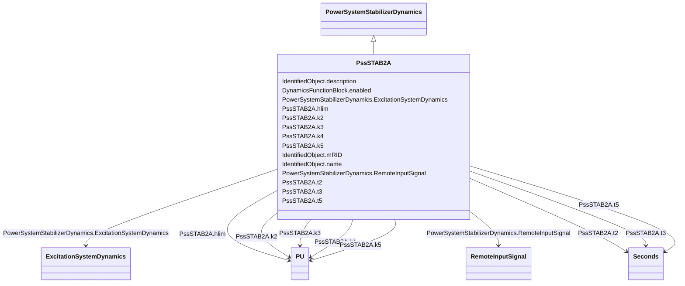

# PssSTAB2A

_Power system stabilizer part of an ABB excitation system._

_[Footnote: ABB excitation systems are an example of suitable products available commercially. This information is given for the convenience of users of this document and does not constitute an endorsement by IEC of these products.]_

**URI**: [cim:PssSTAB2A](http://iec.ch/TC57/CIM100#PssSTAB2A) 
**Type**: Class

## Inheritance
* [IdentifiedObject](IdentifiedObject.md)
    * [DynamicsFunctionBlock](DynamicsFunctionBlock.md)
        * [PowerSystemStabilizerDynamics](PowerSystemStabilizerDynamics.md)
            * **PssSTAB2A**

## Attributes

| Name | URI | Cardinality and Range | Description | Inheritance |
| ---  | --- | --- | --- | --- |
| k2 | [cim:PssSTAB2A.k2](http://iec.ch/TC57/CIM100#PssSTAB2A.k2) | 1..1    [PU](PU.md)  | Gain (<i>K2</i>) | direct |
| k3 | [cim:PssSTAB2A.k3](http://iec.ch/TC57/CIM100#PssSTAB2A.k3) | 1..1    [PU](PU.md)  | Gain (<i>K3</i>) | direct |
| k4 | [cim:PssSTAB2A.k4](http://iec.ch/TC57/CIM100#PssSTAB2A.k4) | 1..1    [PU](PU.md)  | Gain (<i>K4</i>) | direct |
| k5 | [cim:PssSTAB2A.k5](http://iec.ch/TC57/CIM100#PssSTAB2A.k5) | 1..1    [PU](PU.md)  | Gain (<i>K5</i>) | direct |
| t2 | [cim:PssSTAB2A.t2](http://iec.ch/TC57/CIM100#PssSTAB2A.t2) | 1..1    [Seconds](Seconds.md)  | Time constant (<i>T2</i>) | direct |
| t3 | [cim:PssSTAB2A.t3](http://iec.ch/TC57/CIM100#PssSTAB2A.t3) | 1..1    [Seconds](Seconds.md)  | Time constant (<i>T3</i>) | direct |
| t5 | [cim:PssSTAB2A.t5](http://iec.ch/TC57/CIM100#PssSTAB2A.t5) | 1..1    [Seconds](Seconds.md)  | Time constant (<i>T5</i>) | direct |
| hlim | [cim:PssSTAB2A.hlim](http://iec.ch/TC57/CIM100#PssSTAB2A.hlim) | 1..1    [PU](PU.md)  | Stabilizer output limiter (<i>H</i><i>LIM</i>) | direct |
| RemoteInputSignal | [cim:PowerSystemStabilizerDynamics.RemoteInputSignal](http://iec.ch/TC57/CIM100#PowerSystemStabilizerDynamics.RemoteInputSignal) | 0..*    [RemoteInputSignal](RemoteInputSignal.md)  | Remote input signal used by this power system stabilizer model | [PowerSystemStabilizerDynamics](PowerSystemStabilizerDynamics.md) |
| ExcitationSystemDynamics | [cim:PowerSystemStabilizerDynamics.ExcitationSystemDynamics](http://iec.ch/TC57/CIM100#PowerSystemStabilizerDynamics.ExcitationSystemDynamics) | 1..1    [ExcitationSystemDynamics](ExcitationSystemDynamics.md)  | Excitation system model with which this power system stabilizer model is asso... | [PowerSystemStabilizerDynamics](PowerSystemStabilizerDynamics.md) |
| enabled | [cim:DynamicsFunctionBlock.enabled](http://iec.ch/TC57/CIM100#DynamicsFunctionBlock.enabled) | 1..1    boolean  | Function block used indicator | [DynamicsFunctionBlock](DynamicsFunctionBlock.md) |
| description | [cim:IdentifiedObject.description](http://iec.ch/TC57/CIM100#IdentifiedObject.description) | 0..1    string  | The description is a free human readable text describing or naming the object | [IdentifiedObject](IdentifiedObject.md) |
| mRID | [cim:IdentifiedObject.mRID](http://iec.ch/TC57/CIM100#IdentifiedObject.mRID) | 1..1    string  | Master resource identifier issued by a model authority | [IdentifiedObject](IdentifiedObject.md) |
| name | [cim:IdentifiedObject.name](http://iec.ch/TC57/CIM100#IdentifiedObject.name) | 0..1    string  | The name is any free human readable and possibly non unique text naming the o... | [IdentifiedObject](IdentifiedObject.md) |

## Identifier and Mapping Information

### Schema Source

* from schema: http://iec.ch/TC57/ns/CIM/Dynamics-EU#Package_DynamicsProfile

## Mappings

| Mapping Type | Mapped Value |
| ---  | ---  |
| self | cim:PssSTAB2A |
| native | this:PssSTAB2A |

