# PssWECC

_Dual input power system stabilizer, based on IEEE type 2, with modified output limiter defined by WECC (Western Electricity Coordinating Council, USA)._

**URI**: [cim:PssWECC](http://iec.ch/TC57/CIM100#PssWECC) 
**Type**: Class

```mermaid
 classDiagram
    class PssWECC
    click PssWECC href "../PssWECC"
      PowerSystemStabilizerDynamics <|-- PssWECC
        click PowerSystemStabilizerDynamics href "../PowerSystemStabilizerDynamics"
      
      PssWECC : IdentifiedObject.description
        
      PssWECC : DynamicsFunctionBlock.enabled
        
      PssWECC : PowerSystemStabilizerDynamics.ExcitationSystemDynamics
        
          PssWECC --> ExcitationSystemDynamics : PowerSystemStabilizerDynamics.ExcitationSystemDynamics
          click ExcitationSystemDynamics href "../ExcitationSystemDynamics"
        
      PssWECC : PssWECC.inputSignal1Type
        
          PssWECC --> InputSignalKind : PssWECC.inputSignal1Type
          click InputSignalKind href "../InputSignalKind"
        
      PssWECC : PssWECC.inputSignal2Type
        
          PssWECC --> InputSignalKind : PssWECC.inputSignal2Type
          click InputSignalKind href "../InputSignalKind"
        
      PssWECC : PssWECC.k1
        
          PssWECC --> PU : PssWECC.k1
          click PU href "../PU"
        
      PssWECC : PssWECC.k2
        
          PssWECC --> PU : PssWECC.k2
          click PU href "../PU"
        
      PssWECC : IdentifiedObject.mRID
        
      PssWECC : IdentifiedObject.name
        
      PssWECC : PowerSystemStabilizerDynamics.RemoteInputSignal
        
          PssWECC --> RemoteInputSignal : PowerSystemStabilizerDynamics.RemoteInputSignal
          click RemoteInputSignal href "../RemoteInputSignal"
        
      PssWECC : PssWECC.t1
        
          PssWECC --> Seconds : PssWECC.t1
          click Seconds href "../Seconds"
        
      PssWECC : PssWECC.t10
        
          PssWECC --> Seconds : PssWECC.t10
          click Seconds href "../Seconds"
        
      PssWECC : PssWECC.t2
        
          PssWECC --> Seconds : PssWECC.t2
          click Seconds href "../Seconds"
        
      PssWECC : PssWECC.t3
        
          PssWECC --> Seconds : PssWECC.t3
          click Seconds href "../Seconds"
        
      PssWECC : PssWECC.t4
        
          PssWECC --> Seconds : PssWECC.t4
          click Seconds href "../Seconds"
        
      PssWECC : PssWECC.t5
        
          PssWECC --> Seconds : PssWECC.t5
          click Seconds href "../Seconds"
        
      PssWECC : PssWECC.t6
        
          PssWECC --> Seconds : PssWECC.t6
          click Seconds href "../Seconds"
        
      PssWECC : PssWECC.t7
        
          PssWECC --> Seconds : PssWECC.t7
          click Seconds href "../Seconds"
        
      PssWECC : PssWECC.t8
        
          PssWECC --> Seconds : PssWECC.t8
          click Seconds href "../Seconds"
        
      PssWECC : PssWECC.t9
        
          PssWECC --> Seconds : PssWECC.t9
          click Seconds href "../Seconds"
        
      PssWECC : PssWECC.vcl
        
          PssWECC --> PU : PssWECC.vcl
          click PU href "../PU"
        
      PssWECC : PssWECC.vcu
        
          PssWECC --> PU : PssWECC.vcu
          click PU href "../PU"
        
      PssWECC : PssWECC.vsmax
        
          PssWECC --> PU : PssWECC.vsmax
          click PU href "../PU"
        
      PssWECC : PssWECC.vsmin
        
          PssWECC --> PU : PssWECC.vsmin
          click PU href "../PU"
        
      
```

## Inheritance
* [IdentifiedObject](IdentifiedObject.md)
    * [DynamicsFunctionBlock](DynamicsFunctionBlock.md)
        * [PowerSystemStabilizerDynamics](PowerSystemStabilizerDynamics.md)
            * **PssWECC**

## Attributes

| Name | URI | Cardinality and Range | Description | Inheritance |
| ---  | --- | --- | --- | --- |
| inputSignal1Type | [cim:PssWECC.inputSignal1Type](http://iec.ch/TC57/CIM100#PssWECC.inputSignal1Type) | 1    [InputSignalKind](InputSignalKind.md)  | Type of input signal #1 (rotorAngularFrequencyDeviation, busFrequencyDeviatio... | direct |
| inputSignal2Type | [cim:PssWECC.inputSignal2Type](http://iec.ch/TC57/CIM100#PssWECC.inputSignal2Type) | 1    [InputSignalKind](InputSignalKind.md)  | Type of input signal #2 (rotorAngularFrequencyDeviation, busFrequencyDeviatio... | direct |
| k1 | [cim:PssWECC.k1](http://iec.ch/TC57/CIM100#PssWECC.k1) | 1    [PU](PU.md)  | Input signal 1 gain (<i>K</i><i>1</i>) | direct |
| t1 | [cim:PssWECC.t1](http://iec.ch/TC57/CIM100#PssWECC.t1) | 1    [Seconds](Seconds.md)  | Input signal 1 transducer time constant (<i>T</i><i>1</i>) (&gt;= ... | direct |
| k2 | [cim:PssWECC.k2](http://iec.ch/TC57/CIM100#PssWECC.k2) | 1    [PU](PU.md)  | Input signal 2 gain (<i>K</i><i>2</i>) | direct |
| t2 | [cim:PssWECC.t2](http://iec.ch/TC57/CIM100#PssWECC.t2) | 1    [Seconds](Seconds.md)  | Input signal 2 transducer time constant (<i>T</i><i>2</i>) (&gt;= ... | direct |
| t3 | [cim:PssWECC.t3](http://iec.ch/TC57/CIM100#PssWECC.t3) | 1    [Seconds](Seconds.md)  | Stabilizer washout time constant (<i>T</i><i>3</i>) (&gt;= 0) | direct |
| t4 | [cim:PssWECC.t4](http://iec.ch/TC57/CIM100#PssWECC.t4) | 1    [Seconds](Seconds.md)  | Stabilizer washout time lag constant (<i>T</i><i>4</i>) (&gt;= 0) | direct |
| t5 | [cim:PssWECC.t5](http://iec.ch/TC57/CIM100#PssWECC.t5) | 1    [Seconds](Seconds.md)  | Lead time constant (<i>T</i><i>5</i>) (&gt;= 0) | direct |
| t6 | [cim:PssWECC.t6](http://iec.ch/TC57/CIM100#PssWECC.t6) | 1    [Seconds](Seconds.md)  | Lag time constant (<i>T</i><i>6</i>) (&gt;= 0) | direct |
| t7 | [cim:PssWECC.t7](http://iec.ch/TC57/CIM100#PssWECC.t7) | 1    [Seconds](Seconds.md)  | Lead time constant (<i>T</i><i>7</i>) (&gt;= 0) | direct |
| t8 | [cim:PssWECC.t8](http://iec.ch/TC57/CIM100#PssWECC.t8) | 1    [Seconds](Seconds.md)  | Lag time constant (<i>T</i><i>8</i>) (&gt;= 0) | direct |
| t10 | [cim:PssWECC.t10](http://iec.ch/TC57/CIM100#PssWECC.t10) | 1    [Seconds](Seconds.md)  | Lag time constant (<i>T</i><i>10</i>) (&gt;= 0) | direct |
| t9 | [cim:PssWECC.t9](http://iec.ch/TC57/CIM100#PssWECC.t9) | 1    [Seconds](Seconds.md)  | Lead time constant (<i>T</i><i>9</i>) (&gt;= 0) | direct |
| vsmax | [cim:PssWECC.vsmax](http://iec.ch/TC57/CIM100#PssWECC.vsmax) | 1    [PU](PU.md)  | Maximum output signal (<i>Vsmax</i>) (&gt; PssWECC | direct |
| vsmin | [cim:PssWECC.vsmin](http://iec.ch/TC57/CIM100#PssWECC.vsmin) | 1    [PU](PU.md)  | Minimum output signal (<i>Vsmin</i>) (&lt; PssWECC | direct |
| vcu | [cim:PssWECC.vcu](http://iec.ch/TC57/CIM100#PssWECC.vcu) | 1    [PU](PU.md)  | Maximum value for voltage compensator output (<i>V</i><i>CU</i>) | direct |
| vcl | [cim:PssWECC.vcl](http://iec.ch/TC57/CIM100#PssWECC.vcl) | 1    [PU](PU.md)  | Minimum value for voltage compensator output (<i>V</i><i>CL</i>) | direct |
| RemoteInputSignal | [cim:PowerSystemStabilizerDynamics.RemoteInputSignal](http://iec.ch/TC57/CIM100#PowerSystemStabilizerDynamics.RemoteInputSignal) | *    [RemoteInputSignal](RemoteInputSignal.md)  | Remote input signal used by this power system stabilizer model | [PowerSystemStabilizerDynamics](PowerSystemStabilizerDynamics.md) |
| ExcitationSystemDynamics | [cim:PowerSystemStabilizerDynamics.ExcitationSystemDynamics](http://iec.ch/TC57/CIM100#PowerSystemStabilizerDynamics.ExcitationSystemDynamics) | 1    [ExcitationSystemDynamics](ExcitationSystemDynamics.md)  | Excitation system model with which this power system stabilizer model is asso... | [PowerSystemStabilizerDynamics](PowerSystemStabilizerDynamics.md) |
| enabled | [cim:DynamicsFunctionBlock.enabled](http://iec.ch/TC57/CIM100#DynamicsFunctionBlock.enabled) | 1    boolean  | Function block used indicator | [DynamicsFunctionBlock](DynamicsFunctionBlock.md) |
| description | [cim:IdentifiedObject.description](http://iec.ch/TC57/CIM100#IdentifiedObject.description) | 0..1    string  | The description is a free human readable text describing or naming the object | [IdentifiedObject](IdentifiedObject.md) |
| mRID | [cim:IdentifiedObject.mRID](http://iec.ch/TC57/CIM100#IdentifiedObject.mRID) | 1    string  | Master resource identifier issued by a model authority | [IdentifiedObject](IdentifiedObject.md) |
| name | [cim:IdentifiedObject.name](http://iec.ch/TC57/CIM100#IdentifiedObject.name) | 0..1    string  | The name is any free human readable and possibly non unique text naming the o... | [IdentifiedObject](IdentifiedObject.md) |

## Identifier and Mapping Information

### Schema Source

* from schema: http://iec.ch/TC57/ns/CIM/Dynamics-EU#Package_DynamicsProfile

## Mappings

| Mapping Type | Mapped Value |
| ---  | ---  |
| self | cim:PssWECC |
| native | this:PssWECC |

