# RemoteInputSignal

_Supports connection to a terminal associated with a remote bus from which an input signal of a specific type is coming._

**URI**: [cim:RemoteInputSignal](http://iec.ch/TC57/CIM100#RemoteInputSignal) 
**Type**: Class

```mermaid
 classDiagram
    class RemoteInputSignal
      IdentifiedObject <|-- RemoteInputSignal
      
      RemoteInputSignal : IdentifiedObject.description
        
      RemoteInputSignal : RemoteInputSignal.DiscontinuousExcitationControlDynamics
        
          RemoteInputSignal --> DiscontinuousExcitationControlDynamics : RemoteInputSignal.DiscontinuousExcitationControlDynamics
        
      RemoteInputSignal : IdentifiedObject.mRID
        
      RemoteInputSignal : IdentifiedObject.name
        
      RemoteInputSignal : RemoteInputSignal.PFVArControllerType1Dynamics
        
          RemoteInputSignal --> PFVArControllerType1Dynamics : RemoteInputSignal.PFVArControllerType1Dynamics
        
      RemoteInputSignal : RemoteInputSignal.PowerSystemStabilizerDynamics
        
          RemoteInputSignal --> PowerSystemStabilizerDynamics : RemoteInputSignal.PowerSystemStabilizerDynamics
        
      RemoteInputSignal : RemoteInputSignal.remoteSignalType
        
          RemoteInputSignal --> RemoteSignalKind : RemoteInputSignal.remoteSignalType
        
      RemoteInputSignal : RemoteInputSignal.Terminal
        
          RemoteInputSignal --> Terminal : RemoteInputSignal.Terminal
        
      RemoteInputSignal : RemoteInputSignal.UnderexcitationLimiterDynamics
        
          RemoteInputSignal --> UnderexcitationLimiterDynamics : RemoteInputSignal.UnderexcitationLimiterDynamics
        
      RemoteInputSignal : RemoteInputSignal.VoltageCompensatorDynamics
        
          RemoteInputSignal --> VoltageCompensatorDynamics : RemoteInputSignal.VoltageCompensatorDynamics
        
      RemoteInputSignal : RemoteInputSignal.WindPlantDynamics
        
          RemoteInputSignal --> WindPlantDynamics : RemoteInputSignal.WindPlantDynamics
        
      RemoteInputSignal : RemoteInputSignal.WindTurbineType1or2Dynamics
        
          RemoteInputSignal --> WindTurbineType1or2Dynamics : RemoteInputSignal.WindTurbineType1or2Dynamics
        
      RemoteInputSignal : RemoteInputSignal.WindTurbineType3or4Dynamics
        
          RemoteInputSignal --> WindTurbineType3or4Dynamics : RemoteInputSignal.WindTurbineType3or4Dynamics
        
      
```

## Inheritance
* [IdentifiedObject](IdentifiedObject.md)
    * **RemoteInputSignal**

## Attributes

| Name | URI | Cardinality and Range | Description | Inheritance |
| ---  | --- | --- | --- | --- |
| Terminal | [cim:RemoteInputSignal.Terminal](http://iec.ch/TC57/CIM100#RemoteInputSignal.Terminal) | 1..1    [Terminal](Terminal.md)  | Remote terminal with which this input signal is associated | direct |
| remoteSignalType | [cim:RemoteInputSignal.remoteSignalType](http://iec.ch/TC57/CIM100#RemoteInputSignal.remoteSignalType) | 1..1    [RemoteSignalKind](RemoteSignalKind.md)  | Type of input signal | direct |
| DiscontinuousExcitationControlDynamics | [cim:RemoteInputSignal.DiscontinuousExcitationControlDynamics](http://iec.ch/TC57/CIM100#RemoteInputSignal.DiscontinuousExcitationControlDynamics) | 0..1    [DiscontinuousExcitationControlDynamics](DiscontinuousExcitationControlDynamics.md)  | Discontinuous excitation control model using this remote input signal | direct |
| WindTurbineType1or2Dynamics | [cim:RemoteInputSignal.WindTurbineType1or2Dynamics](http://iec.ch/TC57/CIM100#RemoteInputSignal.WindTurbineType1or2Dynamics) | 0..1    [WindTurbineType1or2Dynamics](WindTurbineType1or2Dynamics.md)  | Wind generator type 1 or type 2 model using this remote input signal | direct |
| PowerSystemStabilizerDynamics | [cim:RemoteInputSignal.PowerSystemStabilizerDynamics](http://iec.ch/TC57/CIM100#RemoteInputSignal.PowerSystemStabilizerDynamics) | 0..1    [PowerSystemStabilizerDynamics](PowerSystemStabilizerDynamics.md)  | Power system stabilizer model using this remote input signal | direct |
| UnderexcitationLimiterDynamics | [cim:RemoteInputSignal.UnderexcitationLimiterDynamics](http://iec.ch/TC57/CIM100#RemoteInputSignal.UnderexcitationLimiterDynamics) | 0..1    [UnderexcitationLimiterDynamics](UnderexcitationLimiterDynamics.md)  | Underexcitation limiter model using this remote input signal | direct |
| PFVArControllerType1Dynamics | [cim:RemoteInputSignal.PFVArControllerType1Dynamics](http://iec.ch/TC57/CIM100#RemoteInputSignal.PFVArControllerType1Dynamics) | 0..1    [PFVArControllerType1Dynamics](PFVArControllerType1Dynamics.md)  | Power factor or VAr controller type 1 model using this remote input signal | direct |
| VoltageCompensatorDynamics | [cim:RemoteInputSignal.VoltageCompensatorDynamics](http://iec.ch/TC57/CIM100#RemoteInputSignal.VoltageCompensatorDynamics) | 0..1    [VoltageCompensatorDynamics](VoltageCompensatorDynamics.md)  | Voltage compensator model using this remote input signal | direct |
| WindPlantDynamics | [cim:RemoteInputSignal.WindPlantDynamics](http://iec.ch/TC57/CIM100#RemoteInputSignal.WindPlantDynamics) | 0..1    [WindPlantDynamics](WindPlantDynamics.md)  | The wind plant using the remote signal | direct |
| WindTurbineType3or4Dynamics | [cim:RemoteInputSignal.WindTurbineType3or4Dynamics](http://iec.ch/TC57/CIM100#RemoteInputSignal.WindTurbineType3or4Dynamics) | 0..1    [WindTurbineType3or4Dynamics](WindTurbineType3or4Dynamics.md)  | Wind turbine type 3 or type 4 models using this remote input signal | direct |
| description | [cim:IdentifiedObject.description](http://iec.ch/TC57/CIM100#IdentifiedObject.description) | 0..1    string  | The description is a free human readable text describing or naming the object | [IdentifiedObject](IdentifiedObject.md) |
| mRID | [cim:IdentifiedObject.mRID](http://iec.ch/TC57/CIM100#IdentifiedObject.mRID) | 1..1    string  | Master resource identifier issued by a model authority | [IdentifiedObject](IdentifiedObject.md) |
| name | [cim:IdentifiedObject.name](http://iec.ch/TC57/CIM100#IdentifiedObject.name) | 0..1    string  | The name is any free human readable and possibly non unique text naming the o... | [IdentifiedObject](IdentifiedObject.md) |

## Usages

| used by | used in | type | used |
| ---  | --- | --- | --- |
| [Terminal](Terminal.md) | RemoteInputSignal | range | [RemoteInputSignal](RemoteInputSignal.md) |
| [WindPlantUserDefined](WindPlantUserDefined.md) | RemoteInputSignal | range | [RemoteInputSignal](RemoteInputSignal.md) |
| [WindType1or2UserDefined](WindType1or2UserDefined.md) | RemoteInputSignal | range | [RemoteInputSignal](RemoteInputSignal.md) |
| [WindType3or4UserDefined](WindType3or4UserDefined.md) | RemoteInputSignal | range | [RemoteInputSignal](RemoteInputSignal.md) |
| [UnderexcitationLimiterUserDefined](UnderexcitationLimiterUserDefined.md) | RemoteInputSignal | range | [RemoteInputSignal](RemoteInputSignal.md) |
| [PowerSystemStabilizerUserDefined](PowerSystemStabilizerUserDefined.md) | RemoteInputSignal | range | [RemoteInputSignal](RemoteInputSignal.md) |
| [DiscontinuousExcitationControlUserDefined](DiscontinuousExcitationControlUserDefined.md) | RemoteInputSignal | range | [RemoteInputSignal](RemoteInputSignal.md) |
| [PFVArControllerType1UserDefined](PFVArControllerType1UserDefined.md) | RemoteInputSignal | range | [RemoteInputSignal](RemoteInputSignal.md) |
| [VoltageCompensatorUserDefined](VoltageCompensatorUserDefined.md) | RemoteInputSignal | range | [RemoteInputSignal](RemoteInputSignal.md) |
| [UnderexcitationLimiterDynamics](UnderexcitationLimiterDynamics.md) | RemoteInputSignal | range | [RemoteInputSignal](RemoteInputSignal.md) |
| [UnderexcLimIEEE1](UnderexcLimIEEE1.md) | RemoteInputSignal | range | [RemoteInputSignal](RemoteInputSignal.md) |
| [UnderexcLimIEEE2](UnderexcLimIEEE2.md) | RemoteInputSignal | range | [RemoteInputSignal](RemoteInputSignal.md) |
| [UnderexcLim2Simplified](UnderexcLim2Simplified.md) | RemoteInputSignal | range | [RemoteInputSignal](RemoteInputSignal.md) |
| [UnderexcLimX1](UnderexcLimX1.md) | RemoteInputSignal | range | [RemoteInputSignal](RemoteInputSignal.md) |
| [UnderexcLimX2](UnderexcLimX2.md) | RemoteInputSignal | range | [RemoteInputSignal](RemoteInputSignal.md) |
| [PowerSystemStabilizerDynamics](PowerSystemStabilizerDynamics.md) | RemoteInputSignal | range | [RemoteInputSignal](RemoteInputSignal.md) |
| [PssIEEE1A](PssIEEE1A.md) | RemoteInputSignal | range | [RemoteInputSignal](RemoteInputSignal.md) |
| [PssIEEE2B](PssIEEE2B.md) | RemoteInputSignal | range | [RemoteInputSignal](RemoteInputSignal.md) |
| [PssIEEE3B](PssIEEE3B.md) | RemoteInputSignal | range | [RemoteInputSignal](RemoteInputSignal.md) |
| [PssIEEE4B](PssIEEE4B.md) | RemoteInputSignal | range | [RemoteInputSignal](RemoteInputSignal.md) |
| [Pss1](Pss1.md) | RemoteInputSignal | range | [RemoteInputSignal](RemoteInputSignal.md) |
| [Pss1A](Pss1A.md) | RemoteInputSignal | range | [RemoteInputSignal](RemoteInputSignal.md) |
| [Pss2B](Pss2B.md) | RemoteInputSignal | range | [RemoteInputSignal](RemoteInputSignal.md) |
| [Pss2ST](Pss2ST.md) | RemoteInputSignal | range | [RemoteInputSignal](RemoteInputSignal.md) |
| [Pss5](Pss5.md) | RemoteInputSignal | range | [RemoteInputSignal](RemoteInputSignal.md) |
| [PssELIN2](PssELIN2.md) | RemoteInputSignal | range | [RemoteInputSignal](RemoteInputSignal.md) |
| [PssPTIST1](PssPTIST1.md) | RemoteInputSignal | range | [RemoteInputSignal](RemoteInputSignal.md) |
| [PssPTIST3](PssPTIST3.md) | RemoteInputSignal | range | [RemoteInputSignal](RemoteInputSignal.md) |
| [PssRQB](PssRQB.md) | RemoteInputSignal | range | [RemoteInputSignal](RemoteInputSignal.md) |
| [PssSB4](PssSB4.md) | RemoteInputSignal | range | [RemoteInputSignal](RemoteInputSignal.md) |
| [PssSH](PssSH.md) | RemoteInputSignal | range | [RemoteInputSignal](RemoteInputSignal.md) |
| [PssSK](PssSK.md) | RemoteInputSignal | range | [RemoteInputSignal](RemoteInputSignal.md) |
| [PssSTAB2A](PssSTAB2A.md) | RemoteInputSignal | range | [RemoteInputSignal](RemoteInputSignal.md) |
| [PssWECC](PssWECC.md) | RemoteInputSignal | range | [RemoteInputSignal](RemoteInputSignal.md) |
| [DiscontinuousExcitationControlDynamics](DiscontinuousExcitationControlDynamics.md) | RemoteInputSignal | range | [RemoteInputSignal](RemoteInputSignal.md) |
| [DiscExcContIEEEDEC1A](DiscExcContIEEEDEC1A.md) | RemoteInputSignal | range | [RemoteInputSignal](RemoteInputSignal.md) |
| [DiscExcContIEEEDEC2A](DiscExcContIEEEDEC2A.md) | RemoteInputSignal | range | [RemoteInputSignal](RemoteInputSignal.md) |
| [DiscExcContIEEEDEC3A](DiscExcContIEEEDEC3A.md) | RemoteInputSignal | range | [RemoteInputSignal](RemoteInputSignal.md) |
| [PFVArControllerType1Dynamics](PFVArControllerType1Dynamics.md) | RemoteInputSignal | range | [RemoteInputSignal](RemoteInputSignal.md) |
| [PFVArType1IEEEPFController](PFVArType1IEEEPFController.md) | RemoteInputSignal | range | [RemoteInputSignal](RemoteInputSignal.md) |
| [PFVArType1IEEEVArController](PFVArType1IEEEVArController.md) | RemoteInputSignal | range | [RemoteInputSignal](RemoteInputSignal.md) |
| [VoltageCompensatorDynamics](VoltageCompensatorDynamics.md) | RemoteInputSignal | range | [RemoteInputSignal](RemoteInputSignal.md) |
| [VCompIEEEType1](VCompIEEEType1.md) | RemoteInputSignal | range | [RemoteInputSignal](RemoteInputSignal.md) |
| [VCompIEEEType2](VCompIEEEType2.md) | RemoteInputSignal | range | [RemoteInputSignal](RemoteInputSignal.md) |
| [WindGenTurbineType1aIEC](WindGenTurbineType1aIEC.md) | RemoteInputSignal | range | [RemoteInputSignal](RemoteInputSignal.md) |
| [WindGenTurbineType1bIEC](WindGenTurbineType1bIEC.md) | RemoteInputSignal | range | [RemoteInputSignal](RemoteInputSignal.md) |
| [WindGenTurbineType2IEC](WindGenTurbineType2IEC.md) | RemoteInputSignal | range | [RemoteInputSignal](RemoteInputSignal.md) |
| [WindPlantDynamics](WindPlantDynamics.md) | RemoteInputSignal | range | [RemoteInputSignal](RemoteInputSignal.md) |
| [WindPlantIEC](WindPlantIEC.md) | RemoteInputSignal | range | [RemoteInputSignal](RemoteInputSignal.md) |
| [WindTurbineType1or2Dynamics](WindTurbineType1or2Dynamics.md) | RemoteInputSignal | range | [RemoteInputSignal](RemoteInputSignal.md) |
| [WindTurbineType1or2IEC](WindTurbineType1or2IEC.md) | RemoteInputSignal | range | [RemoteInputSignal](RemoteInputSignal.md) |
| [WindTurbineType3IEC](WindTurbineType3IEC.md) | RemoteInputSignal | range | [RemoteInputSignal](RemoteInputSignal.md) |
| [WindTurbineType3or4Dynamics](WindTurbineType3or4Dynamics.md) | RemoteInputSignal | range | [RemoteInputSignal](RemoteInputSignal.md) |
| [WindTurbineType3or4IEC](WindTurbineType3or4IEC.md) | RemoteInputSignal | range | [RemoteInputSignal](RemoteInputSignal.md) |
| [WindTurbineType4aIEC](WindTurbineType4aIEC.md) | RemoteInputSignal | range | [RemoteInputSignal](RemoteInputSignal.md) |
| [WindTurbineType4bIEC](WindTurbineType4bIEC.md) | RemoteInputSignal | range | [RemoteInputSignal](RemoteInputSignal.md) |
| [WindTurbineType4IEC](WindTurbineType4IEC.md) | RemoteInputSignal | range | [RemoteInputSignal](RemoteInputSignal.md) |

## Identifier and Mapping Information

### Schema Source

* from schema: http://iec.ch/TC57/ns/CIM/Dynamics-EU#Package_DynamicsProfile

## Mappings

| Mapping Type | Mapped Value |
| ---  | ---  |
| self | cim:RemoteInputSignal |
| native | this:RemoteInputSignal |

