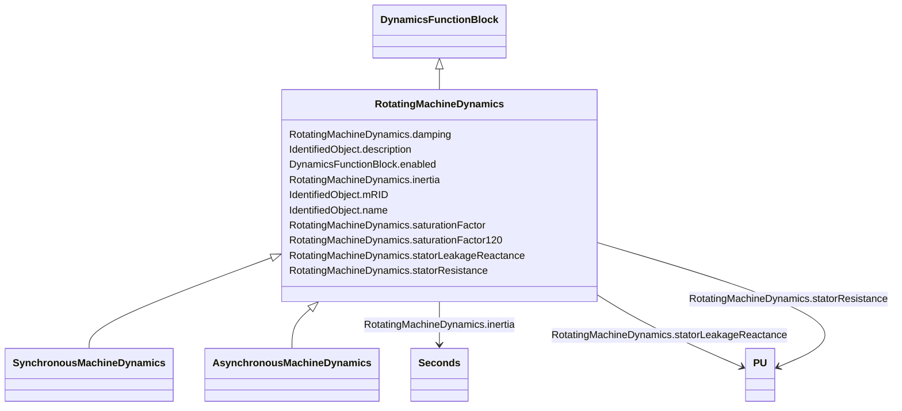

# RotatingMachineDynamics

_Abstract parent class for all synchronous and asynchronous machine standard models._

**URI**: [cim:RotatingMachineDynamics](http://iec.ch/TC57/CIM100#RotatingMachineDynamics) 
**Type**: Class

## Inheritance
* [IdentifiedObject](IdentifiedObject.md)
    * [DynamicsFunctionBlock](DynamicsFunctionBlock.md)
        * **RotatingMachineDynamics**
            * [SynchronousMachineDynamics](SynchronousMachineDynamics.md)
            * [AsynchronousMachineDynamics](AsynchronousMachineDynamics.md)

## Attributes

| Name | URI | Cardinality and Range | Description | Inheritance |
| ---  | --- | --- | --- | --- |
| damping | [cim:RotatingMachineDynamics.damping](http://iec.ch/TC57/CIM100#RotatingMachineDynamics.damping) | 1..1    float  | Damping torque coefficient (<i>D</i>) (&gt;= 0) | direct |
| inertia | [cim:RotatingMachineDynamics.inertia](http://iec.ch/TC57/CIM100#RotatingMachineDynamics.inertia) | 1..1    [Seconds](Seconds.md)  | Inertia constant of generator or motor and mechanical load (<i>H</i>) (&gt; 0... | direct |
| saturationFactor | [cim:RotatingMachineDynamics.saturationFactor](http://iec.ch/TC57/CIM100#RotatingMachineDynamics.saturationFactor) | 0..1    float  | Saturation factor at rated terminal voltage (<i>S1</i>) (&gt;= 0) | direct |
| saturationFactor120 | [cim:RotatingMachineDynamics.saturationFactor120](http://iec.ch/TC57/CIM100#RotatingMachineDynamics.saturationFactor120) | 0..1    float  | Saturation factor at 120% of rated terminal voltage (<i>S12</i>) (&gt;= Rotat... | direct |
| statorLeakageReactance | [cim:RotatingMachineDynamics.statorLeakageReactance](http://iec.ch/TC57/CIM100#RotatingMachineDynamics.statorLeakageReactance) | 1..1    [PU](PU.md)  | Stator leakage reactance (<i>Xl</i>) (&gt;= 0) | direct |
| statorResistance | [cim:RotatingMachineDynamics.statorResistance](http://iec.ch/TC57/CIM100#RotatingMachineDynamics.statorResistance) | 1..1    [PU](PU.md)  | Stator (armature) resistance (<i>Rs</i>) (&gt;= 0) | direct |
| enabled | [cim:DynamicsFunctionBlock.enabled](http://iec.ch/TC57/CIM100#DynamicsFunctionBlock.enabled) | 1..1    boolean  | Function block used indicator | [DynamicsFunctionBlock](DynamicsFunctionBlock.md) |
| description | [cim:IdentifiedObject.description](http://iec.ch/TC57/CIM100#IdentifiedObject.description) | 0..1    string  | The description is a free human readable text describing or naming the object | [IdentifiedObject](IdentifiedObject.md) |
| mRID | [cim:IdentifiedObject.mRID](http://iec.ch/TC57/CIM100#IdentifiedObject.mRID) | 1..1    string  | Master resource identifier issued by a model authority | [IdentifiedObject](IdentifiedObject.md) |
| name | [cim:IdentifiedObject.name](http://iec.ch/TC57/CIM100#IdentifiedObject.name) | 0..1    string  | The name is any free human readable and possibly non unique text naming the o... | [IdentifiedObject](IdentifiedObject.md) |

## Identifier and Mapping Information

### Schema Source

* from schema: http://iec.ch/TC57/ns/CIM/Dynamics-EU#Package_DynamicsProfile

## Mappings

| Mapping Type | Mapped Value |
| ---  | ---  |
| self | cim:RotatingMachineDynamics |
| native | this:RotatingMachineDynamics |

