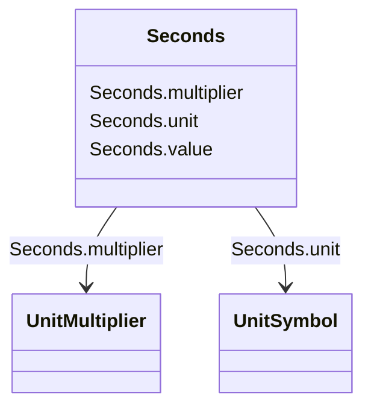

# Seconds

_Time, in seconds._

**URI**: [cim:Seconds](http://iec.ch/TC57/CIM100#Seconds) 
**Type**: Class

<!-- no inheritance hierarchy -->

## Attributes

| Name | URI | Cardinality and Range | Description | Inheritance |
| ---  | --- | --- | --- | --- |
| value | [cim:Seconds.value](http://iec.ch/TC57/CIM100#Seconds.value) | 0..1    float  | Time, in seconds | direct |
| unit | [cim:Seconds.unit](http://iec.ch/TC57/CIM100#Seconds.unit) | 0..1    [UnitSymbol](UnitSymbol.md)  |  | direct |
| multiplier | [cim:Seconds.multiplier](http://iec.ch/TC57/CIM100#Seconds.multiplier) | 0..1    [UnitMultiplier](UnitMultiplier.md)  |  | direct |

## Usages

| used by | used in | type | used |
| ---  | --- | --- | --- |
| [RotatingMachineDynamics](RotatingMachineDynamics.md) | inertia | range | [Seconds](Seconds.md) |
| [SynchronousMachineUserDefined](SynchronousMachineUserDefined.md) | inertia | range | [Seconds](Seconds.md) |
| [AsynchronousMachineUserDefined](AsynchronousMachineUserDefined.md) | inertia | range | [Seconds](Seconds.md) |
| [SynchronousMachineSimplified](SynchronousMachineSimplified.md) | inertia | range | [Seconds](Seconds.md) |
| [SynchronousMachineDynamics](SynchronousMachineDynamics.md) | inertia | range | [Seconds](Seconds.md) |
| [SynchronousMachineDetailed](SynchronousMachineDetailed.md) | inertia | range | [Seconds](Seconds.md) |
| [SynchronousMachineTimeConstantReactance](SynchronousMachineTimeConstantReactance.md) | tpdo | range | [Seconds](Seconds.md) |
| [SynchronousMachineTimeConstantReactance](SynchronousMachineTimeConstantReactance.md) | tppdo | range | [Seconds](Seconds.md) |
| [SynchronousMachineTimeConstantReactance](SynchronousMachineTimeConstantReactance.md) | tpqo | range | [Seconds](Seconds.md) |
| [SynchronousMachineTimeConstantReactance](SynchronousMachineTimeConstantReactance.md) | tppqo | range | [Seconds](Seconds.md) |
| [SynchronousMachineTimeConstantReactance](SynchronousMachineTimeConstantReactance.md) | tc | range | [Seconds](Seconds.md) |
| [SynchronousMachineTimeConstantReactance](SynchronousMachineTimeConstantReactance.md) | inertia | range | [Seconds](Seconds.md) |
| [SynchronousMachineEquivalentCircuit](SynchronousMachineEquivalentCircuit.md) | inertia | range | [Seconds](Seconds.md) |
| [AsynchronousMachineDynamics](AsynchronousMachineDynamics.md) | inertia | range | [Seconds](Seconds.md) |
| [AsynchronousMachineTimeConstantReactance](AsynchronousMachineTimeConstantReactance.md) | tpo | range | [Seconds](Seconds.md) |
| [AsynchronousMachineTimeConstantReactance](AsynchronousMachineTimeConstantReactance.md) | tppo | range | [Seconds](Seconds.md) |
| [AsynchronousMachineTimeConstantReactance](AsynchronousMachineTimeConstantReactance.md) | inertia | range | [Seconds](Seconds.md) |
| [AsynchronousMachineEquivalentCircuit](AsynchronousMachineEquivalentCircuit.md) | inertia | range | [Seconds](Seconds.md) |
| [GovHydroIEEE0](GovHydroIEEE0.md) | t1 | range | [Seconds](Seconds.md) |
| [GovHydroIEEE0](GovHydroIEEE0.md) | t2 | range | [Seconds](Seconds.md) |
| [GovHydroIEEE0](GovHydroIEEE0.md) | t3 | range | [Seconds](Seconds.md) |
| [GovHydroIEEE0](GovHydroIEEE0.md) | t4 | range | [Seconds](Seconds.md) |
| [GovHydroIEEE2](GovHydroIEEE2.md) | tg | range | [Seconds](Seconds.md) |
| [GovHydroIEEE2](GovHydroIEEE2.md) | tp | range | [Seconds](Seconds.md) |
| [GovHydroIEEE2](GovHydroIEEE2.md) | tr | range | [Seconds](Seconds.md) |
| [GovHydroIEEE2](GovHydroIEEE2.md) | tw | range | [Seconds](Seconds.md) |
| [GovSteamIEEE1](GovSteamIEEE1.md) | t1 | range | [Seconds](Seconds.md) |
| [GovSteamIEEE1](GovSteamIEEE1.md) | t2 | range | [Seconds](Seconds.md) |
| [GovSteamIEEE1](GovSteamIEEE1.md) | t3 | range | [Seconds](Seconds.md) |
| [GovSteamIEEE1](GovSteamIEEE1.md) | t4 | range | [Seconds](Seconds.md) |
| [GovSteamIEEE1](GovSteamIEEE1.md) | t5 | range | [Seconds](Seconds.md) |
| [GovSteamIEEE1](GovSteamIEEE1.md) | t6 | range | [Seconds](Seconds.md) |
| [GovSteamIEEE1](GovSteamIEEE1.md) | t7 | range | [Seconds](Seconds.md) |
| [GovCT1](GovCT1.md) | tpelec | range | [Seconds](Seconds.md) |
| [GovCT1](GovCT1.md) | tdgov | range | [Seconds](Seconds.md) |
| [GovCT1](GovCT1.md) | tact | range | [Seconds](Seconds.md) |
| [GovCT1](GovCT1.md) | tb | range | [Seconds](Seconds.md) |
| [GovCT1](GovCT1.md) | tc | range | [Seconds](Seconds.md) |
| [GovCT1](GovCT1.md) | teng | range | [Seconds](Seconds.md) |
| [GovCT1](GovCT1.md) | tfload | range | [Seconds](Seconds.md) |
| [GovCT1](GovCT1.md) | ta | range | [Seconds](Seconds.md) |
| [GovCT1](GovCT1.md) | tsa | range | [Seconds](Seconds.md) |
| [GovCT1](GovCT1.md) | tsb | range | [Seconds](Seconds.md) |
| [GovCT2](GovCT2.md) | tpelec | range | [Seconds](Seconds.md) |
| [GovCT2](GovCT2.md) | tdgov | range | [Seconds](Seconds.md) |
| [GovCT2](GovCT2.md) | tact | range | [Seconds](Seconds.md) |
| [GovCT2](GovCT2.md) | tb | range | [Seconds](Seconds.md) |
| [GovCT2](GovCT2.md) | tc | range | [Seconds](Seconds.md) |
| [GovCT2](GovCT2.md) | teng | range | [Seconds](Seconds.md) |
| [GovCT2](GovCT2.md) | tfload | range | [Seconds](Seconds.md) |
| [GovCT2](GovCT2.md) | ta | range | [Seconds](Seconds.md) |
| [GovCT2](GovCT2.md) | tsa | range | [Seconds](Seconds.md) |
| [GovCT2](GovCT2.md) | tsb | range | [Seconds](Seconds.md) |
| [GovGAST](GovGAST.md) | t1 | range | [Seconds](Seconds.md) |
| [GovGAST](GovGAST.md) | t2 | range | [Seconds](Seconds.md) |
| [GovGAST](GovGAST.md) | t3 | range | [Seconds](Seconds.md) |
| [GovGAST1](GovGAST1.md) | t1 | range | [Seconds](Seconds.md) |
| [GovGAST1](GovGAST1.md) | t2 | range | [Seconds](Seconds.md) |
| [GovGAST1](GovGAST1.md) | t3 | range | [Seconds](Seconds.md) |
| [GovGAST1](GovGAST1.md) | tltr | range | [Seconds](Seconds.md) |
| [GovGAST1](GovGAST1.md) | t4 | range | [Seconds](Seconds.md) |
| [GovGAST1](GovGAST1.md) | t5 | range | [Seconds](Seconds.md) |
| [GovGAST2](GovGAST2.md) | x | range | [Seconds](Seconds.md) |
| [GovGAST2](GovGAST2.md) | y | range | [Seconds](Seconds.md) |
| [GovGAST2](GovGAST2.md) | etd | range | [Seconds](Seconds.md) |
| [GovGAST2](GovGAST2.md) | tcd | range | [Seconds](Seconds.md) |
| [GovGAST2](GovGAST2.md) | t | range | [Seconds](Seconds.md) |
| [GovGAST2](GovGAST2.md) | ecr | range | [Seconds](Seconds.md) |
| [GovGAST2](GovGAST2.md) | tf | range | [Seconds](Seconds.md) |
| [GovGAST2](GovGAST2.md) | t3 | range | [Seconds](Seconds.md) |
| [GovGAST2](GovGAST2.md) | t4 | range | [Seconds](Seconds.md) |
| [GovGAST2](GovGAST2.md) | tt | range | [Seconds](Seconds.md) |
| [GovGAST2](GovGAST2.md) | t5 | range | [Seconds](Seconds.md) |
| [GovGAST3](GovGAST3.md) | tg | range | [Seconds](Seconds.md) |
| [GovGAST3](GovGAST3.md) | ty | range | [Seconds](Seconds.md) |
| [GovGAST3](GovGAST3.md) | tac | range | [Seconds](Seconds.md) |
| [GovGAST3](GovGAST3.md) | tc | range | [Seconds](Seconds.md) |
| [GovGAST3](GovGAST3.md) | tsi | range | [Seconds](Seconds.md) |
| [GovGAST3](GovGAST3.md) | ttc | range | [Seconds](Seconds.md) |
| [GovGAST3](GovGAST3.md) | td | range | [Seconds](Seconds.md) |
| [GovGAST4](GovGAST4.md) | ty | range | [Seconds](Seconds.md) |
| [GovGAST4](GovGAST4.md) | ta | range | [Seconds](Seconds.md) |
| [GovGAST4](GovGAST4.md) | tc | range | [Seconds](Seconds.md) |
| [GovGAST4](GovGAST4.md) | tcm | range | [Seconds](Seconds.md) |
| [GovGAST4](GovGAST4.md) | tm | range | [Seconds](Seconds.md) |
| [GovGASTWD](GovGASTWD.md) | etd | range | [Seconds](Seconds.md) |
| [GovGASTWD](GovGASTWD.md) | tcd | range | [Seconds](Seconds.md) |
| [GovGASTWD](GovGASTWD.md) | t | range | [Seconds](Seconds.md) |
| [GovGASTWD](GovGASTWD.md) | ecr | range | [Seconds](Seconds.md) |
| [GovGASTWD](GovGASTWD.md) | tf | range | [Seconds](Seconds.md) |
| [GovGASTWD](GovGASTWD.md) | t3 | range | [Seconds](Seconds.md) |
| [GovGASTWD](GovGASTWD.md) | t4 | range | [Seconds](Seconds.md) |
| [GovGASTWD](GovGASTWD.md) | tt | range | [Seconds](Seconds.md) |
| [GovGASTWD](GovGASTWD.md) | t5 | range | [Seconds](Seconds.md) |
| [GovGASTWD](GovGASTWD.md) | td | range | [Seconds](Seconds.md) |
| [GovHydro1](GovHydro1.md) | tr | range | [Seconds](Seconds.md) |
| [GovHydro1](GovHydro1.md) | tf | range | [Seconds](Seconds.md) |
| [GovHydro1](GovHydro1.md) | tg | range | [Seconds](Seconds.md) |
| [GovHydro1](GovHydro1.md) | tw | range | [Seconds](Seconds.md) |
| [GovHydro2](GovHydro2.md) | tg | range | [Seconds](Seconds.md) |
| [GovHydro2](GovHydro2.md) | tp | range | [Seconds](Seconds.md) |
| [GovHydro2](GovHydro2.md) | tr | range | [Seconds](Seconds.md) |
| [GovHydro2](GovHydro2.md) | tw | range | [Seconds](Seconds.md) |
| [GovHydro3](GovHydro3.md) | td | range | [Seconds](Seconds.md) |
| [GovHydro3](GovHydro3.md) | tf | range | [Seconds](Seconds.md) |
| [GovHydro3](GovHydro3.md) | tp | range | [Seconds](Seconds.md) |
| [GovHydro3](GovHydro3.md) | tt | range | [Seconds](Seconds.md) |
| [GovHydro3](GovHydro3.md) | tw | range | [Seconds](Seconds.md) |
| [GovHydro4](GovHydro4.md) | tg | range | [Seconds](Seconds.md) |
| [GovHydro4](GovHydro4.md) | tp | range | [Seconds](Seconds.md) |
| [GovHydro4](GovHydro4.md) | rperm | range | [Seconds](Seconds.md) |
| [GovHydro4](GovHydro4.md) | rtemp | range | [Seconds](Seconds.md) |
| [GovHydro4](GovHydro4.md) | tr | range | [Seconds](Seconds.md) |
| [GovHydro4](GovHydro4.md) | tw | range | [Seconds](Seconds.md) |
| [GovHydro4](GovHydro4.md) | tblade | range | [Seconds](Seconds.md) |
| [GovHydroDD](GovHydroDD.md) | td | range | [Seconds](Seconds.md) |
| [GovHydroDD](GovHydroDD.md) | tf | range | [Seconds](Seconds.md) |
| [GovHydroDD](GovHydroDD.md) | tp | range | [Seconds](Seconds.md) |
| [GovHydroDD](GovHydroDD.md) | tturb | range | [Seconds](Seconds.md) |
| [GovHydroDD](GovHydroDD.md) | tt | range | [Seconds](Seconds.md) |
| [GovHydroFrancis](GovHydroFrancis.md) | ta | range | [Seconds](Seconds.md) |
| [GovHydroFrancis](GovHydroFrancis.md) | td | range | [Seconds](Seconds.md) |
| [GovHydroFrancis](GovHydroFrancis.md) | ts | range | [Seconds](Seconds.md) |
| [GovHydroFrancis](GovHydroFrancis.md) | twnc | range | [Seconds](Seconds.md) |
| [GovHydroFrancis](GovHydroFrancis.md) | twng | range | [Seconds](Seconds.md) |
| [GovHydroFrancis](GovHydroFrancis.md) | tx | range | [Seconds](Seconds.md) |
| [GovHydroPelton](GovHydroPelton.md) | ta | range | [Seconds](Seconds.md) |
| [GovHydroPelton](GovHydroPelton.md) | ts | range | [Seconds](Seconds.md) |
| [GovHydroPelton](GovHydroPelton.md) | tv | range | [Seconds](Seconds.md) |
| [GovHydroPelton](GovHydroPelton.md) | twnc | range | [Seconds](Seconds.md) |
| [GovHydroPelton](GovHydroPelton.md) | twng | range | [Seconds](Seconds.md) |
| [GovHydroPelton](GovHydroPelton.md) | tx | range | [Seconds](Seconds.md) |
| [GovHydroPID](GovHydroPID.md) | td | range | [Seconds](Seconds.md) |
| [GovHydroPID](GovHydroPID.md) | tf | range | [Seconds](Seconds.md) |
| [GovHydroPID](GovHydroPID.md) | tp | range | [Seconds](Seconds.md) |
| [GovHydroPID](GovHydroPID.md) | tturb | range | [Seconds](Seconds.md) |
| [GovHydroPID](GovHydroPID.md) | tt | range | [Seconds](Seconds.md) |
| [GovHydroPID2](GovHydroPID2.md) | treg | range | [Seconds](Seconds.md) |
| [GovHydroPID2](GovHydroPID2.md) | ta | range | [Seconds](Seconds.md) |
| [GovHydroPID2](GovHydroPID2.md) | tb | range | [Seconds](Seconds.md) |
| [GovHydroPID2](GovHydroPID2.md) | tw | range | [Seconds](Seconds.md) |
| [GovHydroR](GovHydroR.md) | td | range | [Seconds](Seconds.md) |
| [GovHydroR](GovHydroR.md) | t1 | range | [Seconds](Seconds.md) |
| [GovHydroR](GovHydroR.md) | t2 | range | [Seconds](Seconds.md) |
| [GovHydroR](GovHydroR.md) | t3 | range | [Seconds](Seconds.md) |
| [GovHydroR](GovHydroR.md) | t4 | range | [Seconds](Seconds.md) |
| [GovHydroR](GovHydroR.md) | t5 | range | [Seconds](Seconds.md) |
| [GovHydroR](GovHydroR.md) | t6 | range | [Seconds](Seconds.md) |
| [GovHydroR](GovHydroR.md) | t7 | range | [Seconds](Seconds.md) |
| [GovHydroR](GovHydroR.md) | t8 | range | [Seconds](Seconds.md) |
| [GovHydroR](GovHydroR.md) | tp | range | [Seconds](Seconds.md) |
| [GovHydroR](GovHydroR.md) | tt | range | [Seconds](Seconds.md) |
| [GovHydroR](GovHydroR.md) | tw | range | [Seconds](Seconds.md) |
| [GovHydroWEH](GovHydroWEH.md) | tpe | range | [Seconds](Seconds.md) |
| [GovHydroWEH](GovHydroWEH.md) | td | range | [Seconds](Seconds.md) |
| [GovHydroWEH](GovHydroWEH.md) | tp | range | [Seconds](Seconds.md) |
| [GovHydroWEH](GovHydroWEH.md) | tdv | range | [Seconds](Seconds.md) |
| [GovHydroWEH](GovHydroWEH.md) | tg | range | [Seconds](Seconds.md) |
| [GovHydroWEH](GovHydroWEH.md) | tw | range | [Seconds](Seconds.md) |
| [GovHydroWPID](GovHydroWPID.md) | treg | range | [Seconds](Seconds.md) |
| [GovHydroWPID](GovHydroWPID.md) | ta | range | [Seconds](Seconds.md) |
| [GovHydroWPID](GovHydroWPID.md) | tb | range | [Seconds](Seconds.md) |
| [GovHydroWPID](GovHydroWPID.md) | tw | range | [Seconds](Seconds.md) |
| [GovSteam0](GovSteam0.md) | t1 | range | [Seconds](Seconds.md) |
| [GovSteam0](GovSteam0.md) | t2 | range | [Seconds](Seconds.md) |
| [GovSteam0](GovSteam0.md) | t3 | range | [Seconds](Seconds.md) |
| [GovSteam1](GovSteam1.md) | t1 | range | [Seconds](Seconds.md) |
| [GovSteam1](GovSteam1.md) | t2 | range | [Seconds](Seconds.md) |
| [GovSteam1](GovSteam1.md) | t3 | range | [Seconds](Seconds.md) |
| [GovSteam1](GovSteam1.md) | t4 | range | [Seconds](Seconds.md) |
| [GovSteam1](GovSteam1.md) | t5 | range | [Seconds](Seconds.md) |
| [GovSteam1](GovSteam1.md) | t6 | range | [Seconds](Seconds.md) |
| [GovSteam1](GovSteam1.md) | t7 | range | [Seconds](Seconds.md) |
| [GovSteam2](GovSteam2.md) | t1 | range | [Seconds](Seconds.md) |
| [GovSteam2](GovSteam2.md) | t2 | range | [Seconds](Seconds.md) |
| [GovSteamBB](GovSteamBB.md) | t1 | range | [Seconds](Seconds.md) |
| [GovSteamBB](GovSteamBB.md) | tn | range | [Seconds](Seconds.md) |
| [GovSteamBB](GovSteamBB.md) | td | range | [Seconds](Seconds.md) |
| [GovSteamBB](GovSteamBB.md) | t4 | range | [Seconds](Seconds.md) |
| [GovSteamBB](GovSteamBB.md) | t5 | range | [Seconds](Seconds.md) |
| [GovSteamBB](GovSteamBB.md) | t6 | range | [Seconds](Seconds.md) |
| [GovSteamCC](GovSteamCC.md) | t1hp | range | [Seconds](Seconds.md) |
| [GovSteamCC](GovSteamCC.md) | t3hp | range | [Seconds](Seconds.md) |
| [GovSteamCC](GovSteamCC.md) | t4hp | range | [Seconds](Seconds.md) |
| [GovSteamCC](GovSteamCC.md) | t5hp | range | [Seconds](Seconds.md) |
| [GovSteamCC](GovSteamCC.md) | t1lp | range | [Seconds](Seconds.md) |
| [GovSteamCC](GovSteamCC.md) | t3lp | range | [Seconds](Seconds.md) |
| [GovSteamCC](GovSteamCC.md) | t4lp | range | [Seconds](Seconds.md) |
| [GovSteamCC](GovSteamCC.md) | t5lp | range | [Seconds](Seconds.md) |
| [GovSteamEU](GovSteamEU.md) | tp | range | [Seconds](Seconds.md) |
| [GovSteamEU](GovSteamEU.md) | tip | range | [Seconds](Seconds.md) |
| [GovSteamEU](GovSteamEU.md) | tdp | range | [Seconds](Seconds.md) |
| [GovSteamEU](GovSteamEU.md) | tfp | range | [Seconds](Seconds.md) |
| [GovSteamEU](GovSteamEU.md) | tf | range | [Seconds](Seconds.md) |
| [GovSteamEU](GovSteamEU.md) | ten | range | [Seconds](Seconds.md) |
| [GovSteamEU](GovSteamEU.md) | tw | range | [Seconds](Seconds.md) |
| [GovSteamEU](GovSteamEU.md) | tvhp | range | [Seconds](Seconds.md) |
| [GovSteamEU](GovSteamEU.md) | tvip | range | [Seconds](Seconds.md) |
| [GovSteamEU](GovSteamEU.md) | thp | range | [Seconds](Seconds.md) |
| [GovSteamEU](GovSteamEU.md) | trh | range | [Seconds](Seconds.md) |
| [GovSteamEU](GovSteamEU.md) | tlp | range | [Seconds](Seconds.md) |
| [GovSteamEU](GovSteamEU.md) | tb | range | [Seconds](Seconds.md) |
| [GovSteamFV2](GovSteamFV2.md) | t1 | range | [Seconds](Seconds.md) |
| [GovSteamFV2](GovSteamFV2.md) | t3 | range | [Seconds](Seconds.md) |
| [GovSteamFV2](GovSteamFV2.md) | tt | range | [Seconds](Seconds.md) |
| [GovSteamFV2](GovSteamFV2.md) | ta | range | [Seconds](Seconds.md) |
| [GovSteamFV2](GovSteamFV2.md) | tb | range | [Seconds](Seconds.md) |
| [GovSteamFV2](GovSteamFV2.md) | tc | range | [Seconds](Seconds.md) |
| [GovSteamFV3](GovSteamFV3.md) | t1 | range | [Seconds](Seconds.md) |
| [GovSteamFV3](GovSteamFV3.md) | t2 | range | [Seconds](Seconds.md) |
| [GovSteamFV3](GovSteamFV3.md) | t3 | range | [Seconds](Seconds.md) |
| [GovSteamFV3](GovSteamFV3.md) | t4 | range | [Seconds](Seconds.md) |
| [GovSteamFV3](GovSteamFV3.md) | t5 | range | [Seconds](Seconds.md) |
| [GovSteamFV3](GovSteamFV3.md) | t6 | range | [Seconds](Seconds.md) |
| [GovSteamFV3](GovSteamFV3.md) | ta | range | [Seconds](Seconds.md) |
| [GovSteamFV3](GovSteamFV3.md) | tb | range | [Seconds](Seconds.md) |
| [GovSteamFV3](GovSteamFV3.md) | tc | range | [Seconds](Seconds.md) |
| [GovSteamFV4](GovSteamFV4.md) | ta | range | [Seconds](Seconds.md) |
| [GovSteamFV4](GovSteamFV4.md) | tc | range | [Seconds](Seconds.md) |
| [GovSteamFV4](GovSteamFV4.md) | ty | range | [Seconds](Seconds.md) |
| [GovSteamFV4](GovSteamFV4.md) | tam | range | [Seconds](Seconds.md) |
| [GovSteamFV4](GovSteamFV4.md) | tcm | range | [Seconds](Seconds.md) |
| [GovSteamFV4](GovSteamFV4.md) | thp | range | [Seconds](Seconds.md) |
| [GovSteamFV4](GovSteamFV4.md) | trh | range | [Seconds](Seconds.md) |
| [GovSteamFV4](GovSteamFV4.md) | tmp | range | [Seconds](Seconds.md) |
| [GovSteamFV4](GovSteamFV4.md) | tdc | range | [Seconds](Seconds.md) |
| [GovSteamFV4](GovSteamFV4.md) | tf1 | range | [Seconds](Seconds.md) |
| [GovSteamFV4](GovSteamFV4.md) | tf2 | range | [Seconds](Seconds.md) |
| [GovSteamFV4](GovSteamFV4.md) | tv | range | [Seconds](Seconds.md) |
| [GovSteamSGO](GovSteamSGO.md) | t1 | range | [Seconds](Seconds.md) |
| [GovSteamSGO](GovSteamSGO.md) | t2 | range | [Seconds](Seconds.md) |
| [GovSteamSGO](GovSteamSGO.md) | t3 | range | [Seconds](Seconds.md) |
| [GovSteamSGO](GovSteamSGO.md) | t4 | range | [Seconds](Seconds.md) |
| [GovSteamSGO](GovSteamSGO.md) | t5 | range | [Seconds](Seconds.md) |
| [GovSteamSGO](GovSteamSGO.md) | t6 | range | [Seconds](Seconds.md) |
| [GovSteamSGO](GovSteamSGO.md) | pmin | range | [Seconds](Seconds.md) |
| [TurbLCFB1](TurbLCFB1.md) | tpelec | range | [Seconds](Seconds.md) |
| [ExcIEEEAC1A](ExcIEEEAC1A.md) | tb | range | [Seconds](Seconds.md) |
| [ExcIEEEAC1A](ExcIEEEAC1A.md) | tc | range | [Seconds](Seconds.md) |
| [ExcIEEEAC1A](ExcIEEEAC1A.md) | ta | range | [Seconds](Seconds.md) |
| [ExcIEEEAC1A](ExcIEEEAC1A.md) | te | range | [Seconds](Seconds.md) |
| [ExcIEEEAC1A](ExcIEEEAC1A.md) | tf | range | [Seconds](Seconds.md) |
| [ExcIEEEAC2A](ExcIEEEAC2A.md) | tb | range | [Seconds](Seconds.md) |
| [ExcIEEEAC2A](ExcIEEEAC2A.md) | tc | range | [Seconds](Seconds.md) |
| [ExcIEEEAC2A](ExcIEEEAC2A.md) | ta | range | [Seconds](Seconds.md) |
| [ExcIEEEAC2A](ExcIEEEAC2A.md) | te | range | [Seconds](Seconds.md) |
| [ExcIEEEAC2A](ExcIEEEAC2A.md) | tf | range | [Seconds](Seconds.md) |
| [ExcIEEEAC3A](ExcIEEEAC3A.md) | tb | range | [Seconds](Seconds.md) |
| [ExcIEEEAC3A](ExcIEEEAC3A.md) | tc | range | [Seconds](Seconds.md) |
| [ExcIEEEAC3A](ExcIEEEAC3A.md) | ta | range | [Seconds](Seconds.md) |
| [ExcIEEEAC3A](ExcIEEEAC3A.md) | te | range | [Seconds](Seconds.md) |
| [ExcIEEEAC3A](ExcIEEEAC3A.md) | tf | range | [Seconds](Seconds.md) |
| [ExcIEEEAC4A](ExcIEEEAC4A.md) | tc | range | [Seconds](Seconds.md) |
| [ExcIEEEAC4A](ExcIEEEAC4A.md) | tb | range | [Seconds](Seconds.md) |
| [ExcIEEEAC4A](ExcIEEEAC4A.md) | ta | range | [Seconds](Seconds.md) |
| [ExcIEEEAC5A](ExcIEEEAC5A.md) | ta | range | [Seconds](Seconds.md) |
| [ExcIEEEAC5A](ExcIEEEAC5A.md) | te | range | [Seconds](Seconds.md) |
| [ExcIEEEAC5A](ExcIEEEAC5A.md) | tf1 | range | [Seconds](Seconds.md) |
| [ExcIEEEAC5A](ExcIEEEAC5A.md) | tf2 | range | [Seconds](Seconds.md) |
| [ExcIEEEAC5A](ExcIEEEAC5A.md) | tf3 | range | [Seconds](Seconds.md) |
| [ExcIEEEAC6A](ExcIEEEAC6A.md) | ta | range | [Seconds](Seconds.md) |
| [ExcIEEEAC6A](ExcIEEEAC6A.md) | tk | range | [Seconds](Seconds.md) |
| [ExcIEEEAC6A](ExcIEEEAC6A.md) | tb | range | [Seconds](Seconds.md) |
| [ExcIEEEAC6A](ExcIEEEAC6A.md) | tc | range | [Seconds](Seconds.md) |
| [ExcIEEEAC6A](ExcIEEEAC6A.md) | te | range | [Seconds](Seconds.md) |
| [ExcIEEEAC6A](ExcIEEEAC6A.md) | tj | range | [Seconds](Seconds.md) |
| [ExcIEEEAC6A](ExcIEEEAC6A.md) | th | range | [Seconds](Seconds.md) |
| [ExcIEEEAC7B](ExcIEEEAC7B.md) | tdr | range | [Seconds](Seconds.md) |
| [ExcIEEEAC7B](ExcIEEEAC7B.md) | te | range | [Seconds](Seconds.md) |
| [ExcIEEEAC7B](ExcIEEEAC7B.md) | tf | range | [Seconds](Seconds.md) |
| [ExcIEEEAC8B](ExcIEEEAC8B.md) | tdr | range | [Seconds](Seconds.md) |
| [ExcIEEEAC8B](ExcIEEEAC8B.md) | ta | range | [Seconds](Seconds.md) |
| [ExcIEEEAC8B](ExcIEEEAC8B.md) | te | range | [Seconds](Seconds.md) |
| [ExcIEEEDC1A](ExcIEEEDC1A.md) | ta | range | [Seconds](Seconds.md) |
| [ExcIEEEDC1A](ExcIEEEDC1A.md) | tb | range | [Seconds](Seconds.md) |
| [ExcIEEEDC1A](ExcIEEEDC1A.md) | tc | range | [Seconds](Seconds.md) |
| [ExcIEEEDC1A](ExcIEEEDC1A.md) | te | range | [Seconds](Seconds.md) |
| [ExcIEEEDC1A](ExcIEEEDC1A.md) | tf | range | [Seconds](Seconds.md) |
| [ExcIEEEDC2A](ExcIEEEDC2A.md) | ta | range | [Seconds](Seconds.md) |
| [ExcIEEEDC2A](ExcIEEEDC2A.md) | tb | range | [Seconds](Seconds.md) |
| [ExcIEEEDC2A](ExcIEEEDC2A.md) | tc | range | [Seconds](Seconds.md) |
| [ExcIEEEDC2A](ExcIEEEDC2A.md) | te | range | [Seconds](Seconds.md) |
| [ExcIEEEDC2A](ExcIEEEDC2A.md) | tf | range | [Seconds](Seconds.md) |
| [ExcIEEEDC3A](ExcIEEEDC3A.md) | trh | range | [Seconds](Seconds.md) |
| [ExcIEEEDC3A](ExcIEEEDC3A.md) | te | range | [Seconds](Seconds.md) |
| [ExcIEEEDC4B](ExcIEEEDC4B.md) | ta | range | [Seconds](Seconds.md) |
| [ExcIEEEDC4B](ExcIEEEDC4B.md) | td | range | [Seconds](Seconds.md) |
| [ExcIEEEDC4B](ExcIEEEDC4B.md) | te | range | [Seconds](Seconds.md) |
| [ExcIEEEDC4B](ExcIEEEDC4B.md) | tf | range | [Seconds](Seconds.md) |
| [ExcIEEEST1A](ExcIEEEST1A.md) | ta | range | [Seconds](Seconds.md) |
| [ExcIEEEST1A](ExcIEEEST1A.md) | tb | range | [Seconds](Seconds.md) |
| [ExcIEEEST1A](ExcIEEEST1A.md) | tb1 | range | [Seconds](Seconds.md) |
| [ExcIEEEST1A](ExcIEEEST1A.md) | tc | range | [Seconds](Seconds.md) |
| [ExcIEEEST1A](ExcIEEEST1A.md) | tc1 | range | [Seconds](Seconds.md) |
| [ExcIEEEST1A](ExcIEEEST1A.md) | tf | range | [Seconds](Seconds.md) |
| [ExcIEEEST2A](ExcIEEEST2A.md) | ta | range | [Seconds](Seconds.md) |
| [ExcIEEEST2A](ExcIEEEST2A.md) | te | range | [Seconds](Seconds.md) |
| [ExcIEEEST2A](ExcIEEEST2A.md) | tf | range | [Seconds](Seconds.md) |
| [ExcIEEEST3A](ExcIEEEST3A.md) | ta | range | [Seconds](Seconds.md) |
| [ExcIEEEST3A](ExcIEEEST3A.md) | tb | range | [Seconds](Seconds.md) |
| [ExcIEEEST3A](ExcIEEEST3A.md) | tc | range | [Seconds](Seconds.md) |
| [ExcIEEEST3A](ExcIEEEST3A.md) | tm | range | [Seconds](Seconds.md) |
| [ExcIEEEST4B](ExcIEEEST4B.md) | ta | range | [Seconds](Seconds.md) |
| [ExcIEEEST5B](ExcIEEEST5B.md) | t1 | range | [Seconds](Seconds.md) |
| [ExcIEEEST5B](ExcIEEEST5B.md) | tc1 | range | [Seconds](Seconds.md) |
| [ExcIEEEST5B](ExcIEEEST5B.md) | tb1 | range | [Seconds](Seconds.md) |
| [ExcIEEEST5B](ExcIEEEST5B.md) | tc2 | range | [Seconds](Seconds.md) |
| [ExcIEEEST5B](ExcIEEEST5B.md) | tb2 | range | [Seconds](Seconds.md) |
| [ExcIEEEST5B](ExcIEEEST5B.md) | toc1 | range | [Seconds](Seconds.md) |
| [ExcIEEEST5B](ExcIEEEST5B.md) | tob1 | range | [Seconds](Seconds.md) |
| [ExcIEEEST5B](ExcIEEEST5B.md) | toc2 | range | [Seconds](Seconds.md) |
| [ExcIEEEST5B](ExcIEEEST5B.md) | tob2 | range | [Seconds](Seconds.md) |
| [ExcIEEEST5B](ExcIEEEST5B.md) | tuc1 | range | [Seconds](Seconds.md) |
| [ExcIEEEST5B](ExcIEEEST5B.md) | tub1 | range | [Seconds](Seconds.md) |
| [ExcIEEEST5B](ExcIEEEST5B.md) | tuc2 | range | [Seconds](Seconds.md) |
| [ExcIEEEST5B](ExcIEEEST5B.md) | tub2 | range | [Seconds](Seconds.md) |
| [ExcIEEEST6B](ExcIEEEST6B.md) | tg | range | [Seconds](Seconds.md) |
| [ExcIEEEST7B](ExcIEEEST7B.md) | tb | range | [Seconds](Seconds.md) |
| [ExcIEEEST7B](ExcIEEEST7B.md) | tc | range | [Seconds](Seconds.md) |
| [ExcIEEEST7B](ExcIEEEST7B.md) | tf | range | [Seconds](Seconds.md) |
| [ExcIEEEST7B](ExcIEEEST7B.md) | tg | range | [Seconds](Seconds.md) |
| [ExcIEEEST7B](ExcIEEEST7B.md) | tia | range | [Seconds](Seconds.md) |
| [ExcAC1A](ExcAC1A.md) | tb | range | [Seconds](Seconds.md) |
| [ExcAC1A](ExcAC1A.md) | tc | range | [Seconds](Seconds.md) |
| [ExcAC1A](ExcAC1A.md) | ta | range | [Seconds](Seconds.md) |
| [ExcAC1A](ExcAC1A.md) | te | range | [Seconds](Seconds.md) |
| [ExcAC1A](ExcAC1A.md) | tf | range | [Seconds](Seconds.md) |
| [ExcAC2A](ExcAC2A.md) | tb | range | [Seconds](Seconds.md) |
| [ExcAC2A](ExcAC2A.md) | tc | range | [Seconds](Seconds.md) |
| [ExcAC2A](ExcAC2A.md) | ta | range | [Seconds](Seconds.md) |
| [ExcAC2A](ExcAC2A.md) | te | range | [Seconds](Seconds.md) |
| [ExcAC2A](ExcAC2A.md) | tf | range | [Seconds](Seconds.md) |
| [ExcAC3A](ExcAC3A.md) | tb | range | [Seconds](Seconds.md) |
| [ExcAC3A](ExcAC3A.md) | tc | range | [Seconds](Seconds.md) |
| [ExcAC3A](ExcAC3A.md) | ka | range | [Seconds](Seconds.md) |
| [ExcAC3A](ExcAC3A.md) | te | range | [Seconds](Seconds.md) |
| [ExcAC3A](ExcAC3A.md) | tf | range | [Seconds](Seconds.md) |
| [ExcAC4A](ExcAC4A.md) | tc | range | [Seconds](Seconds.md) |
| [ExcAC4A](ExcAC4A.md) | tb | range | [Seconds](Seconds.md) |
| [ExcAC4A](ExcAC4A.md) | ta | range | [Seconds](Seconds.md) |
| [ExcAC5A](ExcAC5A.md) | tb | range | [Seconds](Seconds.md) |
| [ExcAC5A](ExcAC5A.md) | tc | range | [Seconds](Seconds.md) |
| [ExcAC5A](ExcAC5A.md) | ta | range | [Seconds](Seconds.md) |
| [ExcAC5A](ExcAC5A.md) | te | range | [Seconds](Seconds.md) |
| [ExcAC5A](ExcAC5A.md) | tf1 | range | [Seconds](Seconds.md) |
| [ExcAC5A](ExcAC5A.md) | tf2 | range | [Seconds](Seconds.md) |
| [ExcAC5A](ExcAC5A.md) | tf3 | range | [Seconds](Seconds.md) |
| [ExcAC6A](ExcAC6A.md) | ta | range | [Seconds](Seconds.md) |
| [ExcAC6A](ExcAC6A.md) | tk | range | [Seconds](Seconds.md) |
| [ExcAC6A](ExcAC6A.md) | tb | range | [Seconds](Seconds.md) |
| [ExcAC6A](ExcAC6A.md) | tc | range | [Seconds](Seconds.md) |
| [ExcAC6A](ExcAC6A.md) | te | range | [Seconds](Seconds.md) |
| [ExcAC6A](ExcAC6A.md) | tj | range | [Seconds](Seconds.md) |
| [ExcAC6A](ExcAC6A.md) | th | range | [Seconds](Seconds.md) |
| [ExcAC8B](ExcAC8B.md) | ta | range | [Seconds](Seconds.md) |
| [ExcAC8B](ExcAC8B.md) | tdr | range | [Seconds](Seconds.md) |
| [ExcAC8B](ExcAC8B.md) | te | range | [Seconds](Seconds.md) |
| [ExcANS](ExcANS.md) | t3 | range | [Seconds](Seconds.md) |
| [ExcANS](ExcANS.md) | t2 | range | [Seconds](Seconds.md) |
| [ExcANS](ExcANS.md) | t1 | range | [Seconds](Seconds.md) |
| [ExcANS](ExcANS.md) | tb | range | [Seconds](Seconds.md) |
| [ExcAVR1](ExcAVR1.md) | ta | range | [Seconds](Seconds.md) |
| [ExcAVR1](ExcAVR1.md) | tb | range | [Seconds](Seconds.md) |
| [ExcAVR1](ExcAVR1.md) | te | range | [Seconds](Seconds.md) |
| [ExcAVR1](ExcAVR1.md) | tf | range | [Seconds](Seconds.md) |
| [ExcAVR2](ExcAVR2.md) | ta | range | [Seconds](Seconds.md) |
| [ExcAVR2](ExcAVR2.md) | tb | range | [Seconds](Seconds.md) |
| [ExcAVR2](ExcAVR2.md) | te | range | [Seconds](Seconds.md) |
| [ExcAVR2](ExcAVR2.md) | tf1 | range | [Seconds](Seconds.md) |
| [ExcAVR2](ExcAVR2.md) | tf2 | range | [Seconds](Seconds.md) |
| [ExcAVR3](ExcAVR3.md) | t1 | range | [Seconds](Seconds.md) |
| [ExcAVR3](ExcAVR3.md) | t2 | range | [Seconds](Seconds.md) |
| [ExcAVR3](ExcAVR3.md) | t3 | range | [Seconds](Seconds.md) |
| [ExcAVR3](ExcAVR3.md) | t4 | range | [Seconds](Seconds.md) |
| [ExcAVR3](ExcAVR3.md) | te | range | [Seconds](Seconds.md) |
| [ExcAVR4](ExcAVR4.md) | t1 | range | [Seconds](Seconds.md) |
| [ExcAVR4](ExcAVR4.md) | t2 | range | [Seconds](Seconds.md) |
| [ExcAVR4](ExcAVR4.md) | t3 | range | [Seconds](Seconds.md) |
| [ExcAVR4](ExcAVR4.md) | t4 | range | [Seconds](Seconds.md) |
| [ExcAVR4](ExcAVR4.md) | tif | range | [Seconds](Seconds.md) |
| [ExcAVR4](ExcAVR4.md) | t1if | range | [Seconds](Seconds.md) |
| [ExcAVR5](ExcAVR5.md) | ta | range | [Seconds](Seconds.md) |
| [ExcAVR7](ExcAVR7.md) | t1 | range | [Seconds](Seconds.md) |
| [ExcAVR7](ExcAVR7.md) | t2 | range | [Seconds](Seconds.md) |
| [ExcAVR7](ExcAVR7.md) | t3 | range | [Seconds](Seconds.md) |
| [ExcAVR7](ExcAVR7.md) | t4 | range | [Seconds](Seconds.md) |
| [ExcAVR7](ExcAVR7.md) | t5 | range | [Seconds](Seconds.md) |
| [ExcAVR7](ExcAVR7.md) | t6 | range | [Seconds](Seconds.md) |
| [ExcBBC](ExcBBC.md) | t1 | range | [Seconds](Seconds.md) |
| [ExcBBC](ExcBBC.md) | t2 | range | [Seconds](Seconds.md) |
| [ExcBBC](ExcBBC.md) | t3 | range | [Seconds](Seconds.md) |
| [ExcBBC](ExcBBC.md) | t4 | range | [Seconds](Seconds.md) |
| [ExcCZ](ExcCZ.md) | tc | range | [Seconds](Seconds.md) |
| [ExcCZ](ExcCZ.md) | ta | range | [Seconds](Seconds.md) |
| [ExcCZ](ExcCZ.md) | te | range | [Seconds](Seconds.md) |
| [ExcDC1A](ExcDC1A.md) | ta | range | [Seconds](Seconds.md) |
| [ExcDC1A](ExcDC1A.md) | tb | range | [Seconds](Seconds.md) |
| [ExcDC1A](ExcDC1A.md) | tc | range | [Seconds](Seconds.md) |
| [ExcDC1A](ExcDC1A.md) | te | range | [Seconds](Seconds.md) |
| [ExcDC1A](ExcDC1A.md) | tf | range | [Seconds](Seconds.md) |
| [ExcDC2A](ExcDC2A.md) | ta | range | [Seconds](Seconds.md) |
| [ExcDC2A](ExcDC2A.md) | tb | range | [Seconds](Seconds.md) |
| [ExcDC2A](ExcDC2A.md) | tc | range | [Seconds](Seconds.md) |
| [ExcDC2A](ExcDC2A.md) | te | range | [Seconds](Seconds.md) |
| [ExcDC2A](ExcDC2A.md) | tf | range | [Seconds](Seconds.md) |
| [ExcDC2A](ExcDC2A.md) | tf1 | range | [Seconds](Seconds.md) |
| [ExcDC3A](ExcDC3A.md) | trh | range | [Seconds](Seconds.md) |
| [ExcDC3A](ExcDC3A.md) | te | range | [Seconds](Seconds.md) |
| [ExcDC3A1](ExcDC3A1.md) | ta | range | [Seconds](Seconds.md) |
| [ExcDC3A1](ExcDC3A1.md) | te | range | [Seconds](Seconds.md) |
| [ExcDC3A1](ExcDC3A1.md) | tf | range | [Seconds](Seconds.md) |
| [ExcELIN1](ExcELIN1.md) | tfi | range | [Seconds](Seconds.md) |
| [ExcELIN1](ExcELIN1.md) | tnu | range | [Seconds](Seconds.md) |
| [ExcELIN1](ExcELIN1.md) | tsw | range | [Seconds](Seconds.md) |
| [ExcELIN1](ExcELIN1.md) | ts1 | range | [Seconds](Seconds.md) |
| [ExcELIN1](ExcELIN1.md) | ts2 | range | [Seconds](Seconds.md) |
| [ExcELIN2](ExcELIN2.md) | tb1 | range | [Seconds](Seconds.md) |
| [ExcELIN2](ExcELIN2.md) | te | range | [Seconds](Seconds.md) |
| [ExcELIN2](ExcELIN2.md) | te2 | range | [Seconds](Seconds.md) |
| [ExcELIN2](ExcELIN2.md) | tr4 | range | [Seconds](Seconds.md) |
| [ExcELIN2](ExcELIN2.md) | ti3 | range | [Seconds](Seconds.md) |
| [ExcELIN2](ExcELIN2.md) | ti4 | range | [Seconds](Seconds.md) |
| [ExcHU](ExcHU.md) | tr | range | [Seconds](Seconds.md) |
| [ExcHU](ExcHU.md) | te | range | [Seconds](Seconds.md) |
| [ExcHU](ExcHU.md) | ti | range | [Seconds](Seconds.md) |
| [ExcNI](ExcNI.md) | tr | range | [Seconds](Seconds.md) |
| [ExcNI](ExcNI.md) | ta | range | [Seconds](Seconds.md) |
| [ExcNI](ExcNI.md) | tf2 | range | [Seconds](Seconds.md) |
| [ExcNI](ExcNI.md) | tf1 | range | [Seconds](Seconds.md) |
| [ExcOEX3T](ExcOEX3T.md) | t1 | range | [Seconds](Seconds.md) |
| [ExcOEX3T](ExcOEX3T.md) | t2 | range | [Seconds](Seconds.md) |
| [ExcOEX3T](ExcOEX3T.md) | t3 | range | [Seconds](Seconds.md) |
| [ExcOEX3T](ExcOEX3T.md) | t4 | range | [Seconds](Seconds.md) |
| [ExcOEX3T](ExcOEX3T.md) | t5 | range | [Seconds](Seconds.md) |
| [ExcOEX3T](ExcOEX3T.md) | t6 | range | [Seconds](Seconds.md) |
| [ExcOEX3T](ExcOEX3T.md) | te | range | [Seconds](Seconds.md) |
| [ExcOEX3T](ExcOEX3T.md) | tf | range | [Seconds](Seconds.md) |
| [ExcPIC](ExcPIC.md) | ta1 | range | [Seconds](Seconds.md) |
| [ExcPIC](ExcPIC.md) | ta2 | range | [Seconds](Seconds.md) |
| [ExcPIC](ExcPIC.md) | ta3 | range | [Seconds](Seconds.md) |
| [ExcPIC](ExcPIC.md) | ta4 | range | [Seconds](Seconds.md) |
| [ExcPIC](ExcPIC.md) | tf1 | range | [Seconds](Seconds.md) |
| [ExcPIC](ExcPIC.md) | tf2 | range | [Seconds](Seconds.md) |
| [ExcPIC](ExcPIC.md) | te | range | [Seconds](Seconds.md) |
| [ExcREXS](ExcREXS.md) | kf | range | [Seconds](Seconds.md) |
| [ExcREXS](ExcREXS.md) | ta | range | [Seconds](Seconds.md) |
| [ExcREXS](ExcREXS.md) | tb1 | range | [Seconds](Seconds.md) |
| [ExcREXS](ExcREXS.md) | tb2 | range | [Seconds](Seconds.md) |
| [ExcREXS](ExcREXS.md) | tc1 | range | [Seconds](Seconds.md) |
| [ExcREXS](ExcREXS.md) | tc2 | range | [Seconds](Seconds.md) |
| [ExcREXS](ExcREXS.md) | te | range | [Seconds](Seconds.md) |
| [ExcREXS](ExcREXS.md) | tf | range | [Seconds](Seconds.md) |
| [ExcREXS](ExcREXS.md) | tf1 | range | [Seconds](Seconds.md) |
| [ExcREXS](ExcREXS.md) | tf2 | range | [Seconds](Seconds.md) |
| [ExcREXS](ExcREXS.md) | tp | range | [Seconds](Seconds.md) |
| [ExcRQB](ExcRQB.md) | te | range | [Seconds](Seconds.md) |
| [ExcRQB](ExcRQB.md) | tc | range | [Seconds](Seconds.md) |
| [ExcRQB](ExcRQB.md) | mesu | range | [Seconds](Seconds.md) |
| [ExcRQB](ExcRQB.md) | t4m | range | [Seconds](Seconds.md) |
| [ExcRQB](ExcRQB.md) | tf | range | [Seconds](Seconds.md) |
| [ExcSCRX](ExcSCRX.md) | tb | range | [Seconds](Seconds.md) |
| [ExcSCRX](ExcSCRX.md) | te | range | [Seconds](Seconds.md) |
| [ExcSEXS](ExcSEXS.md) | tb | range | [Seconds](Seconds.md) |
| [ExcSEXS](ExcSEXS.md) | te | range | [Seconds](Seconds.md) |
| [ExcSEXS](ExcSEXS.md) | tc | range | [Seconds](Seconds.md) |
| [ExcSK](ExcSK.md) | tc | range | [Seconds](Seconds.md) |
| [ExcSK](ExcSK.md) | te | range | [Seconds](Seconds.md) |
| [ExcSK](ExcSK.md) | ti | range | [Seconds](Seconds.md) |
| [ExcSK](ExcSK.md) | tp | range | [Seconds](Seconds.md) |
| [ExcSK](ExcSK.md) | tr | range | [Seconds](Seconds.md) |
| [ExcST1A](ExcST1A.md) | tc | range | [Seconds](Seconds.md) |
| [ExcST1A](ExcST1A.md) | tb | range | [Seconds](Seconds.md) |
| [ExcST1A](ExcST1A.md) | ta | range | [Seconds](Seconds.md) |
| [ExcST1A](ExcST1A.md) | tf | range | [Seconds](Seconds.md) |
| [ExcST1A](ExcST1A.md) | tc1 | range | [Seconds](Seconds.md) |
| [ExcST1A](ExcST1A.md) | tb1 | range | [Seconds](Seconds.md) |
| [ExcST2A](ExcST2A.md) | ta | range | [Seconds](Seconds.md) |
| [ExcST2A](ExcST2A.md) | te | range | [Seconds](Seconds.md) |
| [ExcST2A](ExcST2A.md) | tf | range | [Seconds](Seconds.md) |
| [ExcST2A](ExcST2A.md) | tb | range | [Seconds](Seconds.md) |
| [ExcST2A](ExcST2A.md) | tc | range | [Seconds](Seconds.md) |
| [ExcST3A](ExcST3A.md) | tb | range | [Seconds](Seconds.md) |
| [ExcST3A](ExcST3A.md) | tc | range | [Seconds](Seconds.md) |
| [ExcST3A](ExcST3A.md) | tm | range | [Seconds](Seconds.md) |
| [ExcST4B](ExcST4B.md) | ta | range | [Seconds](Seconds.md) |
| [ExcST6B](ExcST6B.md) | tg | range | [Seconds](Seconds.md) |
| [ExcST6B](ExcST6B.md) | ts | range | [Seconds](Seconds.md) |
| [ExcST6B](ExcST6B.md) | tvd | range | [Seconds](Seconds.md) |
| [ExcST7B](ExcST7B.md) | tb | range | [Seconds](Seconds.md) |
| [ExcST7B](ExcST7B.md) | tc | range | [Seconds](Seconds.md) |
| [ExcST7B](ExcST7B.md) | tf | range | [Seconds](Seconds.md) |
| [ExcST7B](ExcST7B.md) | tg | range | [Seconds](Seconds.md) |
| [ExcST7B](ExcST7B.md) | tia | range | [Seconds](Seconds.md) |
| [ExcST7B](ExcST7B.md) | ts | range | [Seconds](Seconds.md) |
| [OverexcLimX1](OverexcLimX1.md) | t1 | range | [Seconds](Seconds.md) |
| [OverexcLimX1](OverexcLimX1.md) | t2 | range | [Seconds](Seconds.md) |
| [OverexcLimX1](OverexcLimX1.md) | t3 | range | [Seconds](Seconds.md) |
| [OverexcLimX2](OverexcLimX2.md) | t1 | range | [Seconds](Seconds.md) |
| [OverexcLimX2](OverexcLimX2.md) | t2 | range | [Seconds](Seconds.md) |
| [OverexcLimX2](OverexcLimX2.md) | t3 | range | [Seconds](Seconds.md) |
| [UnderexcLimIEEE1](UnderexcLimIEEE1.md) | tu1 | range | [Seconds](Seconds.md) |
| [UnderexcLimIEEE1](UnderexcLimIEEE1.md) | tu2 | range | [Seconds](Seconds.md) |
| [UnderexcLimIEEE1](UnderexcLimIEEE1.md) | tu3 | range | [Seconds](Seconds.md) |
| [UnderexcLimIEEE1](UnderexcLimIEEE1.md) | tu4 | range | [Seconds](Seconds.md) |
| [UnderexcLimIEEE2](UnderexcLimIEEE2.md) | tuv | range | [Seconds](Seconds.md) |
| [UnderexcLimIEEE2](UnderexcLimIEEE2.md) | tup | range | [Seconds](Seconds.md) |
| [UnderexcLimIEEE2](UnderexcLimIEEE2.md) | tuq | range | [Seconds](Seconds.md) |
| [UnderexcLimIEEE2](UnderexcLimIEEE2.md) | tul | range | [Seconds](Seconds.md) |
| [UnderexcLimIEEE2](UnderexcLimIEEE2.md) | tu1 | range | [Seconds](Seconds.md) |
| [UnderexcLimIEEE2](UnderexcLimIEEE2.md) | tu2 | range | [Seconds](Seconds.md) |
| [UnderexcLimIEEE2](UnderexcLimIEEE2.md) | tu3 | range | [Seconds](Seconds.md) |
| [UnderexcLimIEEE2](UnderexcLimIEEE2.md) | tu4 | range | [Seconds](Seconds.md) |
| [UnderexcLimX1](UnderexcLimX1.md) | tf2 | range | [Seconds](Seconds.md) |
| [UnderexcLimX1](UnderexcLimX1.md) | tm | range | [Seconds](Seconds.md) |
| [UnderexcLimX2](UnderexcLimX2.md) | tf2 | range | [Seconds](Seconds.md) |
| [UnderexcLimX2](UnderexcLimX2.md) | tm | range | [Seconds](Seconds.md) |
| [PssIEEE1A](PssIEEE1A.md) | t1 | range | [Seconds](Seconds.md) |
| [PssIEEE1A](PssIEEE1A.md) | t2 | range | [Seconds](Seconds.md) |
| [PssIEEE1A](PssIEEE1A.md) | t3 | range | [Seconds](Seconds.md) |
| [PssIEEE1A](PssIEEE1A.md) | t4 | range | [Seconds](Seconds.md) |
| [PssIEEE1A](PssIEEE1A.md) | t5 | range | [Seconds](Seconds.md) |
| [PssIEEE1A](PssIEEE1A.md) | t6 | range | [Seconds](Seconds.md) |
| [PssIEEE2B](PssIEEE2B.md) | tw1 | range | [Seconds](Seconds.md) |
| [PssIEEE2B](PssIEEE2B.md) | tw2 | range | [Seconds](Seconds.md) |
| [PssIEEE2B](PssIEEE2B.md) | tw3 | range | [Seconds](Seconds.md) |
| [PssIEEE2B](PssIEEE2B.md) | tw4 | range | [Seconds](Seconds.md) |
| [PssIEEE2B](PssIEEE2B.md) | t1 | range | [Seconds](Seconds.md) |
| [PssIEEE2B](PssIEEE2B.md) | t2 | range | [Seconds](Seconds.md) |
| [PssIEEE2B](PssIEEE2B.md) | t3 | range | [Seconds](Seconds.md) |
| [PssIEEE2B](PssIEEE2B.md) | t4 | range | [Seconds](Seconds.md) |
| [PssIEEE2B](PssIEEE2B.md) | t6 | range | [Seconds](Seconds.md) |
| [PssIEEE2B](PssIEEE2B.md) | t7 | range | [Seconds](Seconds.md) |
| [PssIEEE2B](PssIEEE2B.md) | t8 | range | [Seconds](Seconds.md) |
| [PssIEEE2B](PssIEEE2B.md) | t9 | range | [Seconds](Seconds.md) |
| [PssIEEE2B](PssIEEE2B.md) | t10 | range | [Seconds](Seconds.md) |
| [PssIEEE2B](PssIEEE2B.md) | t11 | range | [Seconds](Seconds.md) |
| [PssIEEE3B](PssIEEE3B.md) | t1 | range | [Seconds](Seconds.md) |
| [PssIEEE3B](PssIEEE3B.md) | t2 | range | [Seconds](Seconds.md) |
| [PssIEEE3B](PssIEEE3B.md) | tw1 | range | [Seconds](Seconds.md) |
| [PssIEEE3B](PssIEEE3B.md) | tw2 | range | [Seconds](Seconds.md) |
| [PssIEEE3B](PssIEEE3B.md) | tw3 | range | [Seconds](Seconds.md) |
| [PssIEEE4B](PssIEEE4B.md) | th1 | range | [Seconds](Seconds.md) |
| [PssIEEE4B](PssIEEE4B.md) | th10 | range | [Seconds](Seconds.md) |
| [PssIEEE4B](PssIEEE4B.md) | th11 | range | [Seconds](Seconds.md) |
| [PssIEEE4B](PssIEEE4B.md) | th12 | range | [Seconds](Seconds.md) |
| [PssIEEE4B](PssIEEE4B.md) | th2 | range | [Seconds](Seconds.md) |
| [PssIEEE4B](PssIEEE4B.md) | th3 | range | [Seconds](Seconds.md) |
| [PssIEEE4B](PssIEEE4B.md) | th4 | range | [Seconds](Seconds.md) |
| [PssIEEE4B](PssIEEE4B.md) | th5 | range | [Seconds](Seconds.md) |
| [PssIEEE4B](PssIEEE4B.md) | th6 | range | [Seconds](Seconds.md) |
| [PssIEEE4B](PssIEEE4B.md) | th7 | range | [Seconds](Seconds.md) |
| [PssIEEE4B](PssIEEE4B.md) | th8 | range | [Seconds](Seconds.md) |
| [PssIEEE4B](PssIEEE4B.md) | th9 | range | [Seconds](Seconds.md) |
| [PssIEEE4B](PssIEEE4B.md) | ti1 | range | [Seconds](Seconds.md) |
| [PssIEEE4B](PssIEEE4B.md) | ti10 | range | [Seconds](Seconds.md) |
| [PssIEEE4B](PssIEEE4B.md) | ti11 | range | [Seconds](Seconds.md) |
| [PssIEEE4B](PssIEEE4B.md) | ti12 | range | [Seconds](Seconds.md) |
| [PssIEEE4B](PssIEEE4B.md) | ti2 | range | [Seconds](Seconds.md) |
| [PssIEEE4B](PssIEEE4B.md) | ti3 | range | [Seconds](Seconds.md) |
| [PssIEEE4B](PssIEEE4B.md) | ti4 | range | [Seconds](Seconds.md) |
| [PssIEEE4B](PssIEEE4B.md) | ti5 | range | [Seconds](Seconds.md) |
| [PssIEEE4B](PssIEEE4B.md) | ti6 | range | [Seconds](Seconds.md) |
| [PssIEEE4B](PssIEEE4B.md) | ti7 | range | [Seconds](Seconds.md) |
| [PssIEEE4B](PssIEEE4B.md) | ti8 | range | [Seconds](Seconds.md) |
| [PssIEEE4B](PssIEEE4B.md) | ti9 | range | [Seconds](Seconds.md) |
| [PssIEEE4B](PssIEEE4B.md) | tl1 | range | [Seconds](Seconds.md) |
| [PssIEEE4B](PssIEEE4B.md) | tl10 | range | [Seconds](Seconds.md) |
| [PssIEEE4B](PssIEEE4B.md) | tl11 | range | [Seconds](Seconds.md) |
| [PssIEEE4B](PssIEEE4B.md) | tl12 | range | [Seconds](Seconds.md) |
| [PssIEEE4B](PssIEEE4B.md) | tl2 | range | [Seconds](Seconds.md) |
| [PssIEEE4B](PssIEEE4B.md) | tl3 | range | [Seconds](Seconds.md) |
| [PssIEEE4B](PssIEEE4B.md) | tl4 | range | [Seconds](Seconds.md) |
| [PssIEEE4B](PssIEEE4B.md) | tl5 | range | [Seconds](Seconds.md) |
| [PssIEEE4B](PssIEEE4B.md) | tl6 | range | [Seconds](Seconds.md) |
| [PssIEEE4B](PssIEEE4B.md) | tl7 | range | [Seconds](Seconds.md) |
| [PssIEEE4B](PssIEEE4B.md) | tl8 | range | [Seconds](Seconds.md) |
| [PssIEEE4B](PssIEEE4B.md) | tl9 | range | [Seconds](Seconds.md) |
| [Pss1](Pss1.md) | tpe | range | [Seconds](Seconds.md) |
| [Pss1](Pss1.md) | t5 | range | [Seconds](Seconds.md) |
| [Pss1](Pss1.md) | t6 | range | [Seconds](Seconds.md) |
| [Pss1](Pss1.md) | t7 | range | [Seconds](Seconds.md) |
| [Pss1](Pss1.md) | t8 | range | [Seconds](Seconds.md) |
| [Pss1](Pss1.md) | t9 | range | [Seconds](Seconds.md) |
| [Pss1](Pss1.md) | t10 | range | [Seconds](Seconds.md) |
| [Pss1A](Pss1A.md) | t1 | range | [Seconds](Seconds.md) |
| [Pss1A](Pss1A.md) | t2 | range | [Seconds](Seconds.md) |
| [Pss1A](Pss1A.md) | t3 | range | [Seconds](Seconds.md) |
| [Pss1A](Pss1A.md) | t4 | range | [Seconds](Seconds.md) |
| [Pss1A](Pss1A.md) | t5 | range | [Seconds](Seconds.md) |
| [Pss1A](Pss1A.md) | t6 | range | [Seconds](Seconds.md) |
| [Pss1A](Pss1A.md) | tdelay | range | [Seconds](Seconds.md) |
| [Pss2B](Pss2B.md) | tw1 | range | [Seconds](Seconds.md) |
| [Pss2B](Pss2B.md) | tw2 | range | [Seconds](Seconds.md) |
| [Pss2B](Pss2B.md) | tw3 | range | [Seconds](Seconds.md) |
| [Pss2B](Pss2B.md) | tw4 | range | [Seconds](Seconds.md) |
| [Pss2B](Pss2B.md) | t1 | range | [Seconds](Seconds.md) |
| [Pss2B](Pss2B.md) | t2 | range | [Seconds](Seconds.md) |
| [Pss2B](Pss2B.md) | t3 | range | [Seconds](Seconds.md) |
| [Pss2B](Pss2B.md) | t4 | range | [Seconds](Seconds.md) |
| [Pss2B](Pss2B.md) | t6 | range | [Seconds](Seconds.md) |
| [Pss2B](Pss2B.md) | t7 | range | [Seconds](Seconds.md) |
| [Pss2B](Pss2B.md) | t8 | range | [Seconds](Seconds.md) |
| [Pss2B](Pss2B.md) | t9 | range | [Seconds](Seconds.md) |
| [Pss2B](Pss2B.md) | t10 | range | [Seconds](Seconds.md) |
| [Pss2B](Pss2B.md) | t11 | range | [Seconds](Seconds.md) |
| [Pss2B](Pss2B.md) | ta | range | [Seconds](Seconds.md) |
| [Pss2B](Pss2B.md) | tb | range | [Seconds](Seconds.md) |
| [Pss2ST](Pss2ST.md) | t1 | range | [Seconds](Seconds.md) |
| [Pss2ST](Pss2ST.md) | t2 | range | [Seconds](Seconds.md) |
| [Pss2ST](Pss2ST.md) | t3 | range | [Seconds](Seconds.md) |
| [Pss2ST](Pss2ST.md) | t4 | range | [Seconds](Seconds.md) |
| [Pss2ST](Pss2ST.md) | t5 | range | [Seconds](Seconds.md) |
| [Pss2ST](Pss2ST.md) | t6 | range | [Seconds](Seconds.md) |
| [Pss2ST](Pss2ST.md) | t7 | range | [Seconds](Seconds.md) |
| [Pss2ST](Pss2ST.md) | t8 | range | [Seconds](Seconds.md) |
| [Pss2ST](Pss2ST.md) | t9 | range | [Seconds](Seconds.md) |
| [Pss2ST](Pss2ST.md) | t10 | range | [Seconds](Seconds.md) |
| [Pss5](Pss5.md) | tw1 | range | [Seconds](Seconds.md) |
| [Pss5](Pss5.md) | tw2 | range | [Seconds](Seconds.md) |
| [Pss5](Pss5.md) | tl1 | range | [Seconds](Seconds.md) |
| [Pss5](Pss5.md) | tl2 | range | [Seconds](Seconds.md) |
| [Pss5](Pss5.md) | tl3 | range | [Seconds](Seconds.md) |
| [Pss5](Pss5.md) | tl4 | range | [Seconds](Seconds.md) |
| [Pss5](Pss5.md) | tpe | range | [Seconds](Seconds.md) |
| [PssELIN2](PssELIN2.md) | ts1 | range | [Seconds](Seconds.md) |
| [PssELIN2](PssELIN2.md) | ts2 | range | [Seconds](Seconds.md) |
| [PssELIN2](PssELIN2.md) | ts3 | range | [Seconds](Seconds.md) |
| [PssELIN2](PssELIN2.md) | ts4 | range | [Seconds](Seconds.md) |
| [PssELIN2](PssELIN2.md) | ts5 | range | [Seconds](Seconds.md) |
| [PssELIN2](PssELIN2.md) | ts6 | range | [Seconds](Seconds.md) |
| [PssPTIST1](PssPTIST1.md) | tf | range | [Seconds](Seconds.md) |
| [PssPTIST1](PssPTIST1.md) | tp | range | [Seconds](Seconds.md) |
| [PssPTIST1](PssPTIST1.md) | t1 | range | [Seconds](Seconds.md) |
| [PssPTIST1](PssPTIST1.md) | t2 | range | [Seconds](Seconds.md) |
| [PssPTIST1](PssPTIST1.md) | t3 | range | [Seconds](Seconds.md) |
| [PssPTIST1](PssPTIST1.md) | t4 | range | [Seconds](Seconds.md) |
| [PssPTIST1](PssPTIST1.md) | dtf | range | [Seconds](Seconds.md) |
| [PssPTIST1](PssPTIST1.md) | dtc | range | [Seconds](Seconds.md) |
| [PssPTIST1](PssPTIST1.md) | dtp | range | [Seconds](Seconds.md) |
| [PssPTIST3](PssPTIST3.md) | tf | range | [Seconds](Seconds.md) |
| [PssPTIST3](PssPTIST3.md) | tp | range | [Seconds](Seconds.md) |
| [PssPTIST3](PssPTIST3.md) | t1 | range | [Seconds](Seconds.md) |
| [PssPTIST3](PssPTIST3.md) | t2 | range | [Seconds](Seconds.md) |
| [PssPTIST3](PssPTIST3.md) | t3 | range | [Seconds](Seconds.md) |
| [PssPTIST3](PssPTIST3.md) | t4 | range | [Seconds](Seconds.md) |
| [PssPTIST3](PssPTIST3.md) | dtf | range | [Seconds](Seconds.md) |
| [PssPTIST3](PssPTIST3.md) | dtc | range | [Seconds](Seconds.md) |
| [PssPTIST3](PssPTIST3.md) | dtp | range | [Seconds](Seconds.md) |
| [PssPTIST3](PssPTIST3.md) | t5 | range | [Seconds](Seconds.md) |
| [PssPTIST3](PssPTIST3.md) | t6 | range | [Seconds](Seconds.md) |
| [PssRQB](PssRQB.md) | t4m | range | [Seconds](Seconds.md) |
| [PssRQB](PssRQB.md) | tomd | range | [Seconds](Seconds.md) |
| [PssRQB](PssRQB.md) | tomsl | range | [Seconds](Seconds.md) |
| [PssRQB](PssRQB.md) | t4mom | range | [Seconds](Seconds.md) |
| [PssRQB](PssRQB.md) | t4f | range | [Seconds](Seconds.md) |
| [PssSB4](PssSB4.md) | tt | range | [Seconds](Seconds.md) |
| [PssSB4](PssSB4.md) | tx2 | range | [Seconds](Seconds.md) |
| [PssSB4](PssSB4.md) | ta | range | [Seconds](Seconds.md) |
| [PssSB4](PssSB4.md) | tx1 | range | [Seconds](Seconds.md) |
| [PssSB4](PssSB4.md) | tb | range | [Seconds](Seconds.md) |
| [PssSB4](PssSB4.md) | tc | range | [Seconds](Seconds.md) |
| [PssSB4](PssSB4.md) | td | range | [Seconds](Seconds.md) |
| [PssSB4](PssSB4.md) | te | range | [Seconds](Seconds.md) |
| [PssSH](PssSH.md) | td | range | [Seconds](Seconds.md) |
| [PssSH](PssSH.md) | t1 | range | [Seconds](Seconds.md) |
| [PssSH](PssSH.md) | t2 | range | [Seconds](Seconds.md) |
| [PssSH](PssSH.md) | t3 | range | [Seconds](Seconds.md) |
| [PssSH](PssSH.md) | t4 | range | [Seconds](Seconds.md) |
| [PssSK](PssSK.md) | t1 | range | [Seconds](Seconds.md) |
| [PssSK](PssSK.md) | t2 | range | [Seconds](Seconds.md) |
| [PssSK](PssSK.md) | t3 | range | [Seconds](Seconds.md) |
| [PssSK](PssSK.md) | t4 | range | [Seconds](Seconds.md) |
| [PssSK](PssSK.md) | t5 | range | [Seconds](Seconds.md) |
| [PssSK](PssSK.md) | t6 | range | [Seconds](Seconds.md) |
| [PssSTAB2A](PssSTAB2A.md) | t2 | range | [Seconds](Seconds.md) |
| [PssSTAB2A](PssSTAB2A.md) | t3 | range | [Seconds](Seconds.md) |
| [PssSTAB2A](PssSTAB2A.md) | t5 | range | [Seconds](Seconds.md) |
| [PssWECC](PssWECC.md) | t1 | range | [Seconds](Seconds.md) |
| [PssWECC](PssWECC.md) | t2 | range | [Seconds](Seconds.md) |
| [PssWECC](PssWECC.md) | t3 | range | [Seconds](Seconds.md) |
| [PssWECC](PssWECC.md) | t4 | range | [Seconds](Seconds.md) |
| [PssWECC](PssWECC.md) | t5 | range | [Seconds](Seconds.md) |
| [PssWECC](PssWECC.md) | t6 | range | [Seconds](Seconds.md) |
| [PssWECC](PssWECC.md) | t7 | range | [Seconds](Seconds.md) |
| [PssWECC](PssWECC.md) | t8 | range | [Seconds](Seconds.md) |
| [PssWECC](PssWECC.md) | t10 | range | [Seconds](Seconds.md) |
| [PssWECC](PssWECC.md) | t9 | range | [Seconds](Seconds.md) |
| [DiscExcContIEEEDEC1A](DiscExcContIEEEDEC1A.md) | tan | range | [Seconds](Seconds.md) |
| [DiscExcContIEEEDEC1A](DiscExcContIEEEDEC1A.md) | tw5 | range | [Seconds](Seconds.md) |
| [DiscExcContIEEEDEC1A](DiscExcContIEEEDEC1A.md) | td | range | [Seconds](Seconds.md) |
| [DiscExcContIEEEDEC1A](DiscExcContIEEEDEC1A.md) | tl1 | range | [Seconds](Seconds.md) |
| [DiscExcContIEEEDEC1A](DiscExcContIEEEDEC1A.md) | tl2 | range | [Seconds](Seconds.md) |
| [DiscExcContIEEEDEC2A](DiscExcContIEEEDEC2A.md) | td1 | range | [Seconds](Seconds.md) |
| [DiscExcContIEEEDEC2A](DiscExcContIEEEDEC2A.md) | td2 | range | [Seconds](Seconds.md) |
| [DiscExcContIEEEDEC3A](DiscExcContIEEEDEC3A.md) | tdr | range | [Seconds](Seconds.md) |
| [PFVArType1IEEEPFController](PFVArType1IEEEPFController.md) | tpfc | range | [Seconds](Seconds.md) |
| [PFVArType1IEEEVArController](PFVArType1IEEEVArController.md) | tvarc | range | [Seconds](Seconds.md) |
| [VAdjIEEE](VAdjIEEE.md) | taon | range | [Seconds](Seconds.md) |
| [VAdjIEEE](VAdjIEEE.md) | taoff | range | [Seconds](Seconds.md) |
| [VCompIEEEType1](VCompIEEEType1.md) | tr | range | [Seconds](Seconds.md) |
| [VCompIEEEType2](VCompIEEEType2.md) | tr | range | [Seconds](Seconds.md) |
| [WindContCurrLimIEC](WindContCurrLimIEC.md) | tufiltcl | range | [Seconds](Seconds.md) |
| [WindContPitchAngleIEC](WindContPitchAngleIEC.md) | ttheta | range | [Seconds](Seconds.md) |
| [WindContPType3IEC](WindContPType3IEC.md) | tdvs | range | [Seconds](Seconds.md) |
| [WindContPType3IEC](WindContPType3IEC.md) | tomegafiltp3 | range | [Seconds](Seconds.md) |
| [WindContPType3IEC](WindContPType3IEC.md) | tpfiltp3 | range | [Seconds](Seconds.md) |
| [WindContPType3IEC](WindContPType3IEC.md) | tufiltp3 | range | [Seconds](Seconds.md) |
| [WindContPType3IEC](WindContPType3IEC.md) | tomegaref | range | [Seconds](Seconds.md) |
| [WindContPType4aIEC](WindContPType4aIEC.md) | tpordp4a | range | [Seconds](Seconds.md) |
| [WindContPType4aIEC](WindContPType4aIEC.md) | tufiltp4a | range | [Seconds](Seconds.md) |
| [WindContPType4bIEC](WindContPType4bIEC.md) | tpaero | range | [Seconds](Seconds.md) |
| [WindContPType4bIEC](WindContPType4bIEC.md) | tpordp4b | range | [Seconds](Seconds.md) |
| [WindContPType4bIEC](WindContPType4bIEC.md) | tufiltp4b | range | [Seconds](Seconds.md) |
| [WindContQIEC](WindContQIEC.md) | tpfiltq | range | [Seconds](Seconds.md) |
| [WindContQIEC](WindContQIEC.md) | tufiltq | range | [Seconds](Seconds.md) |
| [WindContQIEC](WindContQIEC.md) | tpost | range | [Seconds](Seconds.md) |
| [WindContQIEC](WindContQIEC.md) | tqord | range | [Seconds](Seconds.md) |
| [WindContQPQULimIEC](WindContQPQULimIEC.md) | tpfiltql | range | [Seconds](Seconds.md) |
| [WindContQPQULimIEC](WindContQPQULimIEC.md) | tufiltql | range | [Seconds](Seconds.md) |
| [WindContRotorRIEC](WindContRotorRIEC.md) | tomegafiltrr | range | [Seconds](Seconds.md) |
| [WindContRotorRIEC](WindContRotorRIEC.md) | tpfiltrr | range | [Seconds](Seconds.md) |
| [WindGenType3aIEC](WindGenType3aIEC.md) | tic | range | [Seconds](Seconds.md) |
| [WindGenType3bIEC](WindGenType3bIEC.md) | tg | range | [Seconds](Seconds.md) |
| [WindGenType3bIEC](WindGenType3bIEC.md) | two | range | [Seconds](Seconds.md) |
| [WindGenType4IEC](WindGenType4IEC.md) | tg | range | [Seconds](Seconds.md) |
| [WindMechIEC](WindMechIEC.md) | hgen | range | [Seconds](Seconds.md) |
| [WindMechIEC](WindMechIEC.md) | hwtr | range | [Seconds](Seconds.md) |
| [WindPitchContPowerIEC](WindPitchContPowerIEC.md) | t1 | range | [Seconds](Seconds.md) |
| [WindPitchContPowerIEC](WindPitchContPowerIEC.md) | tr | range | [Seconds](Seconds.md) |
| [WindPlantFreqPcontrolIEC](WindPlantFreqPcontrolIEC.md) | tpft | range | [Seconds](Seconds.md) |
| [WindPlantFreqPcontrolIEC](WindPlantFreqPcontrolIEC.md) | tpfv | range | [Seconds](Seconds.md) |
| [WindPlantFreqPcontrolIEC](WindPlantFreqPcontrolIEC.md) | twpffiltp | range | [Seconds](Seconds.md) |
| [WindPlantFreqPcontrolIEC](WindPlantFreqPcontrolIEC.md) | twppfiltp | range | [Seconds](Seconds.md) |
| [WindPlantReactiveControlIEC](WindPlantReactiveControlIEC.md) | tuqfilt | range | [Seconds](Seconds.md) |
| [WindPlantReactiveControlIEC](WindPlantReactiveControlIEC.md) | twppfiltq | range | [Seconds](Seconds.md) |
| [WindPlantReactiveControlIEC](WindPlantReactiveControlIEC.md) | twpqfiltq | range | [Seconds](Seconds.md) |
| [WindPlantReactiveControlIEC](WindPlantReactiveControlIEC.md) | twpufiltq | range | [Seconds](Seconds.md) |
| [WindPlantReactiveControlIEC](WindPlantReactiveControlIEC.md) | txft | range | [Seconds](Seconds.md) |
| [WindPlantReactiveControlIEC](WindPlantReactiveControlIEC.md) | txfv | range | [Seconds](Seconds.md) |
| [WindProtectionIEC](WindProtectionIEC.md) | tfma | range | [Seconds](Seconds.md) |
| [WindRefFrameRotIEC](WindRefFrameRotIEC.md) | tpll | range | [Seconds](Seconds.md) |
| [LoadComposite](LoadComposite.md) | h | range | [Seconds](Seconds.md) |
| [LoadGenericNonLinear](LoadGenericNonLinear.md) | tp | range | [Seconds](Seconds.md) |
| [LoadGenericNonLinear](LoadGenericNonLinear.md) | tq | range | [Seconds](Seconds.md) |
| [LoadMotor](LoadMotor.md) | tpo | range | [Seconds](Seconds.md) |
| [LoadMotor](LoadMotor.md) | tppo | range | [Seconds](Seconds.md) |
| [LoadMotor](LoadMotor.md) | h | range | [Seconds](Seconds.md) |
| [LoadMotor](LoadMotor.md) | tv | range | [Seconds](Seconds.md) |
| [LoadMotor](LoadMotor.md) | tbkr | range | [Seconds](Seconds.md) |

## Identifier and Mapping Information

### Schema Source

* from schema: http://iec.ch/TC57/ns/CIM/Dynamics-EU#Package_DynamicsProfile

## Mappings

| Mapping Type | Mapped Value |
| ---  | ---  |
| self | cim:Seconds |
| native | this:Seconds |

