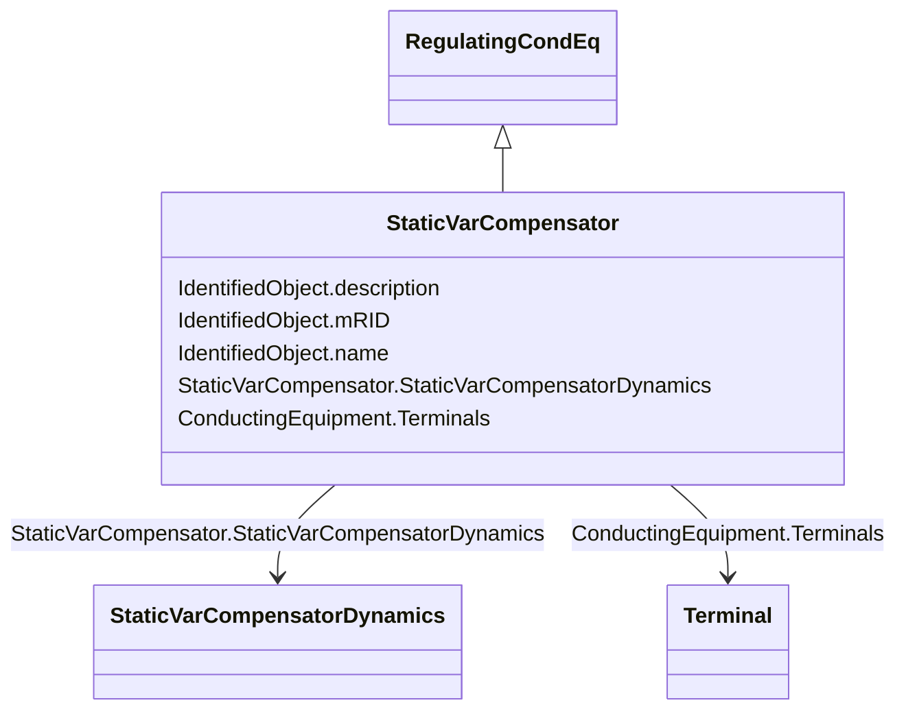

# StaticVarCompensator

_A facility for providing variable and controllable shunt reactive power. The SVC typically consists of a stepdown transformer, filter, thyristor-controlled reactor, and thyristor-switched capacitor arms._

__

_The SVC may operate in fixed MVar output mode or in voltage control mode. When in voltage control mode, the output of the SVC will be proportional to the deviation of voltage at the controlled bus from the voltage setpoint.  The SVC characteristic slope defines the proportion.  If the voltage at the controlled bus is equal to the voltage setpoint, the SVC MVar output is zero._

**URI**: [cim:StaticVarCompensator](http://iec.ch/TC57/CIM100#StaticVarCompensator) 
**Type**: Class

## Inheritance
* [IdentifiedObject](IdentifiedObject.md)
    * [PowerSystemResource](PowerSystemResource.md)
        * [Equipment](Equipment.md)
            * [ConductingEquipment](ConductingEquipment.md)
                * [EnergyConnection](EnergyConnection.md)
                    * [RegulatingCondEq](RegulatingCondEq.md)
                        * **StaticVarCompensator**

## Attributes

| Name | URI | Cardinality and Range | Description | Inheritance |
| ---  | --- | --- | --- | --- |
| StaticVarCompensatorDynamics | [cim:StaticVarCompensator.StaticVarCompensatorDynamics](http://iec.ch/TC57/CIM100#StaticVarCompensator.StaticVarCompensatorDynamics) | 0..1    [StaticVarCompensatorDynamics](StaticVarCompensatorDynamics.md)  | Static Var Compensator dynamics model used to describe dynamic behaviour of t... | direct |
| Terminals | [cim:ConductingEquipment.Terminals](http://iec.ch/TC57/CIM100#ConductingEquipment.Terminals) | *    [Terminal](Terminal.md)  | Conducting equipment have terminals that may be connected to other conducting... | [ConductingEquipment](ConductingEquipment.md) |
| description | [cim:IdentifiedObject.description](http://iec.ch/TC57/CIM100#IdentifiedObject.description) | 0..1    string  | The description is a free human readable text describing or naming the object | [IdentifiedObject](IdentifiedObject.md) |
| mRID | [cim:IdentifiedObject.mRID](http://iec.ch/TC57/CIM100#IdentifiedObject.mRID) | 1    string  | Master resource identifier issued by a model authority | [IdentifiedObject](IdentifiedObject.md) |
| name | [cim:IdentifiedObject.name](http://iec.ch/TC57/CIM100#IdentifiedObject.name) | 0..1    string  | The name is any free human readable and possibly non unique text naming the o... | [IdentifiedObject](IdentifiedObject.md) |

## Usages

| used by | used in | type | used |
| ---  | --- | --- | --- |
| [SVCUserDefined](SVCUserDefined.md) | StaticVarCompensator | range | [StaticVarCompensator](StaticVarCompensator.md) |
| [StaticVarCompensatorDynamics](StaticVarCompensatorDynamics.md) | StaticVarCompensator | range | [StaticVarCompensator](StaticVarCompensator.md) |

## Identifier and Mapping Information

### Schema Source

* from schema: http://iec.ch/TC57/ns/CIM/Dynamics-EU#Package_DynamicsProfile

## Mappings

| Mapping Type | Mapped Value |
| ---  | ---  |
| self | cim:StaticVarCompensator |
| native | this:StaticVarCompensator |

