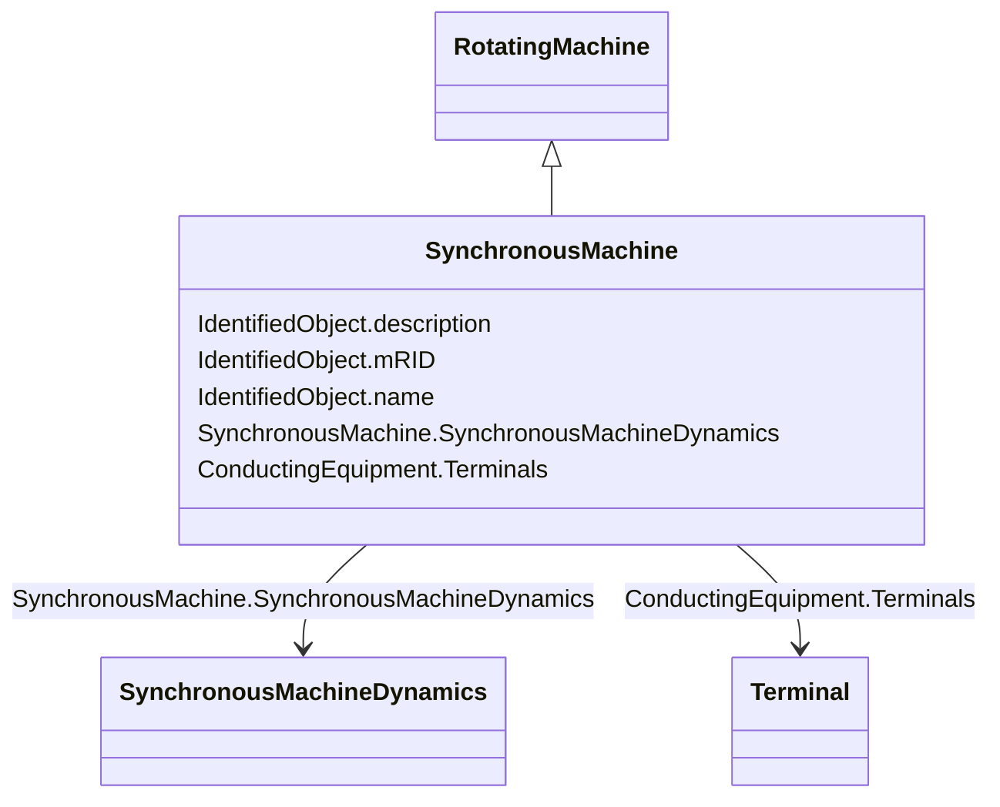

# SynchronousMachine

_An electromechanical device that operates with shaft rotating synchronously with the network. It is a single machine operating either as a generator or synchronous condenser or pump._

**URI**: [cim:SynchronousMachine](http://iec.ch/TC57/CIM100#SynchronousMachine) 
**Type**: Class

## Inheritance
* [IdentifiedObject](IdentifiedObject.md)
    * [PowerSystemResource](PowerSystemResource.md)
        * [Equipment](Equipment.md)
            * [ConductingEquipment](ConductingEquipment.md)
                * [EnergyConnection](EnergyConnection.md)
                    * [RegulatingCondEq](RegulatingCondEq.md)
                        * [RotatingMachine](RotatingMachine.md)
                            * **SynchronousMachine**

## Attributes

| Name | URI | Cardinality and Range | Description | Inheritance |
| ---  | --- | --- | --- | --- |
| SynchronousMachineDynamics | [cim:SynchronousMachine.SynchronousMachineDynamics](http://iec.ch/TC57/CIM100#SynchronousMachine.SynchronousMachineDynamics) | 0..1    [SynchronousMachineDynamics](SynchronousMachineDynamics.md)  | Synchronous machine dynamics model used to describe dynamic behaviour of this... | direct |
| Terminals | [cim:ConductingEquipment.Terminals](http://iec.ch/TC57/CIM100#ConductingEquipment.Terminals) | 0..*    [Terminal](Terminal.md)  | Conducting equipment have terminals that may be connected to other conducting... | [ConductingEquipment](ConductingEquipment.md) |
| description | [cim:IdentifiedObject.description](http://iec.ch/TC57/CIM100#IdentifiedObject.description) | 0..1    string  | The description is a free human readable text describing or naming the object | [IdentifiedObject](IdentifiedObject.md) |
| mRID | [cim:IdentifiedObject.mRID](http://iec.ch/TC57/CIM100#IdentifiedObject.mRID) | 1..1    string  | Master resource identifier issued by a model authority | [IdentifiedObject](IdentifiedObject.md) |
| name | [cim:IdentifiedObject.name](http://iec.ch/TC57/CIM100#IdentifiedObject.name) | 0..1    string  | The name is any free human readable and possibly non unique text naming the o... | [IdentifiedObject](IdentifiedObject.md) |

## Usages

| used by | used in | type | used |
| ---  | --- | --- | --- |
| [SynchronousMachineUserDefined](SynchronousMachineUserDefined.md) | SynchronousMachine | range | [SynchronousMachine](SynchronousMachine.md) |
| [SynchronousMachineSimplified](SynchronousMachineSimplified.md) | SynchronousMachine | range | [SynchronousMachine](SynchronousMachine.md) |
| [SynchronousMachineDynamics](SynchronousMachineDynamics.md) | SynchronousMachine | range | [SynchronousMachine](SynchronousMachine.md) |
| [SynchronousMachineDetailed](SynchronousMachineDetailed.md) | SynchronousMachine | range | [SynchronousMachine](SynchronousMachine.md) |
| [SynchronousMachineTimeConstantReactance](SynchronousMachineTimeConstantReactance.md) | SynchronousMachine | range | [SynchronousMachine](SynchronousMachine.md) |
| [SynchronousMachineEquivalentCircuit](SynchronousMachineEquivalentCircuit.md) | SynchronousMachine | range | [SynchronousMachine](SynchronousMachine.md) |

## Identifier and Mapping Information

### Schema Source

* from schema: http://iec.ch/TC57/ns/CIM/Dynamics-EU#Package_DynamicsProfile

## Mappings

| Mapping Type | Mapped Value |
| ---  | ---  |
| self | cim:SynchronousMachine |
| native | this:SynchronousMachine |

