# SynchronousMachineDetailed

_All synchronous machine detailed types use a subset of the same data parameters and input/output variables.  _

_The several variations differ in the following ways:_

_- the number of  equivalent windings that are included;_

_- the way in which saturation is incorporated into the model;_

_- whether or not “subtransient saliency” (<i>X''q</i> not = <i>X''d</i>) is represented._

_It is not necessary for each simulation tool to have separate models for each of the model types.  The same model can often be used for several types by alternative logic within the model.  Also, differences in saturation representation might not result in significant model performance differences so model substitutions are often acceptable._

**URI**: [cim:SynchronousMachineDetailed](http://iec.ch/TC57/CIM100#SynchronousMachineDetailed) 
**Type**: Class

```mermaid
 classDiagram
    class SynchronousMachineDetailed
      SynchronousMachineDynamics <|-- SynchronousMachineDetailed
      

      SynchronousMachineDetailed <|-- SynchronousMachineTimeConstantReactance
      SynchronousMachineDetailed <|-- SynchronousMachineEquivalentCircuit
      
      
      SynchronousMachineDetailed : SynchronousMachineDynamics.CrossCompoundTurbineGovernorDyanmics
        
          SynchronousMachineDetailed --> CrossCompoundTurbineGovernorDynamics : SynchronousMachineDynamics.CrossCompoundTurbineGovernorDyanmics
        
      SynchronousMachineDetailed : SynchronousMachineDynamics.CrossCompoundTurbineGovernorDynamics
        
          SynchronousMachineDetailed --> CrossCompoundTurbineGovernorDynamics : SynchronousMachineDynamics.CrossCompoundTurbineGovernorDynamics
        
      SynchronousMachineDetailed : RotatingMachineDynamics.damping
        
      SynchronousMachineDetailed : IdentifiedObject.description
        
      SynchronousMachineDetailed : SynchronousMachineDetailed.efdBaseRatio
        
      SynchronousMachineDetailed : DynamicsFunctionBlock.enabled
        
      SynchronousMachineDetailed : SynchronousMachineDynamics.ExcitationSystemDynamics
        
          SynchronousMachineDetailed --> ExcitationSystemDynamics : SynchronousMachineDynamics.ExcitationSystemDynamics
        
      SynchronousMachineDetailed : SynchronousMachineDynamics.GenICompensationForGenJ
        
          SynchronousMachineDetailed --> GenICompensationForGenJ : SynchronousMachineDynamics.GenICompensationForGenJ
        
      SynchronousMachineDetailed : SynchronousMachineDetailed.ifdBaseType
        
          SynchronousMachineDetailed --> IfdBaseKind : SynchronousMachineDetailed.ifdBaseType
        
      SynchronousMachineDetailed : RotatingMachineDynamics.inertia
        
          SynchronousMachineDetailed --> Seconds : RotatingMachineDynamics.inertia
        
      SynchronousMachineDetailed : SynchronousMachineDynamics.MechanicalLoadDynamics
        
          SynchronousMachineDetailed --> MechanicalLoadDynamics : SynchronousMachineDynamics.MechanicalLoadDynamics
        
      SynchronousMachineDetailed : IdentifiedObject.mRID
        
      SynchronousMachineDetailed : IdentifiedObject.name
        
      SynchronousMachineDetailed : RotatingMachineDynamics.saturationFactor
        
      SynchronousMachineDetailed : RotatingMachineDynamics.saturationFactor120
        
      SynchronousMachineDetailed : SynchronousMachineDetailed.saturationFactor120QAxis
        
      SynchronousMachineDetailed : SynchronousMachineDetailed.saturationFactorQAxis
        
      SynchronousMachineDetailed : RotatingMachineDynamics.statorLeakageReactance
        
          SynchronousMachineDetailed --> PU : RotatingMachineDynamics.statorLeakageReactance
        
      SynchronousMachineDetailed : RotatingMachineDynamics.statorResistance
        
          SynchronousMachineDetailed --> PU : RotatingMachineDynamics.statorResistance
        
      SynchronousMachineDetailed : SynchronousMachineDynamics.SynchronousMachine
        
          SynchronousMachineDetailed --> SynchronousMachine : SynchronousMachineDynamics.SynchronousMachine
        
      SynchronousMachineDetailed : SynchronousMachineDynamics.TurbineGovernorDynamics
        
          SynchronousMachineDetailed --> TurbineGovernorDynamics : SynchronousMachineDynamics.TurbineGovernorDynamics
        
      
```

## Inheritance
* [IdentifiedObject](IdentifiedObject.md)
    * [DynamicsFunctionBlock](DynamicsFunctionBlock.md)
        * [RotatingMachineDynamics](RotatingMachineDynamics.md)
            * [SynchronousMachineDynamics](SynchronousMachineDynamics.md)
                * **SynchronousMachineDetailed**
                    * [SynchronousMachineTimeConstantReactance](SynchronousMachineTimeConstantReactance.md)
                    * [SynchronousMachineEquivalentCircuit](SynchronousMachineEquivalentCircuit.md)

## Attributes

| Name | URI | Cardinality and Range | Description | Inheritance |
| ---  | --- | --- | --- | --- |
| saturationFactorQAxis | [cim:SynchronousMachineDetailed.saturationFactorQAxis](http://iec.ch/TC57/CIM100#SynchronousMachineDetailed.saturationFactorQAxis) | 0..1    float  | Quadrature-axis saturation factor at rated terminal voltage (<i>S1q</i>) (&gt... | direct |
| saturationFactor120QAxis | [cim:SynchronousMachineDetailed.saturationFactor120QAxis](http://iec.ch/TC57/CIM100#SynchronousMachineDetailed.saturationFactor120QAxis) | 0..1    float  | Quadrature-axis saturation factor at 120% of rated terminal voltage (<i>S12q<... | direct |
| efdBaseRatio | [cim:SynchronousMachineDetailed.efdBaseRatio](http://iec.ch/TC57/CIM100#SynchronousMachineDetailed.efdBaseRatio) | 1..1    float  | Ratio (exciter voltage/generator voltage) of <i>Efd</i> bases of exciter and ... | direct |
| ifdBaseType | [cim:SynchronousMachineDetailed.ifdBaseType](http://iec.ch/TC57/CIM100#SynchronousMachineDetailed.ifdBaseType) | 1..1    [IfdBaseKind](IfdBaseKind.md)  | Excitation base system mode | direct |
| SynchronousMachine | [cim:SynchronousMachineDynamics.SynchronousMachine](http://iec.ch/TC57/CIM100#SynchronousMachineDynamics.SynchronousMachine) | 1..1    [SynchronousMachine](SynchronousMachine.md)  | Synchronous machine to which synchronous machine dynamics model applies | [SynchronousMachineDynamics](SynchronousMachineDynamics.md) |
| CrossCompoundTurbineGovernorDyanmics | [cim:SynchronousMachineDynamics.CrossCompoundTurbineGovernorDyanmics](http://iec.ch/TC57/CIM100#SynchronousMachineDynamics.CrossCompoundTurbineGovernorDyanmics) | 0..1    [CrossCompoundTurbineGovernorDynamics](CrossCompoundTurbineGovernorDynamics.md)  | The cross-compound turbine governor with which this high-pressure synchronous... | [SynchronousMachineDynamics](SynchronousMachineDynamics.md) |
| CrossCompoundTurbineGovernorDynamics | [cim:SynchronousMachineDynamics.CrossCompoundTurbineGovernorDynamics](http://iec.ch/TC57/CIM100#SynchronousMachineDynamics.CrossCompoundTurbineGovernorDynamics) | 0..1    [CrossCompoundTurbineGovernorDynamics](CrossCompoundTurbineGovernorDynamics.md)  | The cross-compound turbine governor with which this low-pressure synchronous ... | [SynchronousMachineDynamics](SynchronousMachineDynamics.md) |
| MechanicalLoadDynamics | [cim:SynchronousMachineDynamics.MechanicalLoadDynamics](http://iec.ch/TC57/CIM100#SynchronousMachineDynamics.MechanicalLoadDynamics) | 0..1    [MechanicalLoadDynamics](MechanicalLoadDynamics.md)  | Mechanical load model associated with this synchronous machine model | [SynchronousMachineDynamics](SynchronousMachineDynamics.md) |
| ExcitationSystemDynamics | [cim:SynchronousMachineDynamics.ExcitationSystemDynamics](http://iec.ch/TC57/CIM100#SynchronousMachineDynamics.ExcitationSystemDynamics) | 0..1    [ExcitationSystemDynamics](ExcitationSystemDynamics.md)  | Excitation system model associated with this synchronous machine model | [SynchronousMachineDynamics](SynchronousMachineDynamics.md) |
| TurbineGovernorDynamics | [cim:SynchronousMachineDynamics.TurbineGovernorDynamics](http://iec.ch/TC57/CIM100#SynchronousMachineDynamics.TurbineGovernorDynamics) | 0..*    [TurbineGovernorDynamics](TurbineGovernorDynamics.md)  | Turbine-governor model associated with this synchronous machine model | [SynchronousMachineDynamics](SynchronousMachineDynamics.md) |
| GenICompensationForGenJ | [cim:SynchronousMachineDynamics.GenICompensationForGenJ](http://iec.ch/TC57/CIM100#SynchronousMachineDynamics.GenICompensationForGenJ) | 0..*    [GenICompensationForGenJ](GenICompensationForGenJ.md)  | Compensation of voltage compensator's generator for current flow out of this ... | [SynchronousMachineDynamics](SynchronousMachineDynamics.md) |
| damping | [cim:RotatingMachineDynamics.damping](http://iec.ch/TC57/CIM100#RotatingMachineDynamics.damping) | 1..1    float  | Damping torque coefficient (<i>D</i>) (&gt;= 0) | [RotatingMachineDynamics](RotatingMachineDynamics.md) |
| inertia | [cim:RotatingMachineDynamics.inertia](http://iec.ch/TC57/CIM100#RotatingMachineDynamics.inertia) | 1..1    [Seconds](Seconds.md)  | Inertia constant of generator or motor and mechanical load (<i>H</i>) (&gt; 0... | [RotatingMachineDynamics](RotatingMachineDynamics.md) |
| saturationFactor | [cim:RotatingMachineDynamics.saturationFactor](http://iec.ch/TC57/CIM100#RotatingMachineDynamics.saturationFactor) | 0..1    float  | Saturation factor at rated terminal voltage (<i>S1</i>) (&gt;= 0) | [RotatingMachineDynamics](RotatingMachineDynamics.md) |
| saturationFactor120 | [cim:RotatingMachineDynamics.saturationFactor120](http://iec.ch/TC57/CIM100#RotatingMachineDynamics.saturationFactor120) | 0..1    float  | Saturation factor at 120% of rated terminal voltage (<i>S12</i>) (&gt;= Rotat... | [RotatingMachineDynamics](RotatingMachineDynamics.md) |
| statorLeakageReactance | [cim:RotatingMachineDynamics.statorLeakageReactance](http://iec.ch/TC57/CIM100#RotatingMachineDynamics.statorLeakageReactance) | 1..1    [PU](PU.md)  | Stator leakage reactance (<i>Xl</i>) (&gt;= 0) | [RotatingMachineDynamics](RotatingMachineDynamics.md) |
| statorResistance | [cim:RotatingMachineDynamics.statorResistance](http://iec.ch/TC57/CIM100#RotatingMachineDynamics.statorResistance) | 1..1    [PU](PU.md)  | Stator (armature) resistance (<i>Rs</i>) (&gt;= 0) | [RotatingMachineDynamics](RotatingMachineDynamics.md) |
| enabled | [cim:DynamicsFunctionBlock.enabled](http://iec.ch/TC57/CIM100#DynamicsFunctionBlock.enabled) | 1..1    boolean  | Function block used indicator | [DynamicsFunctionBlock](DynamicsFunctionBlock.md) |
| description | [cim:IdentifiedObject.description](http://iec.ch/TC57/CIM100#IdentifiedObject.description) | 0..1    string  | The description is a free human readable text describing or naming the object | [IdentifiedObject](IdentifiedObject.md) |
| mRID | [cim:IdentifiedObject.mRID](http://iec.ch/TC57/CIM100#IdentifiedObject.mRID) | 1..1    string  | Master resource identifier issued by a model authority | [IdentifiedObject](IdentifiedObject.md) |
| name | [cim:IdentifiedObject.name](http://iec.ch/TC57/CIM100#IdentifiedObject.name) | 0..1    string  | The name is any free human readable and possibly non unique text naming the o... | [IdentifiedObject](IdentifiedObject.md) |

## Identifier and Mapping Information

### Schema Source

* from schema: http://iec.ch/TC57/ns/CIM/Dynamics-EU#Package_DynamicsProfile

## Mappings

| Mapping Type | Mapped Value |
| ---  | ---  |
| self | cim:SynchronousMachineDetailed |
| native | this:SynchronousMachineDetailed |

