# SynchronousMachineDynamics

_Synchronous machine whose behaviour is described by reference to a standard model expressed in one of the following forms:_

_- simplified (or classical), where a group of generators or motors is not modelled in detail;_

_- detailed, in equivalent circuit form;_

_- detailed, in time constant reactance form; or_

_- by definition of a user-defined model._

_It is a common practice to represent small generators by a negative load rather than by a dynamic generator model when performing dynamics simulations. In this case, a SynchronousMachine in the static model is not represented by anything in the dynamics model, instead it is treated as an ordinary load._

_Parameter details:_

_<ol>_

_	<li>Synchronous machine parameters such as <i>Xl, Xd, Xp</i> etc. are actually used as inductances in the models, but are commonly referred to as reactances since, at nominal frequency, the PU values are the same. However, some references use the symbol <i>L</i> instead of <i>X</i>.</li>_

_</ol>_

**URI**: [cim:SynchronousMachineDynamics](http://iec.ch/TC57/CIM100#SynchronousMachineDynamics) 
**Type**: Class

```mermaid
 classDiagram
    class SynchronousMachineDynamics
      RotatingMachineDynamics <|-- SynchronousMachineDynamics
      

      SynchronousMachineDynamics <|-- SynchronousMachineUserDefined
      SynchronousMachineDynamics <|-- SynchronousMachineSimplified
      SynchronousMachineDynamics <|-- SynchronousMachineDetailed
      
      
      SynchronousMachineDynamics : SynchronousMachineDynamics.CrossCompoundTurbineGovernorDyanmics
        
          SynchronousMachineDynamics --> CrossCompoundTurbineGovernorDynamics : SynchronousMachineDynamics.CrossCompoundTurbineGovernorDyanmics
        
      SynchronousMachineDynamics : SynchronousMachineDynamics.CrossCompoundTurbineGovernorDynamics
        
          SynchronousMachineDynamics --> CrossCompoundTurbineGovernorDynamics : SynchronousMachineDynamics.CrossCompoundTurbineGovernorDynamics
        
      SynchronousMachineDynamics : RotatingMachineDynamics.damping
        
      SynchronousMachineDynamics : IdentifiedObject.description
        
      SynchronousMachineDynamics : DynamicsFunctionBlock.enabled
        
      SynchronousMachineDynamics : SynchronousMachineDynamics.ExcitationSystemDynamics
        
          SynchronousMachineDynamics --> ExcitationSystemDynamics : SynchronousMachineDynamics.ExcitationSystemDynamics
        
      SynchronousMachineDynamics : SynchronousMachineDynamics.GenICompensationForGenJ
        
          SynchronousMachineDynamics --> GenICompensationForGenJ : SynchronousMachineDynamics.GenICompensationForGenJ
        
      SynchronousMachineDynamics : RotatingMachineDynamics.inertia
        
          SynchronousMachineDynamics --> Seconds : RotatingMachineDynamics.inertia
        
      SynchronousMachineDynamics : SynchronousMachineDynamics.MechanicalLoadDynamics
        
          SynchronousMachineDynamics --> MechanicalLoadDynamics : SynchronousMachineDynamics.MechanicalLoadDynamics
        
      SynchronousMachineDynamics : IdentifiedObject.mRID
        
      SynchronousMachineDynamics : IdentifiedObject.name
        
      SynchronousMachineDynamics : RotatingMachineDynamics.saturationFactor
        
      SynchronousMachineDynamics : RotatingMachineDynamics.saturationFactor120
        
      SynchronousMachineDynamics : RotatingMachineDynamics.statorLeakageReactance
        
          SynchronousMachineDynamics --> PU : RotatingMachineDynamics.statorLeakageReactance
        
      SynchronousMachineDynamics : RotatingMachineDynamics.statorResistance
        
          SynchronousMachineDynamics --> PU : RotatingMachineDynamics.statorResistance
        
      SynchronousMachineDynamics : SynchronousMachineDynamics.SynchronousMachine
        
          SynchronousMachineDynamics --> SynchronousMachine : SynchronousMachineDynamics.SynchronousMachine
        
      SynchronousMachineDynamics : SynchronousMachineDynamics.TurbineGovernorDynamics
        
          SynchronousMachineDynamics --> TurbineGovernorDynamics : SynchronousMachineDynamics.TurbineGovernorDynamics
        
      
```

## Inheritance
* [IdentifiedObject](IdentifiedObject.md)
    * [DynamicsFunctionBlock](DynamicsFunctionBlock.md)
        * [RotatingMachineDynamics](RotatingMachineDynamics.md)
            * **SynchronousMachineDynamics**
                * [SynchronousMachineUserDefined](SynchronousMachineUserDefined.md)
                * [SynchronousMachineSimplified](SynchronousMachineSimplified.md)
                * [SynchronousMachineDetailed](SynchronousMachineDetailed.md)

## Attributes

| Name | URI | Cardinality and Range | Description | Inheritance |
| ---  | --- | --- | --- | --- |
| SynchronousMachine | [cim:SynchronousMachineDynamics.SynchronousMachine](http://iec.ch/TC57/CIM100#SynchronousMachineDynamics.SynchronousMachine) | 1..1    [SynchronousMachine](SynchronousMachine.md)  | Synchronous machine to which synchronous machine dynamics model applies | direct |
| CrossCompoundTurbineGovernorDyanmics | [cim:SynchronousMachineDynamics.CrossCompoundTurbineGovernorDyanmics](http://iec.ch/TC57/CIM100#SynchronousMachineDynamics.CrossCompoundTurbineGovernorDyanmics) | 0..1    [CrossCompoundTurbineGovernorDynamics](CrossCompoundTurbineGovernorDynamics.md)  | The cross-compound turbine governor with which this high-pressure synchronous... | direct |
| CrossCompoundTurbineGovernorDynamics | [cim:SynchronousMachineDynamics.CrossCompoundTurbineGovernorDynamics](http://iec.ch/TC57/CIM100#SynchronousMachineDynamics.CrossCompoundTurbineGovernorDynamics) | 0..1    [CrossCompoundTurbineGovernorDynamics](CrossCompoundTurbineGovernorDynamics.md)  | The cross-compound turbine governor with which this low-pressure synchronous ... | direct |
| MechanicalLoadDynamics | [cim:SynchronousMachineDynamics.MechanicalLoadDynamics](http://iec.ch/TC57/CIM100#SynchronousMachineDynamics.MechanicalLoadDynamics) | 0..1    [MechanicalLoadDynamics](MechanicalLoadDynamics.md)  | Mechanical load model associated with this synchronous machine model | direct |
| ExcitationSystemDynamics | [cim:SynchronousMachineDynamics.ExcitationSystemDynamics](http://iec.ch/TC57/CIM100#SynchronousMachineDynamics.ExcitationSystemDynamics) | 0..1    [ExcitationSystemDynamics](ExcitationSystemDynamics.md)  | Excitation system model associated with this synchronous machine model | direct |
| TurbineGovernorDynamics | [cim:SynchronousMachineDynamics.TurbineGovernorDynamics](http://iec.ch/TC57/CIM100#SynchronousMachineDynamics.TurbineGovernorDynamics) | 0..*    [TurbineGovernorDynamics](TurbineGovernorDynamics.md)  | Turbine-governor model associated with this synchronous machine model | direct |
| GenICompensationForGenJ | [cim:SynchronousMachineDynamics.GenICompensationForGenJ](http://iec.ch/TC57/CIM100#SynchronousMachineDynamics.GenICompensationForGenJ) | 0..*    [GenICompensationForGenJ](GenICompensationForGenJ.md)  | Compensation of voltage compensator's generator for current flow out of this ... | direct |
| damping | [cim:RotatingMachineDynamics.damping](http://iec.ch/TC57/CIM100#RotatingMachineDynamics.damping) | 1..1    float  | Damping torque coefficient (<i>D</i>) (&gt;= 0) | [RotatingMachineDynamics](RotatingMachineDynamics.md) |
| inertia | [cim:RotatingMachineDynamics.inertia](http://iec.ch/TC57/CIM100#RotatingMachineDynamics.inertia) | 1..1    [Seconds](Seconds.md)  | Inertia constant of generator or motor and mechanical load (<i>H</i>) (&gt; 0... | [RotatingMachineDynamics](RotatingMachineDynamics.md) |
| saturationFactor | [cim:RotatingMachineDynamics.saturationFactor](http://iec.ch/TC57/CIM100#RotatingMachineDynamics.saturationFactor) | 0..1    float  | Saturation factor at rated terminal voltage (<i>S1</i>) (&gt;= 0) | [RotatingMachineDynamics](RotatingMachineDynamics.md) |
| saturationFactor120 | [cim:RotatingMachineDynamics.saturationFactor120](http://iec.ch/TC57/CIM100#RotatingMachineDynamics.saturationFactor120) | 0..1    float  | Saturation factor at 120% of rated terminal voltage (<i>S12</i>) (&gt;= Rotat... | [RotatingMachineDynamics](RotatingMachineDynamics.md) |
| statorLeakageReactance | [cim:RotatingMachineDynamics.statorLeakageReactance](http://iec.ch/TC57/CIM100#RotatingMachineDynamics.statorLeakageReactance) | 1..1    [PU](PU.md)  | Stator leakage reactance (<i>Xl</i>) (&gt;= 0) | [RotatingMachineDynamics](RotatingMachineDynamics.md) |
| statorResistance | [cim:RotatingMachineDynamics.statorResistance](http://iec.ch/TC57/CIM100#RotatingMachineDynamics.statorResistance) | 1..1    [PU](PU.md)  | Stator (armature) resistance (<i>Rs</i>) (&gt;= 0) | [RotatingMachineDynamics](RotatingMachineDynamics.md) |
| enabled | [cim:DynamicsFunctionBlock.enabled](http://iec.ch/TC57/CIM100#DynamicsFunctionBlock.enabled) | 1..1    boolean  | Function block used indicator | [DynamicsFunctionBlock](DynamicsFunctionBlock.md) |
| description | [cim:IdentifiedObject.description](http://iec.ch/TC57/CIM100#IdentifiedObject.description) | 0..1    string  | The description is a free human readable text describing or naming the object | [IdentifiedObject](IdentifiedObject.md) |
| mRID | [cim:IdentifiedObject.mRID](http://iec.ch/TC57/CIM100#IdentifiedObject.mRID) | 1..1    string  | Master resource identifier issued by a model authority | [IdentifiedObject](IdentifiedObject.md) |
| name | [cim:IdentifiedObject.name](http://iec.ch/TC57/CIM100#IdentifiedObject.name) | 0..1    string  | The name is any free human readable and possibly non unique text naming the o... | [IdentifiedObject](IdentifiedObject.md) |

## Usages

| used by | used in | type | used |
| ---  | --- | --- | --- |
| [SynchronousMachine](SynchronousMachine.md) | SynchronousMachineDynamics | range | [SynchronousMachineDynamics](SynchronousMachineDynamics.md) |
| [TurbineGovernorUserDefined](TurbineGovernorUserDefined.md) | SynchronousMachineDynamics | range | [SynchronousMachineDynamics](SynchronousMachineDynamics.md) |
| [MechanicalLoadUserDefined](MechanicalLoadUserDefined.md) | SynchronousMachineDynamics | range | [SynchronousMachineDynamics](SynchronousMachineDynamics.md) |
| [ExcitationSystemUserDefined](ExcitationSystemUserDefined.md) | SynchronousMachineDynamics | range | [SynchronousMachineDynamics](SynchronousMachineDynamics.md) |
| [CrossCompoundTurbineGovernorDynamics](CrossCompoundTurbineGovernorDynamics.md) | HighPressureSynchronousMachineDynamics | range | [SynchronousMachineDynamics](SynchronousMachineDynamics.md) |
| [CrossCompoundTurbineGovernorDynamics](CrossCompoundTurbineGovernorDynamics.md) | LowPressureSynchronousMachineDynamics | range | [SynchronousMachineDynamics](SynchronousMachineDynamics.md) |
| [TurbineGovernorDynamics](TurbineGovernorDynamics.md) | SynchronousMachineDynamics | range | [SynchronousMachineDynamics](SynchronousMachineDynamics.md) |
| [GovHydroIEEE0](GovHydroIEEE0.md) | SynchronousMachineDynamics | range | [SynchronousMachineDynamics](SynchronousMachineDynamics.md) |
| [GovHydroIEEE2](GovHydroIEEE2.md) | SynchronousMachineDynamics | range | [SynchronousMachineDynamics](SynchronousMachineDynamics.md) |
| [GovSteamIEEE1](GovSteamIEEE1.md) | SynchronousMachineDynamics | range | [SynchronousMachineDynamics](SynchronousMachineDynamics.md) |
| [GovCT1](GovCT1.md) | SynchronousMachineDynamics | range | [SynchronousMachineDynamics](SynchronousMachineDynamics.md) |
| [GovCT2](GovCT2.md) | SynchronousMachineDynamics | range | [SynchronousMachineDynamics](SynchronousMachineDynamics.md) |
| [GovGAST](GovGAST.md) | SynchronousMachineDynamics | range | [SynchronousMachineDynamics](SynchronousMachineDynamics.md) |
| [GovGAST1](GovGAST1.md) | SynchronousMachineDynamics | range | [SynchronousMachineDynamics](SynchronousMachineDynamics.md) |
| [GovGAST2](GovGAST2.md) | SynchronousMachineDynamics | range | [SynchronousMachineDynamics](SynchronousMachineDynamics.md) |
| [GovGAST3](GovGAST3.md) | SynchronousMachineDynamics | range | [SynchronousMachineDynamics](SynchronousMachineDynamics.md) |
| [GovGAST4](GovGAST4.md) | SynchronousMachineDynamics | range | [SynchronousMachineDynamics](SynchronousMachineDynamics.md) |
| [GovGASTWD](GovGASTWD.md) | SynchronousMachineDynamics | range | [SynchronousMachineDynamics](SynchronousMachineDynamics.md) |
| [GovHydro1](GovHydro1.md) | SynchronousMachineDynamics | range | [SynchronousMachineDynamics](SynchronousMachineDynamics.md) |
| [GovHydro2](GovHydro2.md) | SynchronousMachineDynamics | range | [SynchronousMachineDynamics](SynchronousMachineDynamics.md) |
| [GovHydro3](GovHydro3.md) | SynchronousMachineDynamics | range | [SynchronousMachineDynamics](SynchronousMachineDynamics.md) |
| [GovHydro4](GovHydro4.md) | SynchronousMachineDynamics | range | [SynchronousMachineDynamics](SynchronousMachineDynamics.md) |
| [GovHydroDD](GovHydroDD.md) | SynchronousMachineDynamics | range | [SynchronousMachineDynamics](SynchronousMachineDynamics.md) |
| [GovHydroFrancis](GovHydroFrancis.md) | SynchronousMachineDynamics | range | [SynchronousMachineDynamics](SynchronousMachineDynamics.md) |
| [GovHydroPelton](GovHydroPelton.md) | SynchronousMachineDynamics | range | [SynchronousMachineDynamics](SynchronousMachineDynamics.md) |
| [GovHydroPID](GovHydroPID.md) | SynchronousMachineDynamics | range | [SynchronousMachineDynamics](SynchronousMachineDynamics.md) |
| [GovHydroPID2](GovHydroPID2.md) | SynchronousMachineDynamics | range | [SynchronousMachineDynamics](SynchronousMachineDynamics.md) |
| [GovHydroR](GovHydroR.md) | SynchronousMachineDynamics | range | [SynchronousMachineDynamics](SynchronousMachineDynamics.md) |
| [GovHydroWEH](GovHydroWEH.md) | SynchronousMachineDynamics | range | [SynchronousMachineDynamics](SynchronousMachineDynamics.md) |
| [GovHydroWPID](GovHydroWPID.md) | SynchronousMachineDynamics | range | [SynchronousMachineDynamics](SynchronousMachineDynamics.md) |
| [GovSteam0](GovSteam0.md) | SynchronousMachineDynamics | range | [SynchronousMachineDynamics](SynchronousMachineDynamics.md) |
| [GovSteam1](GovSteam1.md) | SynchronousMachineDynamics | range | [SynchronousMachineDynamics](SynchronousMachineDynamics.md) |
| [GovSteam2](GovSteam2.md) | SynchronousMachineDynamics | range | [SynchronousMachineDynamics](SynchronousMachineDynamics.md) |
| [GovSteamBB](GovSteamBB.md) | SynchronousMachineDynamics | range | [SynchronousMachineDynamics](SynchronousMachineDynamics.md) |
| [GovSteamCC](GovSteamCC.md) | HighPressureSynchronousMachineDynamics | range | [SynchronousMachineDynamics](SynchronousMachineDynamics.md) |
| [GovSteamCC](GovSteamCC.md) | LowPressureSynchronousMachineDynamics | range | [SynchronousMachineDynamics](SynchronousMachineDynamics.md) |
| [GovSteamEU](GovSteamEU.md) | SynchronousMachineDynamics | range | [SynchronousMachineDynamics](SynchronousMachineDynamics.md) |
| [GovSteamFV2](GovSteamFV2.md) | SynchronousMachineDynamics | range | [SynchronousMachineDynamics](SynchronousMachineDynamics.md) |
| [GovSteamFV3](GovSteamFV3.md) | SynchronousMachineDynamics | range | [SynchronousMachineDynamics](SynchronousMachineDynamics.md) |
| [GovSteamFV4](GovSteamFV4.md) | SynchronousMachineDynamics | range | [SynchronousMachineDynamics](SynchronousMachineDynamics.md) |
| [GovSteamSGO](GovSteamSGO.md) | SynchronousMachineDynamics | range | [SynchronousMachineDynamics](SynchronousMachineDynamics.md) |
| [MechanicalLoadDynamics](MechanicalLoadDynamics.md) | SynchronousMachineDynamics | range | [SynchronousMachineDynamics](SynchronousMachineDynamics.md) |
| [MechLoad1](MechLoad1.md) | SynchronousMachineDynamics | range | [SynchronousMachineDynamics](SynchronousMachineDynamics.md) |
| [ExcitationSystemDynamics](ExcitationSystemDynamics.md) | SynchronousMachineDynamics | range | [SynchronousMachineDynamics](SynchronousMachineDynamics.md) |
| [ExcIEEEAC1A](ExcIEEEAC1A.md) | SynchronousMachineDynamics | range | [SynchronousMachineDynamics](SynchronousMachineDynamics.md) |
| [ExcIEEEAC2A](ExcIEEEAC2A.md) | SynchronousMachineDynamics | range | [SynchronousMachineDynamics](SynchronousMachineDynamics.md) |
| [ExcIEEEAC3A](ExcIEEEAC3A.md) | SynchronousMachineDynamics | range | [SynchronousMachineDynamics](SynchronousMachineDynamics.md) |
| [ExcIEEEAC4A](ExcIEEEAC4A.md) | SynchronousMachineDynamics | range | [SynchronousMachineDynamics](SynchronousMachineDynamics.md) |
| [ExcIEEEAC5A](ExcIEEEAC5A.md) | SynchronousMachineDynamics | range | [SynchronousMachineDynamics](SynchronousMachineDynamics.md) |
| [ExcIEEEAC6A](ExcIEEEAC6A.md) | SynchronousMachineDynamics | range | [SynchronousMachineDynamics](SynchronousMachineDynamics.md) |
| [ExcIEEEAC7B](ExcIEEEAC7B.md) | SynchronousMachineDynamics | range | [SynchronousMachineDynamics](SynchronousMachineDynamics.md) |
| [ExcIEEEAC8B](ExcIEEEAC8B.md) | SynchronousMachineDynamics | range | [SynchronousMachineDynamics](SynchronousMachineDynamics.md) |
| [ExcIEEEDC1A](ExcIEEEDC1A.md) | SynchronousMachineDynamics | range | [SynchronousMachineDynamics](SynchronousMachineDynamics.md) |
| [ExcIEEEDC2A](ExcIEEEDC2A.md) | SynchronousMachineDynamics | range | [SynchronousMachineDynamics](SynchronousMachineDynamics.md) |
| [ExcIEEEDC3A](ExcIEEEDC3A.md) | SynchronousMachineDynamics | range | [SynchronousMachineDynamics](SynchronousMachineDynamics.md) |
| [ExcIEEEDC4B](ExcIEEEDC4B.md) | SynchronousMachineDynamics | range | [SynchronousMachineDynamics](SynchronousMachineDynamics.md) |
| [ExcIEEEST1A](ExcIEEEST1A.md) | SynchronousMachineDynamics | range | [SynchronousMachineDynamics](SynchronousMachineDynamics.md) |
| [ExcIEEEST2A](ExcIEEEST2A.md) | SynchronousMachineDynamics | range | [SynchronousMachineDynamics](SynchronousMachineDynamics.md) |
| [ExcIEEEST3A](ExcIEEEST3A.md) | SynchronousMachineDynamics | range | [SynchronousMachineDynamics](SynchronousMachineDynamics.md) |
| [ExcIEEEST4B](ExcIEEEST4B.md) | SynchronousMachineDynamics | range | [SynchronousMachineDynamics](SynchronousMachineDynamics.md) |
| [ExcIEEEST5B](ExcIEEEST5B.md) | SynchronousMachineDynamics | range | [SynchronousMachineDynamics](SynchronousMachineDynamics.md) |
| [ExcIEEEST6B](ExcIEEEST6B.md) | SynchronousMachineDynamics | range | [SynchronousMachineDynamics](SynchronousMachineDynamics.md) |
| [ExcIEEEST7B](ExcIEEEST7B.md) | SynchronousMachineDynamics | range | [SynchronousMachineDynamics](SynchronousMachineDynamics.md) |
| [ExcAC1A](ExcAC1A.md) | SynchronousMachineDynamics | range | [SynchronousMachineDynamics](SynchronousMachineDynamics.md) |
| [ExcAC2A](ExcAC2A.md) | SynchronousMachineDynamics | range | [SynchronousMachineDynamics](SynchronousMachineDynamics.md) |
| [ExcAC3A](ExcAC3A.md) | SynchronousMachineDynamics | range | [SynchronousMachineDynamics](SynchronousMachineDynamics.md) |
| [ExcAC4A](ExcAC4A.md) | SynchronousMachineDynamics | range | [SynchronousMachineDynamics](SynchronousMachineDynamics.md) |
| [ExcAC5A](ExcAC5A.md) | SynchronousMachineDynamics | range | [SynchronousMachineDynamics](SynchronousMachineDynamics.md) |
| [ExcAC6A](ExcAC6A.md) | SynchronousMachineDynamics | range | [SynchronousMachineDynamics](SynchronousMachineDynamics.md) |
| [ExcAC8B](ExcAC8B.md) | SynchronousMachineDynamics | range | [SynchronousMachineDynamics](SynchronousMachineDynamics.md) |
| [ExcANS](ExcANS.md) | SynchronousMachineDynamics | range | [SynchronousMachineDynamics](SynchronousMachineDynamics.md) |
| [ExcAVR1](ExcAVR1.md) | SynchronousMachineDynamics | range | [SynchronousMachineDynamics](SynchronousMachineDynamics.md) |
| [ExcAVR2](ExcAVR2.md) | SynchronousMachineDynamics | range | [SynchronousMachineDynamics](SynchronousMachineDynamics.md) |
| [ExcAVR3](ExcAVR3.md) | SynchronousMachineDynamics | range | [SynchronousMachineDynamics](SynchronousMachineDynamics.md) |
| [ExcAVR4](ExcAVR4.md) | SynchronousMachineDynamics | range | [SynchronousMachineDynamics](SynchronousMachineDynamics.md) |
| [ExcAVR5](ExcAVR5.md) | SynchronousMachineDynamics | range | [SynchronousMachineDynamics](SynchronousMachineDynamics.md) |
| [ExcAVR7](ExcAVR7.md) | SynchronousMachineDynamics | range | [SynchronousMachineDynamics](SynchronousMachineDynamics.md) |
| [ExcBBC](ExcBBC.md) | SynchronousMachineDynamics | range | [SynchronousMachineDynamics](SynchronousMachineDynamics.md) |
| [ExcCZ](ExcCZ.md) | SynchronousMachineDynamics | range | [SynchronousMachineDynamics](SynchronousMachineDynamics.md) |
| [ExcDC1A](ExcDC1A.md) | SynchronousMachineDynamics | range | [SynchronousMachineDynamics](SynchronousMachineDynamics.md) |
| [ExcDC2A](ExcDC2A.md) | SynchronousMachineDynamics | range | [SynchronousMachineDynamics](SynchronousMachineDynamics.md) |
| [ExcDC3A](ExcDC3A.md) | SynchronousMachineDynamics | range | [SynchronousMachineDynamics](SynchronousMachineDynamics.md) |
| [ExcDC3A1](ExcDC3A1.md) | SynchronousMachineDynamics | range | [SynchronousMachineDynamics](SynchronousMachineDynamics.md) |
| [ExcELIN1](ExcELIN1.md) | SynchronousMachineDynamics | range | [SynchronousMachineDynamics](SynchronousMachineDynamics.md) |
| [ExcELIN2](ExcELIN2.md) | SynchronousMachineDynamics | range | [SynchronousMachineDynamics](SynchronousMachineDynamics.md) |
| [ExcHU](ExcHU.md) | SynchronousMachineDynamics | range | [SynchronousMachineDynamics](SynchronousMachineDynamics.md) |
| [ExcNI](ExcNI.md) | SynchronousMachineDynamics | range | [SynchronousMachineDynamics](SynchronousMachineDynamics.md) |
| [ExcOEX3T](ExcOEX3T.md) | SynchronousMachineDynamics | range | [SynchronousMachineDynamics](SynchronousMachineDynamics.md) |
| [ExcPIC](ExcPIC.md) | SynchronousMachineDynamics | range | [SynchronousMachineDynamics](SynchronousMachineDynamics.md) |
| [ExcREXS](ExcREXS.md) | SynchronousMachineDynamics | range | [SynchronousMachineDynamics](SynchronousMachineDynamics.md) |
| [ExcRQB](ExcRQB.md) | SynchronousMachineDynamics | range | [SynchronousMachineDynamics](SynchronousMachineDynamics.md) |
| [ExcSCRX](ExcSCRX.md) | SynchronousMachineDynamics | range | [SynchronousMachineDynamics](SynchronousMachineDynamics.md) |
| [ExcSEXS](ExcSEXS.md) | SynchronousMachineDynamics | range | [SynchronousMachineDynamics](SynchronousMachineDynamics.md) |
| [ExcSK](ExcSK.md) | SynchronousMachineDynamics | range | [SynchronousMachineDynamics](SynchronousMachineDynamics.md) |
| [ExcST1A](ExcST1A.md) | SynchronousMachineDynamics | range | [SynchronousMachineDynamics](SynchronousMachineDynamics.md) |
| [ExcST2A](ExcST2A.md) | SynchronousMachineDynamics | range | [SynchronousMachineDynamics](SynchronousMachineDynamics.md) |
| [ExcST3A](ExcST3A.md) | SynchronousMachineDynamics | range | [SynchronousMachineDynamics](SynchronousMachineDynamics.md) |
| [ExcST4B](ExcST4B.md) | SynchronousMachineDynamics | range | [SynchronousMachineDynamics](SynchronousMachineDynamics.md) |
| [ExcST6B](ExcST6B.md) | SynchronousMachineDynamics | range | [SynchronousMachineDynamics](SynchronousMachineDynamics.md) |
| [ExcST7B](ExcST7B.md) | SynchronousMachineDynamics | range | [SynchronousMachineDynamics](SynchronousMachineDynamics.md) |
| [GenICompensationForGenJ](GenICompensationForGenJ.md) | SynchronousMachineDynamics | range | [SynchronousMachineDynamics](SynchronousMachineDynamics.md) |

## Identifier and Mapping Information

### Schema Source

* from schema: http://iec.ch/TC57/ns/CIM/Dynamics-EU#Package_DynamicsProfile

## Mappings

| Mapping Type | Mapped Value |
| ---  | ---  |
| self | cim:SynchronousMachineDynamics |
| native | this:SynchronousMachineDynamics |

