# SynchronousMachineEquivalentCircuit

_The electrical equations for all variations of the synchronous models are based on the SynchronousEquivalentCircuit diagram for the direct- and quadrature- axes._

_Equations for conversion between equivalent circuit and time constant reactance forms:_

_<i>Xd</i> = <i>Xad </i>+<i> Xl</i>_

_<i>X’d</i> = <i>Xl</i> + <i>Xad</i> x <i>Xfd</i> / (<i>Xad</i> + <i>Xfd</i>)_

_<i>X”d</i> = <i>Xl</i> + <i>Xad</i> x <i>Xfd</i> x <i>X1d</i> / (<i>Xad</i> x <i>Xfd</i> + <i>Xad</i> x <i>X1d</i> + <i>Xfd</i> x <i>X1d</i>)_

_<i>Xq</i> = <i>Xaq</i> + <i>Xl</i>_

_<i>X’q</i> = <i>Xl</i> + <i>Xaq</i> x <i>X1q</i> / (<i>Xaq</i> + <i>X1q</i>)_

_<i>X”q</i> = <i>Xl</i> + <i>Xaq</i> x <i>X1q</i> x <i>X2q</i> / (<i>Xaq</i> x <i>X1q</i> + <i>Xaq</i> x <i>X2q</i> + <i>X1q</i> x <i>X2q</i>)_

_<i>T’do</i> = (<i>Xad</i> + <i>Xfd</i>) / (<i>omega</i><i>0</i> x <i>Rfd</i>)_

_<i>T”do</i> = (<i>Xad</i> x <i>Xfd</i> + <i>Xad</i> x <i>X1d</i> + <i>Xfd</i> x <i>X1d</i>) / (<i>omega</i><i>0</i> x <i>R1d</i> x (<i>Xad</i> + <i>Xfd</i>)_

_<i>T’qo</i> = (<i>Xaq</i> + <i>X1q</i>) / (<i>omega</i><i>0</i> x <i>R1q</i>)_

_<i>T”qo</i> = (<i>Xaq</i> x <i>X1q</i> + <i>Xaq</i> x <i>X2q</i> + <i>X1q</i> x <i>X2q</i>) / (<i>omega</i><i>0</i> x <i>R2q</i> x (<i>Xaq</i> + <i>X1q</i>)_

_Same equations using CIM attributes from SynchronousMachineTimeConstantReactance class on left of "=" and SynchronousMachineEquivalentCircuit class on right (except as noted):_

_xDirectSync = xad + RotatingMachineDynamics.statorLeakageReactance_

_xDirectTrans = RotatingMachineDynamics.statorLeakageReactance + xad x xfd / (xad + xfd)_

_xDirectSubtrans = RotatingMachineDynamics.statorLeakageReactance + xad x xfd x x1d / (xad x xfd + xad x x1d + xfd x x1d)_

_xQuadSync = xaq + RotatingMachineDynamics.statorLeakageReactance_

_xQuadTrans = RotatingMachineDynamics.statorLeakageReactance + xaq x x1q / (xaq+ x1q)_

_xQuadSubtrans = RotatingMachineDynamics.statorLeakageReactance + xaq x x1q x x2q / (xaq x x1q + xaq x x2q + x1q x x2q) _

_tpdo = (xad + xfd) / (2 x pi x nominal frequency x rfd)_

_tppdo = (xad x xfd + xad x x1d + xfd x x1d) / (2 x pi x nominal frequency x r1d x (xad + xfd)_

_tpqo = (xaq + x1q) / (2 x pi x nominal frequency x r1q)_

_tppqo = (xaq x x1q + xaq x x2q + x1q x x2q) / (2 x pi x nominal frequency x r2q x (xaq + x1q)_

_These are only valid for a simplified model where "Canay" reactance is zero._

**URI**: [cim:SynchronousMachineEquivalentCircuit](http://iec.ch/TC57/CIM100#SynchronousMachineEquivalentCircuit) 
**Type**: Class

```mermaid
 classDiagram
    class SynchronousMachineEquivalentCircuit
      SynchronousMachineDetailed <|-- SynchronousMachineEquivalentCircuit
      
      SynchronousMachineEquivalentCircuit : SynchronousMachineDynamics.CrossCompoundTurbineGovernorDyanmics
        
          SynchronousMachineEquivalentCircuit --> CrossCompoundTurbineGovernorDynamics : SynchronousMachineDynamics.CrossCompoundTurbineGovernorDyanmics
        
      SynchronousMachineEquivalentCircuit : SynchronousMachineDynamics.CrossCompoundTurbineGovernorDynamics
        
          SynchronousMachineEquivalentCircuit --> CrossCompoundTurbineGovernorDynamics : SynchronousMachineDynamics.CrossCompoundTurbineGovernorDynamics
        
      SynchronousMachineEquivalentCircuit : RotatingMachineDynamics.damping
        
      SynchronousMachineEquivalentCircuit : IdentifiedObject.description
        
      SynchronousMachineEquivalentCircuit : SynchronousMachineDetailed.efdBaseRatio
        
      SynchronousMachineEquivalentCircuit : DynamicsFunctionBlock.enabled
        
      SynchronousMachineEquivalentCircuit : SynchronousMachineDynamics.ExcitationSystemDynamics
        
          SynchronousMachineEquivalentCircuit --> ExcitationSystemDynamics : SynchronousMachineDynamics.ExcitationSystemDynamics
        
      SynchronousMachineEquivalentCircuit : SynchronousMachineDynamics.GenICompensationForGenJ
        
          SynchronousMachineEquivalentCircuit --> GenICompensationForGenJ : SynchronousMachineDynamics.GenICompensationForGenJ
        
      SynchronousMachineEquivalentCircuit : SynchronousMachineDetailed.ifdBaseType
        
          SynchronousMachineEquivalentCircuit --> IfdBaseKind : SynchronousMachineDetailed.ifdBaseType
        
      SynchronousMachineEquivalentCircuit : RotatingMachineDynamics.inertia
        
          SynchronousMachineEquivalentCircuit --> Seconds : RotatingMachineDynamics.inertia
        
      SynchronousMachineEquivalentCircuit : SynchronousMachineDynamics.MechanicalLoadDynamics
        
          SynchronousMachineEquivalentCircuit --> MechanicalLoadDynamics : SynchronousMachineDynamics.MechanicalLoadDynamics
        
      SynchronousMachineEquivalentCircuit : IdentifiedObject.mRID
        
      SynchronousMachineEquivalentCircuit : IdentifiedObject.name
        
      SynchronousMachineEquivalentCircuit : SynchronousMachineEquivalentCircuit.r1d
        
          SynchronousMachineEquivalentCircuit --> PU : SynchronousMachineEquivalentCircuit.r1d
        
      SynchronousMachineEquivalentCircuit : SynchronousMachineEquivalentCircuit.r1q
        
          SynchronousMachineEquivalentCircuit --> PU : SynchronousMachineEquivalentCircuit.r1q
        
      SynchronousMachineEquivalentCircuit : SynchronousMachineEquivalentCircuit.r2q
        
          SynchronousMachineEquivalentCircuit --> PU : SynchronousMachineEquivalentCircuit.r2q
        
      SynchronousMachineEquivalentCircuit : SynchronousMachineEquivalentCircuit.rfd
        
          SynchronousMachineEquivalentCircuit --> PU : SynchronousMachineEquivalentCircuit.rfd
        
      SynchronousMachineEquivalentCircuit : RotatingMachineDynamics.saturationFactor
        
      SynchronousMachineEquivalentCircuit : RotatingMachineDynamics.saturationFactor120
        
      SynchronousMachineEquivalentCircuit : SynchronousMachineDetailed.saturationFactor120QAxis
        
      SynchronousMachineEquivalentCircuit : SynchronousMachineDetailed.saturationFactorQAxis
        
      SynchronousMachineEquivalentCircuit : RotatingMachineDynamics.statorLeakageReactance
        
          SynchronousMachineEquivalentCircuit --> PU : RotatingMachineDynamics.statorLeakageReactance
        
      SynchronousMachineEquivalentCircuit : RotatingMachineDynamics.statorResistance
        
          SynchronousMachineEquivalentCircuit --> PU : RotatingMachineDynamics.statorResistance
        
      SynchronousMachineEquivalentCircuit : SynchronousMachineDynamics.SynchronousMachine
        
          SynchronousMachineEquivalentCircuit --> SynchronousMachine : SynchronousMachineDynamics.SynchronousMachine
        
      SynchronousMachineEquivalentCircuit : SynchronousMachineDynamics.TurbineGovernorDynamics
        
          SynchronousMachineEquivalentCircuit --> TurbineGovernorDynamics : SynchronousMachineDynamics.TurbineGovernorDynamics
        
      SynchronousMachineEquivalentCircuit : SynchronousMachineEquivalentCircuit.x1d
        
          SynchronousMachineEquivalentCircuit --> PU : SynchronousMachineEquivalentCircuit.x1d
        
      SynchronousMachineEquivalentCircuit : SynchronousMachineEquivalentCircuit.x1q
        
          SynchronousMachineEquivalentCircuit --> PU : SynchronousMachineEquivalentCircuit.x1q
        
      SynchronousMachineEquivalentCircuit : SynchronousMachineEquivalentCircuit.x2q
        
          SynchronousMachineEquivalentCircuit --> PU : SynchronousMachineEquivalentCircuit.x2q
        
      SynchronousMachineEquivalentCircuit : SynchronousMachineEquivalentCircuit.xad
        
          SynchronousMachineEquivalentCircuit --> PU : SynchronousMachineEquivalentCircuit.xad
        
      SynchronousMachineEquivalentCircuit : SynchronousMachineEquivalentCircuit.xaq
        
          SynchronousMachineEquivalentCircuit --> PU : SynchronousMachineEquivalentCircuit.xaq
        
      SynchronousMachineEquivalentCircuit : SynchronousMachineEquivalentCircuit.xf1d
        
          SynchronousMachineEquivalentCircuit --> PU : SynchronousMachineEquivalentCircuit.xf1d
        
      SynchronousMachineEquivalentCircuit : SynchronousMachineEquivalentCircuit.xfd
        
          SynchronousMachineEquivalentCircuit --> PU : SynchronousMachineEquivalentCircuit.xfd
        
      
```

## Inheritance
* [IdentifiedObject](IdentifiedObject.md)
    * [DynamicsFunctionBlock](DynamicsFunctionBlock.md)
        * [RotatingMachineDynamics](RotatingMachineDynamics.md)
            * [SynchronousMachineDynamics](SynchronousMachineDynamics.md)
                * [SynchronousMachineDetailed](SynchronousMachineDetailed.md)
                    * **SynchronousMachineEquivalentCircuit**

## Attributes

| Name | URI | Cardinality and Range | Description | Inheritance |
| ---  | --- | --- | --- | --- |
| xad | [cim:SynchronousMachineEquivalentCircuit.xad](http://iec.ch/TC57/CIM100#SynchronousMachineEquivalentCircuit.xad) | 1..1    [PU](PU.md)  | Direct-axis mutual reactance | direct |
| rfd | [cim:SynchronousMachineEquivalentCircuit.rfd](http://iec.ch/TC57/CIM100#SynchronousMachineEquivalentCircuit.rfd) | 1..1    [PU](PU.md)  | Field winding resistance | direct |
| xfd | [cim:SynchronousMachineEquivalentCircuit.xfd](http://iec.ch/TC57/CIM100#SynchronousMachineEquivalentCircuit.xfd) | 1..1    [PU](PU.md)  | Field winding leakage reactance | direct |
| r1d | [cim:SynchronousMachineEquivalentCircuit.r1d](http://iec.ch/TC57/CIM100#SynchronousMachineEquivalentCircuit.r1d) | 1..1    [PU](PU.md)  | Direct-axis damper 1 winding resistance | direct |
| x1d | [cim:SynchronousMachineEquivalentCircuit.x1d](http://iec.ch/TC57/CIM100#SynchronousMachineEquivalentCircuit.x1d) | 1..1    [PU](PU.md)  | Direct-axis damper 1 winding leakage reactance | direct |
| xf1d | [cim:SynchronousMachineEquivalentCircuit.xf1d](http://iec.ch/TC57/CIM100#SynchronousMachineEquivalentCircuit.xf1d) | 1..1    [PU](PU.md)  | Differential mutual (“Canay”) reactance | direct |
| xaq | [cim:SynchronousMachineEquivalentCircuit.xaq](http://iec.ch/TC57/CIM100#SynchronousMachineEquivalentCircuit.xaq) | 1..1    [PU](PU.md)  | Quadrature-axis mutual reactance | direct |
| r1q | [cim:SynchronousMachineEquivalentCircuit.r1q](http://iec.ch/TC57/CIM100#SynchronousMachineEquivalentCircuit.r1q) | 1..1    [PU](PU.md)  | Quadrature-axis damper 1 winding resistance | direct |
| x1q | [cim:SynchronousMachineEquivalentCircuit.x1q](http://iec.ch/TC57/CIM100#SynchronousMachineEquivalentCircuit.x1q) | 1..1    [PU](PU.md)  | Quadrature-axis damper 1 winding leakage reactance | direct |
| r2q | [cim:SynchronousMachineEquivalentCircuit.r2q](http://iec.ch/TC57/CIM100#SynchronousMachineEquivalentCircuit.r2q) | 1..1    [PU](PU.md)  | Quadrature-axis damper 2 winding resistance | direct |
| x2q | [cim:SynchronousMachineEquivalentCircuit.x2q](http://iec.ch/TC57/CIM100#SynchronousMachineEquivalentCircuit.x2q) | 1..1    [PU](PU.md)  | Quadrature-axis damper 2 winding leakage reactance | direct |
| saturationFactorQAxis | [cim:SynchronousMachineDetailed.saturationFactorQAxis](http://iec.ch/TC57/CIM100#SynchronousMachineDetailed.saturationFactorQAxis) | 0..1    float  | Quadrature-axis saturation factor at rated terminal voltage (<i>S1q</i>) (&gt... | [SynchronousMachineDetailed](SynchronousMachineDetailed.md) |
| saturationFactor120QAxis | [cim:SynchronousMachineDetailed.saturationFactor120QAxis](http://iec.ch/TC57/CIM100#SynchronousMachineDetailed.saturationFactor120QAxis) | 0..1    float  | Quadrature-axis saturation factor at 120% of rated terminal voltage (<i>S12q<... | [SynchronousMachineDetailed](SynchronousMachineDetailed.md) |
| efdBaseRatio | [cim:SynchronousMachineDetailed.efdBaseRatio](http://iec.ch/TC57/CIM100#SynchronousMachineDetailed.efdBaseRatio) | 1..1    float  | Ratio (exciter voltage/generator voltage) of <i>Efd</i> bases of exciter and ... | [SynchronousMachineDetailed](SynchronousMachineDetailed.md) |
| ifdBaseType | [cim:SynchronousMachineDetailed.ifdBaseType](http://iec.ch/TC57/CIM100#SynchronousMachineDetailed.ifdBaseType) | 1..1    [IfdBaseKind](IfdBaseKind.md)  | Excitation base system mode | [SynchronousMachineDetailed](SynchronousMachineDetailed.md) |
| SynchronousMachine | [cim:SynchronousMachineDynamics.SynchronousMachine](http://iec.ch/TC57/CIM100#SynchronousMachineDynamics.SynchronousMachine) | 1..1    [SynchronousMachine](SynchronousMachine.md)  | Synchronous machine to which synchronous machine dynamics model applies | [SynchronousMachineDynamics](SynchronousMachineDynamics.md) |
| CrossCompoundTurbineGovernorDyanmics | [cim:SynchronousMachineDynamics.CrossCompoundTurbineGovernorDyanmics](http://iec.ch/TC57/CIM100#SynchronousMachineDynamics.CrossCompoundTurbineGovernorDyanmics) | 0..1    [CrossCompoundTurbineGovernorDynamics](CrossCompoundTurbineGovernorDynamics.md)  | The cross-compound turbine governor with which this high-pressure synchronous... | [SynchronousMachineDynamics](SynchronousMachineDynamics.md) |
| CrossCompoundTurbineGovernorDynamics | [cim:SynchronousMachineDynamics.CrossCompoundTurbineGovernorDynamics](http://iec.ch/TC57/CIM100#SynchronousMachineDynamics.CrossCompoundTurbineGovernorDynamics) | 0..1    [CrossCompoundTurbineGovernorDynamics](CrossCompoundTurbineGovernorDynamics.md)  | The cross-compound turbine governor with which this low-pressure synchronous ... | [SynchronousMachineDynamics](SynchronousMachineDynamics.md) |
| MechanicalLoadDynamics | [cim:SynchronousMachineDynamics.MechanicalLoadDynamics](http://iec.ch/TC57/CIM100#SynchronousMachineDynamics.MechanicalLoadDynamics) | 0..1    [MechanicalLoadDynamics](MechanicalLoadDynamics.md)  | Mechanical load model associated with this synchronous machine model | [SynchronousMachineDynamics](SynchronousMachineDynamics.md) |
| ExcitationSystemDynamics | [cim:SynchronousMachineDynamics.ExcitationSystemDynamics](http://iec.ch/TC57/CIM100#SynchronousMachineDynamics.ExcitationSystemDynamics) | 0..1    [ExcitationSystemDynamics](ExcitationSystemDynamics.md)  | Excitation system model associated with this synchronous machine model | [SynchronousMachineDynamics](SynchronousMachineDynamics.md) |
| TurbineGovernorDynamics | [cim:SynchronousMachineDynamics.TurbineGovernorDynamics](http://iec.ch/TC57/CIM100#SynchronousMachineDynamics.TurbineGovernorDynamics) | 0..*    [TurbineGovernorDynamics](TurbineGovernorDynamics.md)  | Turbine-governor model associated with this synchronous machine model | [SynchronousMachineDynamics](SynchronousMachineDynamics.md) |
| GenICompensationForGenJ | [cim:SynchronousMachineDynamics.GenICompensationForGenJ](http://iec.ch/TC57/CIM100#SynchronousMachineDynamics.GenICompensationForGenJ) | 0..*    [GenICompensationForGenJ](GenICompensationForGenJ.md)  | Compensation of voltage compensator's generator for current flow out of this ... | [SynchronousMachineDynamics](SynchronousMachineDynamics.md) |
| damping | [cim:RotatingMachineDynamics.damping](http://iec.ch/TC57/CIM100#RotatingMachineDynamics.damping) | 1..1    float  | Damping torque coefficient (<i>D</i>) (&gt;= 0) | [RotatingMachineDynamics](RotatingMachineDynamics.md) |
| inertia | [cim:RotatingMachineDynamics.inertia](http://iec.ch/TC57/CIM100#RotatingMachineDynamics.inertia) | 1..1    [Seconds](Seconds.md)  | Inertia constant of generator or motor and mechanical load (<i>H</i>) (&gt; 0... | [RotatingMachineDynamics](RotatingMachineDynamics.md) |
| saturationFactor | [cim:RotatingMachineDynamics.saturationFactor](http://iec.ch/TC57/CIM100#RotatingMachineDynamics.saturationFactor) | 0..1    float  | Saturation factor at rated terminal voltage (<i>S1</i>) (&gt;= 0) | [RotatingMachineDynamics](RotatingMachineDynamics.md) |
| saturationFactor120 | [cim:RotatingMachineDynamics.saturationFactor120](http://iec.ch/TC57/CIM100#RotatingMachineDynamics.saturationFactor120) | 0..1    float  | Saturation factor at 120% of rated terminal voltage (<i>S12</i>) (&gt;= Rotat... | [RotatingMachineDynamics](RotatingMachineDynamics.md) |
| statorLeakageReactance | [cim:RotatingMachineDynamics.statorLeakageReactance](http://iec.ch/TC57/CIM100#RotatingMachineDynamics.statorLeakageReactance) | 1..1    [PU](PU.md)  | Stator leakage reactance (<i>Xl</i>) (&gt;= 0) | [RotatingMachineDynamics](RotatingMachineDynamics.md) |
| statorResistance | [cim:RotatingMachineDynamics.statorResistance](http://iec.ch/TC57/CIM100#RotatingMachineDynamics.statorResistance) | 1..1    [PU](PU.md)  | Stator (armature) resistance (<i>Rs</i>) (&gt;= 0) | [RotatingMachineDynamics](RotatingMachineDynamics.md) |
| enabled | [cim:DynamicsFunctionBlock.enabled](http://iec.ch/TC57/CIM100#DynamicsFunctionBlock.enabled) | 1..1    boolean  | Function block used indicator | [DynamicsFunctionBlock](DynamicsFunctionBlock.md) |
| description | [cim:IdentifiedObject.description](http://iec.ch/TC57/CIM100#IdentifiedObject.description) | 0..1    string  | The description is a free human readable text describing or naming the object | [IdentifiedObject](IdentifiedObject.md) |
| mRID | [cim:IdentifiedObject.mRID](http://iec.ch/TC57/CIM100#IdentifiedObject.mRID) | 1..1    string  | Master resource identifier issued by a model authority | [IdentifiedObject](IdentifiedObject.md) |
| name | [cim:IdentifiedObject.name](http://iec.ch/TC57/CIM100#IdentifiedObject.name) | 0..1    string  | The name is any free human readable and possibly non unique text naming the o... | [IdentifiedObject](IdentifiedObject.md) |

## Identifier and Mapping Information

### Schema Source

* from schema: http://iec.ch/TC57/ns/CIM/Dynamics-EU#Package_DynamicsProfile

## Mappings

| Mapping Type | Mapped Value |
| ---  | ---  |
| self | cim:SynchronousMachineEquivalentCircuit |
| native | this:SynchronousMachineEquivalentCircuit |

