# SynchronousMachineTimeConstantReactance

_Synchronous machine detailed modelling types are defined by the combination of the attributes SynchronousMachineTimeConstantReactance.modelType and SynchronousMachineTimeConstantReactance.rotorType.  _

_Parameter details:_

_<ol>_

_	<li>The “p” in the time-related attribute names is a substitution for a “prime” in the usual parameter notation, e.g. tpdo refers to <i>T'do</i>.</li>_

_	<li>The parameters used for models expressed in time constant reactance form include:</li>_

_</ol>_

_- RotatingMachine.ratedS (<i>MVAbase</i>);_

_- RotatingMachineDynamics.damping (<i>D</i>);_

_- RotatingMachineDynamics.inertia (<i>H</i>);_

_- RotatingMachineDynamics.saturationFactor (<i>S1</i>);_

_- RotatingMachineDynamics.saturationFactor120 (<i>S12</i>);_

_- RotatingMachineDynamics.statorLeakageReactance (<i>Xl</i>);_

_- RotatingMachineDynamics.statorResistance (<i>Rs</i>);_

_- SynchronousMachineTimeConstantReactance.ks (<i>Ks</i>);_

_- SynchronousMachineDetailed.saturationFactorQAxis (<i>S1q</i>);_

_- SynchronousMachineDetailed.saturationFactor120QAxis (<i>S12q</i>);_

_- SynchronousMachineDetailed.efdBaseRatio;_

_- SynchronousMachineDetailed.ifdBaseType;_

_- .xDirectSync (<i>Xd</i>);_

_- .xDirectTrans (<i>X'd</i>);_

_- .xDirectSubtrans (<i>X''d</i>);_

_- .xQuadSync (<i>Xq</i>);_

_- .xQuadTrans (<i>X'q</i>);_

_- .xQuadSubtrans (<i>X''q</i>);_

_- .tpdo (<i>T'do</i>);_

_- .tppdo (<i>T''do</i>);_

_- .tpqo (<i>T'qo</i>);_

_- .tppqo (<i>T''qo</i>);_

_- .tc._

**URI**: [cim:SynchronousMachineTimeConstantReactance](http://iec.ch/TC57/CIM100#SynchronousMachineTimeConstantReactance) 
**Type**: Class

```mermaid
 classDiagram
    class SynchronousMachineTimeConstantReactance
      SynchronousMachineDetailed <|-- SynchronousMachineTimeConstantReactance
      
      SynchronousMachineTimeConstantReactance : SynchronousMachineDynamics.CrossCompoundTurbineGovernorDyanmics
        
          SynchronousMachineTimeConstantReactance --> CrossCompoundTurbineGovernorDynamics : SynchronousMachineDynamics.CrossCompoundTurbineGovernorDyanmics
        
      SynchronousMachineTimeConstantReactance : SynchronousMachineDynamics.CrossCompoundTurbineGovernorDynamics
        
          SynchronousMachineTimeConstantReactance --> CrossCompoundTurbineGovernorDynamics : SynchronousMachineDynamics.CrossCompoundTurbineGovernorDynamics
        
      SynchronousMachineTimeConstantReactance : RotatingMachineDynamics.damping
        
      SynchronousMachineTimeConstantReactance : IdentifiedObject.description
        
      SynchronousMachineTimeConstantReactance : SynchronousMachineDetailed.efdBaseRatio
        
      SynchronousMachineTimeConstantReactance : DynamicsFunctionBlock.enabled
        
      SynchronousMachineTimeConstantReactance : SynchronousMachineDynamics.ExcitationSystemDynamics
        
          SynchronousMachineTimeConstantReactance --> ExcitationSystemDynamics : SynchronousMachineDynamics.ExcitationSystemDynamics
        
      SynchronousMachineTimeConstantReactance : SynchronousMachineDynamics.GenICompensationForGenJ
        
          SynchronousMachineTimeConstantReactance --> GenICompensationForGenJ : SynchronousMachineDynamics.GenICompensationForGenJ
        
      SynchronousMachineTimeConstantReactance : SynchronousMachineDetailed.ifdBaseType
        
          SynchronousMachineTimeConstantReactance --> IfdBaseKind : SynchronousMachineDetailed.ifdBaseType
        
      SynchronousMachineTimeConstantReactance : RotatingMachineDynamics.inertia
        
          SynchronousMachineTimeConstantReactance --> Seconds : RotatingMachineDynamics.inertia
        
      SynchronousMachineTimeConstantReactance : SynchronousMachineTimeConstantReactance.ks
        
      SynchronousMachineTimeConstantReactance : SynchronousMachineDynamics.MechanicalLoadDynamics
        
          SynchronousMachineTimeConstantReactance --> MechanicalLoadDynamics : SynchronousMachineDynamics.MechanicalLoadDynamics
        
      SynchronousMachineTimeConstantReactance : SynchronousMachineTimeConstantReactance.modelType
        
          SynchronousMachineTimeConstantReactance --> SynchronousMachineModelKind : SynchronousMachineTimeConstantReactance.modelType
        
      SynchronousMachineTimeConstantReactance : IdentifiedObject.mRID
        
      SynchronousMachineTimeConstantReactance : IdentifiedObject.name
        
      SynchronousMachineTimeConstantReactance : SynchronousMachineTimeConstantReactance.rotorType
        
          SynchronousMachineTimeConstantReactance --> RotorKind : SynchronousMachineTimeConstantReactance.rotorType
        
      SynchronousMachineTimeConstantReactance : RotatingMachineDynamics.saturationFactor
        
      SynchronousMachineTimeConstantReactance : RotatingMachineDynamics.saturationFactor120
        
      SynchronousMachineTimeConstantReactance : SynchronousMachineDetailed.saturationFactor120QAxis
        
      SynchronousMachineTimeConstantReactance : SynchronousMachineDetailed.saturationFactorQAxis
        
      SynchronousMachineTimeConstantReactance : RotatingMachineDynamics.statorLeakageReactance
        
          SynchronousMachineTimeConstantReactance --> PU : RotatingMachineDynamics.statorLeakageReactance
        
      SynchronousMachineTimeConstantReactance : RotatingMachineDynamics.statorResistance
        
          SynchronousMachineTimeConstantReactance --> PU : RotatingMachineDynamics.statorResistance
        
      SynchronousMachineTimeConstantReactance : SynchronousMachineDynamics.SynchronousMachine
        
          SynchronousMachineTimeConstantReactance --> SynchronousMachine : SynchronousMachineDynamics.SynchronousMachine
        
      SynchronousMachineTimeConstantReactance : SynchronousMachineTimeConstantReactance.tc
        
          SynchronousMachineTimeConstantReactance --> Seconds : SynchronousMachineTimeConstantReactance.tc
        
      SynchronousMachineTimeConstantReactance : SynchronousMachineTimeConstantReactance.tpdo
        
          SynchronousMachineTimeConstantReactance --> Seconds : SynchronousMachineTimeConstantReactance.tpdo
        
      SynchronousMachineTimeConstantReactance : SynchronousMachineTimeConstantReactance.tppdo
        
          SynchronousMachineTimeConstantReactance --> Seconds : SynchronousMachineTimeConstantReactance.tppdo
        
      SynchronousMachineTimeConstantReactance : SynchronousMachineTimeConstantReactance.tppqo
        
          SynchronousMachineTimeConstantReactance --> Seconds : SynchronousMachineTimeConstantReactance.tppqo
        
      SynchronousMachineTimeConstantReactance : SynchronousMachineTimeConstantReactance.tpqo
        
          SynchronousMachineTimeConstantReactance --> Seconds : SynchronousMachineTimeConstantReactance.tpqo
        
      SynchronousMachineTimeConstantReactance : SynchronousMachineDynamics.TurbineGovernorDynamics
        
          SynchronousMachineTimeConstantReactance --> TurbineGovernorDynamics : SynchronousMachineDynamics.TurbineGovernorDynamics
        
      SynchronousMachineTimeConstantReactance : SynchronousMachineTimeConstantReactance.xDirectSubtrans
        
          SynchronousMachineTimeConstantReactance --> PU : SynchronousMachineTimeConstantReactance.xDirectSubtrans
        
      SynchronousMachineTimeConstantReactance : SynchronousMachineTimeConstantReactance.xDirectSync
        
          SynchronousMachineTimeConstantReactance --> PU : SynchronousMachineTimeConstantReactance.xDirectSync
        
      SynchronousMachineTimeConstantReactance : SynchronousMachineTimeConstantReactance.xDirectTrans
        
          SynchronousMachineTimeConstantReactance --> PU : SynchronousMachineTimeConstantReactance.xDirectTrans
        
      SynchronousMachineTimeConstantReactance : SynchronousMachineTimeConstantReactance.xQuadSubtrans
        
          SynchronousMachineTimeConstantReactance --> PU : SynchronousMachineTimeConstantReactance.xQuadSubtrans
        
      SynchronousMachineTimeConstantReactance : SynchronousMachineTimeConstantReactance.xQuadSync
        
          SynchronousMachineTimeConstantReactance --> PU : SynchronousMachineTimeConstantReactance.xQuadSync
        
      SynchronousMachineTimeConstantReactance : SynchronousMachineTimeConstantReactance.xQuadTrans
        
          SynchronousMachineTimeConstantReactance --> PU : SynchronousMachineTimeConstantReactance.xQuadTrans
        
      
```

## Inheritance
* [IdentifiedObject](IdentifiedObject.md)
    * [DynamicsFunctionBlock](DynamicsFunctionBlock.md)
        * [RotatingMachineDynamics](RotatingMachineDynamics.md)
            * [SynchronousMachineDynamics](SynchronousMachineDynamics.md)
                * [SynchronousMachineDetailed](SynchronousMachineDetailed.md)
                    * **SynchronousMachineTimeConstantReactance**

## Attributes

| Name | URI | Cardinality and Range | Description | Inheritance |
| ---  | --- | --- | --- | --- |
| rotorType | [cim:SynchronousMachineTimeConstantReactance.rotorType](http://iec.ch/TC57/CIM100#SynchronousMachineTimeConstantReactance.rotorType) | 0..1    [RotorKind](RotorKind.md)  | Type of rotor on physical machine | direct |
| modelType | [cim:SynchronousMachineTimeConstantReactance.modelType](http://iec.ch/TC57/CIM100#SynchronousMachineTimeConstantReactance.modelType) | 1..1    [SynchronousMachineModelKind](SynchronousMachineModelKind.md)  | Type of synchronous machine model used in dynamic simulation applications | direct |
| ks | [cim:SynchronousMachineTimeConstantReactance.ks](http://iec.ch/TC57/CIM100#SynchronousMachineTimeConstantReactance.ks) | 1..1    float  | Saturation loading correction factor (<i>Ks</i>) (&gt;= 0) | direct |
| xDirectSync | [cim:SynchronousMachineTimeConstantReactance.xDirectSync](http://iec.ch/TC57/CIM100#SynchronousMachineTimeConstantReactance.xDirectSync) | 1..1    [PU](PU.md)  | Direct-axis synchronous reactance (<i>Xd</i>) (&gt;= SynchronousMachineTimeCo... | direct |
| xDirectTrans | [cim:SynchronousMachineTimeConstantReactance.xDirectTrans](http://iec.ch/TC57/CIM100#SynchronousMachineTimeConstantReactance.xDirectTrans) | 1..1    [PU](PU.md)  | Direct-axis transient reactance (unsaturated) (<i>X'd</i>) (&gt;= Synchronous... | direct |
| xDirectSubtrans | [cim:SynchronousMachineTimeConstantReactance.xDirectSubtrans](http://iec.ch/TC57/CIM100#SynchronousMachineTimeConstantReactance.xDirectSubtrans) | 1..1    [PU](PU.md)  | Direct-axis subtransient reactance (unsaturated) (<i>X''d</i>) (&gt; Rotating... | direct |
| xQuadSync | [cim:SynchronousMachineTimeConstantReactance.xQuadSync](http://iec.ch/TC57/CIM100#SynchronousMachineTimeConstantReactance.xQuadSync) | 1..1    [PU](PU.md)  | Quadrature-axis synchronous reactance (<i>Xq</i>) (&gt;= SynchronousMachineTi... | direct |
| xQuadTrans | [cim:SynchronousMachineTimeConstantReactance.xQuadTrans](http://iec.ch/TC57/CIM100#SynchronousMachineTimeConstantReactance.xQuadTrans) | 0..1    [PU](PU.md)  | Quadrature-axis transient reactance (<i>X'q</i>) (&gt;= SynchronousMachineTim... | direct |
| xQuadSubtrans | [cim:SynchronousMachineTimeConstantReactance.xQuadSubtrans](http://iec.ch/TC57/CIM100#SynchronousMachineTimeConstantReactance.xQuadSubtrans) | 1..1    [PU](PU.md)  | Quadrature-axis subtransient reactance (<i>X''q</i>) (&gt; RotatingMachineDyn... | direct |
| tpdo | [cim:SynchronousMachineTimeConstantReactance.tpdo](http://iec.ch/TC57/CIM100#SynchronousMachineTimeConstantReactance.tpdo) | 1..1    [Seconds](Seconds.md)  | Direct-axis transient rotor time constant (<i>T'do</i>) (&gt; SynchronousMach... | direct |
| tppdo | [cim:SynchronousMachineTimeConstantReactance.tppdo](http://iec.ch/TC57/CIM100#SynchronousMachineTimeConstantReactance.tppdo) | 1..1    [Seconds](Seconds.md)  | Direct-axis subtransient rotor time constant (<i>T''do</i>) (&gt; 0) | direct |
| tpqo | [cim:SynchronousMachineTimeConstantReactance.tpqo](http://iec.ch/TC57/CIM100#SynchronousMachineTimeConstantReactance.tpqo) | 0..1    [Seconds](Seconds.md)  | Quadrature-axis transient rotor time constant (<i>T'qo</i>) (&gt; Synchronous... | direct |
| tppqo | [cim:SynchronousMachineTimeConstantReactance.tppqo](http://iec.ch/TC57/CIM100#SynchronousMachineTimeConstantReactance.tppqo) | 1..1    [Seconds](Seconds.md)  | Quadrature-axis subtransient rotor time constant (<i>T''qo</i>) (&gt; 0) | direct |
| tc | [cim:SynchronousMachineTimeConstantReactance.tc](http://iec.ch/TC57/CIM100#SynchronousMachineTimeConstantReactance.tc) | 1..1    [Seconds](Seconds.md)  | Damping time constant for “Canay” reactance (&gt;= 0) | direct |
| saturationFactorQAxis | [cim:SynchronousMachineDetailed.saturationFactorQAxis](http://iec.ch/TC57/CIM100#SynchronousMachineDetailed.saturationFactorQAxis) | 0..1    float  | Quadrature-axis saturation factor at rated terminal voltage (<i>S1q</i>) (&gt... | [SynchronousMachineDetailed](SynchronousMachineDetailed.md) |
| saturationFactor120QAxis | [cim:SynchronousMachineDetailed.saturationFactor120QAxis](http://iec.ch/TC57/CIM100#SynchronousMachineDetailed.saturationFactor120QAxis) | 0..1    float  | Quadrature-axis saturation factor at 120% of rated terminal voltage (<i>S12q<... | [SynchronousMachineDetailed](SynchronousMachineDetailed.md) |
| efdBaseRatio | [cim:SynchronousMachineDetailed.efdBaseRatio](http://iec.ch/TC57/CIM100#SynchronousMachineDetailed.efdBaseRatio) | 1..1    float  | Ratio (exciter voltage/generator voltage) of <i>Efd</i> bases of exciter and ... | [SynchronousMachineDetailed](SynchronousMachineDetailed.md) |
| ifdBaseType | [cim:SynchronousMachineDetailed.ifdBaseType](http://iec.ch/TC57/CIM100#SynchronousMachineDetailed.ifdBaseType) | 1..1    [IfdBaseKind](IfdBaseKind.md)  | Excitation base system mode | [SynchronousMachineDetailed](SynchronousMachineDetailed.md) |
| SynchronousMachine | [cim:SynchronousMachineDynamics.SynchronousMachine](http://iec.ch/TC57/CIM100#SynchronousMachineDynamics.SynchronousMachine) | 1..1    [SynchronousMachine](SynchronousMachine.md)  | Synchronous machine to which synchronous machine dynamics model applies | [SynchronousMachineDynamics](SynchronousMachineDynamics.md) |
| CrossCompoundTurbineGovernorDyanmics | [cim:SynchronousMachineDynamics.CrossCompoundTurbineGovernorDyanmics](http://iec.ch/TC57/CIM100#SynchronousMachineDynamics.CrossCompoundTurbineGovernorDyanmics) | 0..1    [CrossCompoundTurbineGovernorDynamics](CrossCompoundTurbineGovernorDynamics.md)  | The cross-compound turbine governor with which this high-pressure synchronous... | [SynchronousMachineDynamics](SynchronousMachineDynamics.md) |
| CrossCompoundTurbineGovernorDynamics | [cim:SynchronousMachineDynamics.CrossCompoundTurbineGovernorDynamics](http://iec.ch/TC57/CIM100#SynchronousMachineDynamics.CrossCompoundTurbineGovernorDynamics) | 0..1    [CrossCompoundTurbineGovernorDynamics](CrossCompoundTurbineGovernorDynamics.md)  | The cross-compound turbine governor with which this low-pressure synchronous ... | [SynchronousMachineDynamics](SynchronousMachineDynamics.md) |
| MechanicalLoadDynamics | [cim:SynchronousMachineDynamics.MechanicalLoadDynamics](http://iec.ch/TC57/CIM100#SynchronousMachineDynamics.MechanicalLoadDynamics) | 0..1    [MechanicalLoadDynamics](MechanicalLoadDynamics.md)  | Mechanical load model associated with this synchronous machine model | [SynchronousMachineDynamics](SynchronousMachineDynamics.md) |
| ExcitationSystemDynamics | [cim:SynchronousMachineDynamics.ExcitationSystemDynamics](http://iec.ch/TC57/CIM100#SynchronousMachineDynamics.ExcitationSystemDynamics) | 0..1    [ExcitationSystemDynamics](ExcitationSystemDynamics.md)  | Excitation system model associated with this synchronous machine model | [SynchronousMachineDynamics](SynchronousMachineDynamics.md) |
| TurbineGovernorDynamics | [cim:SynchronousMachineDynamics.TurbineGovernorDynamics](http://iec.ch/TC57/CIM100#SynchronousMachineDynamics.TurbineGovernorDynamics) | 0..*    [TurbineGovernorDynamics](TurbineGovernorDynamics.md)  | Turbine-governor model associated with this synchronous machine model | [SynchronousMachineDynamics](SynchronousMachineDynamics.md) |
| GenICompensationForGenJ | [cim:SynchronousMachineDynamics.GenICompensationForGenJ](http://iec.ch/TC57/CIM100#SynchronousMachineDynamics.GenICompensationForGenJ) | 0..*    [GenICompensationForGenJ](GenICompensationForGenJ.md)  | Compensation of voltage compensator's generator for current flow out of this ... | [SynchronousMachineDynamics](SynchronousMachineDynamics.md) |
| damping | [cim:RotatingMachineDynamics.damping](http://iec.ch/TC57/CIM100#RotatingMachineDynamics.damping) | 1..1    float  | Damping torque coefficient (<i>D</i>) (&gt;= 0) | [RotatingMachineDynamics](RotatingMachineDynamics.md) |
| inertia | [cim:RotatingMachineDynamics.inertia](http://iec.ch/TC57/CIM100#RotatingMachineDynamics.inertia) | 1..1    [Seconds](Seconds.md)  | Inertia constant of generator or motor and mechanical load (<i>H</i>) (&gt; 0... | [RotatingMachineDynamics](RotatingMachineDynamics.md) |
| saturationFactor | [cim:RotatingMachineDynamics.saturationFactor](http://iec.ch/TC57/CIM100#RotatingMachineDynamics.saturationFactor) | 0..1    float  | Saturation factor at rated terminal voltage (<i>S1</i>) (&gt;= 0) | [RotatingMachineDynamics](RotatingMachineDynamics.md) |
| saturationFactor120 | [cim:RotatingMachineDynamics.saturationFactor120](http://iec.ch/TC57/CIM100#RotatingMachineDynamics.saturationFactor120) | 0..1    float  | Saturation factor at 120% of rated terminal voltage (<i>S12</i>) (&gt;= Rotat... | [RotatingMachineDynamics](RotatingMachineDynamics.md) |
| statorLeakageReactance | [cim:RotatingMachineDynamics.statorLeakageReactance](http://iec.ch/TC57/CIM100#RotatingMachineDynamics.statorLeakageReactance) | 1..1    [PU](PU.md)  | Stator leakage reactance (<i>Xl</i>) (&gt;= 0) | [RotatingMachineDynamics](RotatingMachineDynamics.md) |
| statorResistance | [cim:RotatingMachineDynamics.statorResistance](http://iec.ch/TC57/CIM100#RotatingMachineDynamics.statorResistance) | 1..1    [PU](PU.md)  | Stator (armature) resistance (<i>Rs</i>) (&gt;= 0) | [RotatingMachineDynamics](RotatingMachineDynamics.md) |
| enabled | [cim:DynamicsFunctionBlock.enabled](http://iec.ch/TC57/CIM100#DynamicsFunctionBlock.enabled) | 1..1    boolean  | Function block used indicator | [DynamicsFunctionBlock](DynamicsFunctionBlock.md) |
| description | [cim:IdentifiedObject.description](http://iec.ch/TC57/CIM100#IdentifiedObject.description) | 0..1    string  | The description is a free human readable text describing or naming the object | [IdentifiedObject](IdentifiedObject.md) |
| mRID | [cim:IdentifiedObject.mRID](http://iec.ch/TC57/CIM100#IdentifiedObject.mRID) | 1..1    string  | Master resource identifier issued by a model authority | [IdentifiedObject](IdentifiedObject.md) |
| name | [cim:IdentifiedObject.name](http://iec.ch/TC57/CIM100#IdentifiedObject.name) | 0..1    string  | The name is any free human readable and possibly non unique text naming the o... | [IdentifiedObject](IdentifiedObject.md) |

## Identifier and Mapping Information

### Schema Source

* from schema: http://iec.ch/TC57/ns/CIM/Dynamics-EU#Package_DynamicsProfile

## Mappings

| Mapping Type | Mapped Value |
| ---  | ---  |
| self | cim:SynchronousMachineTimeConstantReactance |
| native | this:SynchronousMachineTimeConstantReactance |

