# SynchronousMachineUserDefined

_Synchronous machine whose dynamic behaviour is described by a user-defined model._

**URI**: [cim:SynchronousMachineUserDefined](http://iec.ch/TC57/CIM100#SynchronousMachineUserDefined) 
**Type**: Class

```mermaid
 classDiagram
    class SynchronousMachineUserDefined
    click SynchronousMachineUserDefined href "../SynchronousMachineUserDefined"
      SynchronousMachineDynamics <|-- SynchronousMachineUserDefined
        click SynchronousMachineDynamics href "../SynchronousMachineDynamics"
      
      SynchronousMachineUserDefined : SynchronousMachineDynamics.CrossCompoundTurbineGovernorDyanmics
        
          SynchronousMachineUserDefined --> CrossCompoundTurbineGovernorDynamics : SynchronousMachineDynamics.CrossCompoundTurbineGovernorDyanmics
          click CrossCompoundTurbineGovernorDynamics href "../CrossCompoundTurbineGovernorDynamics"
        
      SynchronousMachineUserDefined : SynchronousMachineDynamics.CrossCompoundTurbineGovernorDynamics
        
          SynchronousMachineUserDefined --> CrossCompoundTurbineGovernorDynamics : SynchronousMachineDynamics.CrossCompoundTurbineGovernorDynamics
          click CrossCompoundTurbineGovernorDynamics href "../CrossCompoundTurbineGovernorDynamics"
        
      SynchronousMachineUserDefined : RotatingMachineDynamics.damping
        
      SynchronousMachineUserDefined : IdentifiedObject.description
        
      SynchronousMachineUserDefined : DynamicsFunctionBlock.enabled
        
      SynchronousMachineUserDefined : SynchronousMachineDynamics.ExcitationSystemDynamics
        
          SynchronousMachineUserDefined --> ExcitationSystemDynamics : SynchronousMachineDynamics.ExcitationSystemDynamics
          click ExcitationSystemDynamics href "../ExcitationSystemDynamics"
        
      SynchronousMachineUserDefined : SynchronousMachineDynamics.GenICompensationForGenJ
        
          SynchronousMachineUserDefined --> GenICompensationForGenJ : SynchronousMachineDynamics.GenICompensationForGenJ
          click GenICompensationForGenJ href "../GenICompensationForGenJ"
        
      SynchronousMachineUserDefined : RotatingMachineDynamics.inertia
        
          SynchronousMachineUserDefined --> Seconds : RotatingMachineDynamics.inertia
          click Seconds href "../Seconds"
        
      SynchronousMachineUserDefined : SynchronousMachineDynamics.MechanicalLoadDynamics
        
          SynchronousMachineUserDefined --> MechanicalLoadDynamics : SynchronousMachineDynamics.MechanicalLoadDynamics
          click MechanicalLoadDynamics href "../MechanicalLoadDynamics"
        
      SynchronousMachineUserDefined : IdentifiedObject.mRID
        
      SynchronousMachineUserDefined : IdentifiedObject.name
        
      SynchronousMachineUserDefined : SynchronousMachineUserDefined.proprietary
        
      SynchronousMachineUserDefined : SynchronousMachineUserDefined.ProprietaryParameterDynamics
        
          SynchronousMachineUserDefined --> ProprietaryParameterDynamics : SynchronousMachineUserDefined.ProprietaryParameterDynamics
          click ProprietaryParameterDynamics href "../ProprietaryParameterDynamics"
        
      SynchronousMachineUserDefined : RotatingMachineDynamics.saturationFactor
        
      SynchronousMachineUserDefined : RotatingMachineDynamics.saturationFactor120
        
      SynchronousMachineUserDefined : RotatingMachineDynamics.statorLeakageReactance
        
          SynchronousMachineUserDefined --> PU : RotatingMachineDynamics.statorLeakageReactance
          click PU href "../PU"
        
      SynchronousMachineUserDefined : RotatingMachineDynamics.statorResistance
        
          SynchronousMachineUserDefined --> PU : RotatingMachineDynamics.statorResistance
          click PU href "../PU"
        
      SynchronousMachineUserDefined : SynchronousMachineDynamics.SynchronousMachine
        
          SynchronousMachineUserDefined --> SynchronousMachine : SynchronousMachineDynamics.SynchronousMachine
          click SynchronousMachine href "../SynchronousMachine"
        
      SynchronousMachineUserDefined : SynchronousMachineDynamics.TurbineGovernorDynamics
        
          SynchronousMachineUserDefined --> TurbineGovernorDynamics : SynchronousMachineDynamics.TurbineGovernorDynamics
          click TurbineGovernorDynamics href "../TurbineGovernorDynamics"
        
      
```

## Inheritance
* [IdentifiedObject](IdentifiedObject.md)
    * [DynamicsFunctionBlock](DynamicsFunctionBlock.md)
        * [RotatingMachineDynamics](RotatingMachineDynamics.md)
            * [SynchronousMachineDynamics](SynchronousMachineDynamics.md)
                * **SynchronousMachineUserDefined**

## Attributes

| Name | URI | Cardinality and Range | Description | Inheritance |
| ---  | --- | --- | --- | --- |
| proprietary | [cim:SynchronousMachineUserDefined.proprietary](http://iec.ch/TC57/CIM100#SynchronousMachineUserDefined.proprietary) | 1    boolean  | Behaviour is based on a proprietary model as opposed to a detailed model | direct |
| ProprietaryParameterDynamics | [cim:SynchronousMachineUserDefined.ProprietaryParameterDynamics](http://iec.ch/TC57/CIM100#SynchronousMachineUserDefined.ProprietaryParameterDynamics) | *    [ProprietaryParameterDynamics](ProprietaryParameterDynamics.md)  | Parameter of this proprietary user-defined model | direct |
| SynchronousMachine | [cim:SynchronousMachineDynamics.SynchronousMachine](http://iec.ch/TC57/CIM100#SynchronousMachineDynamics.SynchronousMachine) | 1    [SynchronousMachine](SynchronousMachine.md)  | Synchronous machine to which synchronous machine dynamics model applies | [SynchronousMachineDynamics](SynchronousMachineDynamics.md) |
| CrossCompoundTurbineGovernorDyanmics | [cim:SynchronousMachineDynamics.CrossCompoundTurbineGovernorDyanmics](http://iec.ch/TC57/CIM100#SynchronousMachineDynamics.CrossCompoundTurbineGovernorDyanmics) | 0..1    [CrossCompoundTurbineGovernorDynamics](CrossCompoundTurbineGovernorDynamics.md)  | The cross-compound turbine governor with which this high-pressure synchronous... | [SynchronousMachineDynamics](SynchronousMachineDynamics.md) |
| CrossCompoundTurbineGovernorDynamics | [cim:SynchronousMachineDynamics.CrossCompoundTurbineGovernorDynamics](http://iec.ch/TC57/CIM100#SynchronousMachineDynamics.CrossCompoundTurbineGovernorDynamics) | 0..1    [CrossCompoundTurbineGovernorDynamics](CrossCompoundTurbineGovernorDynamics.md)  | The cross-compound turbine governor with which this low-pressure synchronous ... | [SynchronousMachineDynamics](SynchronousMachineDynamics.md) |
| MechanicalLoadDynamics | [cim:SynchronousMachineDynamics.MechanicalLoadDynamics](http://iec.ch/TC57/CIM100#SynchronousMachineDynamics.MechanicalLoadDynamics) | 0..1    [MechanicalLoadDynamics](MechanicalLoadDynamics.md)  | Mechanical load model associated with this synchronous machine model | [SynchronousMachineDynamics](SynchronousMachineDynamics.md) |
| ExcitationSystemDynamics | [cim:SynchronousMachineDynamics.ExcitationSystemDynamics](http://iec.ch/TC57/CIM100#SynchronousMachineDynamics.ExcitationSystemDynamics) | 0..1    [ExcitationSystemDynamics](ExcitationSystemDynamics.md)  | Excitation system model associated with this synchronous machine model | [SynchronousMachineDynamics](SynchronousMachineDynamics.md) |
| TurbineGovernorDynamics | [cim:SynchronousMachineDynamics.TurbineGovernorDynamics](http://iec.ch/TC57/CIM100#SynchronousMachineDynamics.TurbineGovernorDynamics) | *    [TurbineGovernorDynamics](TurbineGovernorDynamics.md)  | Turbine-governor model associated with this synchronous machine model | [SynchronousMachineDynamics](SynchronousMachineDynamics.md) |
| GenICompensationForGenJ | [cim:SynchronousMachineDynamics.GenICompensationForGenJ](http://iec.ch/TC57/CIM100#SynchronousMachineDynamics.GenICompensationForGenJ) | *    [GenICompensationForGenJ](GenICompensationForGenJ.md)  | Compensation of voltage compensator's generator for current flow out of this ... | [SynchronousMachineDynamics](SynchronousMachineDynamics.md) |
| damping | [cim:RotatingMachineDynamics.damping](http://iec.ch/TC57/CIM100#RotatingMachineDynamics.damping) | 1    float  | Damping torque coefficient (<i>D</i>) (&gt;= 0) | [RotatingMachineDynamics](RotatingMachineDynamics.md) |
| inertia | [cim:RotatingMachineDynamics.inertia](http://iec.ch/TC57/CIM100#RotatingMachineDynamics.inertia) | 1    [Seconds](Seconds.md)  | Inertia constant of generator or motor and mechanical load (<i>H</i>) (&gt; 0... | [RotatingMachineDynamics](RotatingMachineDynamics.md) |
| saturationFactor | [cim:RotatingMachineDynamics.saturationFactor](http://iec.ch/TC57/CIM100#RotatingMachineDynamics.saturationFactor) | 0..1    float  | Saturation factor at rated terminal voltage (<i>S1</i>) (&gt;= 0) | [RotatingMachineDynamics](RotatingMachineDynamics.md) |
| saturationFactor120 | [cim:RotatingMachineDynamics.saturationFactor120](http://iec.ch/TC57/CIM100#RotatingMachineDynamics.saturationFactor120) | 0..1    float  | Saturation factor at 120% of rated terminal voltage (<i>S12</i>) (&gt;= Rotat... | [RotatingMachineDynamics](RotatingMachineDynamics.md) |
| statorLeakageReactance | [cim:RotatingMachineDynamics.statorLeakageReactance](http://iec.ch/TC57/CIM100#RotatingMachineDynamics.statorLeakageReactance) | 1    [PU](PU.md)  | Stator leakage reactance (<i>Xl</i>) (&gt;= 0) | [RotatingMachineDynamics](RotatingMachineDynamics.md) |
| statorResistance | [cim:RotatingMachineDynamics.statorResistance](http://iec.ch/TC57/CIM100#RotatingMachineDynamics.statorResistance) | 1    [PU](PU.md)  | Stator (armature) resistance (<i>Rs</i>) (&gt;= 0) | [RotatingMachineDynamics](RotatingMachineDynamics.md) |
| enabled | [cim:DynamicsFunctionBlock.enabled](http://iec.ch/TC57/CIM100#DynamicsFunctionBlock.enabled) | 1    boolean  | Function block used indicator | [DynamicsFunctionBlock](DynamicsFunctionBlock.md) |
| description | [cim:IdentifiedObject.description](http://iec.ch/TC57/CIM100#IdentifiedObject.description) | 0..1    string  | The description is a free human readable text describing or naming the object | [IdentifiedObject](IdentifiedObject.md) |
| mRID | [cim:IdentifiedObject.mRID](http://iec.ch/TC57/CIM100#IdentifiedObject.mRID) | 1    string  | Master resource identifier issued by a model authority | [IdentifiedObject](IdentifiedObject.md) |
| name | [cim:IdentifiedObject.name](http://iec.ch/TC57/CIM100#IdentifiedObject.name) | 0..1    string  | The name is any free human readable and possibly non unique text naming the o... | [IdentifiedObject](IdentifiedObject.md) |

## Usages

| used by | used in | type | used |
| ---  | --- | --- | --- |
| [ProprietaryParameterDynamics](ProprietaryParameterDynamics.md) | SynchronousMachineUserDefined | range | [SynchronousMachineUserDefined](SynchronousMachineUserDefined.md) |

## Identifier and Mapping Information

### Schema Source

* from schema: http://iec.ch/TC57/ns/CIM/Dynamics-EU#Package_DynamicsProfile

## Mappings

| Mapping Type | Mapped Value |
| ---  | ---  |
| self | cim:SynchronousMachineUserDefined |
| native | this:SynchronousMachineUserDefined |

