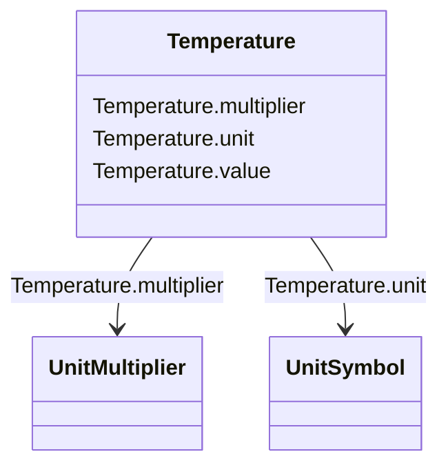

# Temperature

_Value of temperature in degrees Celsius._

**URI**: [cim:Temperature](http://iec.ch/TC57/CIM100#Temperature) 
**Type**: Class

<!-- no inheritance hierarchy -->

## Attributes

| Name | URI | Cardinality and Range | Description | Inheritance |
| ---  | --- | --- | --- | --- |
| multiplier | [cim:Temperature.multiplier](http://iec.ch/TC57/CIM100#Temperature.multiplier) | 0..1    [UnitMultiplier](UnitMultiplier.md)  |  | direct |
| unit | [cim:Temperature.unit](http://iec.ch/TC57/CIM100#Temperature.unit) | 0..1    [UnitSymbol](UnitSymbol.md)  |  | direct |
| value | [cim:Temperature.value](http://iec.ch/TC57/CIM100#Temperature.value) | 0..1    float  |  | direct |

## Usages

| used by | used in | type | used |
| ---  | --- | --- | --- |
| [GovGAST2](GovGAST2.md) | tr | range | [Temperature](Temperature.md) |
| [GovGAST2](GovGAST2.md) | tc | range | [Temperature](Temperature.md) |
| [GovGAST3](GovGAST3.md) | dtc | range | [Temperature](Temperature.md) |
| [GovGAST3](GovGAST3.md) | tfen | range | [Temperature](Temperature.md) |
| [GovGAST3](GovGAST3.md) | tt | range | [Temperature](Temperature.md) |
| [GovGASTWD](GovGASTWD.md) | tr | range | [Temperature](Temperature.md) |
| [GovGASTWD](GovGASTWD.md) | tc | range | [Temperature](Temperature.md) |

## Identifier and Mapping Information

### Schema Source

* from schema: http://iec.ch/TC57/ns/CIM/Dynamics-EU#Package_DynamicsProfile

## Mappings

| Mapping Type | Mapped Value |
| ---  | ---  |
| self | cim:Temperature |
| native | this:Temperature |

