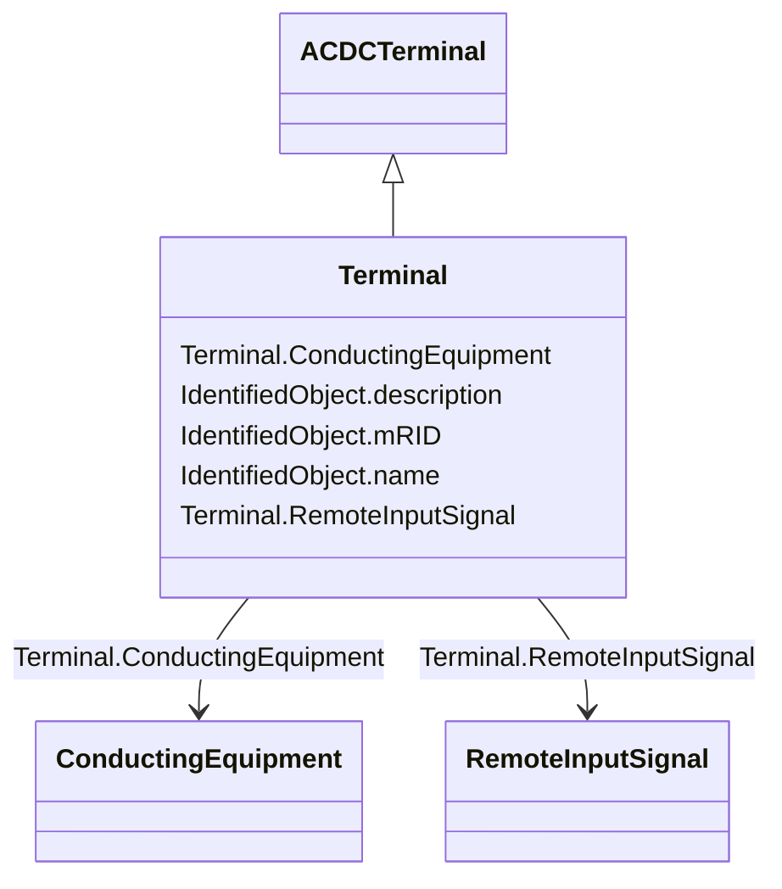

# Terminal

_An AC electrical connection point to a piece of conducting equipment. Terminals are connected at physical connection points called connectivity nodes._

**URI**: [cim:Terminal](http://iec.ch/TC57/CIM100#Terminal) 
**Type**: Class

## Inheritance
* [IdentifiedObject](IdentifiedObject.md)
    * [ACDCTerminal](ACDCTerminal.md)
        * **Terminal**

## Attributes

| Name | URI | Cardinality and Range | Description | Inheritance |
| ---  | --- | --- | --- | --- |
| ConductingEquipment | [cim:Terminal.ConductingEquipment](http://iec.ch/TC57/CIM100#Terminal.ConductingEquipment) | 1    [ConductingEquipment](ConductingEquipment.md)  | The conducting equipment of the terminal | direct |
| RemoteInputSignal | [cim:Terminal.RemoteInputSignal](http://iec.ch/TC57/CIM100#Terminal.RemoteInputSignal) | *    [RemoteInputSignal](RemoteInputSignal.md)  | Input signal coming from this terminal | direct |
| description | [cim:IdentifiedObject.description](http://iec.ch/TC57/CIM100#IdentifiedObject.description) | 0..1    string  | The description is a free human readable text describing or naming the object | [IdentifiedObject](IdentifiedObject.md) |
| mRID | [cim:IdentifiedObject.mRID](http://iec.ch/TC57/CIM100#IdentifiedObject.mRID) | 1    string  | Master resource identifier issued by a model authority | [IdentifiedObject](IdentifiedObject.md) |
| name | [cim:IdentifiedObject.name](http://iec.ch/TC57/CIM100#IdentifiedObject.name) | 0..1    string  | The name is any free human readable and possibly non unique text naming the o... | [IdentifiedObject](IdentifiedObject.md) |

## Usages

| used by | used in | type | used |
| ---  | --- | --- | --- |
| [ConductingEquipment](ConductingEquipment.md) | Terminals | range | [Terminal](Terminal.md) |
| [AsynchronousMachine](AsynchronousMachine.md) | Terminals | range | [Terminal](Terminal.md) |
| [EnergyConnection](EnergyConnection.md) | Terminals | range | [Terminal](Terminal.md) |
| [EnergyConsumer](EnergyConsumer.md) | Terminals | range | [Terminal](Terminal.md) |
| [PowerElectronicsConnection](PowerElectronicsConnection.md) | Terminals | range | [Terminal](Terminal.md) |
| [RegulatingCondEq](RegulatingCondEq.md) | Terminals | range | [Terminal](Terminal.md) |
| [RotatingMachine](RotatingMachine.md) | Terminals | range | [Terminal](Terminal.md) |
| [StaticVarCompensator](StaticVarCompensator.md) | Terminals | range | [Terminal](Terminal.md) |
| [SynchronousMachine](SynchronousMachine.md) | Terminals | range | [Terminal](Terminal.md) |
| [ACDCConverter](ACDCConverter.md) | Terminals | range | [Terminal](Terminal.md) |
| [CsConverter](CsConverter.md) | Terminals | range | [Terminal](Terminal.md) |
| [VsConverter](VsConverter.md) | Terminals | range | [Terminal](Terminal.md) |
| [RemoteInputSignal](RemoteInputSignal.md) | Terminal | range | [Terminal](Terminal.md) |

## Identifier and Mapping Information

### Schema Source

* from schema: http://iec.ch/TC57/ns/CIM/Dynamics-EU#Package_DynamicsProfile

## Mappings

| Mapping Type | Mapped Value |
| ---  | ---  |
| self | cim:Terminal |
| native | this:Terminal |

