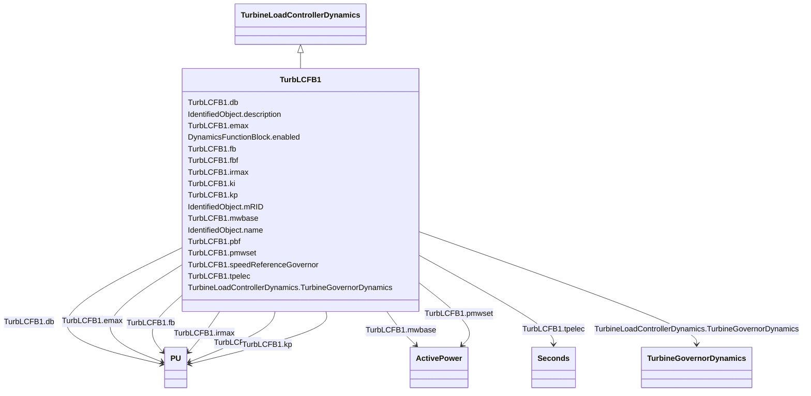

# TurbLCFB1

_Turbine load controller model developed by WECC.  This model represents a supervisory turbine load controller that acts to maintain turbine power at a set value by continuous adjustment of the turbine governor speed-load reference. This model is intended to represent slow reset 'outer loop' controllers managing the action of the turbine governor._

**URI**: [cim:TurbLCFB1](http://iec.ch/TC57/CIM100#TurbLCFB1) 
**Type**: Class

## Inheritance
* [IdentifiedObject](IdentifiedObject.md)
    * [DynamicsFunctionBlock](DynamicsFunctionBlock.md)
        * [TurbineLoadControllerDynamics](TurbineLoadControllerDynamics.md)
            * **TurbLCFB1**

## Attributes

| Name | URI | Cardinality and Range | Description | Inheritance |
| ---  | --- | --- | --- | --- |
| mwbase | [cim:TurbLCFB1.mwbase](http://iec.ch/TC57/CIM100#TurbLCFB1.mwbase) | 1    [ActivePower](ActivePower.md)  | Base for power values (<i>MWbase</i>) (&gt; 0) | direct |
| speedReferenceGovernor | [cim:TurbLCFB1.speedReferenceGovernor](http://iec.ch/TC57/CIM100#TurbLCFB1.speedReferenceGovernor) | 1    boolean  | Type of turbine governor reference (<i>Type</i>) | direct |
| db | [cim:TurbLCFB1.db](http://iec.ch/TC57/CIM100#TurbLCFB1.db) | 1    [PU](PU.md)  | Controller deadband (<i>db</i>) | direct |
| emax | [cim:TurbLCFB1.emax](http://iec.ch/TC57/CIM100#TurbLCFB1.emax) | 1    [PU](PU.md)  | Maximum control error (<i>Emax</i>) (see parameter detail 4) | direct |
| fb | [cim:TurbLCFB1.fb](http://iec.ch/TC57/CIM100#TurbLCFB1.fb) | 1    [PU](PU.md)  | Frequency bias gain (<i>Fb</i>) | direct |
| kp | [cim:TurbLCFB1.kp](http://iec.ch/TC57/CIM100#TurbLCFB1.kp) | 1    [PU](PU.md)  | Proportional gain (<i>Kp</i>) | direct |
| ki | [cim:TurbLCFB1.ki](http://iec.ch/TC57/CIM100#TurbLCFB1.ki) | 1    [PU](PU.md)  | Integral gain (<i>Ki</i>) | direct |
| fbf | [cim:TurbLCFB1.fbf](http://iec.ch/TC57/CIM100#TurbLCFB1.fbf) | 1    boolean  | Frequency bias flag (<i>Fbf</i>) | direct |
| pbf | [cim:TurbLCFB1.pbf](http://iec.ch/TC57/CIM100#TurbLCFB1.pbf) | 1    boolean  | Power controller flag (<i>Pbf</i>) | direct |
| tpelec | [cim:TurbLCFB1.tpelec](http://iec.ch/TC57/CIM100#TurbLCFB1.tpelec) | 1    [Seconds](Seconds.md)  | Power transducer time constant (<i>Tpelec</i>) (&gt;= 0) | direct |
| irmax | [cim:TurbLCFB1.irmax](http://iec.ch/TC57/CIM100#TurbLCFB1.irmax) | 1    [PU](PU.md)  | Maximum turbine speed/load reference bias (<i>Irmax</i>) (see parameter detai... | direct |
| pmwset | [cim:TurbLCFB1.pmwset](http://iec.ch/TC57/CIM100#TurbLCFB1.pmwset) | 1    [ActivePower](ActivePower.md)  | Power controller setpoint (<i>Pmwset</i>) (see parameter detail 1) | direct |
| TurbineGovernorDynamics | [cim:TurbineLoadControllerDynamics.TurbineGovernorDynamics](http://iec.ch/TC57/CIM100#TurbineLoadControllerDynamics.TurbineGovernorDynamics) | 1    [TurbineGovernorDynamics](TurbineGovernorDynamics.md)  | Turbine-governor controlled by this turbine load controller | [TurbineLoadControllerDynamics](TurbineLoadControllerDynamics.md) |
| enabled | [cim:DynamicsFunctionBlock.enabled](http://iec.ch/TC57/CIM100#DynamicsFunctionBlock.enabled) | 1    boolean  | Function block used indicator | [DynamicsFunctionBlock](DynamicsFunctionBlock.md) |
| description | [cim:IdentifiedObject.description](http://iec.ch/TC57/CIM100#IdentifiedObject.description) | 0..1    string  | The description is a free human readable text describing or naming the object | [IdentifiedObject](IdentifiedObject.md) |
| mRID | [cim:IdentifiedObject.mRID](http://iec.ch/TC57/CIM100#IdentifiedObject.mRID) | 1    string  | Master resource identifier issued by a model authority | [IdentifiedObject](IdentifiedObject.md) |
| name | [cim:IdentifiedObject.name](http://iec.ch/TC57/CIM100#IdentifiedObject.name) | 0..1    string  | The name is any free human readable and possibly non unique text naming the o... | [IdentifiedObject](IdentifiedObject.md) |

## Identifier and Mapping Information

### Schema Source

* from schema: http://iec.ch/TC57/ns/CIM/Dynamics-EU#Package_DynamicsProfile

## Mappings

| Mapping Type | Mapped Value |
| ---  | ---  |
| self | cim:TurbLCFB1 |
| native | this:TurbLCFB1 |

