# TurbineGovernorDynamics

_Turbine-governor function block whose behaviour is described by reference to a standard model or by definition of a user-defined model._

**URI**: [cim:TurbineGovernorDynamics](http://iec.ch/TC57/CIM100#TurbineGovernorDynamics) 
**Type**: Class

```mermaid
 classDiagram
    class TurbineGovernorDynamics
    click TurbineGovernorDynamics href "../TurbineGovernorDynamics"
      DynamicsFunctionBlock <|-- TurbineGovernorDynamics
        click DynamicsFunctionBlock href "../DynamicsFunctionBlock"
      

      TurbineGovernorDynamics <|-- TurbineGovernorUserDefined
        click TurbineGovernorUserDefined href "../TurbineGovernorUserDefined"
      TurbineGovernorDynamics <|-- GovHydroIEEE0
        click GovHydroIEEE0 href "../GovHydroIEEE0"
      TurbineGovernorDynamics <|-- GovHydroIEEE2
        click GovHydroIEEE2 href "../GovHydroIEEE2"
      TurbineGovernorDynamics <|-- GovSteamIEEE1
        click GovSteamIEEE1 href "../GovSteamIEEE1"
      TurbineGovernorDynamics <|-- GovCT1
        click GovCT1 href "../GovCT1"
      TurbineGovernorDynamics <|-- GovCT2
        click GovCT2 href "../GovCT2"
      TurbineGovernorDynamics <|-- GovGAST
        click GovGAST href "../GovGAST"
      TurbineGovernorDynamics <|-- GovGAST1
        click GovGAST1 href "../GovGAST1"
      TurbineGovernorDynamics <|-- GovGAST2
        click GovGAST2 href "../GovGAST2"
      TurbineGovernorDynamics <|-- GovGAST3
        click GovGAST3 href "../GovGAST3"
      TurbineGovernorDynamics <|-- GovGAST4
        click GovGAST4 href "../GovGAST4"
      TurbineGovernorDynamics <|-- GovGASTWD
        click GovGASTWD href "../GovGASTWD"
      TurbineGovernorDynamics <|-- GovHydro1
        click GovHydro1 href "../GovHydro1"
      TurbineGovernorDynamics <|-- GovHydro2
        click GovHydro2 href "../GovHydro2"
      TurbineGovernorDynamics <|-- GovHydro3
        click GovHydro3 href "../GovHydro3"
      TurbineGovernorDynamics <|-- GovHydro4
        click GovHydro4 href "../GovHydro4"
      TurbineGovernorDynamics <|-- GovHydroDD
        click GovHydroDD href "../GovHydroDD"
      TurbineGovernorDynamics <|-- GovHydroFrancis
        click GovHydroFrancis href "../GovHydroFrancis"
      TurbineGovernorDynamics <|-- GovHydroPelton
        click GovHydroPelton href "../GovHydroPelton"
      TurbineGovernorDynamics <|-- GovHydroPID
        click GovHydroPID href "../GovHydroPID"
      TurbineGovernorDynamics <|-- GovHydroPID2
        click GovHydroPID2 href "../GovHydroPID2"
      TurbineGovernorDynamics <|-- GovHydroR
        click GovHydroR href "../GovHydroR"
      TurbineGovernorDynamics <|-- GovHydroWEH
        click GovHydroWEH href "../GovHydroWEH"
      TurbineGovernorDynamics <|-- GovHydroWPID
        click GovHydroWPID href "../GovHydroWPID"
      TurbineGovernorDynamics <|-- GovSteam0
        click GovSteam0 href "../GovSteam0"
      TurbineGovernorDynamics <|-- GovSteam1
        click GovSteam1 href "../GovSteam1"
      TurbineGovernorDynamics <|-- GovSteam2
        click GovSteam2 href "../GovSteam2"
      TurbineGovernorDynamics <|-- GovSteamBB
        click GovSteamBB href "../GovSteamBB"
      TurbineGovernorDynamics <|-- GovSteamEU
        click GovSteamEU href "../GovSteamEU"
      TurbineGovernorDynamics <|-- GovSteamFV2
        click GovSteamFV2 href "../GovSteamFV2"
      TurbineGovernorDynamics <|-- GovSteamFV3
        click GovSteamFV3 href "../GovSteamFV3"
      TurbineGovernorDynamics <|-- GovSteamFV4
        click GovSteamFV4 href "../GovSteamFV4"
      TurbineGovernorDynamics <|-- GovSteamSGO
        click GovSteamSGO href "../GovSteamSGO"
      
      
      TurbineGovernorDynamics : TurbineGovernorDynamics.AsynchronousMachineDynamics
        
          TurbineGovernorDynamics --> AsynchronousMachineDynamics : TurbineGovernorDynamics.AsynchronousMachineDynamics
          click AsynchronousMachineDynamics href "../AsynchronousMachineDynamics"
        
      TurbineGovernorDynamics : IdentifiedObject.description
        
      TurbineGovernorDynamics : DynamicsFunctionBlock.enabled
        
      TurbineGovernorDynamics : IdentifiedObject.mRID
        
      TurbineGovernorDynamics : IdentifiedObject.name
        
      TurbineGovernorDynamics : TurbineGovernorDynamics.SynchronousMachineDynamics
        
          TurbineGovernorDynamics --> SynchronousMachineDynamics : TurbineGovernorDynamics.SynchronousMachineDynamics
          click SynchronousMachineDynamics href "../SynchronousMachineDynamics"
        
      TurbineGovernorDynamics : TurbineGovernorDynamics.TurbineLoadControllerDynamics
        
          TurbineGovernorDynamics --> TurbineLoadControllerDynamics : TurbineGovernorDynamics.TurbineLoadControllerDynamics
          click TurbineLoadControllerDynamics href "../TurbineLoadControllerDynamics"
        
      
```

## Inheritance
* [IdentifiedObject](IdentifiedObject.md)
    * [DynamicsFunctionBlock](DynamicsFunctionBlock.md)
        * **TurbineGovernorDynamics**
            * [TurbineGovernorUserDefined](TurbineGovernorUserDefined.md)
            * [GovHydroIEEE0](GovHydroIEEE0.md)
            * [GovHydroIEEE2](GovHydroIEEE2.md)
            * [GovSteamIEEE1](GovSteamIEEE1.md)
            * [GovCT1](GovCT1.md)
            * [GovCT2](GovCT2.md)
            * [GovGAST](GovGAST.md)
            * [GovGAST1](GovGAST1.md)
            * [GovGAST2](GovGAST2.md)
            * [GovGAST3](GovGAST3.md)
            * [GovGAST4](GovGAST4.md)
            * [GovGASTWD](GovGASTWD.md)
            * [GovHydro1](GovHydro1.md)
            * [GovHydro2](GovHydro2.md)
            * [GovHydro3](GovHydro3.md)
            * [GovHydro4](GovHydro4.md)
            * [GovHydroDD](GovHydroDD.md)
            * [GovHydroFrancis](GovHydroFrancis.md)
            * [GovHydroPelton](GovHydroPelton.md)
            * [GovHydroPID](GovHydroPID.md)
            * [GovHydroPID2](GovHydroPID2.md)
            * [GovHydroR](GovHydroR.md)
            * [GovHydroWEH](GovHydroWEH.md)
            * [GovHydroWPID](GovHydroWPID.md)
            * [GovSteam0](GovSteam0.md)
            * [GovSteam1](GovSteam1.md)
            * [GovSteam2](GovSteam2.md)
            * [GovSteamBB](GovSteamBB.md)
            * [GovSteamEU](GovSteamEU.md)
            * [GovSteamFV2](GovSteamFV2.md)
            * [GovSteamFV3](GovSteamFV3.md)
            * [GovSteamFV4](GovSteamFV4.md)
            * [GovSteamSGO](GovSteamSGO.md)

## Attributes

| Name | URI | Cardinality and Range | Description | Inheritance |
| ---  | --- | --- | --- | --- |
| SynchronousMachineDynamics | [cim:TurbineGovernorDynamics.SynchronousMachineDynamics](http://iec.ch/TC57/CIM100#TurbineGovernorDynamics.SynchronousMachineDynamics) | 0..1    [SynchronousMachineDynamics](SynchronousMachineDynamics.md)  | Synchronous machine model with which this turbine-governor model is associate... | direct |
| AsynchronousMachineDynamics | [cim:TurbineGovernorDynamics.AsynchronousMachineDynamics](http://iec.ch/TC57/CIM100#TurbineGovernorDynamics.AsynchronousMachineDynamics) | 0..1    [AsynchronousMachineDynamics](AsynchronousMachineDynamics.md)  | Asynchronous machine model with which this turbine-governor model is associat... | direct |
| TurbineLoadControllerDynamics | [cim:TurbineGovernorDynamics.TurbineLoadControllerDynamics](http://iec.ch/TC57/CIM100#TurbineGovernorDynamics.TurbineLoadControllerDynamics) | 0..1    [TurbineLoadControllerDynamics](TurbineLoadControllerDynamics.md)  | Turbine load controller providing input to this turbine-governor | direct |
| enabled | [cim:DynamicsFunctionBlock.enabled](http://iec.ch/TC57/CIM100#DynamicsFunctionBlock.enabled) | 1    boolean  | Function block used indicator | [DynamicsFunctionBlock](DynamicsFunctionBlock.md) |
| description | [cim:IdentifiedObject.description](http://iec.ch/TC57/CIM100#IdentifiedObject.description) | 0..1    string  | The description is a free human readable text describing or naming the object | [IdentifiedObject](IdentifiedObject.md) |
| mRID | [cim:IdentifiedObject.mRID](http://iec.ch/TC57/CIM100#IdentifiedObject.mRID) | 1    string  | Master resource identifier issued by a model authority | [IdentifiedObject](IdentifiedObject.md) |
| name | [cim:IdentifiedObject.name](http://iec.ch/TC57/CIM100#IdentifiedObject.name) | 0..1    string  | The name is any free human readable and possibly non unique text naming the o... | [IdentifiedObject](IdentifiedObject.md) |

## Usages

| used by | used in | type | used |
| ---  | --- | --- | --- |
| [SynchronousMachineUserDefined](SynchronousMachineUserDefined.md) | TurbineGovernorDynamics | range | [TurbineGovernorDynamics](TurbineGovernorDynamics.md) |
| [AsynchronousMachineUserDefined](AsynchronousMachineUserDefined.md) | TurbineGovernorDynamics | range | [TurbineGovernorDynamics](TurbineGovernorDynamics.md) |
| [TurbineLoadControllerUserDefined](TurbineLoadControllerUserDefined.md) | TurbineGovernorDynamics | range | [TurbineGovernorDynamics](TurbineGovernorDynamics.md) |
| [SynchronousMachineSimplified](SynchronousMachineSimplified.md) | TurbineGovernorDynamics | range | [TurbineGovernorDynamics](TurbineGovernorDynamics.md) |
| [SynchronousMachineDynamics](SynchronousMachineDynamics.md) | TurbineGovernorDynamics | range | [TurbineGovernorDynamics](TurbineGovernorDynamics.md) |
| [SynchronousMachineDetailed](SynchronousMachineDetailed.md) | TurbineGovernorDynamics | range | [TurbineGovernorDynamics](TurbineGovernorDynamics.md) |
| [SynchronousMachineTimeConstantReactance](SynchronousMachineTimeConstantReactance.md) | TurbineGovernorDynamics | range | [TurbineGovernorDynamics](TurbineGovernorDynamics.md) |
| [SynchronousMachineEquivalentCircuit](SynchronousMachineEquivalentCircuit.md) | TurbineGovernorDynamics | range | [TurbineGovernorDynamics](TurbineGovernorDynamics.md) |
| [AsynchronousMachineDynamics](AsynchronousMachineDynamics.md) | TurbineGovernorDynamics | range | [TurbineGovernorDynamics](TurbineGovernorDynamics.md) |
| [AsynchronousMachineTimeConstantReactance](AsynchronousMachineTimeConstantReactance.md) | TurbineGovernorDynamics | range | [TurbineGovernorDynamics](TurbineGovernorDynamics.md) |
| [AsynchronousMachineEquivalentCircuit](AsynchronousMachineEquivalentCircuit.md) | TurbineGovernorDynamics | range | [TurbineGovernorDynamics](TurbineGovernorDynamics.md) |
| [TurbineLoadControllerDynamics](TurbineLoadControllerDynamics.md) | TurbineGovernorDynamics | range | [TurbineGovernorDynamics](TurbineGovernorDynamics.md) |
| [TurbLCFB1](TurbLCFB1.md) | TurbineGovernorDynamics | range | [TurbineGovernorDynamics](TurbineGovernorDynamics.md) |

## Identifier and Mapping Information

### Schema Source

* from schema: http://iec.ch/TC57/ns/CIM/Dynamics-EU#Package_DynamicsProfile

## Mappings

| Mapping Type | Mapped Value |
| ---  | ---  |
| self | cim:TurbineGovernorDynamics |
| native | this:TurbineGovernorDynamics |

