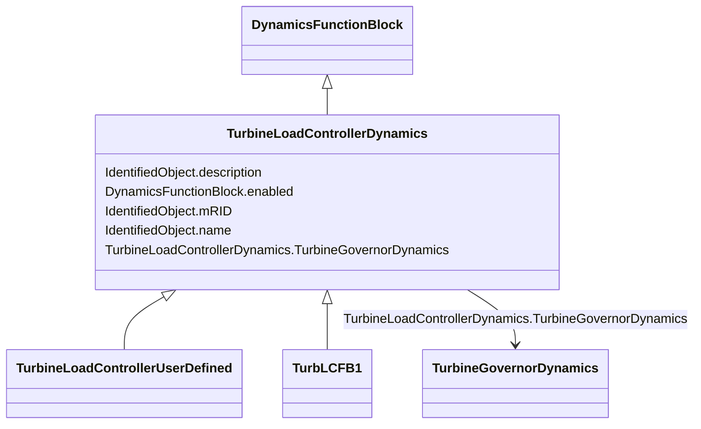

# TurbineLoadControllerDynamics

_Turbine load controller function block whose behaviour is described by reference to a standard model or by definition of a user-defined model._

**URI**: [cim:TurbineLoadControllerDynamics](http://iec.ch/TC57/CIM100#TurbineLoadControllerDynamics) 
**Type**: Class

## Inheritance
* [IdentifiedObject](IdentifiedObject.md)
    * [DynamicsFunctionBlock](DynamicsFunctionBlock.md)
        * **TurbineLoadControllerDynamics**
            * [TurbineLoadControllerUserDefined](TurbineLoadControllerUserDefined.md)
            * [TurbLCFB1](TurbLCFB1.md)

## Attributes

| Name | URI | Cardinality and Range | Description | Inheritance |
| ---  | --- | --- | --- | --- |
| TurbineGovernorDynamics | [cim:TurbineLoadControllerDynamics.TurbineGovernorDynamics](http://iec.ch/TC57/CIM100#TurbineLoadControllerDynamics.TurbineGovernorDynamics) | 1    [TurbineGovernorDynamics](TurbineGovernorDynamics.md)  | Turbine-governor controlled by this turbine load controller | direct |
| enabled | [cim:DynamicsFunctionBlock.enabled](http://iec.ch/TC57/CIM100#DynamicsFunctionBlock.enabled) | 1    boolean  | Function block used indicator | [DynamicsFunctionBlock](DynamicsFunctionBlock.md) |
| description | [cim:IdentifiedObject.description](http://iec.ch/TC57/CIM100#IdentifiedObject.description) | 0..1    string  | The description is a free human readable text describing or naming the object | [IdentifiedObject](IdentifiedObject.md) |
| mRID | [cim:IdentifiedObject.mRID](http://iec.ch/TC57/CIM100#IdentifiedObject.mRID) | 1    string  | Master resource identifier issued by a model authority | [IdentifiedObject](IdentifiedObject.md) |
| name | [cim:IdentifiedObject.name](http://iec.ch/TC57/CIM100#IdentifiedObject.name) | 0..1    string  | The name is any free human readable and possibly non unique text naming the o... | [IdentifiedObject](IdentifiedObject.md) |

## Usages

| used by | used in | type | used |
| ---  | --- | --- | --- |
| [TurbineGovernorUserDefined](TurbineGovernorUserDefined.md) | TurbineLoadControllerDynamics | range | [TurbineLoadControllerDynamics](TurbineLoadControllerDynamics.md) |
| [TurbineGovernorDynamics](TurbineGovernorDynamics.md) | TurbineLoadControllerDynamics | range | [TurbineLoadControllerDynamics](TurbineLoadControllerDynamics.md) |
| [GovHydroIEEE0](GovHydroIEEE0.md) | TurbineLoadControllerDynamics | range | [TurbineLoadControllerDynamics](TurbineLoadControllerDynamics.md) |
| [GovHydroIEEE2](GovHydroIEEE2.md) | TurbineLoadControllerDynamics | range | [TurbineLoadControllerDynamics](TurbineLoadControllerDynamics.md) |
| [GovSteamIEEE1](GovSteamIEEE1.md) | TurbineLoadControllerDynamics | range | [TurbineLoadControllerDynamics](TurbineLoadControllerDynamics.md) |
| [GovCT1](GovCT1.md) | TurbineLoadControllerDynamics | range | [TurbineLoadControllerDynamics](TurbineLoadControllerDynamics.md) |
| [GovCT2](GovCT2.md) | TurbineLoadControllerDynamics | range | [TurbineLoadControllerDynamics](TurbineLoadControllerDynamics.md) |
| [GovGAST](GovGAST.md) | TurbineLoadControllerDynamics | range | [TurbineLoadControllerDynamics](TurbineLoadControllerDynamics.md) |
| [GovGAST1](GovGAST1.md) | TurbineLoadControllerDynamics | range | [TurbineLoadControllerDynamics](TurbineLoadControllerDynamics.md) |
| [GovGAST2](GovGAST2.md) | TurbineLoadControllerDynamics | range | [TurbineLoadControllerDynamics](TurbineLoadControllerDynamics.md) |
| [GovGAST3](GovGAST3.md) | TurbineLoadControllerDynamics | range | [TurbineLoadControllerDynamics](TurbineLoadControllerDynamics.md) |
| [GovGAST4](GovGAST4.md) | TurbineLoadControllerDynamics | range | [TurbineLoadControllerDynamics](TurbineLoadControllerDynamics.md) |
| [GovGASTWD](GovGASTWD.md) | TurbineLoadControllerDynamics | range | [TurbineLoadControllerDynamics](TurbineLoadControllerDynamics.md) |
| [GovHydro1](GovHydro1.md) | TurbineLoadControllerDynamics | range | [TurbineLoadControllerDynamics](TurbineLoadControllerDynamics.md) |
| [GovHydro2](GovHydro2.md) | TurbineLoadControllerDynamics | range | [TurbineLoadControllerDynamics](TurbineLoadControllerDynamics.md) |
| [GovHydro3](GovHydro3.md) | TurbineLoadControllerDynamics | range | [TurbineLoadControllerDynamics](TurbineLoadControllerDynamics.md) |
| [GovHydro4](GovHydro4.md) | TurbineLoadControllerDynamics | range | [TurbineLoadControllerDynamics](TurbineLoadControllerDynamics.md) |
| [GovHydroDD](GovHydroDD.md) | TurbineLoadControllerDynamics | range | [TurbineLoadControllerDynamics](TurbineLoadControllerDynamics.md) |
| [GovHydroFrancis](GovHydroFrancis.md) | TurbineLoadControllerDynamics | range | [TurbineLoadControllerDynamics](TurbineLoadControllerDynamics.md) |
| [GovHydroPelton](GovHydroPelton.md) | TurbineLoadControllerDynamics | range | [TurbineLoadControllerDynamics](TurbineLoadControllerDynamics.md) |
| [GovHydroPID](GovHydroPID.md) | TurbineLoadControllerDynamics | range | [TurbineLoadControllerDynamics](TurbineLoadControllerDynamics.md) |
| [GovHydroPID2](GovHydroPID2.md) | TurbineLoadControllerDynamics | range | [TurbineLoadControllerDynamics](TurbineLoadControllerDynamics.md) |
| [GovHydroR](GovHydroR.md) | TurbineLoadControllerDynamics | range | [TurbineLoadControllerDynamics](TurbineLoadControllerDynamics.md) |
| [GovHydroWEH](GovHydroWEH.md) | TurbineLoadControllerDynamics | range | [TurbineLoadControllerDynamics](TurbineLoadControllerDynamics.md) |
| [GovHydroWPID](GovHydroWPID.md) | TurbineLoadControllerDynamics | range | [TurbineLoadControllerDynamics](TurbineLoadControllerDynamics.md) |
| [GovSteam0](GovSteam0.md) | TurbineLoadControllerDynamics | range | [TurbineLoadControllerDynamics](TurbineLoadControllerDynamics.md) |
| [GovSteam1](GovSteam1.md) | TurbineLoadControllerDynamics | range | [TurbineLoadControllerDynamics](TurbineLoadControllerDynamics.md) |
| [GovSteam2](GovSteam2.md) | TurbineLoadControllerDynamics | range | [TurbineLoadControllerDynamics](TurbineLoadControllerDynamics.md) |
| [GovSteamBB](GovSteamBB.md) | TurbineLoadControllerDynamics | range | [TurbineLoadControllerDynamics](TurbineLoadControllerDynamics.md) |
| [GovSteamEU](GovSteamEU.md) | TurbineLoadControllerDynamics | range | [TurbineLoadControllerDynamics](TurbineLoadControllerDynamics.md) |
| [GovSteamFV2](GovSteamFV2.md) | TurbineLoadControllerDynamics | range | [TurbineLoadControllerDynamics](TurbineLoadControllerDynamics.md) |
| [GovSteamFV3](GovSteamFV3.md) | TurbineLoadControllerDynamics | range | [TurbineLoadControllerDynamics](TurbineLoadControllerDynamics.md) |
| [GovSteamFV4](GovSteamFV4.md) | TurbineLoadControllerDynamics | range | [TurbineLoadControllerDynamics](TurbineLoadControllerDynamics.md) |
| [GovSteamSGO](GovSteamSGO.md) | TurbineLoadControllerDynamics | range | [TurbineLoadControllerDynamics](TurbineLoadControllerDynamics.md) |

## Identifier and Mapping Information

### Schema Source

* from schema: http://iec.ch/TC57/ns/CIM/Dynamics-EU#Package_DynamicsProfile

## Mappings

| Mapping Type | Mapped Value |
| ---  | ---  |
| self | cim:TurbineLoadControllerDynamics |
| native | this:TurbineLoadControllerDynamics |

