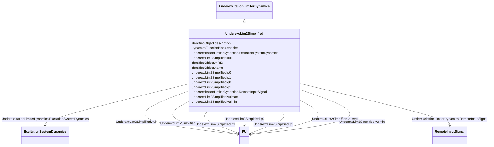

# UnderexcLim2Simplified

_Simplified type UEL2 underexcitation limiter.  This model can be derived from UnderexcLimIEEE2.  The limit characteristic (look –up table) is a single straight-line, the same as UnderexcLimIEEE2 (see Figure 10.4 (p 32), IEEE 421.5-2005 Section 10.2)._

**URI**: [cim:UnderexcLim2Simplified](http://iec.ch/TC57/CIM100#UnderexcLim2Simplified) 
**Type**: Class

## Inheritance
* [IdentifiedObject](IdentifiedObject.md)
    * [DynamicsFunctionBlock](DynamicsFunctionBlock.md)
        * [UnderexcitationLimiterDynamics](UnderexcitationLimiterDynamics.md)
            * **UnderexcLim2Simplified**

## Attributes

| Name | URI | Cardinality and Range | Description | Inheritance |
| ---  | --- | --- | --- | --- |
| q0 | [cim:UnderexcLim2Simplified.q0](http://iec.ch/TC57/CIM100#UnderexcLim2Simplified.q0) | 1..1    [PU](PU.md)  | Segment Q initial point (<i>Q</i><i>0</i>) | direct |
| q1 | [cim:UnderexcLim2Simplified.q1](http://iec.ch/TC57/CIM100#UnderexcLim2Simplified.q1) | 1..1    [PU](PU.md)  | Segment Q end point (<i>Q</i><i>1</i>) | direct |
| p0 | [cim:UnderexcLim2Simplified.p0](http://iec.ch/TC57/CIM100#UnderexcLim2Simplified.p0) | 1..1    [PU](PU.md)  | Segment P initial point (<i>P</i><i>0</i>) | direct |
| p1 | [cim:UnderexcLim2Simplified.p1](http://iec.ch/TC57/CIM100#UnderexcLim2Simplified.p1) | 1..1    [PU](PU.md)  | Segment P end point (<i>P</i><i>1</i>) | direct |
| kui | [cim:UnderexcLim2Simplified.kui](http://iec.ch/TC57/CIM100#UnderexcLim2Simplified.kui) | 1..1    [PU](PU.md)  | Gain Under excitation limiter (<i>K</i><i>UI</i>) | direct |
| vuimin | [cim:UnderexcLim2Simplified.vuimin](http://iec.ch/TC57/CIM100#UnderexcLim2Simplified.vuimin) | 1..1    [PU](PU.md)  | Minimum error signal (<i>V</i><i>UIMIN</i>) (&lt; UnderexcLim2Simp... | direct |
| vuimax | [cim:UnderexcLim2Simplified.vuimax](http://iec.ch/TC57/CIM100#UnderexcLim2Simplified.vuimax) | 1..1    [PU](PU.md)  | Maximum error signal (<i>V</i><i>UIMAX</i>) (&gt; UnderexcLim2Simp... | direct |
| RemoteInputSignal | [cim:UnderexcitationLimiterDynamics.RemoteInputSignal](http://iec.ch/TC57/CIM100#UnderexcitationLimiterDynamics.RemoteInputSignal) | 0..1    [RemoteInputSignal](RemoteInputSignal.md)  | Remote input signal used by this underexcitation limiter model | [UnderexcitationLimiterDynamics](UnderexcitationLimiterDynamics.md) |
| ExcitationSystemDynamics | [cim:UnderexcitationLimiterDynamics.ExcitationSystemDynamics](http://iec.ch/TC57/CIM100#UnderexcitationLimiterDynamics.ExcitationSystemDynamics) | 1..1    [ExcitationSystemDynamics](ExcitationSystemDynamics.md)  | Excitation system model with which this underexcitation limiter model is asso... | [UnderexcitationLimiterDynamics](UnderexcitationLimiterDynamics.md) |
| enabled | [cim:DynamicsFunctionBlock.enabled](http://iec.ch/TC57/CIM100#DynamicsFunctionBlock.enabled) | 1..1    boolean  | Function block used indicator | [DynamicsFunctionBlock](DynamicsFunctionBlock.md) |
| description | [cim:IdentifiedObject.description](http://iec.ch/TC57/CIM100#IdentifiedObject.description) | 0..1    string  | The description is a free human readable text describing or naming the object | [IdentifiedObject](IdentifiedObject.md) |
| mRID | [cim:IdentifiedObject.mRID](http://iec.ch/TC57/CIM100#IdentifiedObject.mRID) | 1..1    string  | Master resource identifier issued by a model authority | [IdentifiedObject](IdentifiedObject.md) |
| name | [cim:IdentifiedObject.name](http://iec.ch/TC57/CIM100#IdentifiedObject.name) | 0..1    string  | The name is any free human readable and possibly non unique text naming the o... | [IdentifiedObject](IdentifiedObject.md) |

## Identifier and Mapping Information

### Schema Source

* from schema: http://iec.ch/TC57/ns/CIM/Dynamics-EU#Package_DynamicsProfile

## Mappings

| Mapping Type | Mapped Value |
| ---  | ---  |
| self | cim:UnderexcLim2Simplified |
| native | this:UnderexcLim2Simplified |

