# UnderexcLimIEEE1

_Type UEL1 model which has a circular limit boundary when plotted in terms of machine reactive power vs. real power output._

_Reference: IEEE UEL1 421.5-2005, 10.1._

**URI**: [cim:UnderexcLimIEEE1](http://iec.ch/TC57/CIM100#UnderexcLimIEEE1) 
**Type**: Class

```mermaid
 classDiagram
    class UnderexcLimIEEE1
      UnderexcitationLimiterDynamics <|-- UnderexcLimIEEE1
      
      UnderexcLimIEEE1 : IdentifiedObject.description
        
      UnderexcLimIEEE1 : DynamicsFunctionBlock.enabled
        
      UnderexcLimIEEE1 : UnderexcitationLimiterDynamics.ExcitationSystemDynamics
        
          UnderexcLimIEEE1 --> ExcitationSystemDynamics : UnderexcitationLimiterDynamics.ExcitationSystemDynamics
        
      UnderexcLimIEEE1 : UnderexcLimIEEE1.kuc
        
          UnderexcLimIEEE1 --> PU : UnderexcLimIEEE1.kuc
        
      UnderexcLimIEEE1 : UnderexcLimIEEE1.kuf
        
          UnderexcLimIEEE1 --> PU : UnderexcLimIEEE1.kuf
        
      UnderexcLimIEEE1 : UnderexcLimIEEE1.kui
        
          UnderexcLimIEEE1 --> PU : UnderexcLimIEEE1.kui
        
      UnderexcLimIEEE1 : UnderexcLimIEEE1.kul
        
          UnderexcLimIEEE1 --> PU : UnderexcLimIEEE1.kul
        
      UnderexcLimIEEE1 : UnderexcLimIEEE1.kur
        
          UnderexcLimIEEE1 --> PU : UnderexcLimIEEE1.kur
        
      UnderexcLimIEEE1 : IdentifiedObject.mRID
        
      UnderexcLimIEEE1 : IdentifiedObject.name
        
      UnderexcLimIEEE1 : UnderexcitationLimiterDynamics.RemoteInputSignal
        
          UnderexcLimIEEE1 --> RemoteInputSignal : UnderexcitationLimiterDynamics.RemoteInputSignal
        
      UnderexcLimIEEE1 : UnderexcLimIEEE1.tu1
        
          UnderexcLimIEEE1 --> Seconds : UnderexcLimIEEE1.tu1
        
      UnderexcLimIEEE1 : UnderexcLimIEEE1.tu2
        
          UnderexcLimIEEE1 --> Seconds : UnderexcLimIEEE1.tu2
        
      UnderexcLimIEEE1 : UnderexcLimIEEE1.tu3
        
          UnderexcLimIEEE1 --> Seconds : UnderexcLimIEEE1.tu3
        
      UnderexcLimIEEE1 : UnderexcLimIEEE1.tu4
        
          UnderexcLimIEEE1 --> Seconds : UnderexcLimIEEE1.tu4
        
      UnderexcLimIEEE1 : UnderexcLimIEEE1.vucmax
        
          UnderexcLimIEEE1 --> PU : UnderexcLimIEEE1.vucmax
        
      UnderexcLimIEEE1 : UnderexcLimIEEE1.vuimax
        
          UnderexcLimIEEE1 --> PU : UnderexcLimIEEE1.vuimax
        
      UnderexcLimIEEE1 : UnderexcLimIEEE1.vuimin
        
          UnderexcLimIEEE1 --> PU : UnderexcLimIEEE1.vuimin
        
      UnderexcLimIEEE1 : UnderexcLimIEEE1.vulmax
        
          UnderexcLimIEEE1 --> PU : UnderexcLimIEEE1.vulmax
        
      UnderexcLimIEEE1 : UnderexcLimIEEE1.vulmin
        
          UnderexcLimIEEE1 --> PU : UnderexcLimIEEE1.vulmin
        
      UnderexcLimIEEE1 : UnderexcLimIEEE1.vurmax
        
          UnderexcLimIEEE1 --> PU : UnderexcLimIEEE1.vurmax
        
      
```

## Inheritance
* [IdentifiedObject](IdentifiedObject.md)
    * [DynamicsFunctionBlock](DynamicsFunctionBlock.md)
        * [UnderexcitationLimiterDynamics](UnderexcitationLimiterDynamics.md)
            * **UnderexcLimIEEE1**

## Attributes

| Name | URI | Cardinality and Range | Description | Inheritance |
| ---  | --- | --- | --- | --- |
| kur | [cim:UnderexcLimIEEE1.kur](http://iec.ch/TC57/CIM100#UnderexcLimIEEE1.kur) | 1..1    [PU](PU.md)  | UEL radius setting (<i>K</i><i>UR</i>) | direct |
| kuc | [cim:UnderexcLimIEEE1.kuc](http://iec.ch/TC57/CIM100#UnderexcLimIEEE1.kuc) | 1..1    [PU](PU.md)  | UEL centre setting (<i>K</i><i>UC</i>) | direct |
| kuf | [cim:UnderexcLimIEEE1.kuf](http://iec.ch/TC57/CIM100#UnderexcLimIEEE1.kuf) | 1..1    [PU](PU.md)  | UEL excitation system stabilizer gain (<i>K</i><i>UF</i>) | direct |
| vurmax | [cim:UnderexcLimIEEE1.vurmax](http://iec.ch/TC57/CIM100#UnderexcLimIEEE1.vurmax) | 1..1    [PU](PU.md)  | UEL maximum limit for radius phasor magnitude (<i>V</i><i>URMAX</i... | direct |
| vucmax | [cim:UnderexcLimIEEE1.vucmax](http://iec.ch/TC57/CIM100#UnderexcLimIEEE1.vucmax) | 1..1    [PU](PU.md)  | UEL maximum limit for operating point phasor magnitude (<i>V</i><i>UCMAX... | direct |
| kui | [cim:UnderexcLimIEEE1.kui](http://iec.ch/TC57/CIM100#UnderexcLimIEEE1.kui) | 1..1    [PU](PU.md)  | UEL integral gain (<i>K</i><i>UI</i>) | direct |
| kul | [cim:UnderexcLimIEEE1.kul](http://iec.ch/TC57/CIM100#UnderexcLimIEEE1.kul) | 1..1    [PU](PU.md)  | UEL proportional gain (<i>K</i><i>UL</i>) | direct |
| vuimax | [cim:UnderexcLimIEEE1.vuimax](http://iec.ch/TC57/CIM100#UnderexcLimIEEE1.vuimax) | 1..1    [PU](PU.md)  | UEL integrator output maximum limit (<i>V</i><i>UIMAX</i>) (&gt; U... | direct |
| vuimin | [cim:UnderexcLimIEEE1.vuimin](http://iec.ch/TC57/CIM100#UnderexcLimIEEE1.vuimin) | 1..1    [PU](PU.md)  | UEL integrator output minimum limit (<i>V</i><i>UIMIN</i>) (&lt; U... | direct |
| tu1 | [cim:UnderexcLimIEEE1.tu1](http://iec.ch/TC57/CIM100#UnderexcLimIEEE1.tu1) | 1..1    [Seconds](Seconds.md)  | UEL lead time constant (<i>T</i><i>U1</i>) (&gt;= 0) | direct |
| tu2 | [cim:UnderexcLimIEEE1.tu2](http://iec.ch/TC57/CIM100#UnderexcLimIEEE1.tu2) | 1..1    [Seconds](Seconds.md)  | UEL lag time constant (<i>T</i><i>U2</i>) (&gt;= 0) | direct |
| tu3 | [cim:UnderexcLimIEEE1.tu3](http://iec.ch/TC57/CIM100#UnderexcLimIEEE1.tu3) | 1..1    [Seconds](Seconds.md)  | UEL lead time constant (<i>T</i><i>U3</i>) (&gt;= 0) | direct |
| tu4 | [cim:UnderexcLimIEEE1.tu4](http://iec.ch/TC57/CIM100#UnderexcLimIEEE1.tu4) | 1..1    [Seconds](Seconds.md)  | UEL lag time constant (<i>T</i><i>U4</i>) (&gt;= 0) | direct |
| vulmax | [cim:UnderexcLimIEEE1.vulmax](http://iec.ch/TC57/CIM100#UnderexcLimIEEE1.vulmax) | 1..1    [PU](PU.md)  | UEL output maximum limit (<i>V</i><i>ULMAX</i>) (&gt; UnderexcLimI... | direct |
| vulmin | [cim:UnderexcLimIEEE1.vulmin](http://iec.ch/TC57/CIM100#UnderexcLimIEEE1.vulmin) | 1..1    [PU](PU.md)  | UEL output minimum limit (<i>V</i><i>ULMIN</i>) (&lt; UnderexcLimI... | direct |
| RemoteInputSignal | [cim:UnderexcitationLimiterDynamics.RemoteInputSignal](http://iec.ch/TC57/CIM100#UnderexcitationLimiterDynamics.RemoteInputSignal) | 0..1    [RemoteInputSignal](RemoteInputSignal.md)  | Remote input signal used by this underexcitation limiter model | [UnderexcitationLimiterDynamics](UnderexcitationLimiterDynamics.md) |
| ExcitationSystemDynamics | [cim:UnderexcitationLimiterDynamics.ExcitationSystemDynamics](http://iec.ch/TC57/CIM100#UnderexcitationLimiterDynamics.ExcitationSystemDynamics) | 1..1    [ExcitationSystemDynamics](ExcitationSystemDynamics.md)  | Excitation system model with which this underexcitation limiter model is asso... | [UnderexcitationLimiterDynamics](UnderexcitationLimiterDynamics.md) |
| enabled | [cim:DynamicsFunctionBlock.enabled](http://iec.ch/TC57/CIM100#DynamicsFunctionBlock.enabled) | 1..1    boolean  | Function block used indicator | [DynamicsFunctionBlock](DynamicsFunctionBlock.md) |
| description | [cim:IdentifiedObject.description](http://iec.ch/TC57/CIM100#IdentifiedObject.description) | 0..1    string  | The description is a free human readable text describing or naming the object | [IdentifiedObject](IdentifiedObject.md) |
| mRID | [cim:IdentifiedObject.mRID](http://iec.ch/TC57/CIM100#IdentifiedObject.mRID) | 1..1    string  | Master resource identifier issued by a model authority | [IdentifiedObject](IdentifiedObject.md) |
| name | [cim:IdentifiedObject.name](http://iec.ch/TC57/CIM100#IdentifiedObject.name) | 0..1    string  | The name is any free human readable and possibly non unique text naming the o... | [IdentifiedObject](IdentifiedObject.md) |

## Identifier and Mapping Information

### Schema Source

* from schema: http://iec.ch/TC57/ns/CIM/Dynamics-EU#Package_DynamicsProfile

## Mappings

| Mapping Type | Mapped Value |
| ---  | ---  |
| self | cim:UnderexcLimIEEE1 |
| native | this:UnderexcLimIEEE1 |

