# UnderexcLimIEEE2

_Type UEL2 underexcitation limiter which has either a straight-line or multi-segment characteristic when plotted in terms of machine reactive power output vs. real power output._

_Reference: IEEE UEL2 421.5-2005, 10.2  (limit characteristic lookup table shown in Figure 10.4 (p 32))._

**URI**: [cim:UnderexcLimIEEE2](http://iec.ch/TC57/CIM100#UnderexcLimIEEE2) 
**Type**: Class

```mermaid
 classDiagram
    class UnderexcLimIEEE2
      UnderexcitationLimiterDynamics <|-- UnderexcLimIEEE2
      
      UnderexcLimIEEE2 : IdentifiedObject.description
        
      UnderexcLimIEEE2 : DynamicsFunctionBlock.enabled
        
      UnderexcLimIEEE2 : UnderexcitationLimiterDynamics.ExcitationSystemDynamics
        
          UnderexcLimIEEE2 --> ExcitationSystemDynamics : UnderexcitationLimiterDynamics.ExcitationSystemDynamics
        
      UnderexcLimIEEE2 : UnderexcLimIEEE2.k1
        
      UnderexcLimIEEE2 : UnderexcLimIEEE2.k2
        
      UnderexcLimIEEE2 : UnderexcLimIEEE2.kfb
        
          UnderexcLimIEEE2 --> PU : UnderexcLimIEEE2.kfb
        
      UnderexcLimIEEE2 : UnderexcLimIEEE2.kuf
        
          UnderexcLimIEEE2 --> PU : UnderexcLimIEEE2.kuf
        
      UnderexcLimIEEE2 : UnderexcLimIEEE2.kui
        
          UnderexcLimIEEE2 --> PU : UnderexcLimIEEE2.kui
        
      UnderexcLimIEEE2 : UnderexcLimIEEE2.kul
        
          UnderexcLimIEEE2 --> PU : UnderexcLimIEEE2.kul
        
      UnderexcLimIEEE2 : IdentifiedObject.mRID
        
      UnderexcLimIEEE2 : IdentifiedObject.name
        
      UnderexcLimIEEE2 : UnderexcLimIEEE2.p0
        
          UnderexcLimIEEE2 --> PU : UnderexcLimIEEE2.p0
        
      UnderexcLimIEEE2 : UnderexcLimIEEE2.p1
        
          UnderexcLimIEEE2 --> PU : UnderexcLimIEEE2.p1
        
      UnderexcLimIEEE2 : UnderexcLimIEEE2.p10
        
          UnderexcLimIEEE2 --> PU : UnderexcLimIEEE2.p10
        
      UnderexcLimIEEE2 : UnderexcLimIEEE2.p2
        
          UnderexcLimIEEE2 --> PU : UnderexcLimIEEE2.p2
        
      UnderexcLimIEEE2 : UnderexcLimIEEE2.p3
        
          UnderexcLimIEEE2 --> PU : UnderexcLimIEEE2.p3
        
      UnderexcLimIEEE2 : UnderexcLimIEEE2.p4
        
          UnderexcLimIEEE2 --> PU : UnderexcLimIEEE2.p4
        
      UnderexcLimIEEE2 : UnderexcLimIEEE2.p5
        
          UnderexcLimIEEE2 --> PU : UnderexcLimIEEE2.p5
        
      UnderexcLimIEEE2 : UnderexcLimIEEE2.p6
        
          UnderexcLimIEEE2 --> PU : UnderexcLimIEEE2.p6
        
      UnderexcLimIEEE2 : UnderexcLimIEEE2.p7
        
          UnderexcLimIEEE2 --> PU : UnderexcLimIEEE2.p7
        
      UnderexcLimIEEE2 : UnderexcLimIEEE2.p8
        
          UnderexcLimIEEE2 --> PU : UnderexcLimIEEE2.p8
        
      UnderexcLimIEEE2 : UnderexcLimIEEE2.p9
        
          UnderexcLimIEEE2 --> PU : UnderexcLimIEEE2.p9
        
      UnderexcLimIEEE2 : UnderexcLimIEEE2.q0
        
          UnderexcLimIEEE2 --> PU : UnderexcLimIEEE2.q0
        
      UnderexcLimIEEE2 : UnderexcLimIEEE2.q1
        
          UnderexcLimIEEE2 --> PU : UnderexcLimIEEE2.q1
        
      UnderexcLimIEEE2 : UnderexcLimIEEE2.q10
        
          UnderexcLimIEEE2 --> PU : UnderexcLimIEEE2.q10
        
      UnderexcLimIEEE2 : UnderexcLimIEEE2.q2
        
          UnderexcLimIEEE2 --> PU : UnderexcLimIEEE2.q2
        
      UnderexcLimIEEE2 : UnderexcLimIEEE2.q3
        
          UnderexcLimIEEE2 --> PU : UnderexcLimIEEE2.q3
        
      UnderexcLimIEEE2 : UnderexcLimIEEE2.q4
        
          UnderexcLimIEEE2 --> PU : UnderexcLimIEEE2.q4
        
      UnderexcLimIEEE2 : UnderexcLimIEEE2.q5
        
          UnderexcLimIEEE2 --> PU : UnderexcLimIEEE2.q5
        
      UnderexcLimIEEE2 : UnderexcLimIEEE2.q6
        
          UnderexcLimIEEE2 --> PU : UnderexcLimIEEE2.q6
        
      UnderexcLimIEEE2 : UnderexcLimIEEE2.q7
        
          UnderexcLimIEEE2 --> PU : UnderexcLimIEEE2.q7
        
      UnderexcLimIEEE2 : UnderexcLimIEEE2.q8
        
          UnderexcLimIEEE2 --> PU : UnderexcLimIEEE2.q8
        
      UnderexcLimIEEE2 : UnderexcLimIEEE2.q9
        
          UnderexcLimIEEE2 --> PU : UnderexcLimIEEE2.q9
        
      UnderexcLimIEEE2 : UnderexcitationLimiterDynamics.RemoteInputSignal
        
          UnderexcLimIEEE2 --> RemoteInputSignal : UnderexcitationLimiterDynamics.RemoteInputSignal
        
      UnderexcLimIEEE2 : UnderexcLimIEEE2.tu1
        
          UnderexcLimIEEE2 --> Seconds : UnderexcLimIEEE2.tu1
        
      UnderexcLimIEEE2 : UnderexcLimIEEE2.tu2
        
          UnderexcLimIEEE2 --> Seconds : UnderexcLimIEEE2.tu2
        
      UnderexcLimIEEE2 : UnderexcLimIEEE2.tu3
        
          UnderexcLimIEEE2 --> Seconds : UnderexcLimIEEE2.tu3
        
      UnderexcLimIEEE2 : UnderexcLimIEEE2.tu4
        
          UnderexcLimIEEE2 --> Seconds : UnderexcLimIEEE2.tu4
        
      UnderexcLimIEEE2 : UnderexcLimIEEE2.tul
        
          UnderexcLimIEEE2 --> Seconds : UnderexcLimIEEE2.tul
        
      UnderexcLimIEEE2 : UnderexcLimIEEE2.tup
        
          UnderexcLimIEEE2 --> Seconds : UnderexcLimIEEE2.tup
        
      UnderexcLimIEEE2 : UnderexcLimIEEE2.tuq
        
          UnderexcLimIEEE2 --> Seconds : UnderexcLimIEEE2.tuq
        
      UnderexcLimIEEE2 : UnderexcLimIEEE2.tuv
        
          UnderexcLimIEEE2 --> Seconds : UnderexcLimIEEE2.tuv
        
      UnderexcLimIEEE2 : UnderexcLimIEEE2.vuimax
        
          UnderexcLimIEEE2 --> PU : UnderexcLimIEEE2.vuimax
        
      UnderexcLimIEEE2 : UnderexcLimIEEE2.vuimin
        
          UnderexcLimIEEE2 --> PU : UnderexcLimIEEE2.vuimin
        
      UnderexcLimIEEE2 : UnderexcLimIEEE2.vulmax
        
          UnderexcLimIEEE2 --> PU : UnderexcLimIEEE2.vulmax
        
      UnderexcLimIEEE2 : UnderexcLimIEEE2.vulmin
        
          UnderexcLimIEEE2 --> PU : UnderexcLimIEEE2.vulmin
        
      
```

## Inheritance
* [IdentifiedObject](IdentifiedObject.md)
    * [DynamicsFunctionBlock](DynamicsFunctionBlock.md)
        * [UnderexcitationLimiterDynamics](UnderexcitationLimiterDynamics.md)
            * **UnderexcLimIEEE2**

## Attributes

| Name | URI | Cardinality and Range | Description | Inheritance |
| ---  | --- | --- | --- | --- |
| tuv | [cim:UnderexcLimIEEE2.tuv](http://iec.ch/TC57/CIM100#UnderexcLimIEEE2.tuv) | 1..1    [Seconds](Seconds.md)  | Voltage filter time constant (<i>T</i><i>UV</i>) (&gt;= 0) | direct |
| tup | [cim:UnderexcLimIEEE2.tup](http://iec.ch/TC57/CIM100#UnderexcLimIEEE2.tup) | 1..1    [Seconds](Seconds.md)  | Real power filter time constant (<i>T</i><i>UP</i>) (&gt;= 0) | direct |
| tuq | [cim:UnderexcLimIEEE2.tuq](http://iec.ch/TC57/CIM100#UnderexcLimIEEE2.tuq) | 1..1    [Seconds](Seconds.md)  | Reactive power filter time constant (<i>T</i><i>UQ</i>) (&gt;= 0) | direct |
| kui | [cim:UnderexcLimIEEE2.kui](http://iec.ch/TC57/CIM100#UnderexcLimIEEE2.kui) | 1..1    [PU](PU.md)  | UEL integral gain (<i>K</i><i>UI</i>) | direct |
| kul | [cim:UnderexcLimIEEE2.kul](http://iec.ch/TC57/CIM100#UnderexcLimIEEE2.kul) | 1..1    [PU](PU.md)  | UEL proportional gain (<i>K</i><i>UL</i>) | direct |
| vuimax | [cim:UnderexcLimIEEE2.vuimax](http://iec.ch/TC57/CIM100#UnderexcLimIEEE2.vuimax) | 1..1    [PU](PU.md)  | UEL integrator output maximum limit (<i>V</i><i>UIMAX</i>) (&gt; U... | direct |
| vuimin | [cim:UnderexcLimIEEE2.vuimin](http://iec.ch/TC57/CIM100#UnderexcLimIEEE2.vuimin) | 1..1    [PU](PU.md)  | UEL integrator output minimum limit (<i>V</i><i>UIMIN</i>) (&lt; U... | direct |
| kuf | [cim:UnderexcLimIEEE2.kuf](http://iec.ch/TC57/CIM100#UnderexcLimIEEE2.kuf) | 1..1    [PU](PU.md)  | UEL excitation system stabilizer gain (<i>K</i><i>UF</i>) | direct |
| kfb | [cim:UnderexcLimIEEE2.kfb](http://iec.ch/TC57/CIM100#UnderexcLimIEEE2.kfb) | 1..1    [PU](PU.md)  | Gain associated with optional integrator feedback input signal to UEL (<i>K</... | direct |
| tul | [cim:UnderexcLimIEEE2.tul](http://iec.ch/TC57/CIM100#UnderexcLimIEEE2.tul) | 1..1    [Seconds](Seconds.md)  | Time constant associated with optional integrator feedback input signal to UE... | direct |
| tu1 | [cim:UnderexcLimIEEE2.tu1](http://iec.ch/TC57/CIM100#UnderexcLimIEEE2.tu1) | 1..1    [Seconds](Seconds.md)  | UEL lead time constant (<i>T</i><i>U1</i>) (&gt;= 0) | direct |
| tu2 | [cim:UnderexcLimIEEE2.tu2](http://iec.ch/TC57/CIM100#UnderexcLimIEEE2.tu2) | 1..1    [Seconds](Seconds.md)  | UEL lag time constant (<i>T</i><i>U2</i>) (&gt;= 0) | direct |
| tu3 | [cim:UnderexcLimIEEE2.tu3](http://iec.ch/TC57/CIM100#UnderexcLimIEEE2.tu3) | 1..1    [Seconds](Seconds.md)  | UEL lead time constant (<i>T</i><i>U3</i>) (&gt;= 0) | direct |
| tu4 | [cim:UnderexcLimIEEE2.tu4](http://iec.ch/TC57/CIM100#UnderexcLimIEEE2.tu4) | 1..1    [Seconds](Seconds.md)  | UEL lag time constant (<i>T</i><i>U4</i>) (&gt;= 0) | direct |
| vulmax | [cim:UnderexcLimIEEE2.vulmax](http://iec.ch/TC57/CIM100#UnderexcLimIEEE2.vulmax) | 1..1    [PU](PU.md)  | UEL output maximum limit (<i>V</i><i>ULMAX</i>) (&gt; UnderexcLimI... | direct |
| vulmin | [cim:UnderexcLimIEEE2.vulmin](http://iec.ch/TC57/CIM100#UnderexcLimIEEE2.vulmin) | 1..1    [PU](PU.md)  | UEL output minimum limit (<i>V</i><i>ULMIN</i>) (&lt; UnderexcLimI... | direct |
| p0 | [cim:UnderexcLimIEEE2.p0](http://iec.ch/TC57/CIM100#UnderexcLimIEEE2.p0) | 1..1    [PU](PU.md)  | Real power values for endpoints (<i>P</i><i>0</i>) | direct |
| q0 | [cim:UnderexcLimIEEE2.q0](http://iec.ch/TC57/CIM100#UnderexcLimIEEE2.q0) | 1..1    [PU](PU.md)  | Reactive power values for endpoints (<i>Q</i><i>0</i>) | direct |
| p1 | [cim:UnderexcLimIEEE2.p1](http://iec.ch/TC57/CIM100#UnderexcLimIEEE2.p1) | 1..1    [PU](PU.md)  | Real power values for endpoints (<i>P</i><i>1</i>) | direct |
| q1 | [cim:UnderexcLimIEEE2.q1](http://iec.ch/TC57/CIM100#UnderexcLimIEEE2.q1) | 1..1    [PU](PU.md)  | Reactive power values for endpoints (<i>Q</i><i>1</i>) | direct |
| p2 | [cim:UnderexcLimIEEE2.p2](http://iec.ch/TC57/CIM100#UnderexcLimIEEE2.p2) | 1..1    [PU](PU.md)  | Real power values for endpoints (<i>P</i><i>2</i>) | direct |
| q2 | [cim:UnderexcLimIEEE2.q2](http://iec.ch/TC57/CIM100#UnderexcLimIEEE2.q2) | 1..1    [PU](PU.md)  | Reactive power values for endpoints (<i>Q</i><i>2</i>) | direct |
| p3 | [cim:UnderexcLimIEEE2.p3](http://iec.ch/TC57/CIM100#UnderexcLimIEEE2.p3) | 1..1    [PU](PU.md)  | Real power values for endpoints (<i>P</i><i>3</i>) | direct |
| q3 | [cim:UnderexcLimIEEE2.q3](http://iec.ch/TC57/CIM100#UnderexcLimIEEE2.q3) | 1..1    [PU](PU.md)  | Reactive power values for endpoints (<i>Q</i><i>3</i>) | direct |
| p4 | [cim:UnderexcLimIEEE2.p4](http://iec.ch/TC57/CIM100#UnderexcLimIEEE2.p4) | 1..1    [PU](PU.md)  | Real power values for endpoints (<i>P</i><i>4</i>) | direct |
| q4 | [cim:UnderexcLimIEEE2.q4](http://iec.ch/TC57/CIM100#UnderexcLimIEEE2.q4) | 1..1    [PU](PU.md)  | Reactive power values for endpoints (<i>Q</i><i>4</i>) | direct |
| p5 | [cim:UnderexcLimIEEE2.p5](http://iec.ch/TC57/CIM100#UnderexcLimIEEE2.p5) | 1..1    [PU](PU.md)  | Real power values for endpoints (<i>P</i><i>5</i>) | direct |
| q5 | [cim:UnderexcLimIEEE2.q5](http://iec.ch/TC57/CIM100#UnderexcLimIEEE2.q5) | 1..1    [PU](PU.md)  | Reactive power values for endpoints (<i>Q</i><i>5</i>) | direct |
| p6 | [cim:UnderexcLimIEEE2.p6](http://iec.ch/TC57/CIM100#UnderexcLimIEEE2.p6) | 1..1    [PU](PU.md)  | Real power values for endpoints (<i>P</i><i>6</i>) | direct |
| q6 | [cim:UnderexcLimIEEE2.q6](http://iec.ch/TC57/CIM100#UnderexcLimIEEE2.q6) | 1..1    [PU](PU.md)  | Reactive power values for endpoints (<i>Q</i><i>6</i>) | direct |
| p7 | [cim:UnderexcLimIEEE2.p7](http://iec.ch/TC57/CIM100#UnderexcLimIEEE2.p7) | 1..1    [PU](PU.md)  | Real power values for endpoints (<i>P</i><i>7</i>) | direct |
| q7 | [cim:UnderexcLimIEEE2.q7](http://iec.ch/TC57/CIM100#UnderexcLimIEEE2.q7) | 1..1    [PU](PU.md)  | Reactive power values for endpoints (<i>Q</i><i>7</i>) | direct |
| p8 | [cim:UnderexcLimIEEE2.p8](http://iec.ch/TC57/CIM100#UnderexcLimIEEE2.p8) | 1..1    [PU](PU.md)  | Real power values for endpoints (<i>P</i><i>8</i>) | direct |
| q8 | [cim:UnderexcLimIEEE2.q8](http://iec.ch/TC57/CIM100#UnderexcLimIEEE2.q8) | 1..1    [PU](PU.md)  | Reactive power values for endpoints (<i>Q</i><i>8</i>) | direct |
| p9 | [cim:UnderexcLimIEEE2.p9](http://iec.ch/TC57/CIM100#UnderexcLimIEEE2.p9) | 1..1    [PU](PU.md)  | Real power values for endpoints (<i>P</i><i>9</i>) | direct |
| q9 | [cim:UnderexcLimIEEE2.q9](http://iec.ch/TC57/CIM100#UnderexcLimIEEE2.q9) | 1..1    [PU](PU.md)  | Reactive power values for endpoints (<i>Q</i><i>9</i>) | direct |
| p10 | [cim:UnderexcLimIEEE2.p10](http://iec.ch/TC57/CIM100#UnderexcLimIEEE2.p10) | 1..1    [PU](PU.md)  | Real power values for endpoints (<i>P</i><i>10</i>) | direct |
| q10 | [cim:UnderexcLimIEEE2.q10](http://iec.ch/TC57/CIM100#UnderexcLimIEEE2.q10) | 1..1    [PU](PU.md)  | Reactive power values for endpoints (<i>Q</i><i>10</i>) | direct |
| k1 | [cim:UnderexcLimIEEE2.k1](http://iec.ch/TC57/CIM100#UnderexcLimIEEE2.k1) | 1..1    float  | UEL terminal voltage exponent applied to real power input to UEL limit look-u... | direct |
| k2 | [cim:UnderexcLimIEEE2.k2](http://iec.ch/TC57/CIM100#UnderexcLimIEEE2.k2) | 1..1    float  | UEL terminal voltage exponent applied to reactive power output from UEL limit... | direct |
| RemoteInputSignal | [cim:UnderexcitationLimiterDynamics.RemoteInputSignal](http://iec.ch/TC57/CIM100#UnderexcitationLimiterDynamics.RemoteInputSignal) | 0..1    [RemoteInputSignal](RemoteInputSignal.md)  | Remote input signal used by this underexcitation limiter model | [UnderexcitationLimiterDynamics](UnderexcitationLimiterDynamics.md) |
| ExcitationSystemDynamics | [cim:UnderexcitationLimiterDynamics.ExcitationSystemDynamics](http://iec.ch/TC57/CIM100#UnderexcitationLimiterDynamics.ExcitationSystemDynamics) | 1..1    [ExcitationSystemDynamics](ExcitationSystemDynamics.md)  | Excitation system model with which this underexcitation limiter model is asso... | [UnderexcitationLimiterDynamics](UnderexcitationLimiterDynamics.md) |
| enabled | [cim:DynamicsFunctionBlock.enabled](http://iec.ch/TC57/CIM100#DynamicsFunctionBlock.enabled) | 1..1    boolean  | Function block used indicator | [DynamicsFunctionBlock](DynamicsFunctionBlock.md) |
| description | [cim:IdentifiedObject.description](http://iec.ch/TC57/CIM100#IdentifiedObject.description) | 0..1    string  | The description is a free human readable text describing or naming the object | [IdentifiedObject](IdentifiedObject.md) |
| mRID | [cim:IdentifiedObject.mRID](http://iec.ch/TC57/CIM100#IdentifiedObject.mRID) | 1..1    string  | Master resource identifier issued by a model authority | [IdentifiedObject](IdentifiedObject.md) |
| name | [cim:IdentifiedObject.name](http://iec.ch/TC57/CIM100#IdentifiedObject.name) | 0..1    string  | The name is any free human readable and possibly non unique text naming the o... | [IdentifiedObject](IdentifiedObject.md) |

## Identifier and Mapping Information

### Schema Source

* from schema: http://iec.ch/TC57/ns/CIM/Dynamics-EU#Package_DynamicsProfile

## Mappings

| Mapping Type | Mapped Value |
| ---  | ---  |
| self | cim:UnderexcLimIEEE2 |
| native | this:UnderexcLimIEEE2 |

