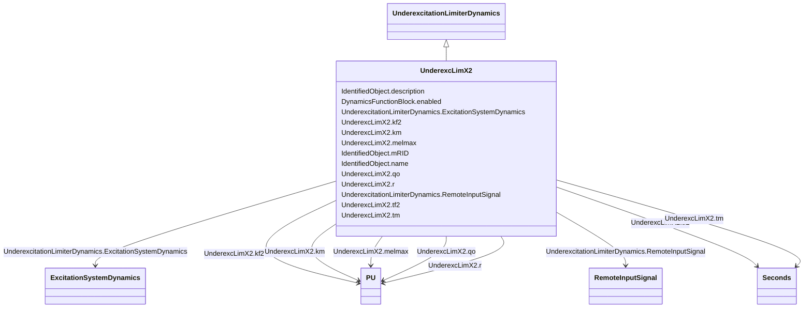

# UnderexcLimX2

_Westinghouse minimum excitation limiter._

**URI**: [cim:UnderexcLimX2](http://iec.ch/TC57/CIM100#UnderexcLimX2) 
**Type**: Class

## Inheritance
* [IdentifiedObject](IdentifiedObject.md)
    * [DynamicsFunctionBlock](DynamicsFunctionBlock.md)
        * [UnderexcitationLimiterDynamics](UnderexcitationLimiterDynamics.md)
            * **UnderexcLimX2**

## Attributes

| Name | URI | Cardinality and Range | Description | Inheritance |
| ---  | --- | --- | --- | --- |
| kf2 | [cim:UnderexcLimX2.kf2](http://iec.ch/TC57/CIM100#UnderexcLimX2.kf2) | 1    [PU](PU.md)  | Differential gain (<i>K</i><i>F2</i>) | direct |
| tf2 | [cim:UnderexcLimX2.tf2](http://iec.ch/TC57/CIM100#UnderexcLimX2.tf2) | 1    [Seconds](Seconds.md)  | Differential time constant (<i>T</i><i>F2</i>) (&gt;= 0) | direct |
| km | [cim:UnderexcLimX2.km](http://iec.ch/TC57/CIM100#UnderexcLimX2.km) | 1    [PU](PU.md)  | Minimum excitation limit gain (<i>K</i><i>M</i>) | direct |
| tm | [cim:UnderexcLimX2.tm](http://iec.ch/TC57/CIM100#UnderexcLimX2.tm) | 1    [Seconds](Seconds.md)  | Minimum excitation limit time constant (<i>T</i><i>M</i>) (&gt;= 0... | direct |
| melmax | [cim:UnderexcLimX2.melmax](http://iec.ch/TC57/CIM100#UnderexcLimX2.melmax) | 1    [PU](PU.md)  | Minimum excitation limit value (<i>MELMAX</i>) | direct |
| qo | [cim:UnderexcLimX2.qo](http://iec.ch/TC57/CIM100#UnderexcLimX2.qo) | 1    [PU](PU.md)  | Excitation centre setting (<i>Q</i><i>O</i>) | direct |
| r | [cim:UnderexcLimX2.r](http://iec.ch/TC57/CIM100#UnderexcLimX2.r) | 1    [PU](PU.md)  | Excitation radius (<i>R</i>) | direct |
| RemoteInputSignal | [cim:UnderexcitationLimiterDynamics.RemoteInputSignal](http://iec.ch/TC57/CIM100#UnderexcitationLimiterDynamics.RemoteInputSignal) | 0..1    [RemoteInputSignal](RemoteInputSignal.md)  | Remote input signal used by this underexcitation limiter model | [UnderexcitationLimiterDynamics](UnderexcitationLimiterDynamics.md) |
| ExcitationSystemDynamics | [cim:UnderexcitationLimiterDynamics.ExcitationSystemDynamics](http://iec.ch/TC57/CIM100#UnderexcitationLimiterDynamics.ExcitationSystemDynamics) | 1    [ExcitationSystemDynamics](ExcitationSystemDynamics.md)  | Excitation system model with which this underexcitation limiter model is asso... | [UnderexcitationLimiterDynamics](UnderexcitationLimiterDynamics.md) |
| enabled | [cim:DynamicsFunctionBlock.enabled](http://iec.ch/TC57/CIM100#DynamicsFunctionBlock.enabled) | 1    boolean  | Function block used indicator | [DynamicsFunctionBlock](DynamicsFunctionBlock.md) |
| description | [cim:IdentifiedObject.description](http://iec.ch/TC57/CIM100#IdentifiedObject.description) | 0..1    string  | The description is a free human readable text describing or naming the object | [IdentifiedObject](IdentifiedObject.md) |
| mRID | [cim:IdentifiedObject.mRID](http://iec.ch/TC57/CIM100#IdentifiedObject.mRID) | 1    string  | Master resource identifier issued by a model authority | [IdentifiedObject](IdentifiedObject.md) |
| name | [cim:IdentifiedObject.name](http://iec.ch/TC57/CIM100#IdentifiedObject.name) | 0..1    string  | The name is any free human readable and possibly non unique text naming the o... | [IdentifiedObject](IdentifiedObject.md) |

## Identifier and Mapping Information

### Schema Source

* from schema: http://iec.ch/TC57/ns/CIM/Dynamics-EU#Package_DynamicsProfile

## Mappings

| Mapping Type | Mapped Value |
| ---  | ---  |
| self | cim:UnderexcLimX2 |
| native | this:UnderexcLimX2 |

