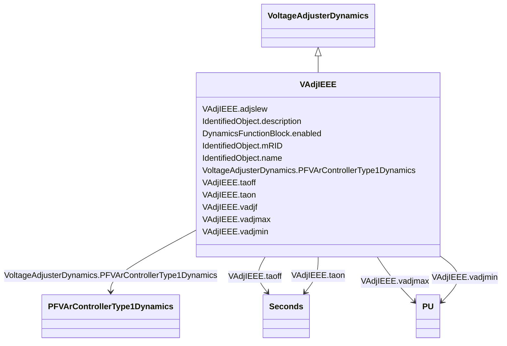

# VAdjIEEE

_IEEE voltage adjuster which is used to represent the voltage adjuster in either a power factor or VAr control system._

_Reference: IEEE 421.5-2005, 11.1._

**URI**: [cim:VAdjIEEE](http://iec.ch/TC57/CIM100#VAdjIEEE) 
**Type**: Class

## Inheritance
* [IdentifiedObject](IdentifiedObject.md)
    * [DynamicsFunctionBlock](DynamicsFunctionBlock.md)
        * [VoltageAdjusterDynamics](VoltageAdjusterDynamics.md)
            * **VAdjIEEE**

## Attributes

| Name | URI | Cardinality and Range | Description | Inheritance |
| ---  | --- | --- | --- | --- |
| vadjf | [cim:VAdjIEEE.vadjf](http://iec.ch/TC57/CIM100#VAdjIEEE.vadjf) | 1..1    float  | Set high to provide a continuous raise or lower (<i>V</i><i>ADJF</... | direct |
| adjslew | [cim:VAdjIEEE.adjslew](http://iec.ch/TC57/CIM100#VAdjIEEE.adjslew) | 1..1    float  | Rate at which output of adjuster changes (<i>ADJ_SLEW</i>) | direct |
| vadjmax | [cim:VAdjIEEE.vadjmax](http://iec.ch/TC57/CIM100#VAdjIEEE.vadjmax) | 1..1    [PU](PU.md)  | Maximum output of the adjuster (<i>V</i><i>ADJMAX</i>) (&gt; VAdjI... | direct |
| vadjmin | [cim:VAdjIEEE.vadjmin](http://iec.ch/TC57/CIM100#VAdjIEEE.vadjmin) | 1..1    [PU](PU.md)  | Minimum output of the adjuster (<i>V</i><i>ADJMIN</i>) (&lt; VAdjI... | direct |
| taon | [cim:VAdjIEEE.taon](http://iec.ch/TC57/CIM100#VAdjIEEE.taon) | 1..1    [Seconds](Seconds.md)  | Time that adjuster pulses are on (<i>T</i><i>AON</i>) (&gt;= 0) | direct |
| taoff | [cim:VAdjIEEE.taoff](http://iec.ch/TC57/CIM100#VAdjIEEE.taoff) | 1..1    [Seconds](Seconds.md)  | Time that adjuster pulses are off (<i>T</i><i>AOFF</i>) (&gt;= 0) | direct |
| PFVArControllerType1Dynamics | [cim:VoltageAdjusterDynamics.PFVArControllerType1Dynamics](http://iec.ch/TC57/CIM100#VoltageAdjusterDynamics.PFVArControllerType1Dynamics) | 1..1    [PFVArControllerType1Dynamics](PFVArControllerType1Dynamics.md)  | Power factor or VAr controller type 1 model with which this voltage adjuster ... | [VoltageAdjusterDynamics](VoltageAdjusterDynamics.md) |
| enabled | [cim:DynamicsFunctionBlock.enabled](http://iec.ch/TC57/CIM100#DynamicsFunctionBlock.enabled) | 1..1    boolean  | Function block used indicator | [DynamicsFunctionBlock](DynamicsFunctionBlock.md) |
| description | [cim:IdentifiedObject.description](http://iec.ch/TC57/CIM100#IdentifiedObject.description) | 0..1    string  | The description is a free human readable text describing or naming the object | [IdentifiedObject](IdentifiedObject.md) |
| mRID | [cim:IdentifiedObject.mRID](http://iec.ch/TC57/CIM100#IdentifiedObject.mRID) | 1..1    string  | Master resource identifier issued by a model authority | [IdentifiedObject](IdentifiedObject.md) |
| name | [cim:IdentifiedObject.name](http://iec.ch/TC57/CIM100#IdentifiedObject.name) | 0..1    string  | The name is any free human readable and possibly non unique text naming the o... | [IdentifiedObject](IdentifiedObject.md) |

## Identifier and Mapping Information

### Schema Source

* from schema: http://iec.ch/TC57/ns/CIM/Dynamics-EU#Package_DynamicsProfile

## Mappings

| Mapping Type | Mapped Value |
| ---  | ---  |
| self | cim:VAdjIEEE |
| native | this:VAdjIEEE |

