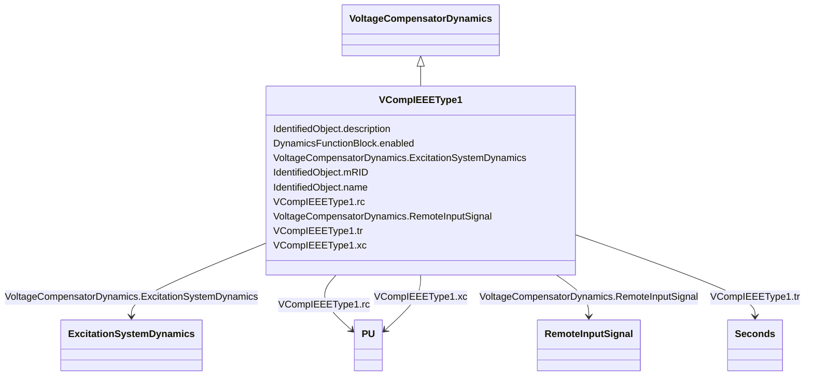

# VCompIEEEType1

_Terminal voltage transducer and load compensator as defined in IEEE 421.5-2005, 4. This model is common to all excitation system models described in the IEEE Standard. _

_Parameter details:_

_<ol>_

_	<li>If <i>Rc</i> and <i>Xc</i> are set to zero, the load compensation is not employed and the behaviour is as a simple sensing circuit.</li>_

_</ol>_

_<ol>_

_	<li>If all parameters (<i>Rc</i>, <i>Xc</i> and <i>Tr</i>) are set to zero, the standard model VCompIEEEType1 is bypassed.</li>_

_</ol>_

_Reference: IEEE 421.5-2005 4._

**URI**: [cim:VCompIEEEType1](http://iec.ch/TC57/CIM100#VCompIEEEType1) 
**Type**: Class

## Inheritance
* [IdentifiedObject](IdentifiedObject.md)
    * [DynamicsFunctionBlock](DynamicsFunctionBlock.md)
        * [VoltageCompensatorDynamics](VoltageCompensatorDynamics.md)
            * **VCompIEEEType1**

## Attributes

| Name | URI | Cardinality and Range | Description | Inheritance |
| ---  | --- | --- | --- | --- |
| rc | [cim:VCompIEEEType1.rc](http://iec.ch/TC57/CIM100#VCompIEEEType1.rc) | 1    [PU](PU.md)  | Resistive component of compensation of a generator (<i>... | direct |
| xc | [cim:VCompIEEEType1.xc](http://iec.ch/TC57/CIM100#VCompIEEEType1.xc) | 1    [PU](PU.md)  | Reactive component of compensation of a generator (<i>X... | direct |
| tr | [cim:VCompIEEEType1.tr](http://iec.ch/TC57/CIM100#VCompIEEEType1.tr) | 1    [Seconds](Seconds.md)  | Time constant which is used for the combined voltage se... | direct |
| RemoteInputSignal | [cim:VoltageCompensatorDynamics.RemoteInputSignal](http://iec.ch/TC57/CIM100#VoltageCompensatorDynamics.RemoteInputSignal) | 0..1    [RemoteInputSignal](RemoteInputSignal.md)  | Remote input signal used by this voltage compensator model | [VoltageCompensatorDynamics](VoltageCompensatorDynamics.md) |
| ExcitationSystemDynamics | [cim:VoltageCompensatorDynamics.ExcitationSystemDynamics](http://iec.ch/TC57/CIM100#VoltageCompensatorDynamics.ExcitationSystemDynamics) | 1    [ExcitationSystemDynamics](ExcitationSystemDynamics.md)  | Excitation system model with which this voltage compensator is associated | [VoltageCompensatorDynamics](VoltageCompensatorDynamics.md) |
| enabled | [cim:DynamicsFunctionBlock.enabled](http://iec.ch/TC57/CIM100#DynamicsFunctionBlock.enabled) | 1    boolean  | Function block used indicator | [DynamicsFunctionBlock](DynamicsFunctionBlock.md) |
| description | [cim:IdentifiedObject.description](http://iec.ch/TC57/CIM100#IdentifiedObject.description) | 0..1    string  | The description is a free human readable text describing or naming the object | [IdentifiedObject](IdentifiedObject.md) |
| mRID | [cim:IdentifiedObject.mRID](http://iec.ch/TC57/CIM100#IdentifiedObject.mRID) | 1    string  | Master resource identifier issued by a model authority | [IdentifiedObject](IdentifiedObject.md) |
| name | [cim:IdentifiedObject.name](http://iec.ch/TC57/CIM100#IdentifiedObject.name) | 0..1    string  | The name is any free human readable and possibly non unique text naming the o... | [IdentifiedObject](IdentifiedObject.md) |

## Identifier and Mapping Information

### Schema Source

* from schema: http://iec.ch/TC57/ns/CIM/Dynamics-EU#Package_DynamicsProfile

## Mappings

| Mapping Type | Mapped Value |
| ---  | ---  |
| self | cim:VCompIEEEType1 |
| native | this:VCompIEEEType1 |

