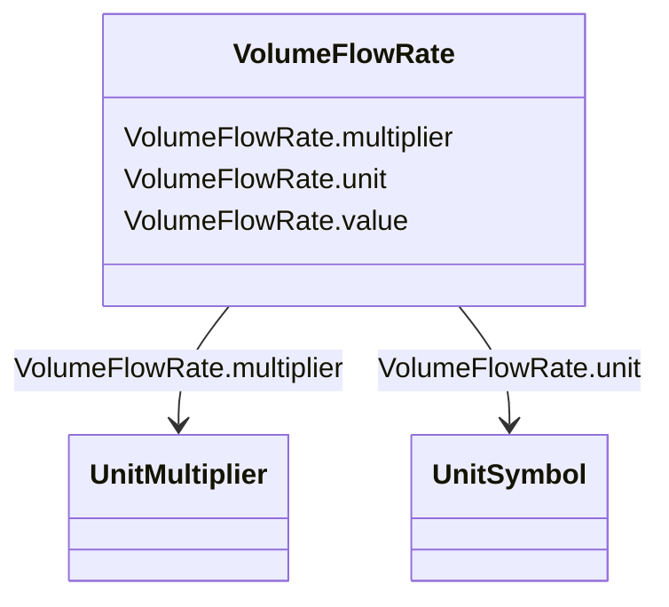

# VolumeFlowRate

_Volume per time._

**URI**: [cim:VolumeFlowRate](http://iec.ch/TC57/CIM100#VolumeFlowRate) 
**Type**: Class

<!-- no inheritance hierarchy -->

## Attributes

| Name | URI | Cardinality and Range | Description | Inheritance |
| ---  | --- | --- | --- | --- |
| multiplier | [cim:VolumeFlowRate.multiplier](http://iec.ch/TC57/CIM100#VolumeFlowRate.multiplier) | 0..1    [UnitMultiplier](UnitMultiplier.md)  |  | direct |
| unit | [cim:VolumeFlowRate.unit](http://iec.ch/TC57/CIM100#VolumeFlowRate.unit) | 0..1    [UnitSymbol](UnitSymbol.md)  |  | direct |
| value | [cim:VolumeFlowRate.value](http://iec.ch/TC57/CIM100#VolumeFlowRate.value) | 0..1    float  |  | direct |

## Usages

| used by | used in | type | used |
| ---  | --- | --- | --- |
| [GovHydroFrancis](GovHydroFrancis.md) | qn | range | [VolumeFlowRate](VolumeFlowRate.md) |
| [GovHydroPelton](GovHydroPelton.md) | qn | range | [VolumeFlowRate](VolumeFlowRate.md) |

## Identifier and Mapping Information

### Schema Source

* from schema: http://iec.ch/TC57/ns/CIM/Dynamics-EU#Package_DynamicsProfile

## Mappings

| Mapping Type | Mapped Value |
| ---  | ---  |
| self | cim:VolumeFlowRate |
| native | this:VolumeFlowRate |

