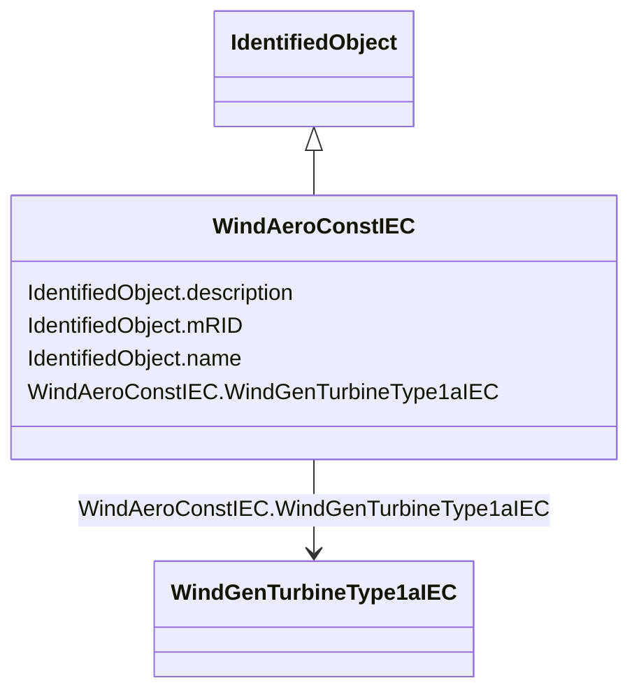

# WindAeroConstIEC

_Constant aerodynamic torque model which assumes that the aerodynamic torque is constant._

_Reference: IEC 61400-27-1:2015, 5.6.1.1._

**URI**: [cim:WindAeroConstIEC](http://iec.ch/TC57/CIM100#WindAeroConstIEC) 
**Type**: Class

## Inheritance
* [IdentifiedObject](IdentifiedObject.md)
    * **WindAeroConstIEC**

## Attributes

| Name | URI | Cardinality and Range | Description | Inheritance |
| ---  | --- | --- | --- | --- |
| WindGenTurbineType1aIEC | [cim:WindAeroConstIEC.WindGenTurbineType1aIEC](http://iec.ch/TC57/CIM100#WindAeroConstIEC.WindGenTurbineType1aIEC) | 1    [WindGenTurbineType1aIEC](WindGenTurbineType1aIEC.md)  | Wind turbine type 1A model with which this wind aerodynamic model is associat... | direct |
| description | [cim:IdentifiedObject.description](http://iec.ch/TC57/CIM100#IdentifiedObject.description) | 0..1    string  | The description is a free human readable text describing or naming the object | [IdentifiedObject](IdentifiedObject.md) |
| mRID | [cim:IdentifiedObject.mRID](http://iec.ch/TC57/CIM100#IdentifiedObject.mRID) | 1    string  | Master resource identifier issued by a model authority | [IdentifiedObject](IdentifiedObject.md) |
| name | [cim:IdentifiedObject.name](http://iec.ch/TC57/CIM100#IdentifiedObject.name) | 0..1    string  | The name is any free human readable and possibly non unique text naming the o... | [IdentifiedObject](IdentifiedObject.md) |

## Usages

| used by | used in | type | used |
| ---  | --- | --- | --- |
| [WindGenTurbineType1aIEC](WindGenTurbineType1aIEC.md) | WindAeroConstIEC | range | [WindAeroConstIEC](WindAeroConstIEC.md) |

## Identifier and Mapping Information

### Schema Source

* from schema: http://iec.ch/TC57/ns/CIM/Dynamics-EU#Package_DynamicsProfile

## Mappings

| Mapping Type | Mapped Value |
| ---  | ---  |
| self | cim:WindAeroConstIEC |
| native | this:WindAeroConstIEC |

