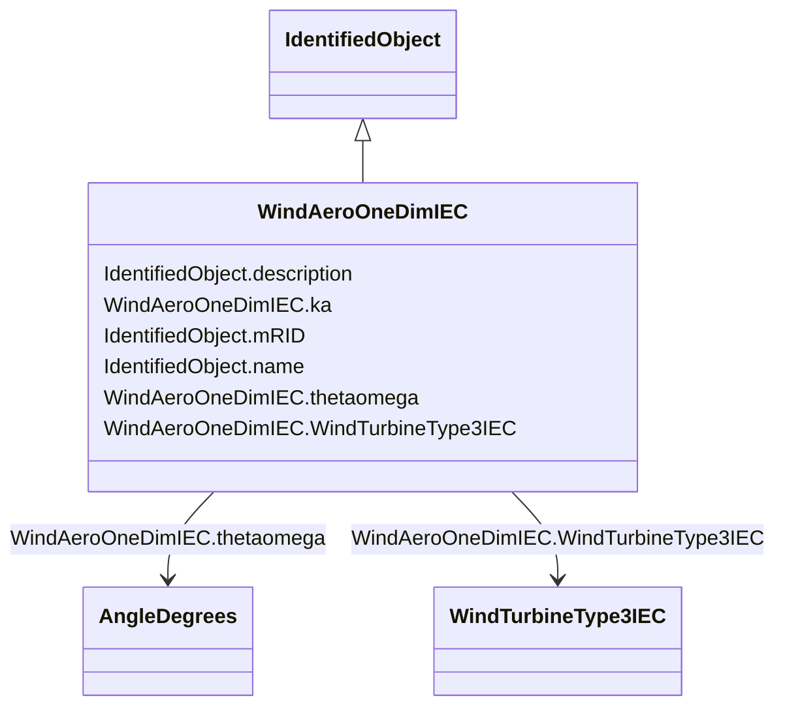

# WindAeroOneDimIEC

_One-dimensional aerodynamic model.  _

_Reference: IEC 61400-27-1:2015, 5.6.1.2._

**URI**: [cim:WindAeroOneDimIEC](http://iec.ch/TC57/CIM100#WindAeroOneDimIEC) 
**Type**: Class

## Inheritance
* [IdentifiedObject](IdentifiedObject.md)
    * **WindAeroOneDimIEC**

## Attributes

| Name | URI | Cardinality and Range | Description | Inheritance |
| ---  | --- | --- | --- | --- |
| ka | [cim:WindAeroOneDimIEC.ka](http://iec.ch/TC57/CIM100#WindAeroOneDimIEC.ka) | 1    float  | Aerodynamic gain (<i>k</i><i>a</i>) | direct |
| thetaomega | [cim:WindAeroOneDimIEC.thetaomega](http://iec.ch/TC57/CIM100#WindAeroOneDimIEC.thetaomega) | 1    [AngleDegrees](AngleDegrees.md)  | Initial pitch angle (<i>theta</i><i>omega0</i>) | direct |
| WindTurbineType3IEC | [cim:WindAeroOneDimIEC.WindTurbineType3IEC](http://iec.ch/TC57/CIM100#WindAeroOneDimIEC.WindTurbineType3IEC) | 1    [WindTurbineType3IEC](WindTurbineType3IEC.md)  | Wind turbine type 3 model with which this wind aerodynamic model is associate... | direct |
| description | [cim:IdentifiedObject.description](http://iec.ch/TC57/CIM100#IdentifiedObject.description) | 0..1    string  | The description is a free human readable text describing or naming the object | [IdentifiedObject](IdentifiedObject.md) |
| mRID | [cim:IdentifiedObject.mRID](http://iec.ch/TC57/CIM100#IdentifiedObject.mRID) | 1    string  | Master resource identifier issued by a model authority | [IdentifiedObject](IdentifiedObject.md) |
| name | [cim:IdentifiedObject.name](http://iec.ch/TC57/CIM100#IdentifiedObject.name) | 0..1    string  | The name is any free human readable and possibly non unique text naming the o... | [IdentifiedObject](IdentifiedObject.md) |

## Usages

| used by | used in | type | used |
| ---  | --- | --- | --- |
| [WindTurbineType3IEC](WindTurbineType3IEC.md) | WindAeroOneDimIEC | range | [WindAeroOneDimIEC](WindAeroOneDimIEC.md) |

## Identifier and Mapping Information

### Schema Source

* from schema: http://iec.ch/TC57/ns/CIM/Dynamics-EU#Package_DynamicsProfile

## Mappings

| Mapping Type | Mapped Value |
| ---  | ---  |
| self | cim:WindAeroOneDimIEC |
| native | this:WindAeroOneDimIEC |

