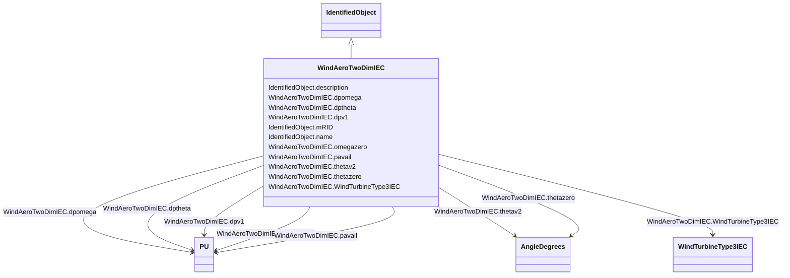

# WindAeroTwoDimIEC

_Two-dimensional aerodynamic model.  _

_Reference: IEC 61400-27-1:2015, 5.6.1.3._

**URI**: [cim:WindAeroTwoDimIEC](http://iec.ch/TC57/CIM100#WindAeroTwoDimIEC) 
**Type**: Class

## Inheritance
* [IdentifiedObject](IdentifiedObject.md)
    * **WindAeroTwoDimIEC**

## Attributes

| Name | URI | Cardinality and Range | Description | Inheritance |
| ---  | --- | --- | --- | --- |
| dpomega | [cim:WindAeroTwoDimIEC.dpomega](http://iec.ch/TC57/CIM100#WindAeroTwoDimIEC.dpomega) | 1..1    [PU](PU.md)  | Partial derivative of aerodynamic power with respect to changes in WTR speed ... | direct |
| dptheta | [cim:WindAeroTwoDimIEC.dptheta](http://iec.ch/TC57/CIM100#WindAeroTwoDimIEC.dptheta) | 1..1    [PU](PU.md)  | Partial derivative of aerodynamic power with respect to changes in pitch angl... | direct |
| dpv1 | [cim:WindAeroTwoDimIEC.dpv1](http://iec.ch/TC57/CIM100#WindAeroTwoDimIEC.dpv1) | 1..1    [PU](PU.md)  | Partial derivative (<i>dp</i><i>v1</i>) | direct |
| omegazero | [cim:WindAeroTwoDimIEC.omegazero](http://iec.ch/TC57/CIM100#WindAeroTwoDimIEC.omegazero) | 1..1    [PU](PU.md)  | Rotor speed if the wind turbine is not derated (<i>omega</i><i>0</... | direct |
| pavail | [cim:WindAeroTwoDimIEC.pavail](http://iec.ch/TC57/CIM100#WindAeroTwoDimIEC.pavail) | 1..1    [PU](PU.md)  | Available aerodynamic power (<i>p</i><i>avail</i><i>)</i> | direct |
| thetazero | [cim:WindAeroTwoDimIEC.thetazero](http://iec.ch/TC57/CIM100#WindAeroTwoDimIEC.thetazero) | 1..1    [AngleDegrees](AngleDegrees.md)  | Pitch angle if the wind turbine is not derated (<i>theta</i><i>0</... | direct |
| thetav2 | [cim:WindAeroTwoDimIEC.thetav2](http://iec.ch/TC57/CIM100#WindAeroTwoDimIEC.thetav2) | 1..1    [AngleDegrees](AngleDegrees.md)  | Blade angle at twice rated wind speed (<i>theta</i><i>v2</i>) | direct |
| WindTurbineType3IEC | [cim:WindAeroTwoDimIEC.WindTurbineType3IEC](http://iec.ch/TC57/CIM100#WindAeroTwoDimIEC.WindTurbineType3IEC) | 1..1    [WindTurbineType3IEC](WindTurbineType3IEC.md)  | Wind turbine type 3 model with which this wind aerodynamic model is associate... | direct |
| description | [cim:IdentifiedObject.description](http://iec.ch/TC57/CIM100#IdentifiedObject.description) | 0..1    string  | The description is a free human readable text describing or naming the object | [IdentifiedObject](IdentifiedObject.md) |
| mRID | [cim:IdentifiedObject.mRID](http://iec.ch/TC57/CIM100#IdentifiedObject.mRID) | 1..1    string  | Master resource identifier issued by a model authority | [IdentifiedObject](IdentifiedObject.md) |
| name | [cim:IdentifiedObject.name](http://iec.ch/TC57/CIM100#IdentifiedObject.name) | 0..1    string  | The name is any free human readable and possibly non unique text naming the o... | [IdentifiedObject](IdentifiedObject.md) |

## Usages

| used by | used in | type | used |
| ---  | --- | --- | --- |
| [WindTurbineType3IEC](WindTurbineType3IEC.md) | WindAeroTwoDimIEC | range | [WindAeroTwoDimIEC](WindAeroTwoDimIEC.md) |

## Identifier and Mapping Information

### Schema Source

* from schema: http://iec.ch/TC57/ns/CIM/Dynamics-EU#Package_DynamicsProfile

## Mappings

| Mapping Type | Mapped Value |
| ---  | ---  |
| self | cim:WindAeroTwoDimIEC |
| native | this:WindAeroTwoDimIEC |

