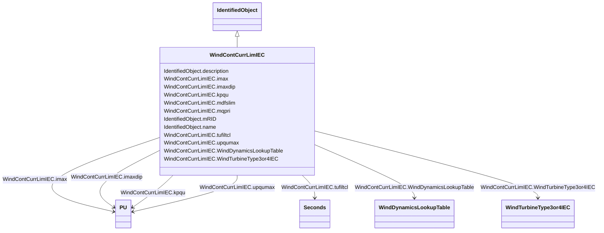

# WindContCurrLimIEC

_Current limitation model.  The current limitation model combines the physical limits and the control limits._

_Reference: IEC 61400-27-1:2015, 5.6.5.8._

**URI**: [cim:WindContCurrLimIEC](http://iec.ch/TC57/CIM100#WindContCurrLimIEC) 
**Type**: Class

## Inheritance
* [IdentifiedObject](IdentifiedObject.md)
    * **WindContCurrLimIEC**

## Attributes

| Name | URI | Cardinality and Range | Description | Inheritance |
| ---  | --- | --- | --- | --- |
| imax | [cim:WindContCurrLimIEC.imax](http://iec.ch/TC57/CIM100#WindContCurrLimIEC.imax) | 1..1    [PU](PU.md)  | Maximum continuous current at the wind turbine terminals (<i>i</i><i>max... | direct |
| imaxdip | [cim:WindContCurrLimIEC.imaxdip](http://iec.ch/TC57/CIM100#WindContCurrLimIEC.imaxdip) | 1..1    [PU](PU.md)  | Maximum current during voltage dip at the wind turbine terminals (<i>i</i><i>... | direct |
| kpqu | [cim:WindContCurrLimIEC.kpqu](http://iec.ch/TC57/CIM100#WindContCurrLimIEC.kpqu) | 1..1    [PU](PU.md)  | Partial derivative of reactive current limit (<i>K</i><i>pqu</i>) ... | direct |
| mdfslim | [cim:WindContCurrLimIEC.mdfslim](http://iec.ch/TC57/CIM100#WindContCurrLimIEC.mdfslim) | 1..1    boolean  | Limitation of type 3 stator current (<i>M</i><i>DFSLim</i>) | direct |
| mqpri | [cim:WindContCurrLimIEC.mqpri](http://iec.ch/TC57/CIM100#WindContCurrLimIEC.mqpri) | 1..1    boolean  | Prioritisation of Q control during UVRT (<i>M</i><i>qpri</i>) | direct |
| tufiltcl | [cim:WindContCurrLimIEC.tufiltcl](http://iec.ch/TC57/CIM100#WindContCurrLimIEC.tufiltcl) | 1..1    [Seconds](Seconds.md)  | Voltage measurement filter time constant (<i>T</i><i>ufiltcl</i>) ... | direct |
| upqumax | [cim:WindContCurrLimIEC.upqumax](http://iec.ch/TC57/CIM100#WindContCurrLimIEC.upqumax) | 1..1    [PU](PU.md)  | Wind turbine voltage in the operation point where zero reactive current can b... | direct |
| WindTurbineType3or4IEC | [cim:WindContCurrLimIEC.WindTurbineType3or4IEC](http://iec.ch/TC57/CIM100#WindContCurrLimIEC.WindTurbineType3or4IEC) | 1..1    [WindTurbineType3or4IEC](WindTurbineType3or4IEC.md)  | Wind turbine type 3 or type 4 model with which this wind control current limi... | direct |
| WindDynamicsLookupTable | [cim:WindContCurrLimIEC.WindDynamicsLookupTable](http://iec.ch/TC57/CIM100#WindContCurrLimIEC.WindDynamicsLookupTable) | 1..*    [WindDynamicsLookupTable](WindDynamicsLookupTable.md)  | The wind dynamics lookup table associated with this current control limitatio... | direct |
| description | [cim:IdentifiedObject.description](http://iec.ch/TC57/CIM100#IdentifiedObject.description) | 0..1    string  | The description is a free human readable text describing or naming the object | [IdentifiedObject](IdentifiedObject.md) |
| mRID | [cim:IdentifiedObject.mRID](http://iec.ch/TC57/CIM100#IdentifiedObject.mRID) | 1..1    string  | Master resource identifier issued by a model authority | [IdentifiedObject](IdentifiedObject.md) |
| name | [cim:IdentifiedObject.name](http://iec.ch/TC57/CIM100#IdentifiedObject.name) | 0..1    string  | The name is any free human readable and possibly non unique text naming the o... | [IdentifiedObject](IdentifiedObject.md) |

## Usages

| used by | used in | type | used |
| ---  | --- | --- | --- |
| [WindDynamicsLookupTable](WindDynamicsLookupTable.md) | WindContCurrLimIEC | range | [WindContCurrLimIEC](WindContCurrLimIEC.md) |
| [WindTurbineType3IEC](WindTurbineType3IEC.md) | WindContCurrLimIEC | range | [WindContCurrLimIEC](WindContCurrLimIEC.md) |
| [WindTurbineType3or4IEC](WindTurbineType3or4IEC.md) | WindContCurrLimIEC | range | [WindContCurrLimIEC](WindContCurrLimIEC.md) |
| [WindTurbineType4aIEC](WindTurbineType4aIEC.md) | WindContCurrLimIEC | range | [WindContCurrLimIEC](WindContCurrLimIEC.md) |
| [WindTurbineType4bIEC](WindTurbineType4bIEC.md) | WindContCurrLimIEC | range | [WindContCurrLimIEC](WindContCurrLimIEC.md) |
| [WindTurbineType4IEC](WindTurbineType4IEC.md) | WindContCurrLimIEC | range | [WindContCurrLimIEC](WindContCurrLimIEC.md) |

## Identifier and Mapping Information

### Schema Source

* from schema: http://iec.ch/TC57/ns/CIM/Dynamics-EU#Package_DynamicsProfile

## Mappings

| Mapping Type | Mapped Value |
| ---  | ---  |
| self | cim:WindContCurrLimIEC |
| native | this:WindContCurrLimIEC |

