# WindContPType3IEC

_P control model type 3._

_Reference: IEC 61400-27-1:2015, 5.6.5.4._

**URI**: [cim:WindContPType3IEC](http://iec.ch/TC57/CIM100#WindContPType3IEC) 
**Type**: Class

```mermaid
 classDiagram
    class WindContPType3IEC
      IdentifiedObject <|-- WindContPType3IEC
      
      WindContPType3IEC : IdentifiedObject.description
        
      WindContPType3IEC : WindContPType3IEC.dpmax
        
          WindContPType3IEC --> PU : WindContPType3IEC.dpmax
        
      WindContPType3IEC : WindContPType3IEC.dprefmax
        
          WindContPType3IEC --> PU : WindContPType3IEC.dprefmax
        
      WindContPType3IEC : WindContPType3IEC.dprefmin
        
          WindContPType3IEC --> PU : WindContPType3IEC.dprefmin
        
      WindContPType3IEC : WindContPType3IEC.dthetamax
        
          WindContPType3IEC --> PU : WindContPType3IEC.dthetamax
        
      WindContPType3IEC : WindContPType3IEC.dthetamaxuvrt
        
          WindContPType3IEC --> PU : WindContPType3IEC.dthetamaxuvrt
        
      WindContPType3IEC : WindContPType3IEC.kdtd
        
          WindContPType3IEC --> PU : WindContPType3IEC.kdtd
        
      WindContPType3IEC : WindContPType3IEC.kip
        
          WindContPType3IEC --> PU : WindContPType3IEC.kip
        
      WindContPType3IEC : WindContPType3IEC.kpp
        
          WindContPType3IEC --> PU : WindContPType3IEC.kpp
        
      WindContPType3IEC : WindContPType3IEC.mpuvrt
        
      WindContPType3IEC : IdentifiedObject.mRID
        
      WindContPType3IEC : IdentifiedObject.name
        
      WindContPType3IEC : WindContPType3IEC.omegadtd
        
          WindContPType3IEC --> PU : WindContPType3IEC.omegadtd
        
      WindContPType3IEC : WindContPType3IEC.omegaoffset
        
          WindContPType3IEC --> PU : WindContPType3IEC.omegaoffset
        
      WindContPType3IEC : WindContPType3IEC.pdtdmax
        
          WindContPType3IEC --> PU : WindContPType3IEC.pdtdmax
        
      WindContPType3IEC : WindContPType3IEC.tdvs
        
          WindContPType3IEC --> Seconds : WindContPType3IEC.tdvs
        
      WindContPType3IEC : WindContPType3IEC.thetaemin
        
          WindContPType3IEC --> PU : WindContPType3IEC.thetaemin
        
      WindContPType3IEC : WindContPType3IEC.thetauscale
        
          WindContPType3IEC --> PU : WindContPType3IEC.thetauscale
        
      WindContPType3IEC : WindContPType3IEC.tomegafiltp3
        
          WindContPType3IEC --> Seconds : WindContPType3IEC.tomegafiltp3
        
      WindContPType3IEC : WindContPType3IEC.tomegaref
        
          WindContPType3IEC --> Seconds : WindContPType3IEC.tomegaref
        
      WindContPType3IEC : WindContPType3IEC.tpfiltp3
        
          WindContPType3IEC --> Seconds : WindContPType3IEC.tpfiltp3
        
      WindContPType3IEC : WindContPType3IEC.tpord
        
          WindContPType3IEC --> PU : WindContPType3IEC.tpord
        
      WindContPType3IEC : WindContPType3IEC.tufiltp3
        
          WindContPType3IEC --> Seconds : WindContPType3IEC.tufiltp3
        
      WindContPType3IEC : WindContPType3IEC.udvs
        
          WindContPType3IEC --> PU : WindContPType3IEC.udvs
        
      WindContPType3IEC : WindContPType3IEC.updip
        
          WindContPType3IEC --> PU : WindContPType3IEC.updip
        
      WindContPType3IEC : WindContPType3IEC.WindDynamicsLookupTable
        
          WindContPType3IEC --> WindDynamicsLookupTable : WindContPType3IEC.WindDynamicsLookupTable
        
      WindContPType3IEC : WindContPType3IEC.WindTurbineType3IEC
        
          WindContPType3IEC --> WindTurbineType3IEC : WindContPType3IEC.WindTurbineType3IEC
        
      WindContPType3IEC : WindContPType3IEC.zeta
        
      
```

## Inheritance
* [IdentifiedObject](IdentifiedObject.md)
    * **WindContPType3IEC**

## Attributes

| Name | URI | Cardinality and Range | Description | Inheritance |
| ---  | --- | --- | --- | --- |
| dpmax | [cim:WindContPType3IEC.dpmax](http://iec.ch/TC57/CIM100#WindContPType3IEC.dpmax) | 1..1    [PU](PU.md)  | Maximum wind turbine power ramp rate (<i>dp</i><i>max</i>) | direct |
| dprefmax | [cim:WindContPType3IEC.dprefmax](http://iec.ch/TC57/CIM100#WindContPType3IEC.dprefmax) | 1..1    [PU](PU.md)  | Maximum ramp rate of wind turbine reference power (<i>dp</i><i>refmax</s... | direct |
| dprefmin | [cim:WindContPType3IEC.dprefmin](http://iec.ch/TC57/CIM100#WindContPType3IEC.dprefmin) | 1..1    [PU](PU.md)  | Minimum ramp rate of wind turbine reference power (<i>dp</i><i>refmin</s... | direct |
| dthetamax | [cim:WindContPType3IEC.dthetamax](http://iec.ch/TC57/CIM100#WindContPType3IEC.dthetamax) | 1..1    [PU](PU.md)  | Ramp limitation of torque, required in some grid codes (<i>dt</i><i>max<... | direct |
| dthetamaxuvrt | [cim:WindContPType3IEC.dthetamaxuvrt](http://iec.ch/TC57/CIM100#WindContPType3IEC.dthetamaxuvrt) | 1..1    [PU](PU.md)  | Limitation of torque rise rate during UVRT (<i>dtheta</i><i>maxUVRT</sub... | direct |
| kdtd | [cim:WindContPType3IEC.kdtd](http://iec.ch/TC57/CIM100#WindContPType3IEC.kdtd) | 1..1    [PU](PU.md)  | Gain for active drive train damping (<i>K</i><i>DTD</i>) | direct |
| kip | [cim:WindContPType3IEC.kip](http://iec.ch/TC57/CIM100#WindContPType3IEC.kip) | 1..1    [PU](PU.md)  | PI controller integration parameter (<i>K</i>Ip) | direct |
| kpp | [cim:WindContPType3IEC.kpp](http://iec.ch/TC57/CIM100#WindContPType3IEC.kpp) | 1..1    [PU](PU.md)  | PI controller proportional gain (<i>K</i>Pp) | direct |
| mpuvrt | [cim:WindContPType3IEC.mpuvrt](http://iec.ch/TC57/CIM100#WindContPType3IEC.mpuvrt) | 1..1    boolean  | Enable UVRT power control mode (<i>M</i><i>pUVRT</i>) | direct |
| omegaoffset | [cim:WindContPType3IEC.omegaoffset](http://iec.ch/TC57/CIM100#WindContPType3IEC.omegaoffset) | 1..1    [PU](PU.md)  | Offset to reference value that limits controller action during rotor speed ch... | direct |
| pdtdmax | [cim:WindContPType3IEC.pdtdmax](http://iec.ch/TC57/CIM100#WindContPType3IEC.pdtdmax) | 1..1    [PU](PU.md)  | Maximum active drive train damping power (<i>p</i>DTDmax) | direct |
| tdvs | [cim:WindContPType3IEC.tdvs](http://iec.ch/TC57/CIM100#WindContPType3IEC.tdvs) | 1..1    [Seconds](Seconds.md)  | Time delay after deep voltage sags (<i>T</i><i>DVS</i>)... | direct |
| thetaemin | [cim:WindContPType3IEC.thetaemin](http://iec.ch/TC57/CIM100#WindContPType3IEC.thetaemin) | 1..1    [PU](PU.md)  | Minimum electrical generator torque (<i>t</i>emin) | direct |
| thetauscale | [cim:WindContPType3IEC.thetauscale](http://iec.ch/TC57/CIM100#WindContPType3IEC.thetauscale) | 1..1    [PU](PU.md)  | Voltage scaling factor of reset-torque (<i>t</i>uscale) | direct |
| tomegafiltp3 | [cim:WindContPType3IEC.tomegafiltp3](http://iec.ch/TC57/CIM100#WindContPType3IEC.tomegafiltp3) | 1..1    [Seconds](Seconds.md)  | Filter time constant for generator speed measurement (<i>T</i>omegafiltp... | direct |
| tpfiltp3 | [cim:WindContPType3IEC.tpfiltp3](http://iec.ch/TC57/CIM100#WindContPType3IEC.tpfiltp3) | 1..1    [Seconds](Seconds.md)  | Filter time constant for power measurement (<i>T</i>pfiltp3) (&gt;... | direct |
| tpord | [cim:WindContPType3IEC.tpord](http://iec.ch/TC57/CIM100#WindContPType3IEC.tpord) | 1..1    [PU](PU.md)  | Time constant in power order lag (<i>T</i>pord) | direct |
| tufiltp3 | [cim:WindContPType3IEC.tufiltp3](http://iec.ch/TC57/CIM100#WindContPType3IEC.tufiltp3) | 1..1    [Seconds](Seconds.md)  | Filter time constant for voltage measurement (<i>T</i>ufiltp3) (&g... | direct |
| tomegaref | [cim:WindContPType3IEC.tomegaref](http://iec.ch/TC57/CIM100#WindContPType3IEC.tomegaref) | 1..1    [Seconds](Seconds.md)  | Time constant in speed reference filter (<i>T</i>omega,ref) (&gt;=... | direct |
| udvs | [cim:WindContPType3IEC.udvs](http://iec.ch/TC57/CIM100#WindContPType3IEC.udvs) | 1..1    [PU](PU.md)  | Voltage limit for hold UVRT status after deep voltage sags (<i>u</i><i>D... | direct |
| updip | [cim:WindContPType3IEC.updip](http://iec.ch/TC57/CIM100#WindContPType3IEC.updip) | 1..1    [PU](PU.md)  | Voltage dip threshold for P-control (<i>u</i>Pdip) | direct |
| omegadtd | [cim:WindContPType3IEC.omegadtd](http://iec.ch/TC57/CIM100#WindContPType3IEC.omegadtd) | 1..1    [PU](PU.md)  | Active drive train damping frequency (<i>omega</i><i>DTD</i>) | direct |
| zeta | [cim:WindContPType3IEC.zeta](http://iec.ch/TC57/CIM100#WindContPType3IEC.zeta) | 1..1    float  | Coefficient for active drive train damping (<i>zeta</i>) | direct |
| WindTurbineType3IEC | [cim:WindContPType3IEC.WindTurbineType3IEC](http://iec.ch/TC57/CIM100#WindContPType3IEC.WindTurbineType3IEC) | 1..1    [WindTurbineType3IEC](WindTurbineType3IEC.md)  | Wind turbine type 3 model with which this wind control P type 3 model is asso... | direct |
| WindDynamicsLookupTable | [cim:WindContPType3IEC.WindDynamicsLookupTable](http://iec.ch/TC57/CIM100#WindContPType3IEC.WindDynamicsLookupTable) | 1..*    [WindDynamicsLookupTable](WindDynamicsLookupTable.md)  | The wind dynamics lookup table associated with this P control type 3 model | direct |
| description | [cim:IdentifiedObject.description](http://iec.ch/TC57/CIM100#IdentifiedObject.description) | 0..1    string  | The description is a free human readable text describing or naming the object | [IdentifiedObject](IdentifiedObject.md) |
| mRID | [cim:IdentifiedObject.mRID](http://iec.ch/TC57/CIM100#IdentifiedObject.mRID) | 1..1    string  | Master resource identifier issued by a model authority | [IdentifiedObject](IdentifiedObject.md) |
| name | [cim:IdentifiedObject.name](http://iec.ch/TC57/CIM100#IdentifiedObject.name) | 0..1    string  | The name is any free human readable and possibly non unique text naming the o... | [IdentifiedObject](IdentifiedObject.md) |

## Usages

| used by | used in | type | used |
| ---  | --- | --- | --- |
| [WindDynamicsLookupTable](WindDynamicsLookupTable.md) | WindContPType3IEC | range | [WindContPType3IEC](WindContPType3IEC.md) |
| [WindTurbineType3IEC](WindTurbineType3IEC.md) | WindContPType3IEC | range | [WindContPType3IEC](WindContPType3IEC.md) |

## Identifier and Mapping Information

### Schema Source

* from schema: http://iec.ch/TC57/ns/CIM/Dynamics-EU#Package_DynamicsProfile

## Mappings

| Mapping Type | Mapped Value |
| ---  | ---  |
| self | cim:WindContPType3IEC |
| native | this:WindContPType3IEC |

