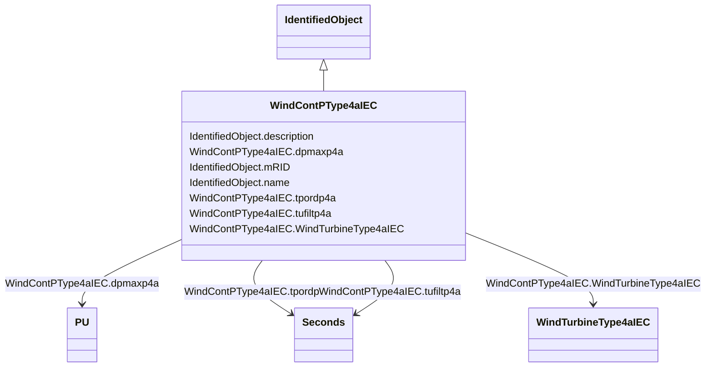

# WindContPType4aIEC

_P control model type 4A._

_Reference: IEC 61400-27-1:2015, 5.6.5.5._

**URI**: [cim:WindContPType4aIEC](http://iec.ch/TC57/CIM100#WindContPType4aIEC) 
**Type**: Class

## Inheritance
* [IdentifiedObject](IdentifiedObject.md)
    * **WindContPType4aIEC**

## Attributes

| Name | URI | Cardinality and Range | Description | Inheritance |
| ---  | --- | --- | --- | --- |
| dpmaxp4a | [cim:WindContPType4aIEC.dpmaxp4a](http://iec.ch/TC57/CIM100#WindContPType4aIEC.dpmaxp4a) | 1    [PU](PU.md)  | Maximum wind turbine power ramp rate (<i>dp</i><i>maxp4A</i>) | direct |
| tpordp4a | [cim:WindContPType4aIEC.tpordp4a](http://iec.ch/TC57/CIM100#WindContPType4aIEC.tpordp4a) | 1    [Seconds](Seconds.md)  | Time constant in power order lag (<i>T</i><i>pordp4A</i>) (&gt;= 0... | direct |
| tufiltp4a | [cim:WindContPType4aIEC.tufiltp4a](http://iec.ch/TC57/CIM100#WindContPType4aIEC.tufiltp4a) | 1    [Seconds](Seconds.md)  | Voltage measurement filter time constant (<i>T</i><i>ufiltp4A</i>)... | direct |
| WindTurbineType4aIEC | [cim:WindContPType4aIEC.WindTurbineType4aIEC](http://iec.ch/TC57/CIM100#WindContPType4aIEC.WindTurbineType4aIEC) | 1    [WindTurbineType4aIEC](WindTurbineType4aIEC.md)  | Wind turbine type 4A model with which this wind control P type 4A model is as... | direct |
| description | [cim:IdentifiedObject.description](http://iec.ch/TC57/CIM100#IdentifiedObject.description) | 0..1    string  | The description is a free human readable text describing or naming the object | [IdentifiedObject](IdentifiedObject.md) |
| mRID | [cim:IdentifiedObject.mRID](http://iec.ch/TC57/CIM100#IdentifiedObject.mRID) | 1    string  | Master resource identifier issued by a model authority | [IdentifiedObject](IdentifiedObject.md) |
| name | [cim:IdentifiedObject.name](http://iec.ch/TC57/CIM100#IdentifiedObject.name) | 0..1    string  | The name is any free human readable and possibly non unique text naming the o... | [IdentifiedObject](IdentifiedObject.md) |

## Usages

| used by | used in | type | used |
| ---  | --- | --- | --- |
| [WindTurbineType4aIEC](WindTurbineType4aIEC.md) | WindContPType4aIEC | range | [WindContPType4aIEC](WindContPType4aIEC.md) |

## Identifier and Mapping Information

### Schema Source

* from schema: http://iec.ch/TC57/ns/CIM/Dynamics-EU#Package_DynamicsProfile

## Mappings

| Mapping Type | Mapped Value |
| ---  | ---  |
| self | cim:WindContPType4aIEC |
| native | this:WindContPType4aIEC |

