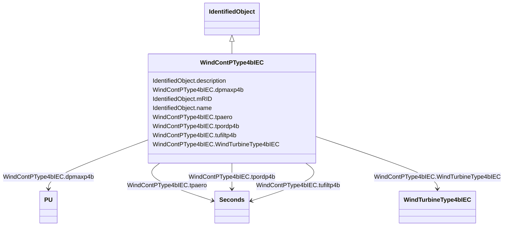

# WindContPType4bIEC

_P control model type 4B._

_Reference: IEC 61400-27-1:2015, 5.6.5.6._

**URI**: [cim:WindContPType4bIEC](http://iec.ch/TC57/CIM100#WindContPType4bIEC) 
**Type**: Class

## Inheritance
* [IdentifiedObject](IdentifiedObject.md)
    * **WindContPType4bIEC**

## Attributes

| Name | URI | Cardinality and Range | Description | Inheritance |
| ---  | --- | --- | --- | --- |
| dpmaxp4b | [cim:WindContPType4bIEC.dpmaxp4b](http://iec.ch/TC57/CIM100#WindContPType4bIEC.dpmaxp4b) | 1..1    [PU](PU.md)  | Maximum wind turbine power ramp rate (<i>dp</i><i>maxp4B</i>) | direct |
| tpaero | [cim:WindContPType4bIEC.tpaero](http://iec.ch/TC57/CIM100#WindContPType4bIEC.tpaero) | 1..1    [Seconds](Seconds.md)  | Time constant in aerodynamic power response (<i>T</i><i>paero</i>)... | direct |
| tpordp4b | [cim:WindContPType4bIEC.tpordp4b](http://iec.ch/TC57/CIM100#WindContPType4bIEC.tpordp4b) | 1..1    [Seconds](Seconds.md)  | Time constant in power order lag (<i>T</i><i>pordp4B</i>) (&gt;= 0... | direct |
| tufiltp4b | [cim:WindContPType4bIEC.tufiltp4b](http://iec.ch/TC57/CIM100#WindContPType4bIEC.tufiltp4b) | 1..1    [Seconds](Seconds.md)  | Voltage measurement filter time constant (<i>T</i><i>ufiltp4B</i>)... | direct |
| WindTurbineType4bIEC | [cim:WindContPType4bIEC.WindTurbineType4bIEC](http://iec.ch/TC57/CIM100#WindContPType4bIEC.WindTurbineType4bIEC) | 1..1    [WindTurbineType4bIEC](WindTurbineType4bIEC.md)  | Wind turbine type 4B model with which this wind control P type 4B model is as... | direct |
| description | [cim:IdentifiedObject.description](http://iec.ch/TC57/CIM100#IdentifiedObject.description) | 0..1    string  | The description is a free human readable text describing or naming the object | [IdentifiedObject](IdentifiedObject.md) |
| mRID | [cim:IdentifiedObject.mRID](http://iec.ch/TC57/CIM100#IdentifiedObject.mRID) | 1..1    string  | Master resource identifier issued by a model authority | [IdentifiedObject](IdentifiedObject.md) |
| name | [cim:IdentifiedObject.name](http://iec.ch/TC57/CIM100#IdentifiedObject.name) | 0..1    string  | The name is any free human readable and possibly non unique text naming the o... | [IdentifiedObject](IdentifiedObject.md) |

## Usages

| used by | used in | type | used |
| ---  | --- | --- | --- |
| [WindTurbineType4bIEC](WindTurbineType4bIEC.md) | WindContPType4bIEC | range | [WindContPType4bIEC](WindContPType4bIEC.md) |

## Identifier and Mapping Information

### Schema Source

* from schema: http://iec.ch/TC57/ns/CIM/Dynamics-EU#Package_DynamicsProfile

## Mappings

| Mapping Type | Mapped Value |
| ---  | ---  |
| self | cim:WindContPType4bIEC |
| native | this:WindContPType4bIEC |

