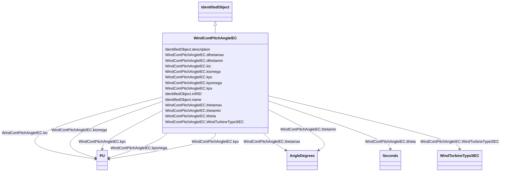

# WindContPitchAngleIEC

_Pitch angle control model._

_Reference: IEC 61400-27-1:2015, 5.6.5.2._

**URI**: [cim:WindContPitchAngleIEC](http://iec.ch/TC57/CIM100#WindContPitchAngleIEC) 
**Type**: Class

## Inheritance
* [IdentifiedObject](IdentifiedObject.md)
    * **WindContPitchAngleIEC**

## Attributes

| Name | URI | Cardinality and Range | Description | Inheritance |
| ---  | --- | --- | --- | --- |
| dthetamax | [cim:WindContPitchAngleIEC.dthetamax](http://iec.ch/TC57/CIM100#WindContPitchAngleIEC.dthetamax) | 1    float  | Maximum pitch positive ramp rate (<i>dtheta</i><i>max</i>) (&gt; W... | direct |
| dthetamin | [cim:WindContPitchAngleIEC.dthetamin](http://iec.ch/TC57/CIM100#WindContPitchAngleIEC.dthetamin) | 1    float  | Maximum pitch negative ramp rate (<i>dtheta</i><i>min</i><i>)</i> ... | direct |
| kic | [cim:WindContPitchAngleIEC.kic](http://iec.ch/TC57/CIM100#WindContPitchAngleIEC.kic) | 1    [PU](PU.md)  | Power PI controller integration gain (<i>K</i><i>Ic</i>) | direct |
| kiomega | [cim:WindContPitchAngleIEC.kiomega](http://iec.ch/TC57/CIM100#WindContPitchAngleIEC.kiomega) | 1    [PU](PU.md)  | Speed PI controller integration gain (<i>K</i><i>Iomega</i>) | direct |
| kpc | [cim:WindContPitchAngleIEC.kpc](http://iec.ch/TC57/CIM100#WindContPitchAngleIEC.kpc) | 1    [PU](PU.md)  | Power PI controller proportional gain (<i>K</i><i>Pc</i>) | direct |
| kpomega | [cim:WindContPitchAngleIEC.kpomega](http://iec.ch/TC57/CIM100#WindContPitchAngleIEC.kpomega) | 1    [PU](PU.md)  | Speed PI controller proportional gain (<i>K</i><i>Pomega</i>) | direct |
| kpx | [cim:WindContPitchAngleIEC.kpx](http://iec.ch/TC57/CIM100#WindContPitchAngleIEC.kpx) | 1    [PU](PU.md)  | Pitch cross coupling gain (<i>K</i><i>PX</i>) | direct |
| thetamax | [cim:WindContPitchAngleIEC.thetamax](http://iec.ch/TC57/CIM100#WindContPitchAngleIEC.thetamax) | 1    [AngleDegrees](AngleDegrees.md)  | Maximum pitch angle (<i>theta</i><i>max</i>) (&gt; WindContPitchAn... | direct |
| thetamin | [cim:WindContPitchAngleIEC.thetamin](http://iec.ch/TC57/CIM100#WindContPitchAngleIEC.thetamin) | 1    [AngleDegrees](AngleDegrees.md)  | Minimum pitch angle (<i>theta</i><i>min</i>) (&lt; WindContPitchAn... | direct |
| ttheta | [cim:WindContPitchAngleIEC.ttheta](http://iec.ch/TC57/CIM100#WindContPitchAngleIEC.ttheta) | 1    [Seconds](Seconds.md)  | Pitch time constant (<i>ttheta</i>) (&gt;= 0) | direct |
| WindTurbineType3IEC | [cim:WindContPitchAngleIEC.WindTurbineType3IEC](http://iec.ch/TC57/CIM100#WindContPitchAngleIEC.WindTurbineType3IEC) | 1    [WindTurbineType3IEC](WindTurbineType3IEC.md)  | Wind turbine type 3 model with which this pitch control model is associated | direct |
| description | [cim:IdentifiedObject.description](http://iec.ch/TC57/CIM100#IdentifiedObject.description) | 0..1    string  | The description is a free human readable text describing or naming the object | [IdentifiedObject](IdentifiedObject.md) |
| mRID | [cim:IdentifiedObject.mRID](http://iec.ch/TC57/CIM100#IdentifiedObject.mRID) | 1    string  | Master resource identifier issued by a model authority | [IdentifiedObject](IdentifiedObject.md) |
| name | [cim:IdentifiedObject.name](http://iec.ch/TC57/CIM100#IdentifiedObject.name) | 0..1    string  | The name is any free human readable and possibly non unique text naming the o... | [IdentifiedObject](IdentifiedObject.md) |

## Usages

| used by | used in | type | used |
| ---  | --- | --- | --- |
| [WindTurbineType3IEC](WindTurbineType3IEC.md) | WindContPitchAngleIEC | range | [WindContPitchAngleIEC](WindContPitchAngleIEC.md) |

## Identifier and Mapping Information

### Schema Source

* from schema: http://iec.ch/TC57/ns/CIM/Dynamics-EU#Package_DynamicsProfile

## Mappings

| Mapping Type | Mapped Value |
| ---  | ---  |
| self | cim:WindContPitchAngleIEC |
| native | this:WindContPitchAngleIEC |

