# WindContQIEC

_Q control model._

_Reference: IEC 61400-27-1:2015, 5.6.5.7._

**URI**: [cim:WindContQIEC](http://iec.ch/TC57/CIM100#WindContQIEC) 
**Type**: Class

```mermaid
 classDiagram
    class WindContQIEC
      IdentifiedObject <|-- WindContQIEC
      
      WindContQIEC : IdentifiedObject.description
        
      WindContQIEC : WindContQIEC.iqh1
        
          WindContQIEC --> PU : WindContQIEC.iqh1
        
      WindContQIEC : WindContQIEC.iqmax
        
          WindContQIEC --> PU : WindContQIEC.iqmax
        
      WindContQIEC : WindContQIEC.iqmin
        
          WindContQIEC --> PU : WindContQIEC.iqmin
        
      WindContQIEC : WindContQIEC.iqpost
        
          WindContQIEC --> PU : WindContQIEC.iqpost
        
      WindContQIEC : WindContQIEC.kiq
        
          WindContQIEC --> PU : WindContQIEC.kiq
        
      WindContQIEC : WindContQIEC.kiu
        
          WindContQIEC --> PU : WindContQIEC.kiu
        
      WindContQIEC : WindContQIEC.kpq
        
          WindContQIEC --> PU : WindContQIEC.kpq
        
      WindContQIEC : WindContQIEC.kpu
        
          WindContQIEC --> PU : WindContQIEC.kpu
        
      WindContQIEC : WindContQIEC.kqv
        
          WindContQIEC --> PU : WindContQIEC.kqv
        
      WindContQIEC : IdentifiedObject.mRID
        
      WindContQIEC : IdentifiedObject.name
        
      WindContQIEC : WindContQIEC.rdroop
        
          WindContQIEC --> PU : WindContQIEC.rdroop
        
      WindContQIEC : WindContQIEC.tpfiltq
        
          WindContQIEC --> Seconds : WindContQIEC.tpfiltq
        
      WindContQIEC : WindContQIEC.tpost
        
          WindContQIEC --> Seconds : WindContQIEC.tpost
        
      WindContQIEC : WindContQIEC.tqord
        
          WindContQIEC --> Seconds : WindContQIEC.tqord
        
      WindContQIEC : WindContQIEC.tufiltq
        
          WindContQIEC --> Seconds : WindContQIEC.tufiltq
        
      WindContQIEC : WindContQIEC.udb1
        
          WindContQIEC --> PU : WindContQIEC.udb1
        
      WindContQIEC : WindContQIEC.udb2
        
          WindContQIEC --> PU : WindContQIEC.udb2
        
      WindContQIEC : WindContQIEC.umax
        
          WindContQIEC --> PU : WindContQIEC.umax
        
      WindContQIEC : WindContQIEC.umin
        
          WindContQIEC --> PU : WindContQIEC.umin
        
      WindContQIEC : WindContQIEC.uqdip
        
          WindContQIEC --> PU : WindContQIEC.uqdip
        
      WindContQIEC : WindContQIEC.uref0
        
          WindContQIEC --> PU : WindContQIEC.uref0
        
      WindContQIEC : WindContQIEC.windQcontrolModesType
        
          WindContQIEC --> WindQcontrolModeKind : WindContQIEC.windQcontrolModesType
        
      WindContQIEC : WindContQIEC.WindTurbineType3or4IEC
        
          WindContQIEC --> WindTurbineType3or4IEC : WindContQIEC.WindTurbineType3or4IEC
        
      WindContQIEC : WindContQIEC.windUVRTQcontrolModesType
        
          WindContQIEC --> WindUVRTQcontrolModeKind : WindContQIEC.windUVRTQcontrolModesType
        
      WindContQIEC : WindContQIEC.xdroop
        
          WindContQIEC --> PU : WindContQIEC.xdroop
        
      
```

## Inheritance
* [IdentifiedObject](IdentifiedObject.md)
    * **WindContQIEC**

## Attributes

| Name | URI | Cardinality and Range | Description | Inheritance |
| ---  | --- | --- | --- | --- |
| iqh1 | [cim:WindContQIEC.iqh1](http://iec.ch/TC57/CIM100#WindContQIEC.iqh1) | 1..1    [PU](PU.md)  | Maximum reactive current injection during dip (<i>i</i><i>qh1</i>) | direct |
| iqmax | [cim:WindContQIEC.iqmax](http://iec.ch/TC57/CIM100#WindContQIEC.iqmax) | 1..1    [PU](PU.md)  | Maximum reactive current injection (<i>i</i><i>qmax</i>) (&gt; Win... | direct |
| iqmin | [cim:WindContQIEC.iqmin](http://iec.ch/TC57/CIM100#WindContQIEC.iqmin) | 1..1    [PU](PU.md)  | Minimum reactive current injection (<i>i</i><i>qmin</i>) (&lt; Win... | direct |
| iqpost | [cim:WindContQIEC.iqpost](http://iec.ch/TC57/CIM100#WindContQIEC.iqpost) | 1..1    [PU](PU.md)  | Post fault reactive current injection (<i>i</i><i>qpost</i>) | direct |
| kiq | [cim:WindContQIEC.kiq](http://iec.ch/TC57/CIM100#WindContQIEC.kiq) | 1..1    [PU](PU.md)  | Reactive power PI controller integration gain (<i>K</i><i>I,q</i>) | direct |
| kiu | [cim:WindContQIEC.kiu](http://iec.ch/TC57/CIM100#WindContQIEC.kiu) | 1..1    [PU](PU.md)  | Voltage PI controller integration gain (<i>K</i><i>I,u</i>) | direct |
| kpq | [cim:WindContQIEC.kpq](http://iec.ch/TC57/CIM100#WindContQIEC.kpq) | 1..1    [PU](PU.md)  | Reactive power PI controller proportional gain (<i>K</i><i>P,q</i>... | direct |
| kpu | [cim:WindContQIEC.kpu](http://iec.ch/TC57/CIM100#WindContQIEC.kpu) | 1..1    [PU](PU.md)  | Voltage PI controller proportional gain (<i>K</i><i>P,u</i>) | direct |
| kqv | [cim:WindContQIEC.kqv](http://iec.ch/TC57/CIM100#WindContQIEC.kqv) | 1..1    [PU](PU.md)  | Voltage scaling factor for UVRT current (<i>K</i><i>qv</i>) | direct |
| tpfiltq | [cim:WindContQIEC.tpfiltq](http://iec.ch/TC57/CIM100#WindContQIEC.tpfiltq) | 1..1    [Seconds](Seconds.md)  | Power measurement filter time constant (<i>T</i><i>pfiltq</i>) (&g... | direct |
| rdroop | [cim:WindContQIEC.rdroop](http://iec.ch/TC57/CIM100#WindContQIEC.rdroop) | 1..1    [PU](PU.md)  | Resistive component of voltage drop impedance (<i>r</i><i>droop</i... | direct |
| tufiltq | [cim:WindContQIEC.tufiltq](http://iec.ch/TC57/CIM100#WindContQIEC.tufiltq) | 1..1    [Seconds](Seconds.md)  | Voltage measurement filter time constant (<i>T</i><i>ufiltq</i>) (... | direct |
| tpost | [cim:WindContQIEC.tpost](http://iec.ch/TC57/CIM100#WindContQIEC.tpost) | 1..1    [Seconds](Seconds.md)  | Length of time period where post fault reactive power is injected (<i>T</i><i... | direct |
| tqord | [cim:WindContQIEC.tqord](http://iec.ch/TC57/CIM100#WindContQIEC.tqord) | 1..1    [Seconds](Seconds.md)  | Time constant in reactive power order lag (<i>T</i><i>qord</i>) (&... | direct |
| udb1 | [cim:WindContQIEC.udb1](http://iec.ch/TC57/CIM100#WindContQIEC.udb1) | 1..1    [PU](PU.md)  | Voltage deadband lower limit (<i>u</i><i>db1</i>) | direct |
| udb2 | [cim:WindContQIEC.udb2](http://iec.ch/TC57/CIM100#WindContQIEC.udb2) | 1..1    [PU](PU.md)  | Voltage deadband upper limit (<i>u</i><i>db2</i>) | direct |
| umax | [cim:WindContQIEC.umax](http://iec.ch/TC57/CIM100#WindContQIEC.umax) | 1..1    [PU](PU.md)  | Maximum voltage in voltage PI controller integral term (<i>u</i><i>max</... | direct |
| umin | [cim:WindContQIEC.umin](http://iec.ch/TC57/CIM100#WindContQIEC.umin) | 1..1    [PU](PU.md)  | Minimum voltage in voltage PI controller integral term (<i>u</i><i>min</... | direct |
| uqdip | [cim:WindContQIEC.uqdip](http://iec.ch/TC57/CIM100#WindContQIEC.uqdip) | 1..1    [PU](PU.md)  | Voltage threshold for UVRT detection in Q control (<i>u</i><i>qdip... | direct |
| uref0 | [cim:WindContQIEC.uref0](http://iec.ch/TC57/CIM100#WindContQIEC.uref0) | 1..1    [PU](PU.md)  | User-defined bias in voltage reference (<i>u</i><i>ref0</i>) | direct |
| windQcontrolModesType | [cim:WindContQIEC.windQcontrolModesType](http://iec.ch/TC57/CIM100#WindContQIEC.windQcontrolModesType) | 1..1    [WindQcontrolModeKind](WindQcontrolModeKind.md)  | Types of general wind turbine Q control modes (<i>M</i><i>qG</i>) | direct |
| windUVRTQcontrolModesType | [cim:WindContQIEC.windUVRTQcontrolModesType](http://iec.ch/TC57/CIM100#WindContQIEC.windUVRTQcontrolModesType) | 1..1    [WindUVRTQcontrolModeKind](WindUVRTQcontrolModeKind.md)  | Types of UVRT Q control modes (<i>M</i><i>qUVRT</i>) | direct |
| xdroop | [cim:WindContQIEC.xdroop](http://iec.ch/TC57/CIM100#WindContQIEC.xdroop) | 1..1    [PU](PU.md)  | Inductive component of voltage drop impedance (<i>x</i><i>droop</i... | direct |
| WindTurbineType3or4IEC | [cim:WindContQIEC.WindTurbineType3or4IEC](http://iec.ch/TC57/CIM100#WindContQIEC.WindTurbineType3or4IEC) | 1..1    [WindTurbineType3or4IEC](WindTurbineType3or4IEC.md)  | Wind turbine type 3 or type 4 model with which this reactive control model is... | direct |
| description | [cim:IdentifiedObject.description](http://iec.ch/TC57/CIM100#IdentifiedObject.description) | 0..1    string  | The description is a free human readable text describing or naming the object | [IdentifiedObject](IdentifiedObject.md) |
| mRID | [cim:IdentifiedObject.mRID](http://iec.ch/TC57/CIM100#IdentifiedObject.mRID) | 1..1    string  | Master resource identifier issued by a model authority | [IdentifiedObject](IdentifiedObject.md) |
| name | [cim:IdentifiedObject.name](http://iec.ch/TC57/CIM100#IdentifiedObject.name) | 0..1    string  | The name is any free human readable and possibly non unique text naming the o... | [IdentifiedObject](IdentifiedObject.md) |

## Usages

| used by | used in | type | used |
| ---  | --- | --- | --- |
| [WindTurbineType3IEC](WindTurbineType3IEC.md) | WIndContQIEC | range | [WindContQIEC](WindContQIEC.md) |
| [WindTurbineType3or4IEC](WindTurbineType3or4IEC.md) | WIndContQIEC | range | [WindContQIEC](WindContQIEC.md) |
| [WindTurbineType4aIEC](WindTurbineType4aIEC.md) | WIndContQIEC | range | [WindContQIEC](WindContQIEC.md) |
| [WindTurbineType4bIEC](WindTurbineType4bIEC.md) | WIndContQIEC | range | [WindContQIEC](WindContQIEC.md) |
| [WindTurbineType4IEC](WindTurbineType4IEC.md) | WIndContQIEC | range | [WindContQIEC](WindContQIEC.md) |

## Identifier and Mapping Information

### Schema Source

* from schema: http://iec.ch/TC57/ns/CIM/Dynamics-EU#Package_DynamicsProfile

## Mappings

| Mapping Type | Mapped Value |
| ---  | ---  |
| self | cim:WindContQIEC |
| native | this:WindContQIEC |

