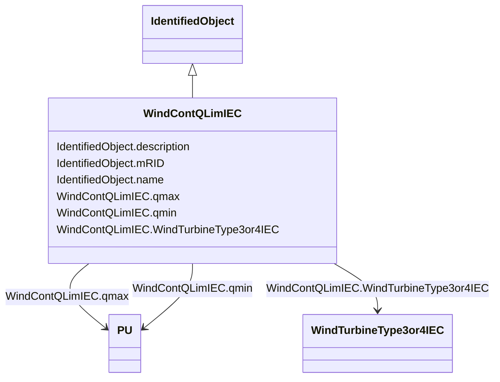

# WindContQLimIEC

_Constant Q limitation model._

_Reference: IEC 61400-27-1:2015, 5.6.5.9._

**URI**: [cim:WindContQLimIEC](http://iec.ch/TC57/CIM100#WindContQLimIEC) 
**Type**: Class

## Inheritance
* [IdentifiedObject](IdentifiedObject.md)
    * **WindContQLimIEC**

## Attributes

| Name | URI | Cardinality and Range | Description | Inheritance |
| ---  | --- | --- | --- | --- |
| qmax | [cim:WindContQLimIEC.qmax](http://iec.ch/TC57/CIM100#WindContQLimIEC.qmax) | 1    [PU](PU.md)  | Maximum reactive power (<i>q</i><i>max</i>) (&gt; WindContQLimIEC | direct |
| qmin | [cim:WindContQLimIEC.qmin](http://iec.ch/TC57/CIM100#WindContQLimIEC.qmin) | 1    [PU](PU.md)  | Minimum reactive power (<i>q</i><i>min</i>) (&lt; WindContQLimIEC | direct |
| WindTurbineType3or4IEC | [cim:WindContQLimIEC.WindTurbineType3or4IEC](http://iec.ch/TC57/CIM100#WindContQLimIEC.WindTurbineType3or4IEC) | 0..1    [WindTurbineType3or4IEC](WindTurbineType3or4IEC.md)  | Wind generator type 3 or type 4 model with which this constant Q limitation m... | direct |
| description | [cim:IdentifiedObject.description](http://iec.ch/TC57/CIM100#IdentifiedObject.description) | 0..1    string  | The description is a free human readable text describing or naming the object | [IdentifiedObject](IdentifiedObject.md) |
| mRID | [cim:IdentifiedObject.mRID](http://iec.ch/TC57/CIM100#IdentifiedObject.mRID) | 1    string  | Master resource identifier issued by a model authority | [IdentifiedObject](IdentifiedObject.md) |
| name | [cim:IdentifiedObject.name](http://iec.ch/TC57/CIM100#IdentifiedObject.name) | 0..1    string  | The name is any free human readable and possibly non unique text naming the o... | [IdentifiedObject](IdentifiedObject.md) |

## Usages

| used by | used in | type | used |
| ---  | --- | --- | --- |
| [WindTurbineType3IEC](WindTurbineType3IEC.md) | WindContQLimIEC | range | [WindContQLimIEC](WindContQLimIEC.md) |
| [WindTurbineType3or4IEC](WindTurbineType3or4IEC.md) | WindContQLimIEC | range | [WindContQLimIEC](WindContQLimIEC.md) |
| [WindTurbineType4aIEC](WindTurbineType4aIEC.md) | WindContQLimIEC | range | [WindContQLimIEC](WindContQLimIEC.md) |
| [WindTurbineType4bIEC](WindTurbineType4bIEC.md) | WindContQLimIEC | range | [WindContQLimIEC](WindContQLimIEC.md) |
| [WindTurbineType4IEC](WindTurbineType4IEC.md) | WindContQLimIEC | range | [WindContQLimIEC](WindContQLimIEC.md) |

## Identifier and Mapping Information

### Schema Source

* from schema: http://iec.ch/TC57/ns/CIM/Dynamics-EU#Package_DynamicsProfile

## Mappings

| Mapping Type | Mapped Value |
| ---  | ---  |
| self | cim:WindContQLimIEC |
| native | this:WindContQLimIEC |

