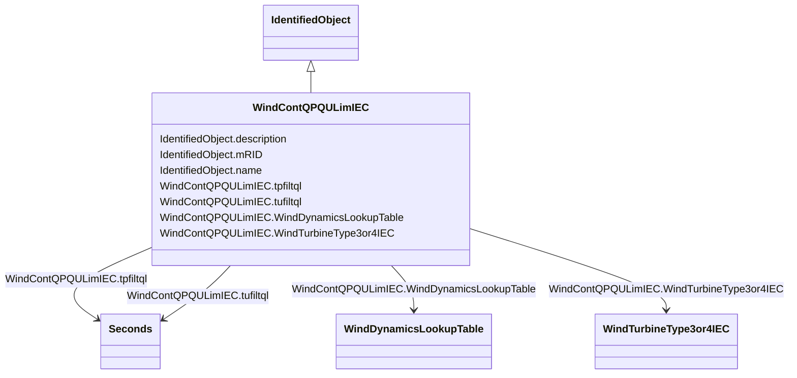

# WindContQPQULimIEC

_QP and QU limitation model._

_Reference: IEC 61400-27-1:2015, 5.6.5.10._

**URI**: [cim:WindContQPQULimIEC](http://iec.ch/TC57/CIM100#WindContQPQULimIEC) 
**Type**: Class

## Inheritance
* [IdentifiedObject](IdentifiedObject.md)
    * **WindContQPQULimIEC**

## Attributes

| Name | URI | Cardinality and Range | Description | Inheritance |
| ---  | --- | --- | --- | --- |
| tpfiltql | [cim:WindContQPQULimIEC.tpfiltql](http://iec.ch/TC57/CIM100#WindContQPQULimIEC.tpfiltql) | 1..1    [Seconds](Seconds.md)  | Power measurement filter time constant for Q capacity (<i>T</i><i>pfiltq... | direct |
| tufiltql | [cim:WindContQPQULimIEC.tufiltql](http://iec.ch/TC57/CIM100#WindContQPQULimIEC.tufiltql) | 1..1    [Seconds](Seconds.md)  | Voltage measurement filter time constant for Q capacity (<i>T</i><i>ufil... | direct |
| WindTurbineType3or4IEC | [cim:WindContQPQULimIEC.WindTurbineType3or4IEC](http://iec.ch/TC57/CIM100#WindContQPQULimIEC.WindTurbineType3or4IEC) | 0..1    [WindTurbineType3or4IEC](WindTurbineType3or4IEC.md)  | Wind generator type 3 or type 4 model with which this QP and QU limitation mo... | direct |
| WindDynamicsLookupTable | [cim:WindContQPQULimIEC.WindDynamicsLookupTable](http://iec.ch/TC57/CIM100#WindContQPQULimIEC.WindDynamicsLookupTable) | 1..*    [WindDynamicsLookupTable](WindDynamicsLookupTable.md)  | The wind dynamics lookup table associated with this QP and QU limitation mode... | direct |
| description | [cim:IdentifiedObject.description](http://iec.ch/TC57/CIM100#IdentifiedObject.description) | 0..1    string  | The description is a free human readable text describing or naming the object | [IdentifiedObject](IdentifiedObject.md) |
| mRID | [cim:IdentifiedObject.mRID](http://iec.ch/TC57/CIM100#IdentifiedObject.mRID) | 1..1    string  | Master resource identifier issued by a model authority | [IdentifiedObject](IdentifiedObject.md) |
| name | [cim:IdentifiedObject.name](http://iec.ch/TC57/CIM100#IdentifiedObject.name) | 0..1    string  | The name is any free human readable and possibly non unique text naming the o... | [IdentifiedObject](IdentifiedObject.md) |

## Usages

| used by | used in | type | used |
| ---  | --- | --- | --- |
| [WindDynamicsLookupTable](WindDynamicsLookupTable.md) | WindContQPQULimIEC | range | [WindContQPQULimIEC](WindContQPQULimIEC.md) |
| [WindTurbineType3IEC](WindTurbineType3IEC.md) | WindContQPQULimIEC | range | [WindContQPQULimIEC](WindContQPQULimIEC.md) |
| [WindTurbineType3or4IEC](WindTurbineType3or4IEC.md) | WindContQPQULimIEC | range | [WindContQPQULimIEC](WindContQPQULimIEC.md) |
| [WindTurbineType4aIEC](WindTurbineType4aIEC.md) | WindContQPQULimIEC | range | [WindContQPQULimIEC](WindContQPQULimIEC.md) |
| [WindTurbineType4bIEC](WindTurbineType4bIEC.md) | WindContQPQULimIEC | range | [WindContQPQULimIEC](WindContQPQULimIEC.md) |
| [WindTurbineType4IEC](WindTurbineType4IEC.md) | WindContQPQULimIEC | range | [WindContQPQULimIEC](WindContQPQULimIEC.md) |

## Identifier and Mapping Information

### Schema Source

* from schema: http://iec.ch/TC57/ns/CIM/Dynamics-EU#Package_DynamicsProfile

## Mappings

| Mapping Type | Mapped Value |
| ---  | ---  |
| self | cim:WindContQPQULimIEC |
| native | this:WindContQPQULimIEC |

