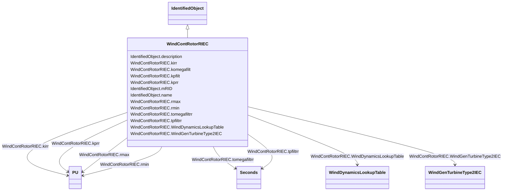

# WindContRotorRIEC

_Rotor resistance control model._

_Reference: IEC 61400-27-1:2015, 5.6.5.3._

**URI**: [cim:WindContRotorRIEC](http://iec.ch/TC57/CIM100#WindContRotorRIEC) 
**Type**: Class

## Inheritance
* [IdentifiedObject](IdentifiedObject.md)
    * **WindContRotorRIEC**

## Attributes

| Name | URI | Cardinality and Range | Description | Inheritance |
| ---  | --- | --- | --- | --- |
| kirr | [cim:WindContRotorRIEC.kirr](http://iec.ch/TC57/CIM100#WindContRotorRIEC.kirr) | 1..1    [PU](PU.md)  | Integral gain in rotor resistance PI controller (<i>K</i><i>Irr</i... | direct |
| komegafilt | [cim:WindContRotorRIEC.komegafilt](http://iec.ch/TC57/CIM100#WindContRotorRIEC.komegafilt) | 1..1    float  | Filter gain for generator speed measurement (<i>K</i><i>omegafilt<... | direct |
| kpfilt | [cim:WindContRotorRIEC.kpfilt](http://iec.ch/TC57/CIM100#WindContRotorRIEC.kpfilt) | 1..1    float  | Filter gain for power measurement (<i>K</i><i>pfilt</i>) | direct |
| kprr | [cim:WindContRotorRIEC.kprr](http://iec.ch/TC57/CIM100#WindContRotorRIEC.kprr) | 1..1    [PU](PU.md)  | Proportional gain in rotor resistance PI controller (<i>K</i><i>Prr</sub... | direct |
| rmax | [cim:WindContRotorRIEC.rmax](http://iec.ch/TC57/CIM100#WindContRotorRIEC.rmax) | 1..1    [PU](PU.md)  | Maximum rotor resistance (<i>r</i><i>max</i>) (&gt; WindContRotorR... | direct |
| rmin | [cim:WindContRotorRIEC.rmin](http://iec.ch/TC57/CIM100#WindContRotorRIEC.rmin) | 1..1    [PU](PU.md)  | Minimum rotor resistance (<i>r</i><i>min</i>) (&lt; WindContRotorR... | direct |
| tomegafiltrr | [cim:WindContRotorRIEC.tomegafiltrr](http://iec.ch/TC57/CIM100#WindContRotorRIEC.tomegafiltrr) | 1..1    [Seconds](Seconds.md)  | Filter time constant for generator speed measurement (<i>T</i><i>omegafi... | direct |
| tpfiltrr | [cim:WindContRotorRIEC.tpfiltrr](http://iec.ch/TC57/CIM100#WindContRotorRIEC.tpfiltrr) | 1..1    [Seconds](Seconds.md)  | Filter time constant for power measurement (<i>T</i><i>pfiltrr</i>... | direct |
| WindDynamicsLookupTable | [cim:WindContRotorRIEC.WindDynamicsLookupTable](http://iec.ch/TC57/CIM100#WindContRotorRIEC.WindDynamicsLookupTable) | 1..*    [WindDynamicsLookupTable](WindDynamicsLookupTable.md)  | The wind dynamics lookup table associated with this rotor resistance control ... | direct |
| WindGenTurbineType2IEC | [cim:WindContRotorRIEC.WindGenTurbineType2IEC](http://iec.ch/TC57/CIM100#WindContRotorRIEC.WindGenTurbineType2IEC) | 1..1    [WindGenTurbineType2IEC](WindGenTurbineType2IEC.md)  | Wind turbine type 2 model with whitch this wind control rotor resistance mode... | direct |
| description | [cim:IdentifiedObject.description](http://iec.ch/TC57/CIM100#IdentifiedObject.description) | 0..1    string  | The description is a free human readable text describing or naming the object | [IdentifiedObject](IdentifiedObject.md) |
| mRID | [cim:IdentifiedObject.mRID](http://iec.ch/TC57/CIM100#IdentifiedObject.mRID) | 1..1    string  | Master resource identifier issued by a model authority | [IdentifiedObject](IdentifiedObject.md) |
| name | [cim:IdentifiedObject.name](http://iec.ch/TC57/CIM100#IdentifiedObject.name) | 0..1    string  | The name is any free human readable and possibly non unique text naming the o... | [IdentifiedObject](IdentifiedObject.md) |

## Usages

| used by | used in | type | used |
| ---  | --- | --- | --- |
| [WindDynamicsLookupTable](WindDynamicsLookupTable.md) | WindContRotorRIEC | range | [WindContRotorRIEC](WindContRotorRIEC.md) |
| [WindGenTurbineType2IEC](WindGenTurbineType2IEC.md) | WindContRotorRIEC | range | [WindContRotorRIEC](WindContRotorRIEC.md) |

## Identifier and Mapping Information

### Schema Source

* from schema: http://iec.ch/TC57/ns/CIM/Dynamics-EU#Package_DynamicsProfile

## Mappings

| Mapping Type | Mapped Value |
| ---  | ---  |
| self | cim:WindContRotorRIEC |
| native | this:WindContRotorRIEC |

