# WindDynamicsLookupTable

_Look up table for the purpose of wind standard models._

**URI**: [cim:WindDynamicsLookupTable](http://iec.ch/TC57/CIM100#WindDynamicsLookupTable) 
**Type**: Class

```mermaid
 classDiagram
    class WindDynamicsLookupTable
    click WindDynamicsLookupTable href "../WindDynamicsLookupTable"
      IdentifiedObject <|-- WindDynamicsLookupTable
        click IdentifiedObject href "../IdentifiedObject"
      
      WindDynamicsLookupTable : IdentifiedObject.description
        
      WindDynamicsLookupTable : WindDynamicsLookupTable.input
        
      WindDynamicsLookupTable : WindDynamicsLookupTable.lookupTableFunctionType
        
          WindDynamicsLookupTable --> WindLookupTableFunctionKind : WindDynamicsLookupTable.lookupTableFunctionType
          click WindLookupTableFunctionKind href "../WindLookupTableFunctionKind"
        
      WindDynamicsLookupTable : IdentifiedObject.mRID
        
      WindDynamicsLookupTable : IdentifiedObject.name
        
      WindDynamicsLookupTable : WindDynamicsLookupTable.output
        
      WindDynamicsLookupTable : WindDynamicsLookupTable.sequence
        
      WindDynamicsLookupTable : WindDynamicsLookupTable.WindContCurrLimIEC
        
          WindDynamicsLookupTable --> WindContCurrLimIEC : WindDynamicsLookupTable.WindContCurrLimIEC
          click WindContCurrLimIEC href "../WindContCurrLimIEC"
        
      WindDynamicsLookupTable : WindDynamicsLookupTable.WindContPType3IEC
        
          WindDynamicsLookupTable --> WindContPType3IEC : WindDynamicsLookupTable.WindContPType3IEC
          click WindContPType3IEC href "../WindContPType3IEC"
        
      WindDynamicsLookupTable : WindDynamicsLookupTable.WindContQPQULimIEC
        
          WindDynamicsLookupTable --> WindContQPQULimIEC : WindDynamicsLookupTable.WindContQPQULimIEC
          click WindContQPQULimIEC href "../WindContQPQULimIEC"
        
      WindDynamicsLookupTable : WindDynamicsLookupTable.WindContRotorRIEC
        
          WindDynamicsLookupTable --> WindContRotorRIEC : WindDynamicsLookupTable.WindContRotorRIEC
          click WindContRotorRIEC href "../WindContRotorRIEC"
        
      WindDynamicsLookupTable : WindDynamicsLookupTable.WindGenType3bIEC
        
          WindDynamicsLookupTable --> WindGenType3bIEC : WindDynamicsLookupTable.WindGenType3bIEC
          click WindGenType3bIEC href "../WindGenType3bIEC"
        
      WindDynamicsLookupTable : WindDynamicsLookupTable.WindPitchContPowerIEC
        
          WindDynamicsLookupTable --> WindPitchContPowerIEC : WindDynamicsLookupTable.WindPitchContPowerIEC
          click WindPitchContPowerIEC href "../WindPitchContPowerIEC"
        
      WindDynamicsLookupTable : WindDynamicsLookupTable.WindPlantFreqPcontrolIEC
        
          WindDynamicsLookupTable --> WindPlantFreqPcontrolIEC : WindDynamicsLookupTable.WindPlantFreqPcontrolIEC
          click WindPlantFreqPcontrolIEC href "../WindPlantFreqPcontrolIEC"
        
      WindDynamicsLookupTable : WindDynamicsLookupTable.WindPlantReactiveControlIEC
        
          WindDynamicsLookupTable --> WindPlantReactiveControlIEC : WindDynamicsLookupTable.WindPlantReactiveControlIEC
          click WindPlantReactiveControlIEC href "../WindPlantReactiveControlIEC"
        
      WindDynamicsLookupTable : WindDynamicsLookupTable.WindProtectionIEC
        
          WindDynamicsLookupTable --> WindProtectionIEC : WindDynamicsLookupTable.WindProtectionIEC
          click WindProtectionIEC href "../WindProtectionIEC"
        
      
```

## Inheritance
* [IdentifiedObject](IdentifiedObject.md)
    * **WindDynamicsLookupTable**

## Attributes

| Name | URI | Cardinality and Range | Description | Inheritance |
| ---  | --- | --- | --- | --- |
| WindContCurrLimIEC | [cim:WindDynamicsLookupTable.WindContCurrLimIEC](http://iec.ch/TC57/CIM100#WindDynamicsLookupTable.WindContCurrLimIEC) | 0..1    [WindContCurrLimIEC](WindContCurrLimIEC.md)  | The current control limitation model with which this wind dynamics lookup tab... | direct |
| WindContPType3IEC | [cim:WindDynamicsLookupTable.WindContPType3IEC](http://iec.ch/TC57/CIM100#WindDynamicsLookupTable.WindContPType3IEC) | 0..1    [WindContPType3IEC](WindContPType3IEC.md)  | The P control type 3 model with which this wind dynamics lookup table is asso... | direct |
| WindContQPQULimIEC | [cim:WindDynamicsLookupTable.WindContQPQULimIEC](http://iec.ch/TC57/CIM100#WindDynamicsLookupTable.WindContQPQULimIEC) | 0..1    [WindContQPQULimIEC](WindContQPQULimIEC.md)  | The QP and QU limitation model with which this wind dynamics lookup table is ... | direct |
| WindContRotorRIEC | [cim:WindDynamicsLookupTable.WindContRotorRIEC](http://iec.ch/TC57/CIM100#WindDynamicsLookupTable.WindContRotorRIEC) | 0..1    [WindContRotorRIEC](WindContRotorRIEC.md)  | The rotor resistance control model with which this wind dynamics lookup table... | direct |
| input | [cim:WindDynamicsLookupTable.input](http://iec.ch/TC57/CIM100#WindDynamicsLookupTable.input) | 1    float  | Input value (<i>x</i>) for the lookup table function | direct |
| lookupTableFunctionType | [cim:WindDynamicsLookupTable.lookupTableFunctionType](http://iec.ch/TC57/CIM100#WindDynamicsLookupTable.lookupTableFunctionType) | 1    [WindLookupTableFunctionKind](WindLookupTableFunctionKind.md)  | Type of the lookup table function | direct |
| output | [cim:WindDynamicsLookupTable.output](http://iec.ch/TC57/CIM100#WindDynamicsLookupTable.output) | 1    float  | Output value (<i>y</i>) for the lookup table function | direct |
| sequence | [cim:WindDynamicsLookupTable.sequence](http://iec.ch/TC57/CIM100#WindDynamicsLookupTable.sequence) | 1    integer  | Sequence numbers of the pairs of the input (<i>x</i>) and the output (<i>y</i... | direct |
| WindPlantFreqPcontrolIEC | [cim:WindDynamicsLookupTable.WindPlantFreqPcontrolIEC](http://iec.ch/TC57/CIM100#WindDynamicsLookupTable.WindPlantFreqPcontrolIEC) | 0..1    [WindPlantFreqPcontrolIEC](WindPlantFreqPcontrolIEC.md)  | The frequency and active power wind plant control model with which this wind ... | direct |
| WindProtectionIEC | [cim:WindDynamicsLookupTable.WindProtectionIEC](http://iec.ch/TC57/CIM100#WindDynamicsLookupTable.WindProtectionIEC) | 0..1    [WindProtectionIEC](WindProtectionIEC.md)  | The grid protection model with which this wind dynamics lookup table is assoc... | direct |
| WindPlantReactiveControlIEC | [cim:WindDynamicsLookupTable.WindPlantReactiveControlIEC](http://iec.ch/TC57/CIM100#WindDynamicsLookupTable.WindPlantReactiveControlIEC) | 0..1    [WindPlantReactiveControlIEC](WindPlantReactiveControlIEC.md)  | The voltage and reactive power wind plant control model with which this wind ... | direct |
| WindGenType3bIEC | [cim:WindDynamicsLookupTable.WindGenType3bIEC](http://iec.ch/TC57/CIM100#WindDynamicsLookupTable.WindGenType3bIEC) | 0..1    [WindGenType3bIEC](WindGenType3bIEC.md)  | The generator type 3B model with which this wind dynamics lookup table is ass... | direct |
| WindPitchContPowerIEC | [cim:WindDynamicsLookupTable.WindPitchContPowerIEC](http://iec.ch/TC57/CIM100#WindDynamicsLookupTable.WindPitchContPowerIEC) | 0..1    [WindPitchContPowerIEC](WindPitchContPowerIEC.md)  | The pitch control power model with which this wind dynamics lookup table is a... | direct |
| description | [cim:IdentifiedObject.description](http://iec.ch/TC57/CIM100#IdentifiedObject.description) | 0..1    string  | The description is a free human readable text describing or naming the object | [IdentifiedObject](IdentifiedObject.md) |
| mRID | [cim:IdentifiedObject.mRID](http://iec.ch/TC57/CIM100#IdentifiedObject.mRID) | 1    string  | Master resource identifier issued by a model authority | [IdentifiedObject](IdentifiedObject.md) |
| name | [cim:IdentifiedObject.name](http://iec.ch/TC57/CIM100#IdentifiedObject.name) | 0..1    string  | The name is any free human readable and possibly non unique text naming the o... | [IdentifiedObject](IdentifiedObject.md) |

## Usages

| used by | used in | type | used |
| ---  | --- | --- | --- |
| [WindContCurrLimIEC](WindContCurrLimIEC.md) | WindDynamicsLookupTable | range | [WindDynamicsLookupTable](WindDynamicsLookupTable.md) |
| [WindContPType3IEC](WindContPType3IEC.md) | WindDynamicsLookupTable | range | [WindDynamicsLookupTable](WindDynamicsLookupTable.md) |
| [WindContQPQULimIEC](WindContQPQULimIEC.md) | WindDynamicsLookupTable | range | [WindDynamicsLookupTable](WindDynamicsLookupTable.md) |
| [WindContRotorRIEC](WindContRotorRIEC.md) | WindDynamicsLookupTable | range | [WindDynamicsLookupTable](WindDynamicsLookupTable.md) |
| [WindGenType3bIEC](WindGenType3bIEC.md) | WindDynamicsLookupTable | range | [WindDynamicsLookupTable](WindDynamicsLookupTable.md) |
| [WindPitchContPowerIEC](WindPitchContPowerIEC.md) | WindDynamicsLookupTable | range | [WindDynamicsLookupTable](WindDynamicsLookupTable.md) |
| [WindPlantFreqPcontrolIEC](WindPlantFreqPcontrolIEC.md) | WindDynamicsLookupTable | range | [WindDynamicsLookupTable](WindDynamicsLookupTable.md) |
| [WindPlantReactiveControlIEC](WindPlantReactiveControlIEC.md) | WindDynamicsLookupTable | range | [WindDynamicsLookupTable](WindDynamicsLookupTable.md) |
| [WindProtectionIEC](WindProtectionIEC.md) | WindDynamicsLookupTable | range | [WindDynamicsLookupTable](WindDynamicsLookupTable.md) |

## Identifier and Mapping Information

### Schema Source

* from schema: http://iec.ch/TC57/ns/CIM/Dynamics-EU#Package_DynamicsProfile

## Mappings

| Mapping Type | Mapped Value |
| ---  | ---  |
| self | cim:WindDynamicsLookupTable |
| native | this:WindDynamicsLookupTable |

