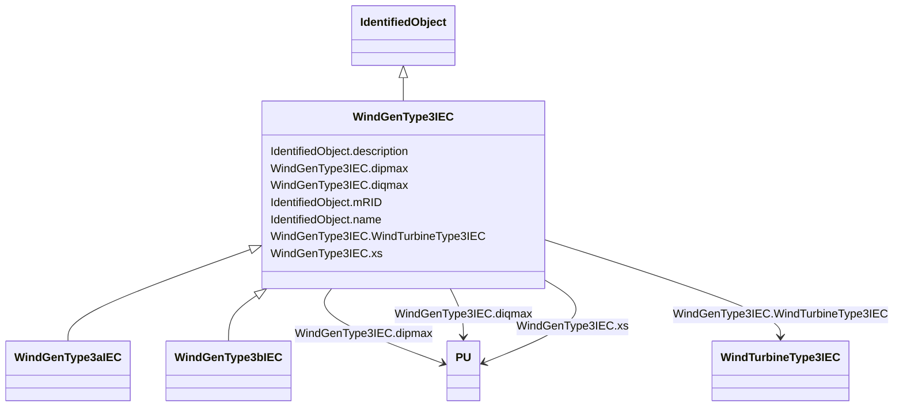

# WindGenType3IEC

_Parent class supporting relationships to IEC wind turbines type 3 generator models of IEC type 3A and 3B._

**URI**: [cim:WindGenType3IEC](http://iec.ch/TC57/CIM100#WindGenType3IEC) 
**Type**: Class

## Inheritance
* [IdentifiedObject](IdentifiedObject.md)
    * **WindGenType3IEC**
        * [WindGenType3aIEC](WindGenType3aIEC.md)
        * [WindGenType3bIEC](WindGenType3bIEC.md)

## Attributes

| Name | URI | Cardinality and Range | Description | Inheritance |
| ---  | --- | --- | --- | --- |
| dipmax | [cim:WindGenType3IEC.dipmax](http://iec.ch/TC57/CIM100#WindGenType3IEC.dipmax) | 1..1    [PU](PU.md)  | Maximum active current ramp rate (<i>di</i><i>pmax</i>) | direct |
| diqmax | [cim:WindGenType3IEC.diqmax](http://iec.ch/TC57/CIM100#WindGenType3IEC.diqmax) | 1..1    [PU](PU.md)  | Maximum reactive current ramp rate (<i>di</i><i>qmax</i>) | direct |
| xs | [cim:WindGenType3IEC.xs](http://iec.ch/TC57/CIM100#WindGenType3IEC.xs) | 1..1    [PU](PU.md)  | Electromagnetic transient reactance (<i>x</i><i>S</i>) | direct |
| WindTurbineType3IEC | [cim:WindGenType3IEC.WindTurbineType3IEC](http://iec.ch/TC57/CIM100#WindGenType3IEC.WindTurbineType3IEC) | 0..1    [WindTurbineType3IEC](WindTurbineType3IEC.md)  | Wind turbine type 3 model with which this wind generator type 3 is associated | direct |
| description | [cim:IdentifiedObject.description](http://iec.ch/TC57/CIM100#IdentifiedObject.description) | 0..1    string  | The description is a free human readable text describing or naming the object | [IdentifiedObject](IdentifiedObject.md) |
| mRID | [cim:IdentifiedObject.mRID](http://iec.ch/TC57/CIM100#IdentifiedObject.mRID) | 1..1    string  | Master resource identifier issued by a model authority | [IdentifiedObject](IdentifiedObject.md) |
| name | [cim:IdentifiedObject.name](http://iec.ch/TC57/CIM100#IdentifiedObject.name) | 0..1    string  | The name is any free human readable and possibly non unique text naming the o... | [IdentifiedObject](IdentifiedObject.md) |

## Usages

| used by | used in | type | used |
| ---  | --- | --- | --- |
| [WindTurbineType3IEC](WindTurbineType3IEC.md) | WindGenType3IEC | range | [WindGenType3IEC](WindGenType3IEC.md) |

## Identifier and Mapping Information

### Schema Source

* from schema: http://iec.ch/TC57/ns/CIM/Dynamics-EU#Package_DynamicsProfile

## Mappings

| Mapping Type | Mapped Value |
| ---  | ---  |
| self | cim:WindGenType3IEC |
| native | this:WindGenType3IEC |

