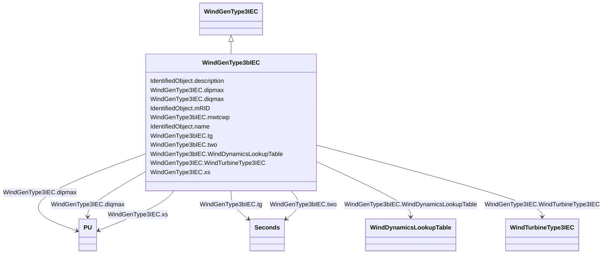

# WindGenType3bIEC

_IEC type 3B generator set model._

_Reference: IEC 61400-27-1:2015, 5.6.3.3._

**URI**: [cim:WindGenType3bIEC](http://iec.ch/TC57/CIM100#WindGenType3bIEC) 
**Type**: Class

## Inheritance
* [IdentifiedObject](IdentifiedObject.md)
    * [WindGenType3IEC](WindGenType3IEC.md)
        * **WindGenType3bIEC**

## Attributes

| Name | URI | Cardinality and Range | Description | Inheritance |
| ---  | --- | --- | --- | --- |
| WindDynamicsLookupTable | [cim:WindGenType3bIEC.WindDynamicsLookupTable](http://iec.ch/TC57/CIM100#WindGenType3bIEC.WindDynamicsLookupTable) | 1..*    [WindDynamicsLookupTable](WindDynamicsLookupTable.md)  | The wind dynamics lookup table associated with this generator type 3B model | direct |
| mwtcwp | [cim:WindGenType3bIEC.mwtcwp](http://iec.ch/TC57/CIM100#WindGenType3bIEC.mwtcwp) | 1    boolean  | Crowbar control mode (<i>M</i><i>WTcwp</i>) | direct |
| tg | [cim:WindGenType3bIEC.tg](http://iec.ch/TC57/CIM100#WindGenType3bIEC.tg) | 1    [Seconds](Seconds.md)  | Current generation time constant (<i>T</i><i>g</i>) (&gt;= 0) | direct |
| two | [cim:WindGenType3bIEC.two](http://iec.ch/TC57/CIM100#WindGenType3bIEC.two) | 1    [Seconds](Seconds.md)  | Time constant for crowbar washout filter (<i>T</i><i>wo</i>) (&gt;... | direct |
| dipmax | [cim:WindGenType3IEC.dipmax](http://iec.ch/TC57/CIM100#WindGenType3IEC.dipmax) | 1    [PU](PU.md)  | Maximum active current ramp rate (<i>di</i><i>pmax</i>) | [WindGenType3IEC](WindGenType3IEC.md) |
| diqmax | [cim:WindGenType3IEC.diqmax](http://iec.ch/TC57/CIM100#WindGenType3IEC.diqmax) | 1    [PU](PU.md)  | Maximum reactive current ramp rate (<i>di</i><i>qmax</i>) | [WindGenType3IEC](WindGenType3IEC.md) |
| xs | [cim:WindGenType3IEC.xs](http://iec.ch/TC57/CIM100#WindGenType3IEC.xs) | 1    [PU](PU.md)  | Electromagnetic transient reactance (<i>x</i><i>S</i>) | [WindGenType3IEC](WindGenType3IEC.md) |
| WindTurbineType3IEC | [cim:WindGenType3IEC.WindTurbineType3IEC](http://iec.ch/TC57/CIM100#WindGenType3IEC.WindTurbineType3IEC) | 0..1    [WindTurbineType3IEC](WindTurbineType3IEC.md)  | Wind turbine type 3 model with which this wind generator type 3 is associated | [WindGenType3IEC](WindGenType3IEC.md) |
| description | [cim:IdentifiedObject.description](http://iec.ch/TC57/CIM100#IdentifiedObject.description) | 0..1    string  | The description is a free human readable text describing or naming the object | [IdentifiedObject](IdentifiedObject.md) |
| mRID | [cim:IdentifiedObject.mRID](http://iec.ch/TC57/CIM100#IdentifiedObject.mRID) | 1    string  | Master resource identifier issued by a model authority | [IdentifiedObject](IdentifiedObject.md) |
| name | [cim:IdentifiedObject.name](http://iec.ch/TC57/CIM100#IdentifiedObject.name) | 0..1    string  | The name is any free human readable and possibly non unique text naming the o... | [IdentifiedObject](IdentifiedObject.md) |

## Usages

| used by | used in | type | used |
| ---  | --- | --- | --- |
| [WindDynamicsLookupTable](WindDynamicsLookupTable.md) | WindGenType3bIEC | range | [WindGenType3bIEC](WindGenType3bIEC.md) |

## Identifier and Mapping Information

### Schema Source

* from schema: http://iec.ch/TC57/ns/CIM/Dynamics-EU#Package_DynamicsProfile

## Mappings

| Mapping Type | Mapped Value |
| ---  | ---  |
| self | cim:WindGenType3bIEC |
| native | this:WindGenType3bIEC |

