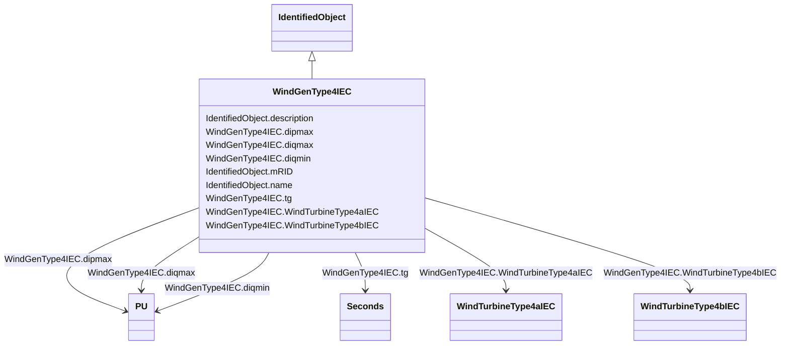

# WindGenType4IEC

_IEC type 4 generator set model._

_Reference: IEC 61400-27-1:2015, 5.6.3.4._

**URI**: [cim:WindGenType4IEC](http://iec.ch/TC57/CIM100#WindGenType4IEC) 
**Type**: Class

## Inheritance
* [IdentifiedObject](IdentifiedObject.md)
    * **WindGenType4IEC**

## Attributes

| Name | URI | Cardinality and Range | Description | Inheritance |
| ---  | --- | --- | --- | --- |
| dipmax | [cim:WindGenType4IEC.dipmax](http://iec.ch/TC57/CIM100#WindGenType4IEC.dipmax) | 1..1    [PU](PU.md)  | Maximum active current ramp rate (<i>di</i><i>pmax</i>) | direct |
| diqmin | [cim:WindGenType4IEC.diqmin](http://iec.ch/TC57/CIM100#WindGenType4IEC.diqmin) | 1..1    [PU](PU.md)  | Minimum reactive current ramp rate (<i>di</i><i>qmin</i>) | direct |
| diqmax | [cim:WindGenType4IEC.diqmax](http://iec.ch/TC57/CIM100#WindGenType4IEC.diqmax) | 1..1    [PU](PU.md)  | Maximum reactive current ramp rate (<i>di</i><i>qmax</i>) | direct |
| tg | [cim:WindGenType4IEC.tg](http://iec.ch/TC57/CIM100#WindGenType4IEC.tg) | 1..1    [Seconds](Seconds.md)  | Time constant (<i>T</i><i>g</i>) (&gt;= 0) | direct |
| WindTurbineType4aIEC | [cim:WindGenType4IEC.WindTurbineType4aIEC](http://iec.ch/TC57/CIM100#WindGenType4IEC.WindTurbineType4aIEC) | 0..1    [WindTurbineType4aIEC](WindTurbineType4aIEC.md)  | Wind turbine type 4A model with which this wind generator type 4 model is ass... | direct |
| WindTurbineType4bIEC | [cim:WindGenType4IEC.WindTurbineType4bIEC](http://iec.ch/TC57/CIM100#WindGenType4IEC.WindTurbineType4bIEC) | 0..1    [WindTurbineType4bIEC](WindTurbineType4bIEC.md)  | Wind turbine type 4B model with which this wind generator type 4 model is ass... | direct |
| description | [cim:IdentifiedObject.description](http://iec.ch/TC57/CIM100#IdentifiedObject.description) | 0..1    string  | The description is a free human readable text describing or naming the object | [IdentifiedObject](IdentifiedObject.md) |
| mRID | [cim:IdentifiedObject.mRID](http://iec.ch/TC57/CIM100#IdentifiedObject.mRID) | 1..1    string  | Master resource identifier issued by a model authority | [IdentifiedObject](IdentifiedObject.md) |
| name | [cim:IdentifiedObject.name](http://iec.ch/TC57/CIM100#IdentifiedObject.name) | 0..1    string  | The name is any free human readable and possibly non unique text naming the o... | [IdentifiedObject](IdentifiedObject.md) |

## Usages

| used by | used in | type | used |
| ---  | --- | --- | --- |
| [WindTurbineType4aIEC](WindTurbineType4aIEC.md) | WindGenType4IEC | range | [WindGenType4IEC](WindGenType4IEC.md) |
| [WindTurbineType4bIEC](WindTurbineType4bIEC.md) | WindGenType4IEC | range | [WindGenType4IEC](WindGenType4IEC.md) |

## Identifier and Mapping Information

### Schema Source

* from schema: http://iec.ch/TC57/ns/CIM/Dynamics-EU#Package_DynamicsProfile

## Mappings

| Mapping Type | Mapped Value |
| ---  | ---  |
| self | cim:WindGenType4IEC |
| native | this:WindGenType4IEC |

