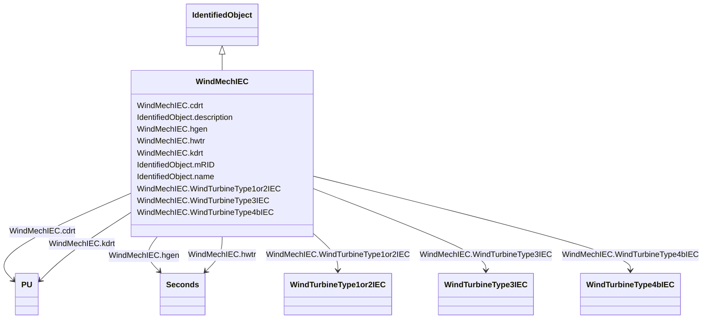

# WindMechIEC

_Two mass model._

_Reference: IEC 61400-27-1:2015, 5.6.2.1._

**URI**: [cim:WindMechIEC](http://iec.ch/TC57/CIM100#WindMechIEC) 
**Type**: Class

## Inheritance
* [IdentifiedObject](IdentifiedObject.md)
    * **WindMechIEC**

## Attributes

| Name | URI | Cardinality and Range | Description | Inheritance |
| ---  | --- | --- | --- | --- |
| cdrt | [cim:WindMechIEC.cdrt](http://iec.ch/TC57/CIM100#WindMechIEC.cdrt) | 1    [PU](PU.md)  | Drive train damping (<i>c</i><i>drt</i><i>)</i> | direct |
| hgen | [cim:WindMechIEC.hgen](http://iec.ch/TC57/CIM100#WindMechIEC.hgen) | 1    [Seconds](Seconds.md)  | Inertia constant of generator (<i>H</i><i>gen</i>) (&gt;= 0) | direct |
| hwtr | [cim:WindMechIEC.hwtr](http://iec.ch/TC57/CIM100#WindMechIEC.hwtr) | 1    [Seconds](Seconds.md)  | Inertia constant of wind turbine rotor (<i>H</i><i>WTR</i>) (&gt;=... | direct |
| kdrt | [cim:WindMechIEC.kdrt](http://iec.ch/TC57/CIM100#WindMechIEC.kdrt) | 1    [PU](PU.md)  | Drive train stiffness (<i>k</i><i>drt</i>) | direct |
| WindTurbineType3IEC | [cim:WindMechIEC.WindTurbineType3IEC](http://iec.ch/TC57/CIM100#WindMechIEC.WindTurbineType3IEC) | 0..1    [WindTurbineType3IEC](WindTurbineType3IEC.md)  | Wind turbine type 3 model with which this wind mechanical model is associated | direct |
| WindTurbineType1or2IEC | [cim:WindMechIEC.WindTurbineType1or2IEC](http://iec.ch/TC57/CIM100#WindMechIEC.WindTurbineType1or2IEC) | 0..1    [WindTurbineType1or2IEC](WindTurbineType1or2IEC.md)  | Wind generator type 1 or type 2 model with which this wind mechanical model i... | direct |
| WindTurbineType4bIEC | [cim:WindMechIEC.WindTurbineType4bIEC](http://iec.ch/TC57/CIM100#WindMechIEC.WindTurbineType4bIEC) | 0..1    [WindTurbineType4bIEC](WindTurbineType4bIEC.md)  | Wind turbine type 4B model with which this wind mechanical model is associate... | direct |
| description | [cim:IdentifiedObject.description](http://iec.ch/TC57/CIM100#IdentifiedObject.description) | 0..1    string  | The description is a free human readable text describing or naming the object | [IdentifiedObject](IdentifiedObject.md) |
| mRID | [cim:IdentifiedObject.mRID](http://iec.ch/TC57/CIM100#IdentifiedObject.mRID) | 1    string  | Master resource identifier issued by a model authority | [IdentifiedObject](IdentifiedObject.md) |
| name | [cim:IdentifiedObject.name](http://iec.ch/TC57/CIM100#IdentifiedObject.name) | 0..1    string  | The name is any free human readable and possibly non unique text naming the o... | [IdentifiedObject](IdentifiedObject.md) |

## Usages

| used by | used in | type | used |
| ---  | --- | --- | --- |
| [WindGenTurbineType1aIEC](WindGenTurbineType1aIEC.md) | WindMechIEC | range | [WindMechIEC](WindMechIEC.md) |
| [WindGenTurbineType1bIEC](WindGenTurbineType1bIEC.md) | WindMechIEC | range | [WindMechIEC](WindMechIEC.md) |
| [WindGenTurbineType2IEC](WindGenTurbineType2IEC.md) | WindMechIEC | range | [WindMechIEC](WindMechIEC.md) |
| [WindTurbineType1or2IEC](WindTurbineType1or2IEC.md) | WindMechIEC | range | [WindMechIEC](WindMechIEC.md) |
| [WindTurbineType3IEC](WindTurbineType3IEC.md) | WindMechIEC | range | [WindMechIEC](WindMechIEC.md) |
| [WindTurbineType4bIEC](WindTurbineType4bIEC.md) | WindMechIEC | range | [WindMechIEC](WindMechIEC.md) |

## Identifier and Mapping Information

### Schema Source

* from schema: http://iec.ch/TC57/ns/CIM/Dynamics-EU#Package_DynamicsProfile

## Mappings

| Mapping Type | Mapped Value |
| ---  | ---  |
| self | cim:WindMechIEC |
| native | this:WindMechIEC |

