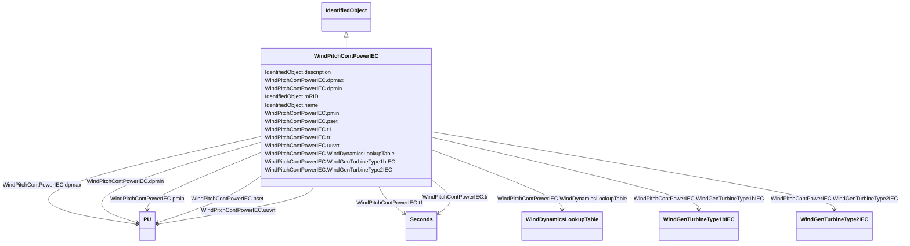

# WindPitchContPowerIEC

_Pitch control power model._

_Reference: IEC 61400-27-1:2015, 5.6.5.1._

**URI**: [cim:WindPitchContPowerIEC](http://iec.ch/TC57/CIM100#WindPitchContPowerIEC) 
**Type**: Class

## Inheritance
* [IdentifiedObject](IdentifiedObject.md)
    * **WindPitchContPowerIEC**

## Attributes

| Name | URI | Cardinality and Range | Description | Inheritance |
| ---  | --- | --- | --- | --- |
| WindDynamicsLookupTable | [cim:WindPitchContPowerIEC.WindDynamicsLookupTable](http://iec.ch/TC57/CIM100#WindPitchContPowerIEC.WindDynamicsLookupTable) | 1..*    [WindDynamicsLookupTable](WindDynamicsLookupTable.md)  | The wind dynamics lookup table associated with this pitch control power model | direct |
| WindGenTurbineType1bIEC | [cim:WindPitchContPowerIEC.WindGenTurbineType1bIEC](http://iec.ch/TC57/CIM100#WindPitchContPowerIEC.WindGenTurbineType1bIEC) | 0..1    [WindGenTurbineType1bIEC](WindGenTurbineType1bIEC.md)  | Wind turbine type 1B model with which this pitch control power model is assoc... | direct |
| WindGenTurbineType2IEC | [cim:WindPitchContPowerIEC.WindGenTurbineType2IEC](http://iec.ch/TC57/CIM100#WindPitchContPowerIEC.WindGenTurbineType2IEC) | 0..1    [WindGenTurbineType2IEC](WindGenTurbineType2IEC.md)  | Wind turbine type 2 model with which this pitch control power model is associ... | direct |
| dpmax | [cim:WindPitchContPowerIEC.dpmax](http://iec.ch/TC57/CIM100#WindPitchContPowerIEC.dpmax) | 1..1    [PU](PU.md)  | Rate limit for increasing power (<i>dp</i><i>max</i>) (&gt; WindPi... | direct |
| dpmin | [cim:WindPitchContPowerIEC.dpmin](http://iec.ch/TC57/CIM100#WindPitchContPowerIEC.dpmin) | 1..1    [PU](PU.md)  | Rate limit for decreasing power (<i>dp</i><i>min</i>) (&lt; WindPi... | direct |
| pmin | [cim:WindPitchContPowerIEC.pmin](http://iec.ch/TC57/CIM100#WindPitchContPowerIEC.pmin) | 1..1    [PU](PU.md)  | Minimum power setting (<i>p</i><i>min</i>) | direct |
| pset | [cim:WindPitchContPowerIEC.pset](http://iec.ch/TC57/CIM100#WindPitchContPowerIEC.pset) | 1..1    [PU](PU.md)  | If <i>p</i><i>init</i> &lt; <i>p</i><i>set</... | direct |
| t1 | [cim:WindPitchContPowerIEC.t1](http://iec.ch/TC57/CIM100#WindPitchContPowerIEC.t1) | 1..1    [Seconds](Seconds.md)  | Lag time constant (<i>T</i><i>1</i>) (&gt;= 0) | direct |
| tr | [cim:WindPitchContPowerIEC.tr](http://iec.ch/TC57/CIM100#WindPitchContPowerIEC.tr) | 1..1    [Seconds](Seconds.md)  | Voltage measurement time constant (<i>T</i><i>r</i>) (&gt;= 0) | direct |
| uuvrt | [cim:WindPitchContPowerIEC.uuvrt](http://iec.ch/TC57/CIM100#WindPitchContPowerIEC.uuvrt) | 1..1    [PU](PU.md)  | Dip detection threshold (<i>u</i><i>UVRT</i>) | direct |
| description | [cim:IdentifiedObject.description](http://iec.ch/TC57/CIM100#IdentifiedObject.description) | 0..1    string  | The description is a free human readable text describing or naming the object | [IdentifiedObject](IdentifiedObject.md) |
| mRID | [cim:IdentifiedObject.mRID](http://iec.ch/TC57/CIM100#IdentifiedObject.mRID) | 1..1    string  | Master resource identifier issued by a model authority | [IdentifiedObject](IdentifiedObject.md) |
| name | [cim:IdentifiedObject.name](http://iec.ch/TC57/CIM100#IdentifiedObject.name) | 0..1    string  | The name is any free human readable and possibly non unique text naming the o... | [IdentifiedObject](IdentifiedObject.md) |

## Usages

| used by | used in | type | used |
| ---  | --- | --- | --- |
| [WindDynamicsLookupTable](WindDynamicsLookupTable.md) | WindPitchContPowerIEC | range | [WindPitchContPowerIEC](WindPitchContPowerIEC.md) |
| [WindGenTurbineType1bIEC](WindGenTurbineType1bIEC.md) | WindPitchContPowerIEC | range | [WindPitchContPowerIEC](WindPitchContPowerIEC.md) |
| [WindGenTurbineType2IEC](WindGenTurbineType2IEC.md) | WindPitchContPowerIEC | range | [WindPitchContPowerIEC](WindPitchContPowerIEC.md) |

## Identifier and Mapping Information

### Schema Source

* from schema: http://iec.ch/TC57/ns/CIM/Dynamics-EU#Package_DynamicsProfile

## Mappings

| Mapping Type | Mapped Value |
| ---  | ---  |
| self | cim:WindPitchContPowerIEC |
| native | this:WindPitchContPowerIEC |

