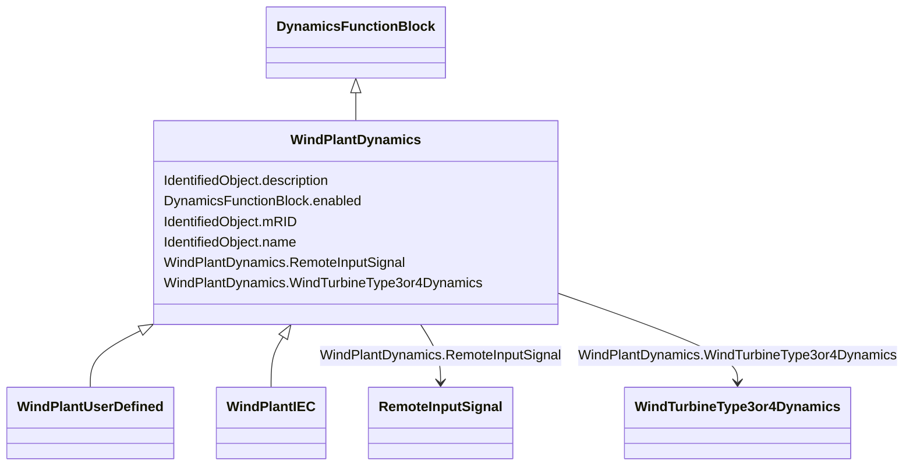

# WindPlantDynamics

_Parent class supporting relationships to wind turbines type 3 and type 4 and wind plant IEC and user-defined wind plants including their control models._

**URI**: [cim:WindPlantDynamics](http://iec.ch/TC57/CIM100#WindPlantDynamics) 
**Type**: Class

## Inheritance
* [IdentifiedObject](IdentifiedObject.md)
    * [DynamicsFunctionBlock](DynamicsFunctionBlock.md)
        * **WindPlantDynamics**
            * [WindPlantUserDefined](WindPlantUserDefined.md)
            * [WindPlantIEC](WindPlantIEC.md)

## Attributes

| Name | URI | Cardinality and Range | Description | Inheritance |
| ---  | --- | --- | --- | --- |
| RemoteInputSignal | [cim:WindPlantDynamics.RemoteInputSignal](http://iec.ch/TC57/CIM100#WindPlantDynamics.RemoteInputSignal) | 0..1    [RemoteInputSignal](RemoteInputSignal.md)  | The remote signal with which this power plant is associated | direct |
| WindTurbineType3or4Dynamics | [cim:WindPlantDynamics.WindTurbineType3or4Dynamics](http://iec.ch/TC57/CIM100#WindPlantDynamics.WindTurbineType3or4Dynamics) | 1..*    [WindTurbineType3or4Dynamics](WindTurbineType3or4Dynamics.md)  | The wind turbine type 3 or type 4 associated with this wind plant | direct |
| enabled | [cim:DynamicsFunctionBlock.enabled](http://iec.ch/TC57/CIM100#DynamicsFunctionBlock.enabled) | 1    boolean  | Function block used indicator | [DynamicsFunctionBlock](DynamicsFunctionBlock.md) |
| description | [cim:IdentifiedObject.description](http://iec.ch/TC57/CIM100#IdentifiedObject.description) | 0..1    string  | The description is a free human readable text describing or naming the object | [IdentifiedObject](IdentifiedObject.md) |
| mRID | [cim:IdentifiedObject.mRID](http://iec.ch/TC57/CIM100#IdentifiedObject.mRID) | 1    string  | Master resource identifier issued by a model authority | [IdentifiedObject](IdentifiedObject.md) |
| name | [cim:IdentifiedObject.name](http://iec.ch/TC57/CIM100#IdentifiedObject.name) | 0..1    string  | The name is any free human readable and possibly non unique text naming the o... | [IdentifiedObject](IdentifiedObject.md) |

## Usages

| used by | used in | type | used |
| ---  | --- | --- | --- |
| [RemoteInputSignal](RemoteInputSignal.md) | WindPlantDynamics | range | [WindPlantDynamics](WindPlantDynamics.md) |
| [WindType3or4UserDefined](WindType3or4UserDefined.md) | WindPlantDynamics | range | [WindPlantDynamics](WindPlantDynamics.md) |
| [WindTurbineType3IEC](WindTurbineType3IEC.md) | WindPlantDynamics | range | [WindPlantDynamics](WindPlantDynamics.md) |
| [WindTurbineType3or4Dynamics](WindTurbineType3or4Dynamics.md) | WindPlantDynamics | range | [WindPlantDynamics](WindPlantDynamics.md) |
| [WindTurbineType3or4IEC](WindTurbineType3or4IEC.md) | WindPlantDynamics | range | [WindPlantDynamics](WindPlantDynamics.md) |
| [WindTurbineType4aIEC](WindTurbineType4aIEC.md) | WindPlantDynamics | range | [WindPlantDynamics](WindPlantDynamics.md) |
| [WindTurbineType4bIEC](WindTurbineType4bIEC.md) | WindPlantDynamics | range | [WindPlantDynamics](WindPlantDynamics.md) |
| [WindTurbineType4IEC](WindTurbineType4IEC.md) | WindPlantDynamics | range | [WindPlantDynamics](WindPlantDynamics.md) |

## Identifier and Mapping Information

### Schema Source

* from schema: http://iec.ch/TC57/ns/CIM/Dynamics-EU#Package_DynamicsProfile

## Mappings

| Mapping Type | Mapped Value |
| ---  | ---  |
| self | cim:WindPlantDynamics |
| native | this:WindPlantDynamics |

