# WindPlantFreqPcontrolIEC

_Frequency and active power controller model._

_Reference: IEC 61400-27-1:2015, Annex D._

**URI**: [cim:WindPlantFreqPcontrolIEC](http://iec.ch/TC57/CIM100#WindPlantFreqPcontrolIEC) 
**Type**: Class

```mermaid
 classDiagram
    class WindPlantFreqPcontrolIEC
      IdentifiedObject <|-- WindPlantFreqPcontrolIEC
      
      WindPlantFreqPcontrolIEC : IdentifiedObject.description
        
      WindPlantFreqPcontrolIEC : WindPlantFreqPcontrolIEC.dprefmax
        
          WindPlantFreqPcontrolIEC --> PU : WindPlantFreqPcontrolIEC.dprefmax
        
      WindPlantFreqPcontrolIEC : WindPlantFreqPcontrolIEC.dprefmin
        
          WindPlantFreqPcontrolIEC --> PU : WindPlantFreqPcontrolIEC.dprefmin
        
      WindPlantFreqPcontrolIEC : WindPlantFreqPcontrolIEC.dpwprefmax
        
          WindPlantFreqPcontrolIEC --> PU : WindPlantFreqPcontrolIEC.dpwprefmax
        
      WindPlantFreqPcontrolIEC : WindPlantFreqPcontrolIEC.dpwprefmin
        
          WindPlantFreqPcontrolIEC --> PU : WindPlantFreqPcontrolIEC.dpwprefmin
        
      WindPlantFreqPcontrolIEC : WindPlantFreqPcontrolIEC.kiwpp
        
      WindPlantFreqPcontrolIEC : WindPlantFreqPcontrolIEC.kiwppmax
        
          WindPlantFreqPcontrolIEC --> PU : WindPlantFreqPcontrolIEC.kiwppmax
        
      WindPlantFreqPcontrolIEC : WindPlantFreqPcontrolIEC.kiwppmin
        
          WindPlantFreqPcontrolIEC --> PU : WindPlantFreqPcontrolIEC.kiwppmin
        
      WindPlantFreqPcontrolIEC : WindPlantFreqPcontrolIEC.kpwpp
        
      WindPlantFreqPcontrolIEC : WindPlantFreqPcontrolIEC.kwppref
        
          WindPlantFreqPcontrolIEC --> PU : WindPlantFreqPcontrolIEC.kwppref
        
      WindPlantFreqPcontrolIEC : IdentifiedObject.mRID
        
      WindPlantFreqPcontrolIEC : IdentifiedObject.name
        
      WindPlantFreqPcontrolIEC : WindPlantFreqPcontrolIEC.prefmax
        
          WindPlantFreqPcontrolIEC --> PU : WindPlantFreqPcontrolIEC.prefmax
        
      WindPlantFreqPcontrolIEC : WindPlantFreqPcontrolIEC.prefmin
        
          WindPlantFreqPcontrolIEC --> PU : WindPlantFreqPcontrolIEC.prefmin
        
      WindPlantFreqPcontrolIEC : WindPlantFreqPcontrolIEC.tpft
        
          WindPlantFreqPcontrolIEC --> Seconds : WindPlantFreqPcontrolIEC.tpft
        
      WindPlantFreqPcontrolIEC : WindPlantFreqPcontrolIEC.tpfv
        
          WindPlantFreqPcontrolIEC --> Seconds : WindPlantFreqPcontrolIEC.tpfv
        
      WindPlantFreqPcontrolIEC : WindPlantFreqPcontrolIEC.twpffiltp
        
          WindPlantFreqPcontrolIEC --> Seconds : WindPlantFreqPcontrolIEC.twpffiltp
        
      WindPlantFreqPcontrolIEC : WindPlantFreqPcontrolIEC.twppfiltp
        
          WindPlantFreqPcontrolIEC --> Seconds : WindPlantFreqPcontrolIEC.twppfiltp
        
      WindPlantFreqPcontrolIEC : WindPlantFreqPcontrolIEC.WindDynamicsLookupTable
        
          WindPlantFreqPcontrolIEC --> WindDynamicsLookupTable : WindPlantFreqPcontrolIEC.WindDynamicsLookupTable
        
      WindPlantFreqPcontrolIEC : WindPlantFreqPcontrolIEC.WindPlantIEC
        
          WindPlantFreqPcontrolIEC --> WindPlantIEC : WindPlantFreqPcontrolIEC.WindPlantIEC
        
      
```

## Inheritance
* [IdentifiedObject](IdentifiedObject.md)
    * **WindPlantFreqPcontrolIEC**

## Attributes

| Name | URI | Cardinality and Range | Description | Inheritance |
| ---  | --- | --- | --- | --- |
| WindDynamicsLookupTable | [cim:WindPlantFreqPcontrolIEC.WindDynamicsLookupTable](http://iec.ch/TC57/CIM100#WindPlantFreqPcontrolIEC.WindDynamicsLookupTable) | 1..*    [WindDynamicsLookupTable](WindDynamicsLookupTable.md)  | The wind dynamics lookup table associated with this frequency and active powe... | direct |
| dprefmax | [cim:WindPlantFreqPcontrolIEC.dprefmax](http://iec.ch/TC57/CIM100#WindPlantFreqPcontrolIEC.dprefmax) | 1..1    [PU](PU.md)  | Maximum ramp rate of <i>p</i><i>WTref</i> request from the plant c... | direct |
| dprefmin | [cim:WindPlantFreqPcontrolIEC.dprefmin](http://iec.ch/TC57/CIM100#WindPlantFreqPcontrolIEC.dprefmin) | 1..1    [PU](PU.md)  | Minimum (negative) ramp rate of <i>p</i><i>WTref</i> request from ... | direct |
| dpwprefmax | [cim:WindPlantFreqPcontrolIEC.dpwprefmax](http://iec.ch/TC57/CIM100#WindPlantFreqPcontrolIEC.dpwprefmax) | 1..1    [PU](PU.md)  | Maximum positive ramp rate for wind plant power reference (<i>dp</i><i>W... | direct |
| dpwprefmin | [cim:WindPlantFreqPcontrolIEC.dpwprefmin](http://iec.ch/TC57/CIM100#WindPlantFreqPcontrolIEC.dpwprefmin) | 1..1    [PU](PU.md)  | Maximum negative ramp rate for wind plant power reference (<i>dp</i><i>W... | direct |
| prefmax | [cim:WindPlantFreqPcontrolIEC.prefmax](http://iec.ch/TC57/CIM100#WindPlantFreqPcontrolIEC.prefmax) | 1..1    [PU](PU.md)  | Maximum <i>p</i><i>WTref</i> request from the plant controller to ... | direct |
| prefmin | [cim:WindPlantFreqPcontrolIEC.prefmin](http://iec.ch/TC57/CIM100#WindPlantFreqPcontrolIEC.prefmin) | 1..1    [PU](PU.md)  | Minimum <i>p</i><i>WTref</i> request from the plant controller to ... | direct |
| kiwpp | [cim:WindPlantFreqPcontrolIEC.kiwpp](http://iec.ch/TC57/CIM100#WindPlantFreqPcontrolIEC.kiwpp) | 1..1    float  | Plant P controller integral gain (<i>K</i><i>IWPp</i>) | direct |
| kiwppmax | [cim:WindPlantFreqPcontrolIEC.kiwppmax](http://iec.ch/TC57/CIM100#WindPlantFreqPcontrolIEC.kiwppmax) | 1..1    [PU](PU.md)  | Maximum PI integrator term (<i>K</i><i>IWPpmax</i>) (&gt; WindPlan... | direct |
| kiwppmin | [cim:WindPlantFreqPcontrolIEC.kiwppmin](http://iec.ch/TC57/CIM100#WindPlantFreqPcontrolIEC.kiwppmin) | 1..1    [PU](PU.md)  | Minimum PI integrator term (<i>K</i><i>IWPpmin</i>) (&lt; WindPlan... | direct |
| kpwpp | [cim:WindPlantFreqPcontrolIEC.kpwpp](http://iec.ch/TC57/CIM100#WindPlantFreqPcontrolIEC.kpwpp) | 1..1    float  | Plant P controller proportional gain (<i>K</i><i>PWPp</i>) | direct |
| kwppref | [cim:WindPlantFreqPcontrolIEC.kwppref](http://iec.ch/TC57/CIM100#WindPlantFreqPcontrolIEC.kwppref) | 1..1    [PU](PU.md)  | Power reference gain (<i>K</i><i>WPpref</i>) | direct |
| tpft | [cim:WindPlantFreqPcontrolIEC.tpft](http://iec.ch/TC57/CIM100#WindPlantFreqPcontrolIEC.tpft) | 1..1    [Seconds](Seconds.md)  | Lead time constant in reference value transfer function (<i>T</i><i>pft<... | direct |
| tpfv | [cim:WindPlantFreqPcontrolIEC.tpfv](http://iec.ch/TC57/CIM100#WindPlantFreqPcontrolIEC.tpfv) | 1..1    [Seconds](Seconds.md)  | Lag time constant in reference value transfer function (<i>T</i><i>pfv</... | direct |
| twpffiltp | [cim:WindPlantFreqPcontrolIEC.twpffiltp](http://iec.ch/TC57/CIM100#WindPlantFreqPcontrolIEC.twpffiltp) | 1..1    [Seconds](Seconds.md)  | Filter time constant for frequency measurement (<i>T</i><i>WPffiltp</sub... | direct |
| twppfiltp | [cim:WindPlantFreqPcontrolIEC.twppfiltp](http://iec.ch/TC57/CIM100#WindPlantFreqPcontrolIEC.twppfiltp) | 1..1    [Seconds](Seconds.md)  | Filter time constant for active power measurement (<i>T</i><i>WPpfiltp</... | direct |
| WindPlantIEC | [cim:WindPlantFreqPcontrolIEC.WindPlantIEC](http://iec.ch/TC57/CIM100#WindPlantFreqPcontrolIEC.WindPlantIEC) | 1..1    [WindPlantIEC](WindPlantIEC.md)  | Wind plant model with which this wind plant frequency and active power contro... | direct |
| description | [cim:IdentifiedObject.description](http://iec.ch/TC57/CIM100#IdentifiedObject.description) | 0..1    string  | The description is a free human readable text describing or naming the object | [IdentifiedObject](IdentifiedObject.md) |
| mRID | [cim:IdentifiedObject.mRID](http://iec.ch/TC57/CIM100#IdentifiedObject.mRID) | 1..1    string  | Master resource identifier issued by a model authority | [IdentifiedObject](IdentifiedObject.md) |
| name | [cim:IdentifiedObject.name](http://iec.ch/TC57/CIM100#IdentifiedObject.name) | 0..1    string  | The name is any free human readable and possibly non unique text naming the o... | [IdentifiedObject](IdentifiedObject.md) |

## Usages

| used by | used in | type | used |
| ---  | --- | --- | --- |
| [WindDynamicsLookupTable](WindDynamicsLookupTable.md) | WindPlantFreqPcontrolIEC | range | [WindPlantFreqPcontrolIEC](WindPlantFreqPcontrolIEC.md) |
| [WindPlantIEC](WindPlantIEC.md) | WindPlantFreqPcontrolIEC | range | [WindPlantFreqPcontrolIEC](WindPlantFreqPcontrolIEC.md) |

## Identifier and Mapping Information

### Schema Source

* from schema: http://iec.ch/TC57/ns/CIM/Dynamics-EU#Package_DynamicsProfile

## Mappings

| Mapping Type | Mapped Value |
| ---  | ---  |
| self | cim:WindPlantFreqPcontrolIEC |
| native | this:WindPlantFreqPcontrolIEC |

